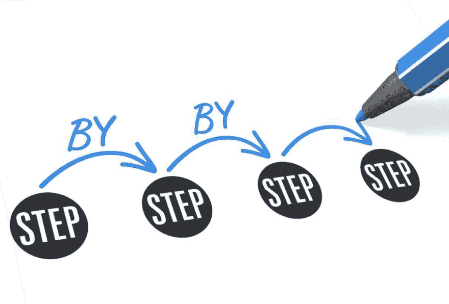

# 工艺建议

> 原文：<https://dev.to/pipelarrotta/process-proposal-3dl3>

 
当我在大学的时候，我提出了一个建议，让网站的开发过程有一点不同(也和其他软件开发人员一起工作)，当时我的老板是新来的，只有一台电脑和客户，但是我们的客户越来越多，公司也在发展。
到达的设计师、工程师和商业人士，都是开发的一部分，而我认为在形式上要做得更便宜、更快，这是我的提议:

规划>概念>执行

*   策划我们开了一个会，讨论所有关于这个项目的事情，商业人士让我们参与到这个领域，商业类型，图形线，客户类型，基本上所有的事情。

制定 act(一份关于会议中所有讨论的书面文件)和需求文档是很重要的。

知道客户想要什么？可能他也不知道，但我们的使命是让一些事情变得伟大和可能，需求列表是了解更多和避免错误的一种方式。

*概念
我们定义了日程会议，但展示了项目的责任和妥协，所有人，如项目经理、设计师、开发人员和客户必须同步。

展示概念图、提案和互动模型。(像漫威这样的视频或软件...)

*执行
开发人员定义的交付时间来展示网站或软件，这带来了许多问题，但却是更有趣的地方。
编码和不眠不休的许多夜晚是沉重的，但和结束时你可以看到你的小儿子 jeje

//注意:我知道这个过程对 scrum 或其他人来说是一样的，但是我想说一下我的看法，分享一下我做事情的方式。

感谢你的阅读，这个博客对我来说很重要，因为它是我心灵的外部世界，并与你分享。