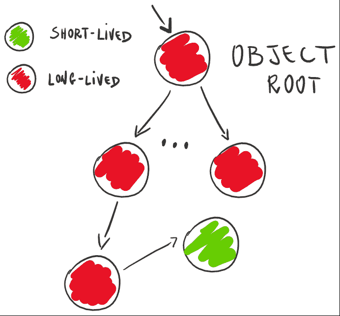
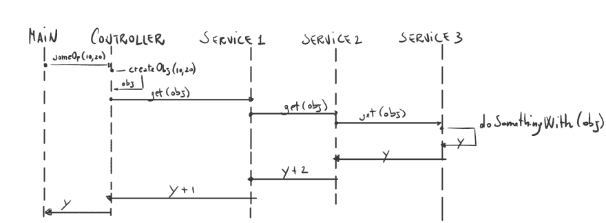

# 依赖注入和阅读器单子

> 原文:[https://dev . to/napicella/dependency-injection-and-reader-monad-5ap 4](https://dev.to/napicella/dependency-injection-and-reader-monad-5ap4)

如果你正在阅读这篇文章，你可能已经熟悉了依赖注入(简称 DI)及其含义。简而言之，
DI 建议对象依赖应该作为参数注入，而不是硬编码:

```
// Constructor creates the dependency
class A {
  private final B b; 
  A() {
    b = new B();
  }
}
// Versus the caller supplies the dependency of the class, 
// that's DI in action
class A {
  private final B b; 
  A(B b) {
    this.b = b;
  }
} 
```

<svg width="20px" height="20px" viewBox="0 0 24 24" class="highlight-action crayons-icon highlight-action--fullscreen-on"><title>Enter fullscreen mode</title></svg> <svg width="20px" height="20px" viewBox="0 0 24 24" class="highlight-action crayons-icon highlight-action--fullscreen-off"><title>Exit fullscreen mode</title></svg>

直到最近我才发现，这并不是动态注入依赖关系的唯一方式。另一个选项来自函数世界，它被称为 reader monad。读者 monad 让我们将值绑定到函数，而不需要传递值。实际上，其中一种用法是推迟一些数据的注入，直到我们知道它将假定的值。
希望读完这篇文章后会更清楚。
在这篇文章中，我不会(也不可能)完全描述单子是什么，但是知道单子是一个参数化的类型就足够了，它包装了一个值，并允许在不解开它的情况下对它执行操作。(为定义向函数式编程大神道歉)。
如果你像我一样，需要将这个概念与你已经知道的东西联系起来，你可能会考虑 Java 中的可选类型或者 Scala 中的两种类型:

```
 public static void main(String[] args) {
        System.out.println(friendsOf("Mickey"));
    }

    public static long friendsOf(String name) {
        // The optional might be empty or might contain the character we are 
        // looking for
        return getCharacterByName(name)
                .map((mickey) -> mickey.friends().count())
                .orElse(0L);
    } 
```

<svg width="20px" height="20px" viewBox="0 0 24 24" class="highlight-action crayons-icon highlight-action--fullscreen-on"><title>Enter fullscreen mode</title></svg> <svg width="20px" height="20px" viewBox="0 0 24 24" class="highlight-action crayons-icon highlight-action--fullscreen-off"><title>Exit fullscreen mode</title></svg>

`Warning: I am a newbie in functional programming! I am on quest to build a mental knob that let me switch between OOP and FP based on what I need.`

让我们回到主题，依赖注入和读者单子。两者都可以用来注入依赖，因此两者都可以用来创建更可测试、可预测和可重用的代码。那么我们应该用哪一个呢？

很多次，在像往常一样使用 DI 为对象提供依赖关系后，我意识到这些对象的 API 有问题。一般来说，当使用依赖注入时，可能会发生这样的情况，你需要下游调用中的某个对象，并且这个对象需要被向下传递，直到它到达下游调用。
当你有一个长寿命的对象(比如 A)依赖于一个短寿命的对象(比如 B)时，这是不可避免的，短寿命的对象是基于我们在对象图的根处得到的一些参数而创建的。例如，长寿命对象可能是我们在应用程序启动时只创建一次的对象，而短寿命对象是在运行时根据用户输入创建的。
[](https://res.cloudinary.com/practicaldev/image/fetch/s--9lg4qKHH--/c_limit%2Cf_auto%2Cfl_progressive%2Cq_auto%2Cw_880/https://thepracticaldev.s3.amazonaws.com/i/vxrkm1diokqxn5komu7z.png) 
当我们在创建 B 的点和使用 B 的点之间有一个很长的调用链时，那么我们基本上是将 B 传递给不打算使用它的方法。那就是界面污染。

一种解决方案是通过恢复它和它的依赖关系，使它成为一个长期对象，一个短期对象。这并不总是令人满意的，因为例如对象创建起来很昂贵，或者是应用程序启动时创建的对象图的一部分(单例图，好的单例不是坏的单例:)。

## 举例

这是一个超级简单的例子，只是为了说明这一点。文章中使用的所有代码都在[github.com/napicella/js-reader-monad](https://github.com/napicella/js-reader-monad)中。
让我们假设我们有一个依赖于某种“服务”的控制器。
这个服务又依赖于另一个服务。为了简单起见，让我们想象下面的调用链:
控制器- >服务 1- >服务 2 - >服务 3。
服务 3 使用需要基于控制器中接收的输入重新创建的对象来执行一些计算。
这里是序列图:

[T2】](https://res.cloudinary.com/practicaldev/image/fetch/s--4RGACNX6--/c_limit%2Cf_auto%2Cfl_progressive%2Cq_auto%2Cw_880/https://thepracticaldev.s3.amazonaws.com/i/3ihm1mluj9tznyzgiwxe.jpg)

控制器根据收到的参数创建“obj ”,并向下传递。服务 1 调用 Service2.get 并将“1”添加到结果中。类似地，Service2 调用 Service3.get 并将“2”添加到结果中。最后，Service3 使用‘obj’并返回结果。

这是 javascript 中的示例代码:

```
/**
 * create a simple object (short lived object in our example)
 */
function createObj(param1, param2) {
  return {
    val1 : param1,
    val2 : param2
  }
}

/**
 * Three long lived objects
 */
function Service1(otherService) {
  return {
    get : (obj) =>  {
      return otherService.get(obj) + 1;
    }
  }
}

function Service2(otherService) {
  return {
    get : (obj) =>  {
      return otherService.get(obj) + 2;
    }
  }
}

function Service3() {
  return {
    get : (obj) => doSomethingWith(obj)
  }
}

function doSomethingWith(someObj) {
  return someObj.val1 + someObj.val2;
}

/**
 * Simple Controller which uses a service to perform some computation
 */
function Controller(service) {
  return {
    someOp : function(param1, param2) {
      // Create an object based on some args recevied from the Controller and
      // pass the object to the service.
      // We could otherwise pass the params to service.
      //
      // Both solutions causes some sort of interface pollution because
      // the obj is only used in Service3
      var obj = createObj(param1, param2);
      return service.get(obj);
    }
  }
}

/**
 * Wire the object graph
 */
function Configuration() {
  return Controller(Service1(Service2(Service3())));
}

var controller = Configuration();
console.log(controller.someOp(10, 20)); 
```

<svg width="20px" height="20px" viewBox="0 0 24 24" class="highlight-action crayons-icon highlight-action--fullscreen-on"><title>Enter fullscreen mode</title></svg> <svg width="20px" height="20px" viewBox="0 0 24 24" class="highlight-action crayons-icon highlight-action--fullscreen-off"><title>Exit fullscreen mode</title></svg>

该代码显示了这三个服务的接口如何需要 obj 作为参数，即使该参数仅在服务 3 中的某些计算中需要。这三个服务是在配置中创建的长期存在的对象，而 obj 是基于收到的参数在控制器中创建的。

另一个解决方案是使用 monad 阅读器。这个想法是将计算抽象成一个单子，当我们知道必须用作计算输入的值时，就可以使用这个单子。在我们的例子中，这意味着由三个服务完成的计算将被包装在一个阅读器中。
Service3 返回一个读取器，Service2 将一个函数映射到封装在读取器中的值(该值有待计算)，Service1 也是如此。

带单子的示例代码:

```
/**
 * Simple Reader Monad
 */
function reader(k) {
    return {
        run: function(e) {
            return k(e);
        },
        bind: function(f) {
            return reader(function(e) {
                return f(k(e)).run(e);
            });
        },
        map: function(f) {
            return reader(function(e) {
                return f(k(e));
            });
        }
    };
}

/**
 * create a simple object (short lived object in our example)
 */
function createObj(param1, param2) {
  return {
    val1 : param1,
    val2 : param2
  }
}

/**
 * Three long lived objects
 */
function Service1(otherService) {
  return {
    get : () =>  {
      return otherService.get().map((val) => val + 1);
    }
  }
}

function Service2(otherService) {
  return {
    get : () =>  {
      return otherService.get().map((val) => val + 2);
    }
  }
}

function Service3() {
  return {
    get : () => reader(doSomethingWith)
  }
}

function doSomethingWith(someObj) {
  return someObj.val1 + someObj.val2;
}

/**
 * Simple Controller which uses a service to perform some computation
 */
function Controller(service) {
  return {
    someOp : function(param1, param2) {
      // Create an object based on some args recevied from the Controller and
      // pass the object to the service.
      // The service returns a Reader, that we use to inject the object.
      // Thus we do not need to pass the object dowstream.
      var obj = createObj(param1, param2);
      return service.get().run(obj);
    }
  }
}

/**
 * Wire the object graph
 */
function Configuration() {
  return Controller(Service1(Service2(Service3())));
}

var controller = Configuration();
console.log(controller.someOp(10, 20)); 
```

<svg width="20px" height="20px" viewBox="0 0 24 24" class="highlight-action crayons-icon highlight-action--fullscreen-on"><title>Enter fullscreen mode</title></svg> <svg width="20px" height="20px" viewBox="0 0 24 24" class="highlight-action crayons-icon highlight-action--fullscreen-off"><title>Exit fullscreen mode</title></svg>

在这里，服务的 API 中不再有 obj。

## 结论

希望这篇文章对你有用。非常感谢您的任何反馈！

* * *

javascript 中的注释
1 - [阅读器](https://earldouglas.com/posts/javascript-reader.html)