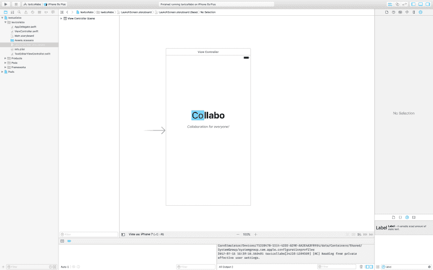
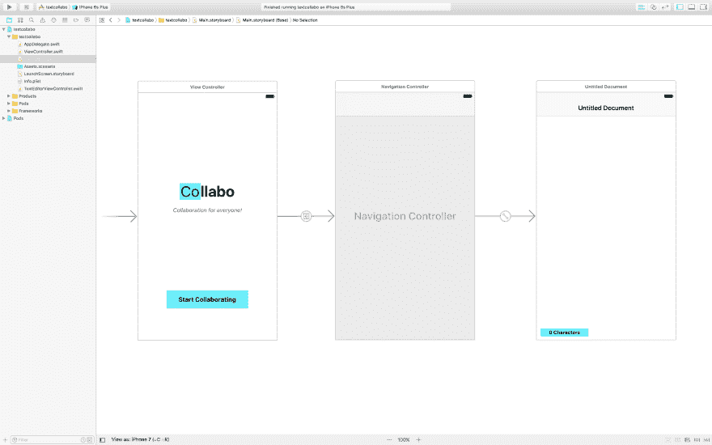
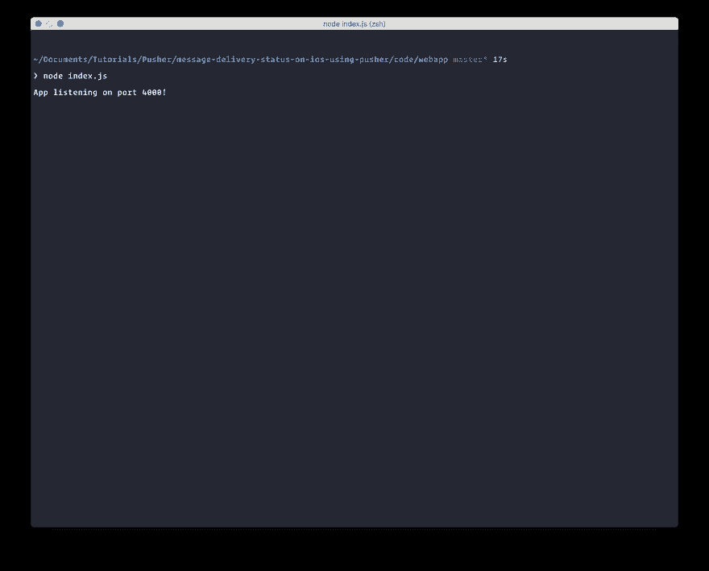

# 如何在 iOS 中构建实时协作文本编辑器

> 原文:[https://dev . to/neo/how-to-build-a-real time-collaborative-text-editor-in-IOs-2655](https://dev.to/neo/how-to-build-a-realtime-collaborative-text-editor-in-ios-2655)

文本编辑器现在越来越受欢迎，无论是嵌入在网站评论表单中，还是作为记事本，都有很多种形式的文本编辑器。在这篇文章中，我们不仅将学习如何在 iOS 中构建一个漂亮的文本编辑器移动应用程序，我们还将学习如何使用 Pusher 在笔记上进行实时协作。但是，请注意，为了保持应用程序的简单性，本文将不涵盖并发编辑，因此只有一个人可以在其他人观看的同时进行编辑。

该应用程序将通过在输入一些文本时触发一个事件来工作。该事件将被发送到 Pusher，然后由协作者的设备接收并自动更新。

要完成本教程，您需要以下内容:

*   **Cocoapods** ，在你的机器上安装 run `gem install cocoapods`
*   **Xcode**
*   一个**推送应用**——你可以在这里创建一个免费的账户和应用
*   一些关于 Swift 语言的知识
*   **节点 j**

## Xcode iOS 应用入门

启动 Xcode 并创建一个新项目。我们称我们的**为 Collabo** 。按照设置向导完成后，打开工作区，关闭 Xcode，然后在项目的根目录下运行命令`pod init`。这将为您生成一个`Podfile`。改变`Podfile`的内容:

```
 # Uncomment the next line to define a global platform for your project
    platform :ios, '9.0'

    target 'textcollabo' do
      # Comment the next line if you're not using Swift and don't want to use dynamic frameworks
      use_frameworks!

      # Pods for anonchat
      pod 'Alamofire'
      pod 'PusherSwift'
    end 
```

<svg width="20px" height="20px" viewBox="0 0 24 24" class="highlight-action crayons-icon highlight-action--fullscreen-on"><title>Enter fullscreen mode</title></svg> <svg width="20px" height="20px" viewBox="0 0 24 24" class="highlight-action crayons-icon highlight-action--fullscreen-off"><title>Exit fullscreen mode</title></svg>

现在运行命令`pod install`,这样 Cocoapods 包管理器就可以获取必要的依赖项。完成后，关闭 Xcode(如果打开的话),然后打开项目文件夹根目录下的`.xcworkspace`文件。

## 为我们的 iOS 应用程序设计视图

我们将为我们的 iOS 应用程序创建一些视图，这些视图将是我们将所有逻辑连接到其中的主干。使用 Xcode 故事板，让你的观点看起来有点像下面的截图。

这是 **LaunchScreen.storyboard** 文件。我们刚刚设计了一些简单的东西，没有任何功能。

[T2】](https://res.cloudinary.com/practicaldev/image/fetch/s--DjwPOYYC--/c_limit%2Cf_auto%2Cfl_progressive%2Cq_auto%2Cw_880/https://thepracticaldev.s3.amazonaws.com/i/19g7cpevw3qfjm9mfehl.png)

我们将设计的下一个故事板是 **Main.storyboard** ，顾名思义，这是主故事板。这就是我们拥有所有重要观点的地方，这些观点都与某种逻辑相联系。

[T2】](https://res.cloudinary.com/practicaldev/image/fetch/s--hW9nRWNy--/c_limit%2Cf_auto%2Cfl_progressive%2Cq_auto%2Cw_880/https://thepracticaldev.s3.amazonaws.com/i/7h60hxvng4k7amfan9b2.png)

这里我们有 3 个视图。第一个视图的设计与启动屏幕一模一样，只是我们链接了一个按钮来打开第二个视图。第二个视图是导航控制器，它附属于第三个视图`ViewController`。我们已经将第三个视图设置为导航控制器的根控制器。

在第三个视图中，我们有一个可编辑的`UITextView`放在视图中，还有一个应该是字符计数器的标签。当用户在文本视图中输入文本时，我们将在这里增加字符。

## 编码 iOS 协同文本编辑器应用程序

既然我们已经成功地创建了应用程序加载所需的视图，接下来我们要做的就是开始为应用程序编写逻辑代码。

创建一个新的 cocoa 类文件，将其命名为`TextEditorViewController`，并将其链接到`Main.storyboard`文件中的第三个视图。`TextViewController`也应该采用`UITextViewDelegate`。现在，您可以将`Main.storyboard`文件中的`UITextView`和`ctrl+drag`到`TextEditorViewController`类中。

此外，您应该将`PusherSwift`和`AlamoFire`库导入到`TextViewController`中。做完之后应该会有接近这个的:

```
 import UIKit
    import PusherSwift
    import Alamofire

    class TextEditorViewController: UIViewController, UITextViewDelegate {
        @IBOutlet weak var textView: UITextView!
        @IBOutlet weak var charactersLabel: UILabel!
    } 
```

<svg width="20px" height="20px" viewBox="0 0 24 24" class="highlight-action crayons-icon highlight-action--fullscreen-on"><title>Enter fullscreen mode</title></svg> <svg width="20px" height="20px" viewBox="0 0 24 24" class="highlight-action crayons-icon highlight-action--fullscreen-off"><title>Exit fullscreen mode</title></svg>

现在我们需要在控制器中添加一些稍后会用到的属性。

```
 import UIKit
    import PusherSwift
    import Alamofire

    class TextEditorViewController: UIViewController, UITextViewDelegate {
        static let API_ENDPOINT = "http://localhost:4000";

        @IBOutlet weak var textView: UITextView!

        @IBOutlet weak var charactersLabel: UILabel!

        var pusher : Pusher!

        var chillPill = true

        var placeHolderText = "Start typing..."

        var randomUuid : String = ""
    } 
```

<svg width="20px" height="20px" viewBox="0 0 24 24" class="highlight-action crayons-icon highlight-action--fullscreen-on"><title>Enter fullscreen mode</title></svg> <svg width="20px" height="20px" viewBox="0 0 24 24" class="highlight-action crayons-icon highlight-action--fullscreen-off"><title>Exit fullscreen mode</title></svg>

现在我们将把逻辑分成三个部分:

*   视图和键盘事件
*   UITextViewDelegate 方法
*   处理推动器事件。

首先是**视图和键盘事件**。打开`TextEditorViewController`，用下面的方法更新

```
 override func viewDidLoad() {
        super.viewDidLoad()

        // Notification trigger
        NotificationCenter.default.addObserver(self, selector: #selector(keyboardWillShow), name: NSNotification.Name.UIKeyboardWillShow, object: nil)
        NotificationCenter.default.addObserver(self, selector: #selector(keyboardWillHide), name: NSNotification.Name.UIKeyboardWillHide, object: nil)

        // Gesture recognizer
        view.addGestureRecognizer(UITapGestureRecognizer(target: self, action: #selector(tappedAwayFunction(_:))))

        // Set the controller as the textView delegate
        textView.delegate = self

        // Set the device ID
        randomUuid = UIDevice.current.identifierForVendor!.uuidString

        // Listen for changes from Pusher
        listenForChanges()
    }

    override func viewWillAppear(_ animated: Bool) {
        super.viewWillAppear(animated)

        if self.textView.text == "" {
            self.textView.text = placeHolderText
            self.textView.textColor = UIColor.lightGray
        }
    }

    func keyboardWillShow(notification: NSNotification) {
        if let keyboardSize = (notification.userInfo?[UIKeyboardFrameBeginUserInfoKey] as? NSValue)?.cgRectValue {
            if self.charactersLabel.frame.origin.y == 1.0 {
                self.charactersLabel.frame.origin.y -= keyboardSize.height
            }
        }
    }

    func keyboardWillHide(notification: NSNotification) {
        if let keyboardSize = (notification.userInfo?[UIKeyboardFrameBeginUserInfoKey] as? NSValue)?.cgRectValue {
            if self.view.frame.origin.y != 1.0 {
                self.charactersLabel.frame.origin.y += keyboardSize.height
            }
        }
    } 
```

<svg width="20px" height="20px" viewBox="0 0 24 24" class="highlight-action crayons-icon highlight-action--fullscreen-on"><title>Enter fullscreen mode</title></svg> <svg width="20px" height="20px" viewBox="0 0 24 24" class="highlight-action crayons-icon highlight-action--fullscreen-off"><title>Exit fullscreen mode</title></svg>

在`viewDidLoad`方法中，我们注册了键盘函数，以便它们响应键盘事件，并且我们添加了手势识别器，当您在`UITextView`之外点击时，手势识别器会消除键盘。我们还为控制器本身设置了`textView`委托，最后，我们调用了一个函数来监听新的更新(我们将在后面创建)。

在`viewWillAppear`方法中，我们简单地将`UITextView`修改成一个占位符文本，因为默认情况下，`UITextView`没有这个特性。想知道为什么，苹果。

在`keyboardWillShow`和`keyboardWillHide`函数中，我们分别让字符计数标签随键盘上升和下降。这将防止键盘在标签处于活动状态时覆盖标签。

第二件事是 **UITextViewDelegate 方法**。将`TextEditorViewController`更新为:

```
 func textViewDidChange(_ textView: UITextView) {
        charactersLabel.text = String(format: "%i Characters", textView.text.characters.count)

        if textView.text.characters.count >= 2 {
            sendToPusher(text: textView.text)
        }
    }

    func textViewShouldBeginEditing(_ textView: UITextView) -> Bool {
        self.textView.textColor = UIColor.black

        if self.textView.text == placeHolderText {
            self.textView.text = ""
        }

        return true
    }

    func textViewDidEndEditing(_ textView: UITextView) {
        if textView.text == "" {
            self.textView.text = placeHolderText
            self.textView.textColor = UIColor.lightGray
        }
    }

    func tappedAwayFunction(_ sender: UITapGestureRecognizer) {
        textView.resignFirstResponder()
    } 
```

<svg width="20px" height="20px" viewBox="0 0 24 24" class="highlight-action crayons-icon highlight-action--fullscreen-on"><title>Enter fullscreen mode</title></svg> <svg width="20px" height="20px" viewBox="0 0 24 24" class="highlight-action crayons-icon highlight-action--fullscreen-off"><title>Exit fullscreen mode</title></svg>

`textViewDidChange`方法只是更新字符计数标签，并使用我们的后端 API(我们将在本文后面创建)将更改发送给 Pusher。`textViewShouldBeginEditing`从`UITextViewDelegate`中获取，当文本视图将要被编辑时触发。在这里，我们基本上是在玩占位符，和`textViewDidEndEditing`方法一样。最后，在`tappedAwayFunction`中，我们为在上一节中注册的手势定义了事件回调。在该方法中，我们基本上忽略了键盘。

最后要做的是**处理 Pusher 事件**。用以下方法更新控制器:

```
 func sendToPusher(text: String) {
        let params: Parameters = ["text": text, "from": randomUuid]

        Alamofire.request(TextEditorViewController.API_ENDPOINT + "/update_text", method: .post, parameters: params).validate().responseJSON { response in
            switch response.result {

            case .success:
                print("Succeeded")
            case .failure(let error):
                print(error)
            }
        }
    }

    func listenForChanges() {
        pusher = Pusher(key: "PUSHER_KEY", options: PusherClientOptions(
            host: .cluster("PUSHER_CLUSTER")
        ))

        let channel = pusher.subscribe("collabo")
        let _ = channel.bind(eventName: "text_update", callback: { (data: Any?) -> Void in

            if let data = data as? [String: AnyObject] {
                let fromDeviceId = data["deviceId"] as! String

                if fromDeviceId != self.randomUuid {
                    let text = data["text"] as! String
                    self.textView.text = text
                    self.charactersLabel.text = String(format: "%i Characters", text.characters.count)
                }
            }
        })

        pusher.connect()
    } 
```

<svg width="20px" height="20px" viewBox="0 0 24 24" class="highlight-action crayons-icon highlight-action--fullscreen-on"><title>Enter fullscreen mode</title></svg> <svg width="20px" height="20px" viewBox="0 0 24 24" class="highlight-action crayons-icon highlight-action--fullscreen-off"><title>Exit fullscreen mode</title></svg>

在`sendToPusher`方法中，我们使用`AlamoFire`将有效载荷发送到我们的后端应用程序，该应用程序将依次将其发送到 Pusher。在`listenForChanges`方法中，我们监听文本的变化，如果有变化，我们将变化应用到文本视图。

> **提示:**记得用您从 Pusher 仪表盘**中获得的实际值替换密钥和集群。

如果你已经密切跟踪教程。那么你的`TextEditorViewController`应该是这样的:

```
 import UIKit
    import PusherSwift
    import Alamofire

    class TextEditorViewController: UIViewController, UITextViewDelegate {
        static let API_ENDPOINT = "http://localhost:4000";

        @IBOutlet weak var textView: UITextView!

        @IBOutlet weak var charactersLabel: UILabel!

        var pusher : Pusher!

        var chillPill = true

        var placeHolderText = "Start typing..."

        var randomUuid : String = ""

        override func viewDidLoad() {
            super.viewDidLoad()

            // Notification trigger
            NotificationCenter.default.addObserver(self, selector: #selector(keyboardWillShow), name: NSNotification.Name.UIKeyboardWillShow, object: nil)
            NotificationCenter.default.addObserver(self, selector: #selector(keyboardWillHide), name: NSNotification.Name.UIKeyboardWillHide, object: nil)

            // Gesture recognizer
            view.addGestureRecognizer(UITapGestureRecognizer(target: self, action: #selector(tappedAwayFunction(_:))))

            // Set the controller as the textView delegate
            textView.delegate = self

            // Set the device ID
            randomUuid = UIDevice.current.identifierForVendor!.uuidString

            // Listen for changes from Pusher
            listenForChanges()
        }

        override func viewWillAppear(_ animated: Bool) {
            super.viewWillAppear(animated)

            if self.textView.text == "" {
                self.textView.text = placeHolderText
                self.textView.textColor = UIColor.lightGray
            }
        }

        func keyboardWillShow(notification: NSNotification) {
            if let keyboardSize = (notification.userInfo?[UIKeyboardFrameBeginUserInfoKey] as? NSValue)?.cgRectValue {
                if self.charactersLabel.frame.origin.y == 1.0 {
                    self.charactersLabel.frame.origin.y -= keyboardSize.height
                }
            }
        }

        func keyboardWillHide(notification: NSNotification) {
            if let keyboardSize = (notification.userInfo?[UIKeyboardFrameBeginUserInfoKey] as? NSValue)?.cgRectValue {
                if self.view.frame.origin.y != 1.0 {
                    self.charactersLabel.frame.origin.y += keyboardSize.height
                }
            }
        }

        func textViewDidChange(_ textView: UITextView) {
            charactersLabel.text = String(format: "%i Characters", textView.text.characters.count)

            if textView.text.characters.count >= 2 {
                sendToPusher(text: textView.text)
            }
        }

        func textViewShouldBeginEditing(_ textView: UITextView) -> Bool {
            self.textView.textColor = UIColor.black

            if self.textView.text == placeHolderText {
                self.textView.text = ""
            }

            return true
        }

        func textViewDidEndEditing(_ textView: UITextView) {
            if textView.text == "" {
                self.textView.text = placeHolderText
                self.textView.textColor = UIColor.lightGray
            }
        }

        func tappedAwayFunction(_ sender: UITapGestureRecognizer) {
            textView.resignFirstResponder()
        }

        func sendToPusher(text: String) {
            let params: Parameters = ["text": text, "from": randomUuid]

            Alamofire.request(TextEditorViewController.API_ENDPOINT + "/update_text", method: .post, parameters: params).validate().responseJSON { response in
                switch response.result {

                case .success:
                    print("Succeeded")
                case .failure(let error):
                    print(error)
                }
            }
        }

        func listenForChanges() {
            pusher = Pusher(key: "PUSHER_KEY", options: PusherClientOptions(
                host: .cluster("PUSHER_CLUSTER")
            ))

            let channel = pusher.subscribe("collabo")
            let _ = channel.bind(eventName: "text_update", callback: { (data: Any?) -> Void in

                if let data = data as? [String: AnyObject] {
                    let fromDeviceId = data["deviceId"] as! String

                    if fromDeviceId != self.randomUuid {
                        let text = data["text"] as! String
                        self.textView.text = text
                        self.charactersLabel.text = String(format: "%i Characters", text.characters.count)
                    }
                }
            })

            pusher.connect()
        }
    } 
```

<svg width="20px" height="20px" viewBox="0 0 24 24" class="highlight-action crayons-icon highlight-action--fullscreen-on"><title>Enter fullscreen mode</title></svg> <svg width="20px" height="20px" viewBox="0 0 24 24" class="highlight-action crayons-icon highlight-action--fullscreen-off"><title>Exit fullscreen mode</title></svg>

太好了！现在我们需要制作应用程序的后端。

## 构建后端节点应用

既然我们已经完成了 Swift 部分，我们可以专注于为应用程序创建 NodeJS 后端了。我们将使用 Express，这样我们可以快速地让一些东西运行起来。

为 web 应用程序创建一个目录，然后创建一些新文件:

**index.js** 文件……

```
 let path = require('path');
    let Pusher = require('pusher');
    let express = require('express');
    let bodyParser = require('body-parser');
    let app = express();
    let pusher = new Pusher(require('./config.js'));

    app.use(bodyParser.json());
    app.use(bodyParser.urlencoded({ extended: false }));

    app.post('/update_text', function(req, res){
      var payload = {text: req.body.text, deviceId: req.body.from}
      pusher.trigger('collabo', 'text_update', payload)
      res.json({success: 200})
    });

    app.use(function(req, res, next) {
        var err = new Error('Not Found');
        err.status = 404;
        next(err);
    });

    module.exports = app;

    app.listen(4000, function(){
      console.log('App listening on port 4000!');
    }); 
```

<svg width="20px" height="20px" viewBox="0 0 24 24" class="highlight-action crayons-icon highlight-action--fullscreen-on"><title>Enter fullscreen mode</title></svg> <svg width="20px" height="20px" viewBox="0 0 24 24" class="highlight-action crayons-icon highlight-action--fullscreen-off"><title>Exit fullscreen mode</title></svg>

在上面的 JS 文件中，我们使用 Express 创建一个简单的应用程序，在`/update_text`路径中，我们简单地接收有效载荷并将其传递给 Pusher。没什么复杂的。

创建一个 **package.json** 文件也:

```
 {
      "main": "index.js",
      "dependencies": {
        "body-parser": "^1.17.2",
        "express": "^4.15.3",
        "path": "^0.12.7",
        "pusher": "^1.5.1"
      }
    } 
```

<svg width="20px" height="20px" viewBox="0 0 24 24" class="highlight-action crayons-icon highlight-action--fullscreen-on"><title>Enter fullscreen mode</title></svg> <svg width="20px" height="20px" viewBox="0 0 24 24" class="highlight-action crayons-icon highlight-action--fullscreen-off"><title>Exit fullscreen mode</title></svg>

**package.json** 文件是我们定义所有 NPM 依赖项的地方。

要创建的最后一个文件是一个 **config.js** 文件。在这里，我们将定义 Pusher 应用程序的配置值:

```
 module.exports = {
      appId: 'PUSHER_ID',
      key: 'PUSHER_KEY',
      secret: 'PUSHER_SECRET',
      cluster: 'PUSHER_CLUSTER',
      encrypted: true
    }; 
```

<svg width="20px" height="20px" viewBox="0 0 24 24" class="highlight-action crayons-icon highlight-action--fullscreen-on"><title>Enter fullscreen mode</title></svg> <svg width="20px" height="20px" viewBox="0 0 24 24" class="highlight-action crayons-icon highlight-action--fullscreen-off"><title>Exit fullscreen mode</title></svg>

> **提示**记住用您从 Pusher 仪表盘**中获得的实际值替换密钥和集群。

现在在目录上运行`npm install`，然后在 npm 安装完成后运行`node index.js`。你应该看到*应用程序监听 4000 端口！*消息。

[T2】](https://res.cloudinary.com/practicaldev/image/fetch/s---LUkr3H5--/c_limit%2Cf_auto%2Cfl_progressive%2Cq_auto%2Cw_880/https://thepracticaldev.s3.amazonaws.com/i/n6q199nvy85pi8a83892.png)

## 测试应用程序

一旦您的本地节点 web 服务器开始运行，您将需要进行一些更改，以便您的应用程序可以与本地 web 服务器通信。在`info.plist`文件中，进行以下更改:

[T2】](https://res.cloudinary.com/practicaldev/image/fetch/s--UHz3Zowr--/c_limit%2Cf_auto%2Cfl_progressive%2Cq_auto%2Cw_880/https://thepracticaldev.s3.amazonaws.com/i/cyk8y7a4halvi402kzb5.png)

通过这一更改，您可以构建并运行您的应用程序，它将直接与您的本地 web 应用程序对话。

## 结论

在本文中，我们介绍了如何使用 Pusher 在 iOS 上构建一个实时协作文本编辑器。希望你已经从教程中学到了一些东西。实际上，您可以扩展状态以支持更多实例。

对文章有问题或反馈吗？请在评论区提问。应用程序和节点后端的存储库在这里[可用](https://github.com/neoighodaro/realtime-collaborative-text-editor)。

这篇博文最早出现在[推手博客](https://blog.pusher.com/build-realtime-collaborative-text-editor-ios/)上。