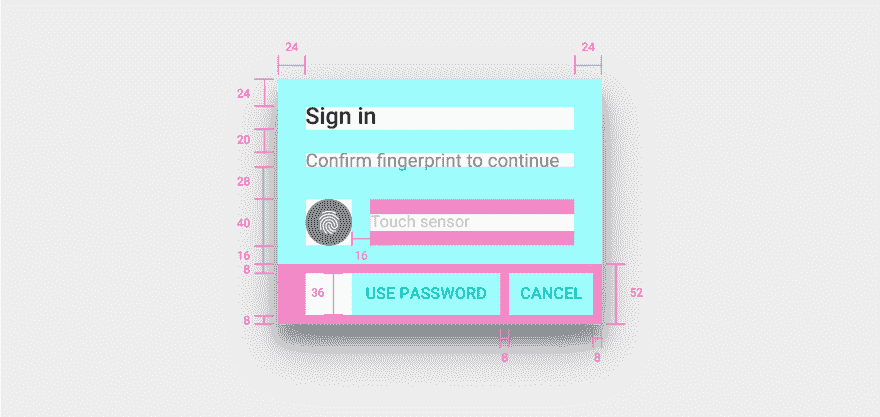

# 安卓指纹认证教程

> 原文:[https://dev . to/Adam MC 331/Android-fingerprint-authentic ation-tutorial-2835](https://dev.to/adammc331/android-fingerprint-authentication-tutorial-2835)

原载于[安卓精华](https://androidessence.com/android/tutorial/fingerprint-authentication-tutorial/)。

当 Android 发布 6.0 版棉花糖(是的，在这一点上有点过时)时，一系列新的开发者 API 随之而来。作为消费者，我个人最喜欢的一个功能是[指纹认证](https://developer.android.com/about/versions/marshmallow/android-6.0.html#fingerprint-authentication)。我浏览了官方文件，甚至通过他们的[指纹对话样本](https://developer.android.com/samples/FingerprintDialog/index.html)，但很难理解到底发生了什么。

最终，尽管如此，我还是能够重现这种流动。这篇文章将一步一步地指导你如何在你的 Android 应用程序中集成你自己的指纹对话框。

## 对话框视图

将指纹认证添加到您的应用程序时，您可以完全控制该流程的设计方式。但是指纹认证流程有一个[材料设计规范](https://material.io/guidelines/patterns/fingerprint.html#)。本页讨论应该包含的某些文本，行为看起来像什么，以及你应该使用的图标。这是必要的，因为作为开发人员，我们希望确保我们的应用程序与做类似工作的其他应用程序相比，能够提供一致的流程。

从上面的规范中，您会注意到 Google 为创建对话框提供了红线:

[T2】](https://res.cloudinary.com/practicaldev/image/fetch/s--hsZlHzPm--/c_limit%2Cf_auto%2Cfl_progressive%2Cq_auto%2Cw_880/https://thepracticaldev.s3.amazonaws.com/i/pzr4i4dd9zzi54vgsyhw.png)

出于本教程的目的，我们将不包括“使用密码”回退，并将只关注指纹认证。使用上面的红线，我能够使用 ConstraintLayout 为对话框创建一个 XML 文件。以下代码在我的`dialog_fingerprint.xml`文件中，你可以在 [GitHub](https://github.com/androidessence/FingerprintDialogSample/blob/master/app/src/main/res/layout/dialog_fingerprint.xml) 上看到。

## 指纹控制器

在写出实际的对话框之前，我们需要创建一个助手类来处理一些指纹认证流。虽然大部分代码可以写在 DialogFragment 类中，但为了分离关注点，最好将其抽象出来，只给控制器它需要的信息。让我们看看如何定义我们的`FingerprintController.kt`类:

```
 class FingerprintController(
        private val fingerprintManager: FingerprintManagerCompat,
        private val callback: Callback,
        private val title: TextView,
        private val subtitle: TextView,
        private val errorText: TextView,
        private val icon: ImageView) : FingerprintManagerCompat.AuthenticationCallback() { 

        interface Callback {
            fun onAuthenticated()
            fun onError()
        }
    } 
```

<svg width="20px" height="20px" viewBox="0 0 24 24" class="highlight-action crayons-icon highlight-action--fullscreen-on"><title>Enter fullscreen mode</title></svg> <svg width="20px" height="20px" viewBox="0 0 24 24" class="highlight-action crayons-icon highlight-action--fullscreen-off"><title>Exit fullscreen mode</title></svg>

这看起来让人不知所措，所以我们可以按位分解:

*   [FingerprintManagerCompat](https://developer.android.com/reference/android/support/v4/hardware/fingerprint/FingerprintManagerCompat.html) 类是用于连接指纹硬件的类。有一个 [FingerprintManager](https://developer.android.com/reference/android/hardware/fingerprint/FingerprintManager.html) 类，但是正如在开始时讨论的，这些 API 只是在 API 23(棉花糖)中添加的，所以最好使用`Compat`类来更好地支持旧的 Android 版本。
*   回调是一个让视图知道指纹认证何时完成的接口。
*   标题、副标题、错误文本和图标都是可以基于成功或不成功的尝试在整个指纹认证流程中修改的视图。
*   我们的控制器扩展了 [`AuthenticaitonCallback()`](https://developer.android.com/reference/android/support/v4/hardware/fingerprint/FingerprintManagerCompat.AuthenticationCallback.html) 类，该类处理来自认证尝试的各种回调可能性。

### 类属性

除了通过构造函数接受的所有属性之外，我们还需要在类本身内部创建一些值。我们需要:

*   一个取消信号，提醒我们何时应该取消身份验证。
*   一个布尔标志，用于了解取消是由我们的控制器还是其他来源引起的。
*   一个布尔标志，告诉我们这个设备是否应该支持指纹验证。
*   将对话框重置为其初始状态的 runnable。我们将在类被实例化时运行它。

下面是我们班现在的样子:

```
 class FingerprintController(...) : FingerprintManagerCompat.AuthenticationCallback() {
        /**
         * Helper variable to get the context from one of the views. The view used is arbitrary. 
         */
        private val context: Context
            get() = errorText.context

        private var cancellationSignal: CancellationSignal? = null
        private var selfCancelled = false

        private val isFingerprintAuthAvailable: Boolean
            get() = fingerprintManager.isHardwareDetected && fingerprintManager.hasEnrolledFingerprints()

        private val resetErrorTextRunnable: Runnable = Runnable {
            errorText.setTextColor(ContextCompat.getColor(context, R.color.hint_color))
            errorText.text = context.getString(R.string.touch_sensor)
            icon.setImageResource(R.drawable.ic_fingerprint_white_24dp)
        }

        init {
            errorText.post(resetErrorTextRunnable)
        }

        interface Callback { }
    } 
```

<svg width="20px" height="20px" viewBox="0 0 24 24" class="highlight-action crayons-icon highlight-action--fullscreen-on"><title>Enter fullscreen mode</title></svg> <svg width="20px" height="20px" viewBox="0 0 24 24" class="highlight-action crayons-icon highlight-action--fullscreen-off"><title>Exit fullscreen mode</title></svg>

### 监听认证

现在我们已经定义了控制器所需的所有字段，我们可以告诉它开始监听身份验证并停止。为了做到这一点，我们将需要一个加密对象，我们将通过指纹进行身份验证，但稍后会有更多内容。我们的 start listening 方法将检查硬件支持，如果有，重置取消信号和标志，并调用指纹管理器的 [authenticate](https://developer.android.com/reference/android/support/v4/hardware/fingerprint/FingerprintManagerCompat.html#authenticate(android.support.v4.hardware.fingerprint.FingerprintManagerCompat.CryptoObject,%20int,%20android.support.v4.os.CancellationSignal,%20android.support.v4.hardware.fingerprint.FingerprintManagerCompat.AuthenticationCallback,%20android.os.Handler)) 方法。当我们想要停止监听时，我们通过使用 Kotlin 的`let` delgate 来检查是否有取消信号，这样我们只在信号不为空时才执行代码块。这就是所有这些看起来的样子:

```
 fun startListening(cryptoObject: FingerprintManagerCompat.CryptoObject) {
        if (!isFingerprintAuthAvailable) return

        cancellationSignal = CancellationSignal()
        selfCancelled = false
        fingerprintManager.authenticate(cryptoObject, 0, cancellationSignal, this, null)
    }

    fun stopListening() {
        cancellationSignal?.let {
            selfCancelled = true
            it.cancel()
            cancellationSignal = null
        }
    } 
```

<svg width="20px" height="20px" viewBox="0 0 24 24" class="highlight-action crayons-icon highlight-action--fullscreen-on"><title>Enter fullscreen mode</title></svg> <svg width="20px" height="20px" viewBox="0 0 24 24" class="highlight-action crayons-icon highlight-action--fullscreen-off"><title>Exit fullscreen mode</title></svg>

您可能会注意到，如果不支持指纹，代码只是从 start listening 方法返回。稍后，当我们将这个对话框添加到我们的活动中时，我们也希望进行检查，这样，如果不必要，我们甚至不会提示用户输入指纹。这也是以后的事。

### 处理指纹认证回调

正如本节第一部分所讨论的，我们的控制器类扩展了`FingerprintManagerCompat.AuthenticationCallback`。在这个类中，我们将实现四个方法，以及另一个实用方法。这些是:

*   onAuthenticationError -当指纹验证发生致命错误时调用。
*   onAuthenticationHelp -发生错误时调用，但不是致命的异常。这将是像移动你的手指太快，或传感器是脏的事情。
*   onAuthenticationFailed -当指纹有效，但不是设备上注册的指纹之一时调用。
*   onAuthenticationSucceeded -当扫描到有效的已注册指纹时调用。
*   show error——这是一个帮助器方法，我们将使用它向用户显示错误。在重置视图之前，此错误将显示大约一秒半。

每个示例的代码可能如下所示。以下所有内容都在我们的`FingerprintController.kt`文件中:

```
 private fun showError(text: CharSequence?) {
        icon.setImageResource(R.drawable.ic_error_white_24dp)
        errorText.text = text
        errorText.setTextColor(ContextCompat.getColor(errorText.context, R.color.warning_color))
        errorText.removeCallbacks(resetErrorTextRunnable)
        errorText.postDelayed(resetErrorTextRunnable, ERROR_TIMEOUT_MILLIS)
    }

    override fun onAuthenticationError(errMsgId: Int, errString: CharSequence?) {
        if (!selfCancelled) {
            showError(errString)
            icon.postDelayed({
                callback.onError()
            }, ERROR_TIMEOUT_MILLIS)
        }
    }

    override fun onAuthenticationSucceeded(result: FingerprintManagerCompat.AuthenticationResult?) {
        errorText.removeCallbacks(resetErrorTextRunnable)
        icon.setImageResource(R.drawable.ic_check_white_24dp)
        errorText.setTextColor(ContextCompat.getColor(errorText.context, R.color.success_color))
        errorText.text = errorText.context.getString(R.string.fingerprint_recognized)
        icon.postDelayed({
            callback.onAuthenticated()
        }, SUCCESS_DELAY_MILLIS)
    }

    override fun onAuthenticationHelp(helpMsgId: Int, helpString: CharSequence?) {
        showError(helpString)
    }

    override fun onAuthenticationFailed() {
        showError(errorText.context.getString(R.string.fingerprint_not_recognized))
    }

    companion object {
        private val ERROR_TIMEOUT_MILLIS = 1600L
        private val SUCCESS_DELAY_MILLIS = 1300L
    } 
```

<svg width="20px" height="20px" viewBox="0 0 24 24" class="highlight-action crayons-icon highlight-action--fullscreen-on"><title>Enter fullscreen mode</title></svg> <svg width="20px" height="20px" viewBox="0 0 24 24" class="highlight-action crayons-icon highlight-action--fullscreen-off"><title>Exit fullscreen mode</title></svg>

## 指纹对话框

一旦我们创建了 XML 布局和 FingerprintController 类，我们就可以开始设置对话框了。让我们先处理一下通用代码，而不是特定于新指纹功能的代码。我们需要:

*   实现我们的`FingerprintController.Callback`接口的 DialogFragment。
*   在对话框中使用的对`FingerprintController`的引用。
*   一个新的实例方法，它创建一个带有特定标题和副标题的对话框，一旦对话框被创建就初始化。

为了节省博客本身的空间，我将省略这段代码，但是你可以在 GitHub 上找到它[。](https://github.com/androidessence/FingerprintDialogSample/blob/master/app/src/main/java/com/androidessence/fingerprintdialogsample/FingerprintDialog.kt)

### 密码术组件

所以，无可否认，这是我努力去理解发生了什么的地方。我跟随谷歌的[指纹对话框](https://github.com/googlesamples/android-FingerprintDialog/)样本，并了解到你需要有一个`FingerprintManagerCompat.CryptoObject`提供给指纹管理器。这个 CryptoObject 的目的是管理分配给 Android KeyStore 的对称密钥，只有当用户实际上通过指纹验证后才能使用该密钥。这就是你如何知道用户已经通过了生物统计学的身份验证。在美国运通的 Ben Oberkfell 的这个[精彩演讲中，你可以了解更多关于这个流程的信息，特别是如何将其连接到后端。让我们列出我们需要做的步骤，并使用所需的代码来遵循它:](https://www.youtube.com/watch?v=_OiyXGTdR3Q)

*   为 crypto 对象、Android 密钥库和密钥生成器创建一个类级变量。
*   在 DialogFragment 的`onCreate()`方法中，我们将获得一个 keystore 和生成器的实例。
*   一旦我们有了这些实例，我们将创建一个默认名称的密钥，并存储在密钥库中。
*   当我们有了我们的密钥，我们可以初始化我们的加密对象。
*   最后，我们设置控制器在`onResume()`开始监听，在`onPause()`停止。

下面是我们的类现在的样子，为了简单起见去掉了代码:

```
 class FingerprintDialog : DialogFragment(), FingerprintController.Callback {

        private var cryptoObject: FingerprintManagerCompat.CryptoObject? = null
        private var keyStore: KeyStore? = null
        private var keyGenerator: KeyGenerator? = null

        override fun onCreate(savedInstanceState: Bundle?) {
            super.onCreate(savedInstanceState)

            try {
                keyStore = KeyStore.getInstance("AndroidKeyStore")
            } catch (...) {}

            try {
                keyGenerator = KeyGenerator
                        .getInstance(KeyProperties.KEY_ALGORITHM_AES, "AndroidKeyStore")
            } catch (...) {}

            createKey(DEFAULT_KEY_NAME, false)

            val defaultCipher: Cipher
            try {
                defaultCipher = Cipher.getInstance(KeyProperties.KEY_ALGORITHM_AES + "/"
                        + KeyProperties.BLOCK_MODE_CBC + "/"
                        + KeyProperties.ENCRYPTION_PADDING_PKCS7)
            } catch (...) {}

            if (initCipher(defaultCipher, DEFAULT_KEY_NAME)) {
                cryptoObject = FingerprintManagerCompat.CryptoObject(defaultCipher)
            }
        }

        override fun onResume() {
            super.onResume()

            dialog?.window?.setLayout(ViewGroup.LayoutParams.MATCH_PARENT, ViewGroup.LayoutParams.WRAP_CONTENT)
            cryptoObject?.let {
                controller.startListening(it)
            }
        }

        override fun onPause() {
            super.onPause()
            controller.stopListening()
        }

        /**
         * Lifted code from the Google samples - https://github.com/googlesamples/android-FingerprintDialog/blob/master/kotlinApp/app/src/main/java/com/example/android/fingerprintdialog/MainActivity.kt
         *
         * Initialize the [Cipher] instance with the created key in the
         * [.createKey] method.
         *
         * @param keyName the key name to init the cipher
         * @return `true` if initialization is successful, `false` if the lock screen has
         * been disabled or reset after the key was generated, or if a fingerprint got enrolled after
         * the key was generated.
         */
        private fun initCipher(cipher: Cipher, keyName: String): Boolean {
            try {
                keyStore?.load(null)
                val key = keyStore?.getKey(keyName, null) as SecretKey
                cipher.init(Cipher.ENCRYPT_MODE, key)
                return true
            } catch (...) {}
        }

        /**
         * Lifted code from the Google Samples - https://github.com/googlesamples/android-FingerprintDialog/blob/master/kotlinApp/app/src/main/java/com/example/android/fingerprintdialog/MainActivity.kt
         *
         * Creates a symmetric key in the Android Key Store which can only be used after the user has
         * authenticated with fingerprint.
         *
         * @param keyName the name of the key to be created
         * @param invalidatedByBiometricEnrollment if `false` is passed, the created key will not
         * be invalidated even if a new fingerprint is enrolled.
         * The default value is `true`, so passing
         * `true` doesn't change the behavior
         * (the key will be invalidated if a new fingerprint is
         * enrolled.). Note that this parameter is only valid if
         * the app works on Android N developer preview.
         */
        private fun createKey(keyName: String, invalidatedByBiometricEnrollment: Boolean) {
            // The enrolling flow for fingerprint. This is where you ask the user to set up fingerprint
            // for your flow. Use of keys is necessary if you need to know if the set of
            // enrolled fingerprints has changed.
            try {
                keyStore?.load(null)
                // Set the alias of the entry in Android KeyStore where the key will appear
                // and the constrains (purposes) in the constructor of the Builder

                val builder = KeyGenParameterSpec.Builder(keyName,
                        KeyProperties.PURPOSE_ENCRYPT or KeyProperties.PURPOSE_DECRYPT)
                        .setBlockModes(KeyProperties.BLOCK_MODE_CBC)
                        // Require the user to authenticate with a fingerprint to authorize every use
                        // of the key
                        .setUserAuthenticationRequired(true)
                        .setEncryptionPaddings(KeyProperties.ENCRYPTION_PADDING_PKCS7)

                // This is a workaround to avoid crashes on devices whose API level is < 24
                // because KeyGenParameterSpec.Builder#setInvalidatedByBiometricEnrollment is only
                // visible on API level +24.
                // Ideally there should be a compat library for KeyGenParameterSpec.Builder but
                // which isn't available yet.
                if (Build.VERSION.SDK_INT >= Build.VERSION_CODES.N) {
                    builder.setInvalidatedByBiometricEnrollment(invalidatedByBiometricEnrollment)
                }
                keyGenerator?.init(builder.build())
                keyGenerator?.generateKey()
            } catch (...) {}

        }

        companion object {
            private val DEFAULT_KEY_NAME = "default_key"
        }
    } 
```

<svg width="20px" height="20px" viewBox="0 0 24 24" class="highlight-action crayons-icon highlight-action--fullscreen-on"><title>Enter fullscreen mode</title></svg> <svg width="20px" height="20px" viewBox="0 0 24 24" class="highlight-action crayons-icon highlight-action--fullscreen-off"><title>Exit fullscreen mode</title></svg>

## 总结

恭喜你。如果你已经做到了这一步，你已经通过了最难的指纹验证码。剩下的唯一一步是设置您的 [MainActivity](https://github.com/androidessence/FingerprintDialogSample/blob/master/app/src/main/java/com/androidessence/fingerprintdialogsample/MainActivity.kt) 来启动这个对话框。

像往常一样，你可以在 GitHub 上找到这篇文章的完整示例应用程序，在那里一切都有记录。如果你有问题或改进，请在评论中留下！