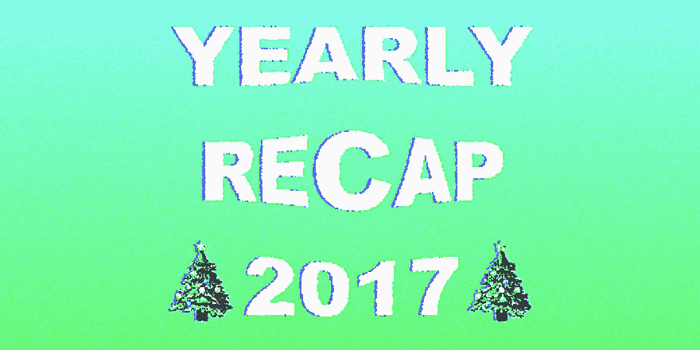
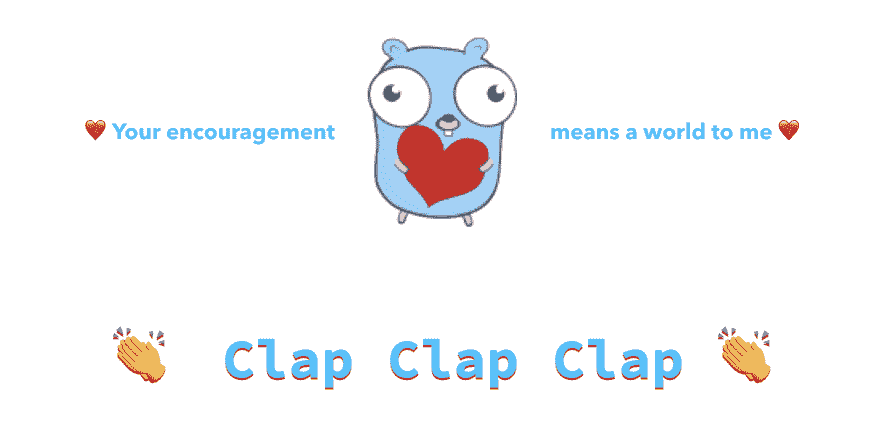

# 学习围棋编程-年度总结- 2017

> 原文:[https://dev.to/inancx/learn-go-programming-年度回顾- 2017-162e](https://dev.to/inancx/learn-go-programming---yearly-recap---2017-162e)

[T2】](https://blog.learngoprogramming.com)

[T2】](https://blog.learngoprogramming.com/2017-yearly-recap-5349f6d7d67b)

嗨！

在这篇文章中，我将讲述 2017 年发生的事情以及 2018 年将会发生的事情。此外，我已经为你创建了一个路径，所以你可以阅读我的文章，以便轻松地消化它们。

* * *

# 2017

经过几天、几夜、几周、几周、几个月的工作，全职教育人们围棋 3 个月后，事情发生了:

*   我一共写了 **10 万字**(编辑后*:共 2 万字*)
*   **2.500+独特人**关注我
*   1，300 多人关注了我的博客
*   **500+人**订阅了我的电子邮件列表([加入这里](http://eepurl.com/c4DMNX)
*   **800+人**跟随[我上媒](https://medium.com/@inanc)
*   **500 多人**在推特上关注[我](https://twitter.com/inancgumus)
*   **10 天 100+订户**到新成立的**学围棋编程公共休闲频道** ( [加入这里](https://join.slack.com/t/learngoprogramming/shared_invite/enQtMjkwNTEyMzM2MDY1LTdlZTc0YWYwZGI2MGY3ODc5NjQ5MjNhYWM2OGI2N2E4NTlmOGMwOTQ4YmVmNGZkMmUxZmYxZGQ0Nzg1ZGVmYzI))
*   我创造了**许多视觉效果、动画和代码练习**
*   我发布了**数百条教育性的推文**
*   我的一些帖子成为了 Reddit 和 T2 的热门帖子，并被许多其他出版物分享
*   许多伟大的人已经为我( ***)提供了巨大的**机会**，甚至加入了谷歌！*** )
*   许多人对我说，他们通过我的作品了解到

* * *

# 2018 年目标

我 2018 年的一些目标是赚点小钱(不知何故？)因为我也需要喝咖啡。

*   ***“有什么建议吗？请告诉我。”*T3】**
*   发布我的**在线课程** ( *开始做了——令人兴奋！*)
*   释放**截屏**我会谈论一切去
*   创建一个 Youtube 频道
*   写一本关于围棋的书
*   继续创作更多**精彩的免费内容**

* * *

# 👶我的博客很年轻

才~3 个月大— *从 2017 年最后一个季度*开始公开做。我的目标一直是教人们我所知道的东西，我很高兴我现在正在这样做。

* * *

# 🤩我的愿景

我的愿景一直是创造最简洁、信息最丰富、最直观、最容易消化的文章，你可以在一个地方找到它们。

我创建了这个博客，因为关于围棋的信息分散在许多地方，所以，你需要在太多的地方搜索它。此外，许多文章对于许多初学者甚至是中级水平的地鼠来说过于复杂或者只是浅显或者难以理解。我正在努力减少这些问题。

* * *

❤️ 💜 💙 💚 💛好吧！现在，我要总结一下我去年创作的关于围棋的大部分内容。我很高兴我能帮助别人。**尽情享受！**

* * *

# 2017 年所有文章

你可以按照我在这里列出的顺序来阅读这些文章。几乎我所有的文章都包括解释、提示和技巧、视觉效果和代码练习，你可以在网上试试。

* * *

*   **概述**

    *   **[关于围棋语言—概述](https://blog.learngoprogramming.com/about-go-language-an-overview-f0bee143597c)**
        *   *围棋生态系统及语言概述。*

* * *

*   **套餐**

    *   **[围棋套餐简介](https://blog.learngoprogramming.com/definitive-guide-to-go-packages-focus-on-the-fundamentals-to-empower-your-skills-d14aae7cd321)**
        *   *什么是套餐？*
    *   **[如何使用套餐](https://blog.learngoprogramming.com/using-packages-eb70cb61a16a)**
        *   如何使用自己的、他人的和 Go 标准库的包？
    *   **[特殊包和目录](https://blog.learngoprogramming.com/special-packages-and-directories-in-go-1d6295690a6b)**
        *   *关于内部、主、库和厂商目录。*
    *   **[用包](https://blog.learngoprogramming.com/code-organization-tips-with-packages-d30de0d11f46)** 组织你的代码
        *   *如何用包设计围棋程序？*
    *   **[如何解耦你的包](https://blog.learngoprogramming.com/packages-can-allow-or-disallow-for-reusability-2edb6bd18815)**
        *   如何用包增加代码的可维护性？
    *   **[围棋套餐规则手册](https://blog.learngoprogramming.com/go-packages-summary-6d40ba46a6f4)**
        *   *总结规则以供参考。*
    *   **[修复你的$GOPATH 和$GOROOT](https://blog.learngoprogramming.com/what-are-goroot-and-gopath-1231b084723f)**
        *   *如何配置它们以及它们的作用。*

* * *

*   **变量**

    *   **[视觉引导围棋变量](https://blog.learngoprogramming.com/learn-go-lang-variables-visual-tutorial-and-ebook-9a061d29babe)**
        *   *变量和声明风格介绍。*
    *   **[短变量声明规则手册](https://blog.learngoprogramming.com/golang-short-variable-declaration-rules-6df88c881ee)**
        *   关于如何使用短变量的提示和技巧。中级。

* * *

*   **常数**

    *   **[视觉引导围棋常数](https://blog.learngoprogramming.com/learn-golang-typed-untyped-constants-70b4df443b61)**
        *   *非类型化和类型化常量介绍。*
    *   **[终极视觉引导围棋枚举](https://blog.learngoprogramming.com/golang-const-type-enums-iota-bc4befd096d3)**
        *   *如何在 Go 中定义 enum，如何使用 iota？*

* * *

*   **功能**

    *   **[Funcs — Baby-Gopher 的视觉向导](https://blog.learngoprogramming.com/golang-funcs-params-named-result-values-types-pass-by-value-67f4374d9c0a)**
        *   *举例介绍 Go 函数。*
    *   **[动物园的围棋功能](https://blog.learngoprogramming.com/go-functions-overview-anonymous-closures-higher-order-deferred-concurrent-6799008dde7b)**
        *   匿名函数、高阶函数、闭包函数、并发函数、延迟函数、可变函数和方法的介绍之旅。
    *   **[变函数终极指南](https://blog.learngoprogramming.com/golang-variadic-funcs-how-to-patterns-369408f19085)**
        *   *可变函数接受可变数量的输入值——零个或更多。这篇文章涵盖了所有关于变元函数的内容。*
    *   **[延期简化加实用视觉](https://blog.learngoprogramming.com/golang-defer-simplified-77d3b2b817ff)**
    *   *延期函数介绍。包括延迟函数、多重延迟、延迟方法、延迟闭包以及其他例子。*
    *   **[延期内件—快速查看](https://blog.learngoprogramming.com/yeah-semantically-after-is-the-right-word-fad1d5181891)**
        *   *一篇中级文章。提问:延迟是在 func 返回之前还是之后运行？*
    *   **[围棋延迟的 5 个陷阱(Golang) —第二部分](https://blog.learngoprogramming.com/5-gotchas-of-defer-in-go-golang-part-ii-cc550f6ad9aa)**
        *   初级水平的文章，涵盖了延迟函数的一些基本陷阱。
    *   **[围棋延迟的 5 个陷阱(Golang)——第一部分](https://blog.learngoprogramming.com/gotchas-of-defer-in-go-1-8d070894cb01)**
        *   中级水平的文章，涵盖了延迟函数的一些更高级的陷阱。

* * *

# 🐦推特

我也在两个月前开始几乎每天发微博。我在推特上发布了很多关于围棋的技巧和练习题。我看到它帮助了很多人。

点击查看[。](https://twitter.com/inancgumus)

* * *

我还在创建一个围棋在线课程→ [加入我的时事通讯](http://eepurl.com/c4DMNX)。

*   让我们每周保持联系，获取新的教程和技巧。
*   *👍当我的课程出版时，订阅者将获得折扣价(甚至免费)。*

* * *

[T2】](https://res.cloudinary.com/practicaldev/image/fetch/s--KpvX3-XV--/c_limit%2Cf_auto%2Cfl_progressive%2Cq_auto%2Cw_880/https://thepracticaldev.s3.amazonaws.com/i/13s08go8m7epb1y6973n.png)