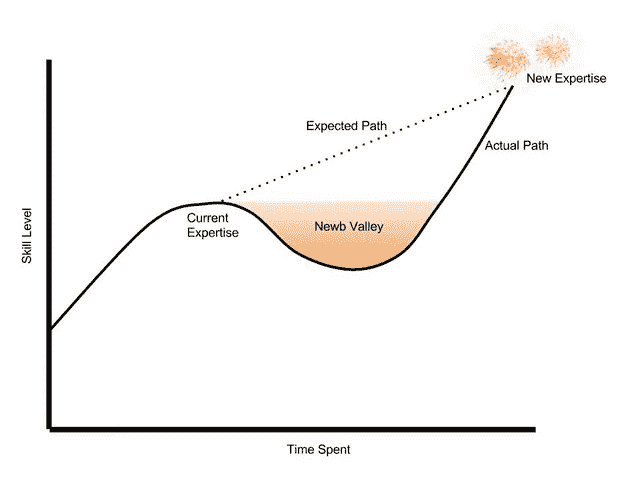

# 纽布山谷

> 原文：<https://dev.to/monknomo/newb-valley-lh4>

当你擅长你所做的事情的时候。如果你和我一样，你在很长一段时间里都很擅长做一些事情——在学校很擅长，在工作中很擅长，在结构化的环境中很擅长提供一条路径，并使用你已经知道的技能。这是一个居住非常舒适的地方。它来自于尊重，既包括自我尊重，也包括来自你的同伴和同事的尊重。

只要你呆在你的结构化环境中，在使用/提高你现有技能的道路上，变得更好感觉很容易——或者至少是可预测的。你付出努力，你的技能以(或多或少)线性的方式提高。

[T2】](https://res.cloudinary.com/practicaldev/image/fetch/s--OKReuMF4--/c_limit%2Cf_auto%2Cfl_progressive%2Cq_auto%2Cw_880/https://i.imgur.com/ym8uDgGl.jpg)

或早或晚，你可能会渴望学习现有专业技能之外的东西。如果你和我一样，当这个*疼*的时候，你会很惊讶。突然，你不擅长你想做的事情。技能水平下降的冲击是令人不安的，退回到舒适的旧环境的诱惑是强烈的。

举一个具体的例子，你可能是一个有才华的开发人员。你可以学习新的语言，或者建立新的系统。如果有什么编程相关的东西你不知道，你很清楚要花多长时间来学习它，以及你应该如何着手学习它。

但是有一天你会成为首席开发人员，或者进入管理层。突然，你需要一些你已经多年没有练习过的技能，而 T2 也没有一条清晰的道路。

## 欢迎来到纽布谷！

[T2】](https://res.cloudinary.com/practicaldev/image/fetch/s--1-nVQw7A--/c_limit%2Cf_auto%2Cfl_progressive%2Cq_auto%2Cw_880/https://i.imgur.com/7QJZMYAl.jpg)

正是你希望的道路和你实际的道路之间的差异导致了很多痛苦。通过纽博谷，你可以做一些事情来减少你的痛苦和力量

1.  知道它要来了
2.  有一个弥合差距的计划
3.  原谅自己的错误

### 知道它要来了

这是一个简单但关键的步骤。如果你新发现的能力不足让你感到惊讶，那么放弃它，回到舒适生活的冲动可能会被证明是压倒性的。相反，向你的新手倾斜。接受你能力不足的事实——毕竟，如果你知道该做什么，你就不会学习了。

在不舒服的情况下发展一定程度的舒适会有很大帮助。

### 有计划

面对不舒服的情况时，发展和保持舒适的一个方法是有一个可以依靠的计划。你知道你在进行一场艰难的斗争，所以提前想好你想如何爬上那座山。给自己一些小目标和方法来检查你的进展。

### 原谅自己

在一段时间内，你的能力会下降。

这意味着你会犯错误。你会错过最后期限的。您将交付比您计划的更少的范围。你的下一步计划将会是错误的。

深呼吸，重新评估，吸取教训，继续前进。

你会在不知不觉中爬出纽布谷

## 访问我的博客

如果你喜欢这篇文章，[访问我的博客](https://www.gunnargissel.com),获取更多关于领导力和编程交集的精彩文章。

[请注册我的电子邮件列表，获取有趣的编程和技术领导文章的月度摘要](http://www.gunnargissel.com/pages/email-signup-1.html)

## 学分

*谢谢[桑迪·布朗·詹森](https://www.flickr.com/photos/sandybrownjensen/)给的[登山者](https://flic.kr/p/oY5rrt)T5】的照片*

*感谢[布赖恩·泰勒](https://www.flickr.com/photos/briantaylor/)提供的[【牛 b 谷】](https://flic.kr/p/qP7esU)* 的图片