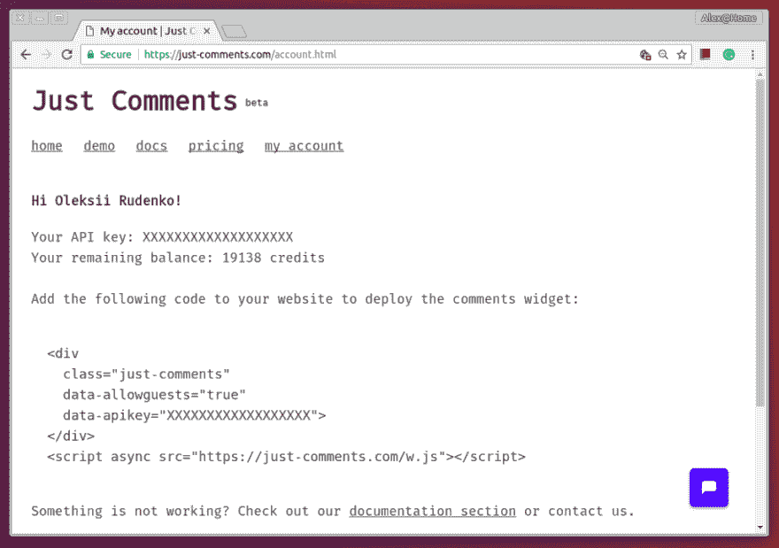
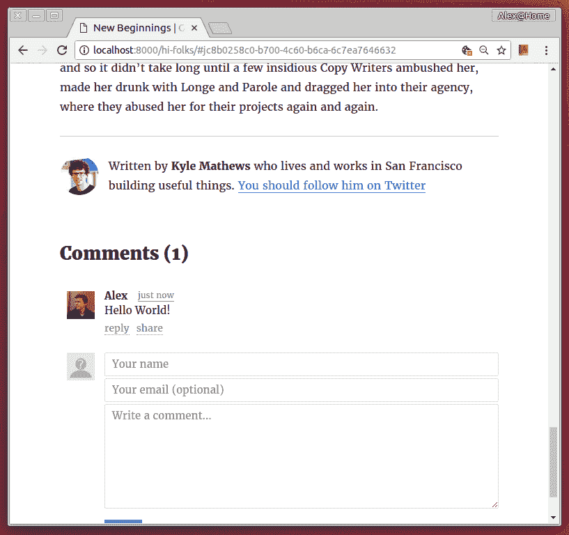

# 两分钟内给你的 GatsbyJS 博客添加评论

> 原文：<https://dev.to/orkon/add-comments-to-your-gatsbyjs-blog-within-two-minutes-3gp5>

静态网站很棒！它们易于发布和维护。你可以为数百万用户轻松扩展一个静态网站。而且主机通常很便宜。另一个优点是本地开发的便利性和在发布前预览任何变化的可能性。静态网站的挑战之一是向网站添加动态内容。在这篇文章中，我将向你展示一种简单的方法，使用 [Just Comments](https://just-comments.com/) 在基于 [GatsbyJS](https://www.gatsbyjs.org/) 的静态网站中添加一个评论小部件。

#### 用 GatsbyJS 的博客启动器创建新博客

如果你已经有了盖茨比的博客，跳过这一节。对于没有的，先从安装 GatsbyJS 开始:

```
npm install --global gatsby-cli 
```

Enter fullscreen mode Exit fullscreen mode

创建一个名为“带评论的博客”的新博客:

```
gatsby new blog-with-comments 
```

Enter fullscreen mode Exit fullscreen mode

将目录改为`blog-with-comments`，在开发模式下启动 GatsbyJS。这将启动一个开发服务器，您将能够在[http://localhost:8000](http://localhost:8000)
看到博客

```
gatsby develop 
```

Enter fullscreen mode Exit fullscreen mode

#### 向 GatsbyJS 博客添加评论

现在，当我们有一个基本的博客时，我们可以添加评论，这样你的访问者就可以对你的内容发表评论。

首先，通过 Github 或脸书登录，在 Just Comments 上创建一个账户。登录后，您将看到一个为您创建的 API 密钥。

<figure>[](https://res.cloudinary.com/practicaldev/image/fetch/s--Qmxx5dqH--/c_limit%2Cf_auto%2Cfl_progressive%2Cq_auto%2Cw_880/https://cdn-images-1.medium.com/max/1024/1%2Aon_NSotyKdv4DOh2PXQP5w.png) 

<figcaption>账号页面上刚刚评论的</figcaption>

</figure>

现在我们需要修改博客模板，并将小部件集成到我们的博客中。在您喜欢的编辑器中打开文件 src/templates/blog-post.js。按照以下方式更改<helmet>标签:</helmet> 

```
<Helmet title={`${post.frontmatter.title} | ${siteTitle}`}>
  <script src="https://just-comments.com/w.js" type="text/javascript" defer="true"></script>
</Helmet> 
```

Enter fullscreen mode Exit fullscreen mode

通过添加脚本标签，我们嵌入了仅由评论提供的小部件，这将为我们的评论提供动力。

其次，将注释的容器元素放在您想要的位置。我将它添加在同一个文件 src/templates/blog-post.js 中的<bio>标签之后。用 Just Comments 帐户的实际 API 键替换 **YOUR_API_KEY** 。</bio> 

```
<div
  className="just-comments"
  data-allowguests="true"
  data-apikey="YOUR_API_KEY"
  style={{
   marginBottom: rhythm(1),
   marginTop: rhythm(-1),
  }}
>
</div> 
```

Enter fullscreen mode Exit fullscreen mode

最终结果看起来像这样:

<figure>[](https://res.cloudinary.com/practicaldev/image/fetch/s--pzhdcm2u--/c_limit%2Cf_auto%2Cfl_progressive%2Cq_auto%2Cw_880/https://cdn-images-1.medium.com/max/817/1%2AfaxVBror7H3tA1OHigDzxg.png) 

<figcaption>Hello World 评论 with GatsbyJS 和 Just 评论</figcaption>

</figure>

#### 关于刚才的评论

Just Comments 是一项提供评论系统的服务。它不是完全免费的，但是对于那些没有几百万访问者的小网站来说，它几乎是免费的。Just Comments 向你收取所谓的评论浏览量费用，一次评论浏览量只需 0.00001 美元，或者 100 万次浏览量只需 10 美元。阅读更多关于 Just Comments 在*的定价和可能的整合*