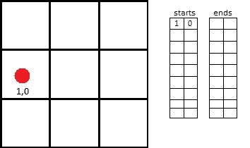
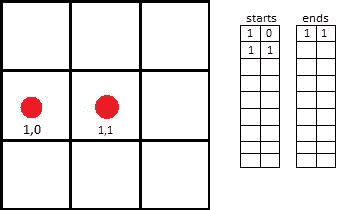
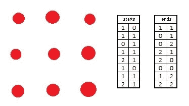
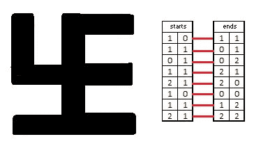
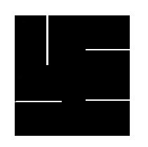
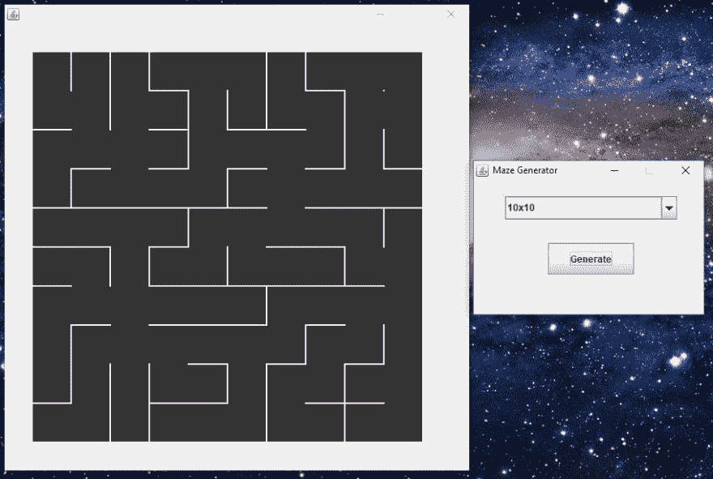
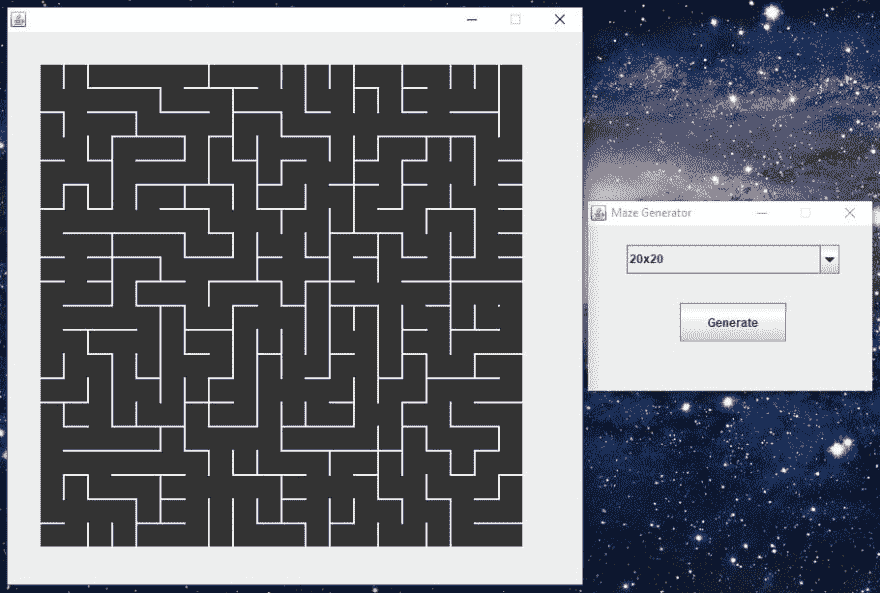
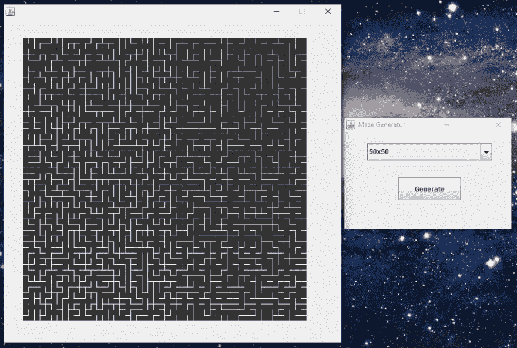
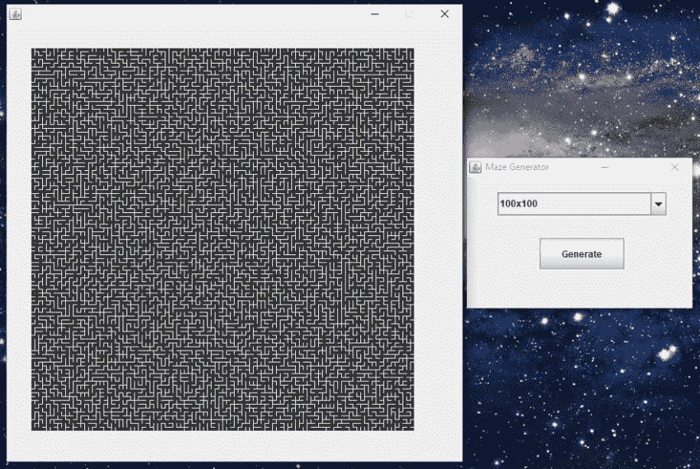

# 迷宫生成器简介[Java]

> 原文:[https://dev . to/marks ASP 95/introducing-maze-generator-Java-320g](https://dev.to/marksasp95/introducing-maze-generator-java-320g)

这是我在大学里为数据结构这一科目做的一个项目。

它的名字很好地描述了它，它生成随机迷宫，它的主要逻辑资源是 Aldous-Broder 算法。

这种算法以随机决策而闻名，因此创建迷宫所需的时间(取决于其尺寸)可能是不可预测的(100x100 迷宫可能需要 45 秒)。

## 奥尔德斯-布罗德算法

[Aldous-Broder 算法](http://weblog.jamisbuck.org/2011/1/17/maze-generation-aldous-broder-algorithm)专门用于迷宫生成，它使用矩阵来创建路径。简单来说，算法如下:

1.-随机抽取任意一个细胞进行检查。
2。-取任何相邻单元格(非对角线)，如果该单元格尚未检查，请检查它。
3。-重复步骤 2，直到检查完所有单元格。

这里可以看到完整的讲解和实时演示[。](http://weblog.jamisbuck.org/2011/1/17/maze-generation-aldous-broder-algorithm)

### 检查单元格

我们通过用坐标建立一个点来检查每个单元，我们连接每个点来创建一条路线。为了追踪这条路线，我们必须有我们去过的地方的记录，所以我们创建两个 2D 数组(*开始*和*结束*)。

让我们看一个简单的例子:

步骤 1(随机选择起始小区)

[T2】](https://res.cloudinary.com/practicaldev/image/fetch/s--pQ9ChKL7--/c_limit%2Cf_auto%2Cfl_progressive%2Cq_auto%2Cw_880/https://thepracticaldev.s3.amazonaws.com/i/ata031a8s4tjlbpxzdw2.jpg)

将该位置保存到*开始*

步骤 2(随机选择相邻小区)

[T2】](https://res.cloudinary.com/practicaldev/image/fetch/s--rEUTA7_u--/c_limit%2Cf_auto%2Cfl_progressive%2Cq_auto%2Cw_880/https://thepracticaldev.s3.amazonaws.com/i/ltjvgetcucmh0epl9qoe.jpg)

如果未选中，则将其选中，并将该位置保存到*终点*。请注意，对于每一个结束，我们必须有一个新的开始，这是以前访问过的单元。

步骤 3(重复步骤 2，直到检查完所有单元格)

[T2】](https://res.cloudinary.com/practicaldev/image/fetch/s--bZd2U-9X--/c_limit%2Cf_auto%2Cfl_progressive%2Cq_auto%2Cw_880/https://thepracticaldev.s3.amazonaws.com/i/m5vcd9yhmfoyqm9fkcao.jpg)

我们还去掉了网格(这只是为了让你看到矩阵)。

我们现在有了绘制迷宫所需的所有数据，我们只需用一条直线连接每个起点和终点。

[T2】](https://res.cloudinary.com/practicaldev/image/fetch/s--mj2tZoD1--/c_limit%2Cf_auto%2Cfl_progressive%2Cq_auto%2Cw_880/https://thepracticaldev.s3.amazonaws.com/i/cr2e4h6su0go6up5kmxa.jpg)

我们的迷宫已经准备好了，但是看起来不太好，所以我增加了线条的笔画。

[T2】](https://res.cloudinary.com/practicaldev/image/fetch/s--__saMsER--/c_limit%2Cf_auto%2Cfl_progressive%2Cq_auto%2Cw_880/https://thepracticaldev.s3.amazonaws.com/i/03p97n71emp0z3sxj0q2.jpg)

这还差不多。

这是画迷宫的代码，我只给你 JPanel:

```
package interfazgrafica;

import javax.swing.*;
import java.awt.*;

class MazeIterfacePanel extends JComponent{ // JPANEL

    private int dims, thickness, margin;

    public MazeInterfacePanel(int dims, int thickness, int margin){
        this.dims = dims;
        this.thickness = thickness;
        this.margin = margin;
    }

    public void paintComponent(Graphics g){

        super.paintComponent(g);

        Graphics2D g2 = (Graphics2D) g;
        BasicStroke stroke = new BasicStroke(thickness);
        g2.setStroke(stroke);
        int j = 0;

        for (int i = 0; i < dims*dims; i++) { 
            g2.drawLine(Labyrinth.starts[i][j] * (500/dims) + margin, 
                        Labyrinth.starts[i][j+1] * (500/dims) + margin, 
                        Labyrinth.ends[i][j] * (500/dims) + margin, 
                        Labyrinth.ends[i][j+1] * (500/dims) + margin);
        }
    }     
} 
```

<svg width="20px" height="20px" viewBox="0 0 24 24" class="highlight-action crayons-icon highlight-action--fullscreen-on"><title>Enter fullscreen mode</title></svg> <svg width="20px" height="20px" viewBox="0 0 24 24" class="highlight-action crayons-icon highlight-action--fullscreen-off"><title>Exit fullscreen mode</title></svg>

绘图是由来自 *java.awt.Graphics* 类的 *drawLine* 函数完成的，它有四个参数:前两个是直线的起点，其他的是终点。我以像素为单位来定位这些点，我使用*变暗*来减少 500 像素的平移因子:假设迷宫的尺寸是 50x50，那么*变暗* = 50。另外，JPanel 是根据尺寸用特殊的笔画和边距创建的。这就是为什么我们的迷宫占据相同的空间，还记得我们的*开始*和*结束*数组吗？这是我们使用它们的地方。

窗口上的坐标是:我们的数组的索引乘以一个根据维度减少的平移因子，并增加一个边距。

这是一些真实的随机迷宫的样子:

### 10x10

[T2】](https://res.cloudinary.com/practicaldev/image/fetch/s--MdaiVM6u--/c_limit%2Cf_auto%2Cfl_progressive%2Cq_auto%2Cw_880/https://thepracticaldev.s3.amazonaws.com/i/hsvqzoo7r1dtnrmooglf.JPG)

### 20x20

[T2】](https://res.cloudinary.com/practicaldev/image/fetch/s--NwJFVY1J--/c_limit%2Cf_auto%2Cfl_progressive%2Cq_auto%2Cw_880/https://thepracticaldev.s3.amazonaws.com/i/l2btabtdx3tla9iteak0.JPG)

### 50x50

[T2】](https://res.cloudinary.com/practicaldev/image/fetch/s--DEQIVHdc--/c_limit%2Cf_auto%2Cfl_progressive%2Cq_auto%2Cw_880/https://thepracticaldev.s3.amazonaws.com/i/ise18lha261xcm3do7pd.JPG)

### 100x100

[T2】](https://res.cloudinary.com/practicaldev/image/fetch/s--RsKN-8eW--/c_limit%2Cf_auto%2Cfl_progressive%2Cq_auto%2Cw_880/https://thepracticaldev.s3.amazonaws.com/i/nzkv5f0poz1elcbd05gg.JPG)

迷宫生成器还将每个生成的迷宫保存在文本文件中，这些文件包含它们生成的时间，它们的目录在程序开始时指定。

### 后记

当我接到这个项目时，我不知道如何做，只有基本的 OOP 知识，几乎没有 Java 经验，正是通过做这个项目，我学到了很多东西，这是给每个初学者的建议。

这是我的第一篇*实际*帖子，欢迎大家在评论中发表意见。

*来自梦幻国度的封面图片*