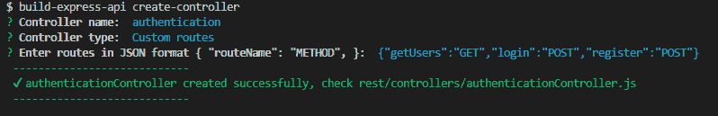
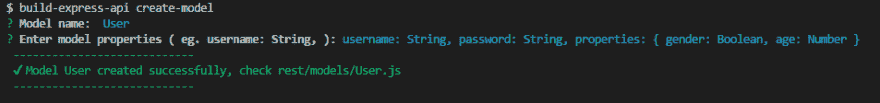
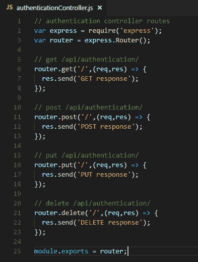
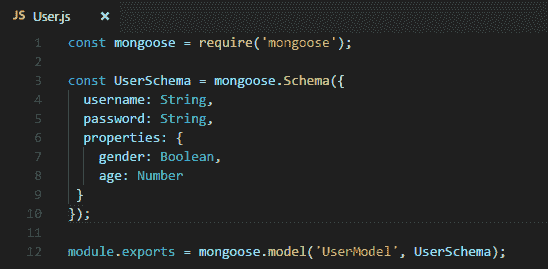
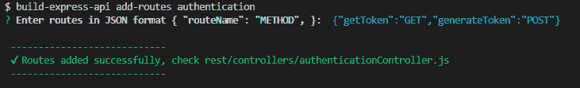

# 创建节点 api 变得容易多了。构建-快速-api 简介

> 原文:[https://dev . to/ognjengt/creating-node-APIs-been-a-lot-easy-introduction-to-build-express-API-292 e](https://dev.to/ognjengt/creating-node-apis-became-a-lot-easier-introduction-to-build-express-api-292e)

在这篇文章中，我想分享一些我从 11 月中旬以来一直在做的事情。就我个人而言，这个项目是我在小型软件开发生涯中最引以为豪的项目。

我说的是我自己搭建的一个工具，叫做“build-express-api”。一个命令行界面(CLI)，可以帮助开发人员在瞬间构建 node express api。

我有了这个想法，意识到当我用 node 创建后端时，我没有一个快速简单的方法来创建模型和控制器。

我总是需要复制现有的代码，手动创建文件，需要 server.js 中的脚本，安装所有需要的依赖项，等等…

所以我想让我的开发工作流程更简单。

一段时间以来，我一直对创建一个 npm 包感兴趣，这似乎是一个完美的机会。所以我看了几个教程，谷歌了一下，准备出发了。

我没有把所有的特性都写下来，我只是开始构建，一件事接一件事。

如果你现在想看看这个包，可以在这里找到:[https://www.npmjs.com/package/build-express-api](https://www.npmjs.com/package/build-express-api)

# 开始

我真的很喜欢 express CLI 本身，以及它通过在终端中键入“express”来初始化整个文件夹结构的方式。我想要类似的东西，所以我创建的第一个特性是“init”。

通过键入“build-express-api init ”,程序初始化了应用程序结构。

此外，该程序创建 beaConfig.json 文件，开发人员可以在其中配置到 models 和 controllers 文件夹的路径，以及 server.js 文件的位置。

如果你已经有了一个正在开发的项目，并且想在那个项目上使用这个工具，通过执行“build-express-api create-config ”,这个程序只在根项目目录中创建 beaConfig.json 文件，在那里你可以配置位置，并开始构建一个 api。

开了个好头。现在真正的工作即将开始。

# 创建控制器和模型

我需要一种快速的方法来创建控制器/路线和模型，所以我实现的下一个特性是“创建控制器”和“创建模型”。

我想让 CLI 具有交互性，引导开发人员完成创建过程。

因此，应用程序不是在一行中键入一个大命令，而是通过一系列问题提示开发人员，比如:控制器的名称是什么？您要将路由添加到此控制器吗？诸如此类…

最后，这些命令看起来像这样。

[T2】](https://res.cloudinary.com/practicaldev/image/fetch/s--vUT-F8Lt--/c_limit%2Cf_auto%2Cfl_progressive%2Cq_auto%2Cw_880/https://thepracticaldev.s3.amazonaws.com/i/l82ejv1lct90ipsawssl.png)

通过键入“build-express-API create-controller”或简称“build-express-api cc ”,将在 controllers 文件夹中创建一个新的控制器，并包含所有必需的依赖项。

实现这个特性后，我真正看到了这个工具的潜力，以及它如何简化开发人员的创建过程。

当创建一个新的控制器时，开发者有两个选择，创建一个普通的控制器，有 4 个路由(GET，POST，PUT，DELETE)或者输入自定义路由。

[T2】](https://res.cloudinary.com/practicaldev/image/fetch/s--U-xd-gpV--/c_limit%2Cf_auto%2Cfl_progressive%2Cq_auto%2Cw_880/https://thepracticaldev.s3.amazonaws.com/i/btge6jtz44lgcw7cb0gq.png)

从菜单中选择自定义路线后，开发人员可以键入他需要的路线，它们将被创建。

我对模型做了同样的事情，输入“build-express-api create-model”或简称“build-express-api cm”。

[T2】](https://res.cloudinary.com/practicaldev/image/fetch/s--jBfJ8PO1--/c_limit%2Cf_auto%2Cfl_progressive%2Cq_auto%2Cw_880/https://thepracticaldev.s3.amazonaws.com/i/grdc9ph6y64b41x7ildq.png)

控制器文件如下所示(这是构建普通控制器时的示例代码)

[T2】](https://res.cloudinary.com/practicaldev/image/fetch/s--kxgcZPod--/c_limit%2Cf_auto%2Cfl_progressive%2Cq_auto%2Cw_880/https://thepracticaldev.s3.amazonaws.com/i/kndoctb28vz3zwqo0cc6.png)

模型文件看起来像这样

[T2】](https://res.cloudinary.com/practicaldev/image/fetch/s--JwFHp1pt--/c_limit%2Cf_auto%2Cfl_progressive%2Cq_auto%2Cw_880/https://thepracticaldev.s3.amazonaws.com/i/hleq1avcqs4k5qculfb5.png)

# 自动要求 server.js/app.js 的文件

我想让这个过程更加自动化，所以在创建控制器之后，工具会自动要求它们出现在主服务器文件中。

这大大加快了进程。开发人员不需要过多考虑他是否在服务器文件中包含了路由，他可以只创建一个控制器，运行“npm start”并查看工作 api。这也是我开发这个工具的主要原因。

# 向现有控制器添加路线

另一个特点是开发者可以添加新的路线到现有的控制器。

通过运行“build-express-api add-routes ”,开发人员会得到消息提示，要求以严格的 JSON 格式添加路由。

[T2】](https://res.cloudinary.com/practicaldev/image/fetch/s--t8vBiEbv--/c_limit%2Cf_auto%2Cfl_progressive%2Cq_auto%2Cw_880/https://thepracticaldev.s3.amazonaws.com/i/ma4ond74zey0rwkqmys2.png)

此后，authenticationController 针对 2 条新路由更加丰富。

# 添加测试和持续集成

我已经意识到，这个模块，必须获得其他开发者的信任，所以我必须添加测试。我以前没有真正测试过任何 javascript 应用程序，所以我决定用 mocha 和 chai，因为我看到它们是流行的测试框架。

我以为这要花些时间才能搞清楚，但实际上，并没有，而且对我帮助很大。

在这个项目中，我发现了测试驱动的开发方法，并看到了它实际上是多么强大。我现在对部署很有信心。如果我所有的测试都通过了，就没有必要担心错误了。

当然，这个模块并不完美，总有需要改进的地方。

此外，我第一次尝试了 TravisCI，当我看到绿色建筑:通过徽章时，我像一个小孩子一样高兴。

我立即将徽章添加到 github repo 中，这样模块就会获得信任，因为所有的测试都通过了。

有了 Travis，我不需要担心该模块是否能在其他机器上工作。

# 结论

总的来说，构建这个模块是一次非常富有成效的经历，我学到了我感兴趣的东西，以及作为开发人员应该学习的东西。

Github 对这个模块的回购可以在这里找到:[https://github.com/ognjengt/build-express-api](https://github.com/ognjengt/build-express-api)

如果您认为这可能对您有用，请随意创建拉式请求，发布您遇到的问题，并开始回购。仍然有一些事情我需要修复，我期待着改进这个模块。

另外，请务必阅读自述文件。

未来的计划是创建一个完整的平台，支持各种语言和框架，并自动化 API 创建过程。

你也可以在推特上找到我:[https://twitter.com/ognjengt](https://twitter.com/ognjengt)

请随时给我你的建议和意见，我很乐意听到它们！