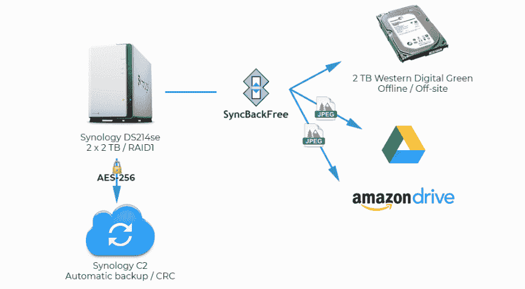

# 我的备份策略

> 原文:[https://dev.to/fbnlsr/my-backup-strategy-4gi7](https://dev.to/fbnlsr/my-backup-strategy-4gi7)

数字资产的保护是一个价值数百万美元的产业。无论我们谈论的是军事、金融还是科学数据，每个行业都必须为损失做好准备，并为安全做好计划。他们经常推出极端措施，甚至拥有自己的(并增加一倍)专用电线。但是如何保护你朋友最新的烧烤聚会照片呢？或者你的小家伙的第一步视频？下面是我如何从一次悲惨的系统故障中吸取教训，以及我现在的设置是什么样子的。

## 灾难性的失败

早在 2008 年，我用一些旧电脑零件、一堆 500 GB 硬盘和一份 **FreeNAS** 给自己做了一个定制 NAS ( **网络附加存储**)。操作系统运行一个漂亮的 512 MB IDE 闪存驱动器，数据阵列配置为使用 **RAID5** 。这意味着，如果一个驱动器损坏，我可以随时在阵列中放入一个新的驱动器，数据将会自行重建。注意条件时态。这是因为在我们 2010 年搬进来之前，它一直运行得完美无缺。我们把 NAS 放在一个盒子里，放在一个有巨大磁铁的扬声器旁边，存放了一个月。两个驱动器出现故障。

我花了几个星期试图找出一个解决方案，如何重建我丢失的数据。但是过了一段时间，我不得不面对现实。这是徒劳的。多年的家庭照片和视频，一整套 MP3 收藏，我所有的视频游戏...一切都失去了，永远失去了。我的女朋友泪流满面，我花了那么多时间规划和构建这整个系统的“极客骄傲”受到了严重的打击。我使用热数据作为存储，当时我没有备份策略。当然，我有恢复选项，因此有了 RAID5，但我没有为这样一个灾难性的失败做好准备。说到计算机安全，你必须做最坏的打算。

几年后，我得到了教训。这就是我现在处理数字生活的方式。

## 我的当前设置

我目前的设置主要是围绕两件事构建的:一个新的 NAS，是我购买而不是构建的；一个备份软件，可以自动处理数据。

我现在用的 NAS 是一款**Synology disk station ds 214 se**。这是一台非常简单的机器，运行在 800 MHz 双核 CPU 上，有 256 MB 内存和两个硬盘驱动器托架。我在那里**放了两个 2 TB Western Digital Green** 硬盘，并配置了一个在 **RAID1** 中运行的单个阵列:一个驱动器上的所有内容都被镜像到第二个驱动器上。这意味着我失去了一半的假设存储空间，但如果一个驱动器出现故障，我可以更改它，数据将自动重建。

NAS 位于 **APC 不间断电源**之上。如果我的公寓断电，NAS 会继续运行，我可以手动(并且安全地)关闭它，方法是使用它的物理电源按钮(它会发送断电命令)，甚至是我的电话(我的路由器也连接到 UPS，所以即使没有电，我仍然可以在几分钟内访问互联网和网络)。

我的主要备份策略是由一个叫做 **SyncBack Free** 的神奇软件处理的。这个软件允许我设置各种备份场景，称为配置文件。主配置文件是一个到外部硬盘驱动器的**物理备份**。当我购买 Synology NAS 时，我得到了第三个 2 TB 驱动器，现在用作备份。这是我的第一个故障保险。这是我之前的设置所缺少的。一旦备份任务完成，该驱动器将被离线存储**和离线存储**，因此它不会出现电气故障。即使发生火灾或洪水，我的数据也是安全的。****

 ****SyncBack 然后运行另外两个作业。在我用旧设备丢失的所有数据中，家庭照片的丢失是最难处理的。人们总是可以替换他们过去喜欢的音乐或电影，因为有永无止境的娱乐可供消费。但是记忆确实会消失，而且不可能恢复。所以我决定在我的备份策略中增加一个冗余层，将照片存储在我的谷歌硬盘中。SyncBack 比较 NAS 文件夹和我的 Google Drive 的内容，并在对每个文件执行**循环冗余检查**以查看它们是否在两端相同之前，用前者更新后者。

我应该注意到，我可以在 NAS 上使用两个不同的应用程序，并让它自动处理这两个备份: **USB 复制**和**超级备份**。在不同的场景下试用了这两个应用程序后，我决定不使用它们，因为它们要么以专有格式存储数据(超级备份)，要么将一堆`._`预先添加的元数据文件添加到我现有的目录中(USB 副本)。我喜欢这样的事实，如果我需要在 Synology 的生态系统之外检索我的文件，我仍然可以使用一个很好的旧的`cp`命令来取回我的文件。

## 但是等等，还有！

因此，我的数据存储在 RAID1 阵列和离线硬盘上。照片都备份在我的谷歌硬盘上了。我本可以就此打住，但我认为这还不够。多亏了我的 **Amazon Prime** 订阅，我可以在他们的 **Amazon Drive** 云服务上上传无限数量的照片，这不会影响我原本有限的配额。所以嘿，让我们抓住这个机会吧！另一个 SyncBack 配置文件将我的照片目录的内容备份到亚马逊的服务器上。我喜欢我的数据存储在两个不同的存储提供商。谷歌和亚马逊都有自己的基础设施，所以如果其中任何一个地方发生天文数字的故障，我*可能*仍然是安全的。

但是为什么就此打住呢？我的照片现在存储在四个不同的位置(NAS、外部硬盘、Google Drive 和 Amazon Drive)。但是其他的呢？我的音乐，我的文档，我的家庭录像？当然，它们在 NAS 和外部硬盘上，但我想我需要另一个故障保险。因为到目前为止，我的备份策略依赖于可能构成单点故障的东西:同步回退。如果软件表现不好，或者我的备份配置文件之一没有正确配置，我可能会以在不同的位置保存错误而告终。我也没有那么容易访问外部硬盘，所以如果我需要在任何给定的时间进行备份，我需要至少提前一天准备操作。

这就是为什么我订阅了 C2 的《T2》和《T3》。这是一个完全集成的服务，原生运行在**DSM**(*disk station Manager*:Synology 自己的操作系统)上，允许我将整个 NAS(除去我的电影和电视节目，这些都不重要)备份到 Synology 的服务器上。在网络上发送数据之前，它使用 AES-256 对数据进行本地加密。我已经对它进行了设置，使它在每周的第一天自动备份，然后在两天后进行完整性检查。

我也考虑过 Online 的 [C14](https://www.online.net/en/c14) ，因为它们真的很便宜，你可以通过 FTP 发送文件，但不幸的是它们不支持 Synology。

## 提升空间

这就是我现在的设置:

[T2】](https://res.cloudinary.com/practicaldev/image/fetch/s--hloPgrFm--/c_limit%2Cf_auto%2Cfl_progressive%2Cq_auto%2Cw_880/https://thepracticaldev.s3.amazonaws.com/i/mgrxrz3qcpwwxzo100nc.jpg)

每个文件在物理上存储在多达 6 个不同的位置，具有不同级别的故障保护措施。

这个设置完美吗？当然不是。首先，它缺乏自动化。我仍然必须手动启动每个备份任务(除了 C2 备份任务)，这很容易出错。我正在处理实时数据，因此阵列会不断变化，但这是一个备份，而不是长期冷存储。我使用的外置硬盘需要运输和操作，这是系统的另一个弱点。

我可能很快会改变的一件事是我正在使用的硬盘的型号。WD Green 很“好”,但它们不适合在 NAS 中使用。因此，我想我会将它们换成 WD Red 或希捷酷狼线，并可能借此机会将存储稍微升级到 3tb 或 4 TB。

总而言之，备份策略的主要问题是它们从来都不是完美的。只要看看几个月前在 GitLab 发生的事情[，或者甚至是](https://techcrunch.com/2017/02/01/gitlab-suffers-major-backup-failure-after-data-deletion-incident/)[让 OVH 瘫痪](https://www.theregister.co.uk/2017/07/13/watercooling_leak_killed_vnx_array/)几个小时的灾难性失败。

人们无法对数据丢失做好充分准备。尽管如此，我可以说，我对这个策略有点信心，我已经尝试过考虑每一种情况(甚至是太阳耀斑，但它们完全是另一种动物)。我们将在几年后看到我的数据如何存放在哪里。****