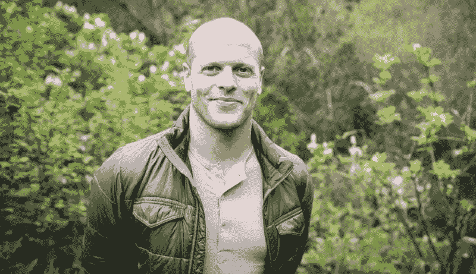
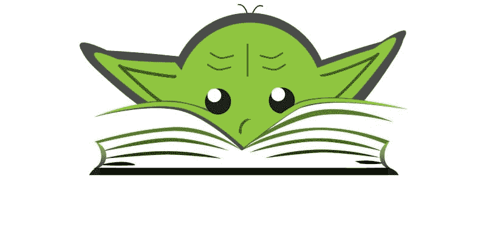

# 这些套路将赢得我的 2018 年——也许也是你的

> 原文:[https://dev . to/yordiverkroost/these-routines-will-win-my-2018-17 F9](https://dev.to/yordiverkroost/these-routines-will-win-my-2018-17f9)

*这篇文章最初出现在[我的个人博客](https://medium.com/@yordiverkroost/these-routines-will-win-my-2018-accac1463cfe)上。*

在过去的几个月里，我慢慢地通读了蒂姆·菲利斯的书《泰坦的工具》。它充斥着“亿万富翁、偶像和世界级表演者的战术、套路和习惯”。

这本书最有趣的话题之一是人们融入日常生活的惯例和习惯，目的是过上更好、更健康、更有成效的生活。这些惯例至少重要到足以让蒂姆·费里斯在他的[播客](https://tim.blog/podcast/)中花[整整一集](https://tim.blog/2017/07/19/morning-routines-and-strategies/)来讨论这个话题。[许多](https://www.businessinsider.nl/tim-ferriss-morning-routine-2017-1/?international=true&r=US) [其他](https://www.cnbc.com/2017/01/23/tim-ferriss-5-step-morning-routine.html) [网站](https://www.huffingtonpost.com/quora/tim-ferriss-shares-his-si_b_13587178.html)也投入时间写了一篇关于蒂姆具体晨间活动的帖子，希望能激励人们开始做同样的事情(或者至少尝试让人们访问他们的网站)。

[T2】](https://res.cloudinary.com/practicaldev/image/fetch/s--AnSatt3E--/c_limit%2Cf_auto%2Cfl_progressive%2Cq_auto%2Cw_880/https://cdn-images-1.medium.com/max/800/1%2AWxcQMPf6ERRwwlhFx7XbeQ.jpeg)

蒂姆启发了我。当我在读《泰坦巨人的工具》的时候，我开始思考并尝试一些我在书中(以及其他地方)发现的晨间惯例。还有什么比开始日常生活更好的新年决心呢，对吗？因此，从这个角度来看，以下是我为了成为亿万富翁而遵循的早晚惯例。或者至少成为一个更好、更健康、更有生产力的人。

# 早晨的例行公事

1.  整理床铺
    整理床铺是你随时可以做的事情，不管你感觉如何，也不管今天会发生什么。这是一个非常简单的任务，与你刚起床时相比，它甚至让你的卧室看起来更好一点(我试图在 5 点或 6 点起床，这取决于我晚上是否要进行运动训练)。当你晚上回到床上时，一天的循环结束了，你会想起至少一件你在那天成功完成的任务。这听起来可能很蠢，但确实有效。对我来说。

2.  **早餐**
    早上吃早餐非常重要。如果我不吃早餐，我会在 10 点左右感觉很糟糕。这是我一直做的事情，没有例外或想法。早餐是什么并不重要，只要它有点健康，能让你撑到午餐时间。

3.  冥想
    嗯，如果你在五年前问我这件事，我从来没想过会做这件事。“冥想”这个词充满了灵性，以至于像我这样脚踏实地的荷兰人都尽量远离它。但实际上，冥想只不过是控制你的思想，意识到你的感受，注意你的呼吸。这非常简单，实际上在一天的剩余时间里非常有用。你一整天都会感到更加放松，减少压力感。它工作了。对我来说。

4.  **记日记**
    每天记日记有很多方法。Tim Ferriss 使用五分钟日记，指导你完成写日记的过程。我喜欢一种更简单的方式，拿起一个笔记本(A5 格式),写下我的任何想法，或者写下昨天发生的或今天将要发生的事情。它实际上让你把你的想法写在纸上，不知何故感觉很好。就像更多的晨间惯例一样，你不一定要解释为什么要做这些事情。如果你觉得某件事对你有用，就去做吧。如果你从不回头看你写下的东西。

5.  **阅读**
    前四步之后，如果还有时间，我会阅读。早晨似乎是我一天中注意力最集中的时候，所以读一些非小说类的作品也不错。如果不是我读的书，我会查阅[中的](https://medium.com/)、[实用开发](https://dev.to/)、 [DZone](https://dzone.com/) 或者我[偶然发现](https://www.stumbleupon.com/)关于我喜欢的话题的故事。

[T2】](https://res.cloudinary.com/practicaldev/image/fetch/s--O40eWCAd--/c_limit%2Cf_auto%2Cfl_progressive%2Cq_auto%2Cw_880/https://cdn-images-1.medium.com/max/800/1%2AY4SfnLKk04sYUPjf8hu6hQ.jpeg)

# 晚间例行公事

我晚上的习惯比早上的简单得多，因为它只包含一个习惯。睡觉前 45 分钟或一小时，我关掉所有屏幕(包括手机上的那个)。我也不会被手机上的通知打扰，[因为我把它们都禁用了](https://dev.to/yordiverkroost/disable-your-smartphone-notificationsall-of-them-mj7)。我没有花更多的时间看屏幕(作为一名开发人员，我白天已经看够了)，而是读了一本书。通常我会在晚上选择小说，因为非小说会让你的思维保持活跃状态，这在你快要入睡的时候很蹩脚。大约半小时后，我觉得很困，可以在 20 分钟左右上床睡觉。

* * *

现在，我用一些“看起来有效”、“不知何故感觉很好”或“对我有效”来描述我的早晚例行公事。那其实是故意的。这些惯例可能对我很有效，但这并不意味着它们对你也有效。设计让你受益的常规是需要时间的——如果它们不起作用，那么继续遵循常规是没有意义的。从小处着手(无论如何你都应该这样做),朝着能让你的生活变得更好的常规和习惯前进。当然，不要忘记一路上的乐趣！