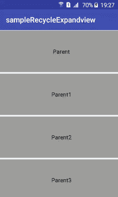

# 如何创建一个可扩展的 Recyclerview 列表和 Firebase 数据库——第 2 部分

> 原文：<https://dev.to/hbodkr/how-to-make-a-expandable-recyclerview-list-and-firebase-database---part-2-3nco>

在本部分结束时，你将学会如何使用 android studio 创建一个可扩展的回收器视图列表。

## 添加可扩展回收器视图 SDK

### 第四步

前往**project/app/build . gardl . XML**

```
dependencies {
    ...
    })
// Material Desgin 
compile 'com.android.support:design:26.+'

//Expandable Recycler View 
compile 'com.thoughtbot:expandablerecyclerview:1.3'

//Firebase appluy
compile 'com.google.firebase:firebase-database:9.8.0'
}
apply plugin: 'com.google.gms.google-services' 
```

Enter fullscreen mode Exit fullscreen mode

## 添加上网权限

### 第四步

要在你的应用上使用互联网，你需要首先在**project/app/src/main/Android manifest . XML**中添加权限。

```
<manifest ...>

<uses-permission android:name="android.permission.INTERNET" />

<application ...>
        ...
    </application>
</manifest> 
```

Enter fullscreen mode Exit fullscreen mode

## 创建布局

### 第五步

activity_main.xml

```
<?xml version="1.0" encoding="utf-8"?>
<LinearLayout

    xmlns:android="http://schemas.android.com/apk/res/android"
    android:layout_width="match_parent"
    android:layout_height="match_parent"
    android:orientation="vertical"
    android:background="#FFFFFF"
    >

    <android.support.v7.widget.RecyclerView
        android:id="@+id/recycler_Expand"
        android:layout_width="match_parent"
        android:layout_height="match_parent" />

</LinearLayout> 
```

Enter fullscreen mode Exit fullscreen mode

Item_parent.xml

```
<?xml version="1.0" encoding="utf-8"?>

<LinearLayout
    xmlns:android="http://schemas.android.com/apk/res/android"
    android:layout_width="match_parent"
    android:layout_height="wrap_content"
    android:paddingTop="2dp"
    android:paddingBottom="2dp"
    >

<LinearLayout
    xmlns:android="http://schemas.android.com/apk/res/android"
    android:layout_width="match_parent"
    android:layout_height="wrap_content"
    android:orientation="horizontal"
    android:background="#9E9E9E"
    >

    <LinearLayout
        android:layout_width="match_parent"
        android:layout_height="wrap_content"
        android:gravity="center"

        >
    <TextView
        android:id="@+id/listParent"
        android:text="text"
        android:textSize="15dp"
        android:layout_width="wrap_content"
        android:layout_height="wrap_content"
        android:layout_gravity="center"
        android:layout_marginTop="45dp"
        android:layout_marginLeft="15dp"
        android:layout_marginRight="2dp"
        android:layout_marginBottom="45dp"
        android:textColor="#000000"

        />
    </LinearLayout>
</LinearLayout>
</LinearLayout> 
```

Enter fullscreen mode Exit fullscreen mode

item_child.xml

```
<?xml version="1.0" encoding="utf-8"?>

<LinearLayout
    xmlns:android="http://schemas.android.com/apk/res/android"
    android:layout_width="match_parent"
    android:layout_height="wrap_content"
    android:paddingTop="3dp"
    android:paddingBottom="3dp"
    >

<LinearLayout

    android:layout_width="match_parent"
    android:orientation="vertical"
    android:layout_height="wrap_content"
    android:background="#E0E0E0"
    android:divider="#FFFFFF"
    android:showDividers="middle"
    android:dividerHeight="2px"
    >
    <TextView

        android:layout_width="wrap_content"
        android:layout_height="wrap_content"
        android:id="@+id/listChild"
        android:textSize="16dp"
        android:text="text"
        android:layout_margin="25dp"
        android:layout_gravity="center"
        android:textColor="#000000"

        />
</LinearLayout>
</LinearLayout> 
```

Enter fullscreen mode Exit fullscreen mode

## 编写代码

### 第三步

ChildList.java

```
 public class ChildList implements Parcelable {

    private String title;

    public ChildList(String title) {
        this.title = title;
    }

    protected ChildList(Parcel in) {
        title = in.readString();
    }

    public static final Creator<ChildList> CREATOR = new Creator<ChildList>() {
        @Override
        public ChildList createFromParcel(Parcel in) {
            return new ChildList(in);
        }

        @Override
        public ChildList[] newArray(int size) {
            return new ChildList[size];
        }
    };

    public String getTitle() {
        return title;
    }

    public void setTitle(String Title) {
        this.title = Title;
    }

    @Override
    public int describeContents() {
        return 0;
    }

    @Override
    public void writeToParcel(Parcel parcel, int i) {
        parcel.writeString(title);
    }
} 
```

Enter fullscreen mode Exit fullscreen mode

ParentList.java

```
 public class ParentList extends ExpandableGroup<ChildList> {

    public ParentList(String title, List<ChildList> items) {
        super(title, items);
    }

} 
```

Enter fullscreen mode Exit fullscreen mode

MyParentViewHolder.java

```
 public class MyParentViewHolder extends GroupViewHolder {

    public TextView listGroup;

    public MyParentViewHolder(View itemView) {
        super(itemView);
        listGroup = (TextView) itemView.findViewById(R.id.listParent);
    }

    public void setParentTitle(ExpandableGroup group) {
        listGroup.setText(group.getTitle());
    }

} 
```

Enter fullscreen mode Exit fullscreen mode

MyChildViewHolder.java

```
 public class MyChildViewHolder extends ChildViewHolder {

   public TextView listChild;

    public MyChildViewHolder(View itemView) {
        super(itemView);
        listChild = (TextView) itemView.findViewById(R.id.listChild);

    }

    public void onBind(String Sousdoc) {
        listChild.setText(Sousdoc);

    }

} 
```

Enter fullscreen mode Exit fullscreen mode

MainActivity.java

```
 public class MainActivity extends AppCompatActivity {

    private RecyclerView recycler_view;

    @Override
    protected void onCreate(Bundle savedInstanceState) {
        super.onCreate(savedInstanceState);
        setContentView(R.layout.activity_main);

        //Define recycleview
        recycler_view = (RecyclerView) findViewById(R.id.recycler_Expand);
        recycler_view.setLayoutManager(new LinearLayoutManager(this));

        //Initialize your Firebase app
        FirebaseDatabase database = FirebaseDatabase.getInstance();

        // Reference to your entire Firebase database
        DatabaseReference parentReference = database.getReference();

    //reading data from firebase
     parentReference.addValueEventListener(new ValueEventListener() {
            @Override
            public void onDataChange(DataSnapshot dataSnapshot) {
                final List<ParentList> Parent = new ArrayList<>();
                for (final DataSnapshot snapshot : dataSnapshot.getChildren()){

               final String ParentKey = snapshot.getKey().toString();

                  snapshot.child("titre").getValue();

                 DatabaseReference childReference = 
                  FirebaseDatabase.getInstance().getReference().child(ParentKey);
                    childReference.addValueEventListener(new ValueEventListener() {
                        @Override
                        public void onDataChange(DataSnapshot dataSnapshot) {
                            final List<ChildList> Child = new ArrayList<>();

                  for (DataSnapshot snapshot1:dataSnapshot.getChildren()) 
                       {
                         final String ChildValue =  snapshot1.getValue().toString();

                                   snapshot1.child("titre").getValue();

                                    Child.add(new ChildList(ChildValue));

                            }

                                Parent.add(new ParentList(ParentKey, Child));

   DocExpandableRecyclerAdapter adapter = new DocExpandableRecyclerAdapter(Parent);

     recycler_view.setAdapter(adapter);

                        }

                  @Override
          public void onCancelled(DatabaseError error) {
           // Failed to read value
             System.out.println("Failed to read value." + error.toException());
                        }

                    });}}

            @Override
            public void onCancelled(DatabaseError databaseError) {

            }
        });

    }

    public class DocExpandableRecyclerAdapter extends ExpandableRecyclerViewAdapter<MyParentViewHolder,MyChildViewHolder> {

        public DocExpandableRecyclerAdapter(List<ParentList> groups) {
            super(groups);
        }

        @Override
        public MyParentViewHolder onCreateGroupViewHolder(ViewGroup parent, int viewType) {
            View view = LayoutInflater.from(parent.getContext()).inflate(R.layout.item_parent, parent, false);
            return new MyParentViewHolder(view);
        }

        @Override
        public MyChildViewHolder onCreateChildViewHolder(ViewGroup parent, int viewType) {
            View view = LayoutInflater.from(parent.getContext()).inflate(R.layout.item_child, parent, false);
            return new MyChildViewHolder(view);
        }

        @Override
        public void onBindChildViewHolder(MyChildViewHolder holder, int flatPosition, ExpandableGroup group, int childIndex) {

            final ChildList childItem = ((ParentList) group).getItems().get(childIndex);
            holder.onBind(childItem.getTitle());
            final String TitleChild=group.getTitle();
            holder.listChild.setOnClickListener(new View.OnClickListener() {
                @Override
                public void onClick(View view) {
                    Toast toast = Toast.makeText(getApplicationContext(), TitleChild, Toast.LENGTH_SHORT);
                    toast.show();
                }

            });

        }

        @Override
        public void onBindGroupViewHolder(MyParentViewHolder holder, int flatPosition, final ExpandableGroup group) {
            holder.setParentTitle(group);

            if(group.getItems()==null)
            {
                holder.listGroup.setOnClickListener(  new View.OnClickListener() {
                    @Override
                    public void onClick(View view) {

                        Toast toast = Toast.makeText(getApplicationContext(), group.toString(), Toast.LENGTH_SHORT);
                        toast.show();
                    }
                });

            }
        }

    }

} 
```

Enter fullscreen mode Exit fullscreen mode

[T2】](https://res.cloudinary.com/practicaldev/image/fetch/s--UL9j9OyI--/c_limit%2Cf_auto%2Cfl_progressive%2Cq_auto%2Cw_880/https://thepracticaldev.s3.amazonaws.com/i/r8stcfdfm2nakzp3yk8c.jpg)

预期的最终结果会是这样的。

[T2】](https://res.cloudinary.com/practicaldev/image/fetch/s--B852nwg8--/c_limit%2Cf_auto%2Cfl_progressive%2Cq_66%2Cw_880/https://thepracticaldev.s3.amazonaws.com/i/5vadmtq1uev9xpog5ofx.gif)

编码快乐！