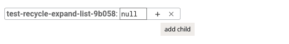
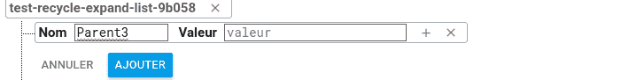
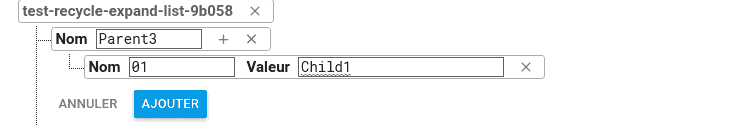
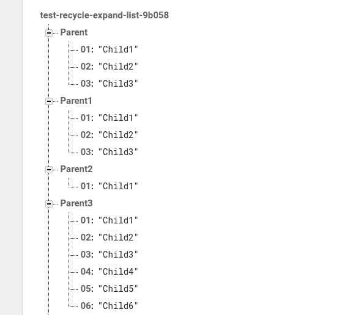

# 如何制作一个可扩展的 Recyclerview list 和 Firebase 数据库——第 1 部分

> 原文:[https://dev . to/HBO dkr/how-to-make-a-expandable-recycler view-list-and-firebase-database-part-1-2m6h](https://dev.to/hbodkr/how-to-make-a-expandable-recyclerview-list-and-firebase-database-part-1---2m6h)

这是如何在 android studio 上创建 Recycleview 可扩展列表以及使用实时数据库创建 firebase 项目的分步指南。

让我们从 [Firebase](https://firebase.google.com) 开始。

## 第一步

### 在 Firebase 中创建新项目

点击开始，然后添加项目。将出现一个小窗口；输入您的项目名称，然后单击创建项目。在下一页中，选择您项目的应用程序:ios、android 或 web。在本例中，选择了 android 应用程序。

为了继续下一步，应该在 android studio 上创建一个新项目。在框中填入 android studio 创建的包的名称。

接下来，下载 json 文件并按照说明进行操作。

最后，在 android studio 中添加 firebase SDK。

## 第二步

### 配置数据库的规则

转到数据库，选择实时数据库，然后打开规则页面。

将出现两条规则:读和写。如果要读取数据，需要将 read 的值更改为 true，如下所示:

[T2】](https://res.cloudinary.com/practicaldev/image/fetch/s--JNWsvgZ_--/c_limit%2Cf_auto%2Cfl_progressive%2Cq_auto%2Cw_880/https://thepracticaldev.s3.amazonaws.com/i/s64wev1uoqevqnkd1mah.png)

注意:如果您想在应用程序中添加数据，您需要将 write 的值更改为 true

## 第三步

### 创建数据

当您转到“数据”页面时，您会发现一个包含数据库引用的节点。

[T2】](https://res.cloudinary.com/practicaldev/image/fetch/s--9W42mVwV--/c_limit%2Cf_auto%2Cfl_progressive%2Cq_auto%2Cw_880/https://thepracticaldev.s3.amazonaws.com/i/4a99u3jzsqm0aqvlek8f.png)

要添加新的孩子，请按下方框“+”。将出现一个新行，其中有两个空文本框；一个用于名称，另一个用于值。要添加一个新的孩子，你只需要填写名字框，把值框留空，然后按“+”。
注:如果填写了两个框(名称和值)，“+”框会消失。

[T2】](https://res.cloudinary.com/practicaldev/image/fetch/s--3fPR8PCC--/c_limit%2Cf_auto%2Cfl_progressive%2Cq_auto%2Cw_880/https://thepracticaldev.s3.amazonaws.com/i/wfh9rvc10u8zgwda82nw.png)

现在，填写两个框。

[T2】](https://res.cloudinary.com/practicaldev/image/fetch/s--A-b7CsOA--/c_limit%2Cf_auto%2Cfl_progressive%2Cq_auto%2Cw_880/https://thepracticaldev.s3.amazonaws.com/i/133rjwyxmwtv87k1f06c.png)

重复前面的步骤，直到创建一个类似的数据库:

[T2】](https://res.cloudinary.com/practicaldev/image/fetch/s--nCrh6lJ3--/c_limit%2Cf_auto%2Cfl_progressive%2Cq_auto%2Cw_880/https://thepracticaldev.s3.amazonaws.com/i/celrw2u2btxgms6e88u9.png)

一旦完成，移动到下一个[部分](https://dev.to/hbodkr/how-to-make-a-expandable-recyclerview-list-and-firebase-database---part-2-3nco)。