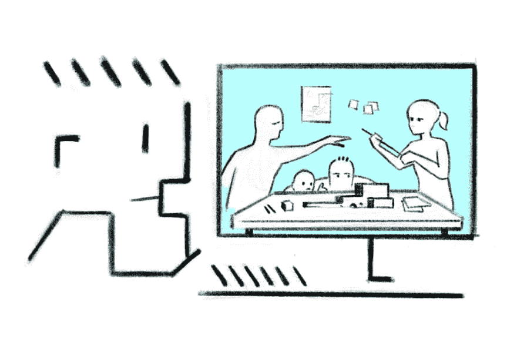
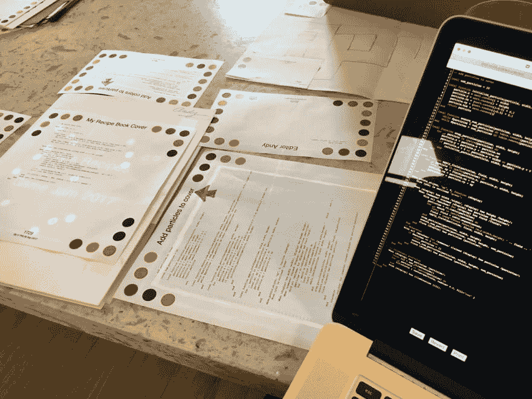
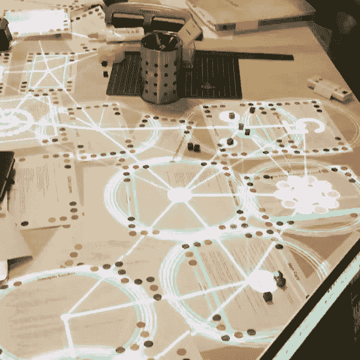
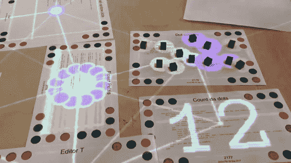
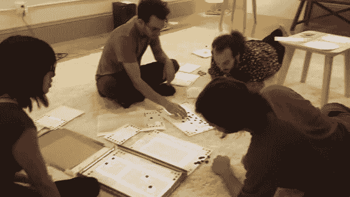

# 编程剥夺了我们的空间。Dynamicland 可以还给他们。

> 原文:[https://dev . to/sgwilym/programming-robs-us-of-our-spaces-dynamic and-could-give-them-back-1bn](https://dev.to/sgwilym/programming-robs-us-of-our-spaces-dynamicland-could-give-them-back-1bn)

从编程的短暂休息中回来后，你会发现有多少工作要做:语言、库、技术，都有自己的工具和社区，都经历了开发或放弃的阶段。对于大多数程序员来说，在这些世界中工作意味着每天要花很多时间查看一堆杂乱的终端窗口、文本编辑器、文档和团队聊天。

很难不觉得自己是罐子里的头。计算机的世界在屏幕的边缘结束，在这些边缘内的一切都有一个设计好的假设，即一次只有一个人在使用它。我们用鼠标和键盘与这个唯我论的世界互动，最多只用我们的手指。更令人愤慨的是，使用电脑要求你总是静止不动:你可以坐着、躺着或站着，但仅此而已。有些人勇敢地尝试一边走路一边使用手机，但却失去了成为现实世界中令人信服的一部分的能力，走进了人群、灯柱和繁忙的道路。

这一切都非常令人沮丧，因为编程有许多独特的回报:在一个思想领域与其他人合作，第一次看到某个东西工作时的那种奇怪的兴奋感，重构代码库的某个奇妙的、不受控制的部分时的那种安静的满足感——这些都是让我们忍受我们工作的迟钝环境的事情。

但是, *environment* 是一个慷慨的词，用来形容我们工作的地方:它意味着一个宽敞的地方，有许多有趣的东西，被许多人分享。这与现实相去甚远。与他人分享这些屏幕和其中的世界是一种挫折，我们已经接受了这样一个事实，即要完成任何真正的工作，我们都需要有自己的屏幕，并在事后让彼此了解我们的进展。我们主要通过评估源代码的添加和删除来合作，在思想被思考很久之后。我们不再是队友，而是彼此大脑的考古学家。现代远程协作的高度是广播你在屏幕上看到的内容，并让其他人控制你的鼠标。

不要误解我的意思:我对这些技术并不是不领情，并且每天都在使用它们。但是，透过电脑显示屏看着我的工作室伙伴(都不是程序员)，我开始对这些工具心存感激，就像一个有着无门栅栏的人对有一个梯子心存感激一样。我会看着他们聚集在一张大桌子周围，他们一天的工作摆在他们面前:最近制作的材料，照片和印刷品散落在桌子上，钢笔，铅笔，尺子。他们会把他们的问题摆在他们面前的桌面上，用手举起它们，与一种材料和人类的直接合作，当我的眼睛重新聚焦在我面前的屏幕上时，所有那些小窗口都显得有点荒谬。

当我再次凝视屏幕时，我会有同样的感觉，我会看到我的一个朋友独自工作，雕刻木头。我会观察他们在周围搭建的工作空间，他们工具的临时摆放，他们正在进行的工作在草图旁边的位置，工具和材料以意想不到的方式结合在一起。在手头的任务中，你可以立刻看到所有的可能性和进展。

就在那时，我认为编程已经够难了，不需要在电脑屏幕的范围内完成所有的工作。我们为什么要以牺牲我们的环境、我们与他人互动的自然方式、我们自己的身体为代价来接受编程所提供的东西呢？

[T2】](https://res.cloudinary.com/practicaldev/image/fetch/s--b2TD_1KQ--/c_limit%2Cf_auto%2Cfl_progressive%2Cq_auto%2Cw_880/https://thepracticaldev.s3.amazonaws.com/i/35j3svzqtmrn92f9crfb.jpg)

2017 年底，我开始看到一些我喜欢的程序员分享的图片和视频。在这些视频中，你会看到许多人在一个奇怪的，像工作室一样的空间里推着上面有彩色圆圈的纸片，幽灵般的图像会跟着纸片走，并随着它的移动而变化。我看到的东西非常奇怪，一开始我真的不知道这些视频到底想展示什么。

> 安迪·马图切克@安迪 _ 马图切克在@ dynamicland1 成功的第一次调试会话！圆点被做成波尔卡。2017 年 9 月 22:11PM-09

但是随着时间的推移和视频的增多，一切开始变得清晰起来。

> <video loop="" controls=""><source src="https://video.twimg.com/ext_tw_video/906761829380063233/pu/pl/py6s5MnTC_wqiqkA.m3u8" type="application/x-mpegURL"></video>梅丽莎·鲍彻@米扎布用纸和灯制作迷幻的东西以及 [@Dynamicland1](https://twitter.com/Dynamicland1) 中的代码位，可能诱发癫痫06:2017 年 9 月 10 日上午 10 点至 10 日

> <video loop="" controls=""><source src="https://video.twimg.com/ext_tw_video/906675435383152641/pu/vid/320x180/BOfQbSPLd6PUzgIh.mp4" type="video/mp4"></video>——李🦄khoe@ mayli2017 年 9 月 10 日上午 00:27

> <video loop="" controls=""><source src="https://video.twimg.com/ext_tw_video/907276497257246720/pu/pl/9vVRTcX_Yh1Z8kN1.m3u8" type="application/x-mpegURL"></video>

这些都是人们一起编程的视频，在一个物理空间，使用一个物理媒介。它叫做 [Dynamicland](https://dynamicland.org) ，是位于加州奥克兰的一座建筑。

> 安迪·马图切克@安迪 _ 马图切克本周末打完 26 hrs[@ dynamic LAN D1](https://twitter.com/Dynamicland1)；我家的所有表面都静得出奇。通灵后…[twitter.com/i/web/status/9…](https://t.co/kuibf5qN6g)2017 年 9 月 11 日上午 05:59

直到亲眼所见，我才知道自己有多想在这个世界上。我已经开始更加贪婪地觊觎我的邻居——插画师、木工、厨师——的工作空间，羡慕他们的体力，羡慕他们能够把某人叫过来，指着某个地方的一张桌子说:“这是我一直在做的——你知道我如何才能修复这一点吗？”。程序员研讨会。

显然不止如此，这个项目旨在将编程的活力带给那些无法忍受编程当前所要求的环境的人。当前的形势使得编程成为今天的一种职业，就像古埃及的抄写员一样。“笔、剪刀和订书机在这里是真正强大的工具”，他们说，我很容易相信这一点，因为我使用过命令行。在教室、图书馆和博物馆中想象这个系统比想象如何将其用于一个完整的编程环境要容易得多。很容易愤世嫉俗地想知道能够使用订书机如何真正有利于我们今天完成工作所依赖的长寿库、工具和方法。但这是用我们想象新的文本编辑器或版本控制系统的方式来思考它:这台计算机改变了人们一起工作的方式，这将比任何一打新工具产生更大的影响。

它还值得与未来计算的其他愿景进行比较:VR 试图通过愚弄你的眼睛和耳朵(并不总是成功)并将你的真实环境替换为虚拟环境，将唯我论的计算机一直带到它的极端结论。这显然是一件有趣的事情，但很难突破它不仅仅是一个嘉年华景点，而且将它作为一台全职电脑似乎是一个真正的反乌托邦噩梦。许多人认为增强现实是一个更令人兴奋的前景，这需要一个将模拟元素叠加到你真正可以看到的东西上的耳机，在某些方面，这就像 Dynamicland。但是你需要一个用于 AR 的耳机，每个不戴耳机的人只是看到一个戴着怪异眼镜的人与稀薄的空气进行交互。相比之下，Dynamicland 需要一整个建筑，但好处是在场的每个人都是同一个世界的一部分，只需要他们生来就是其中的一部分，并与具有质量和纹理的真实事物互动。

还有机构的差异:VR 和 AR 都是由私营公司体现的，旨在销售耳机，建立市场份额和新的生态系统。Dynamicland 由一个非营利组织支持，并寻求捐赠和研究资金。他们把自己的想法放在几十年而不是产品周期的背景下看待，并把互联网的发展作为一个模型。无论你认为哪种未来最有可能，在这样的东西取代我们现在使用的孤立的桌子和电脑之前，无疑还有很长的路要走。但是，走这条漫长的路是值得娱乐的，尤其是当你想象自己不得不坐在办公桌前，在余下的工作日里穿梭于一个平坦的世界。

从这里——2018 年初，荷兰——dynamic land 似乎还有很长的路要走。我还需要一段时间才能亲身经历类似的事情。但是，当我自私地想象自己可以选择在一个看起来更像工作间而不是航站楼的地方工作，或者(无私地)想象未来的孩子有一个类似这样的教室时——好吧，我忍不住要写点什么，即使这只会有助于提前一两分钟迎来未来。