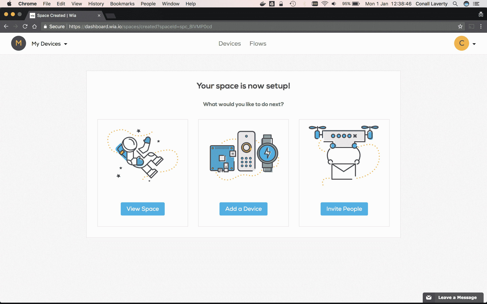
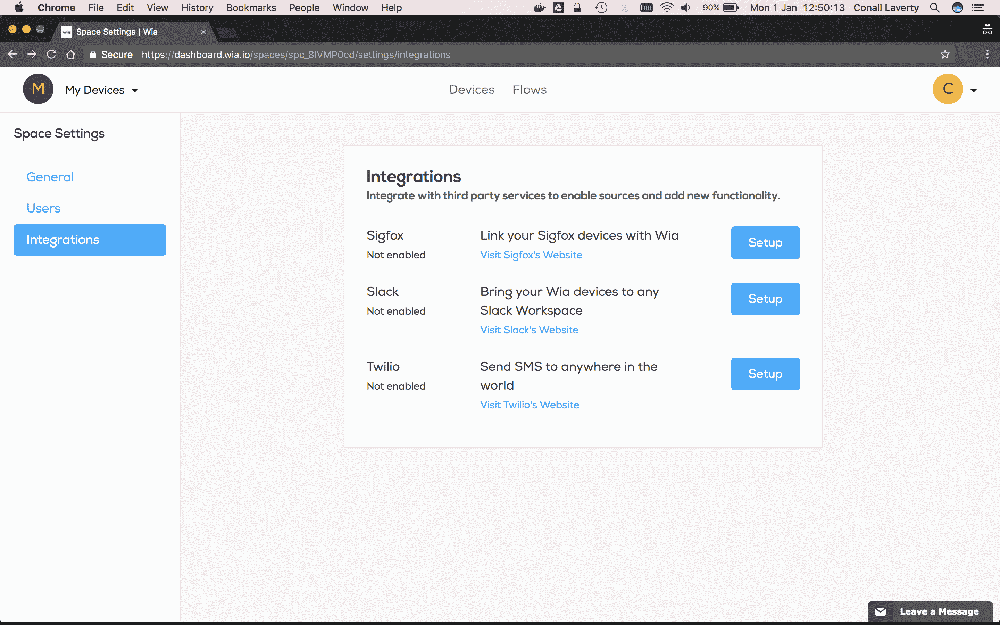
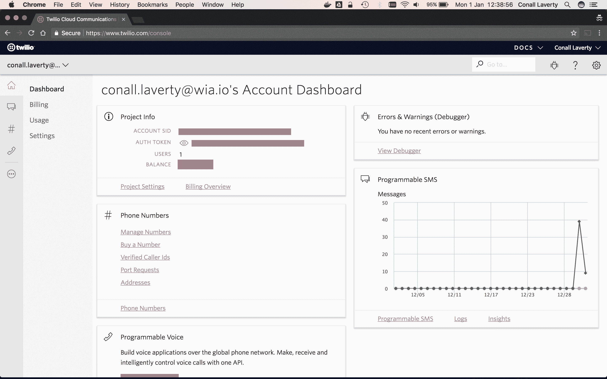
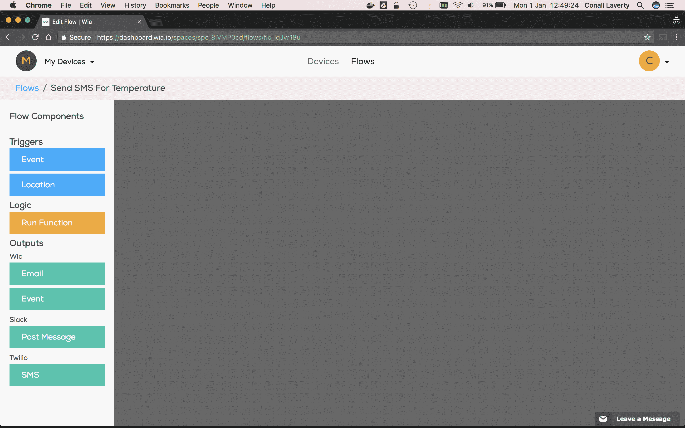
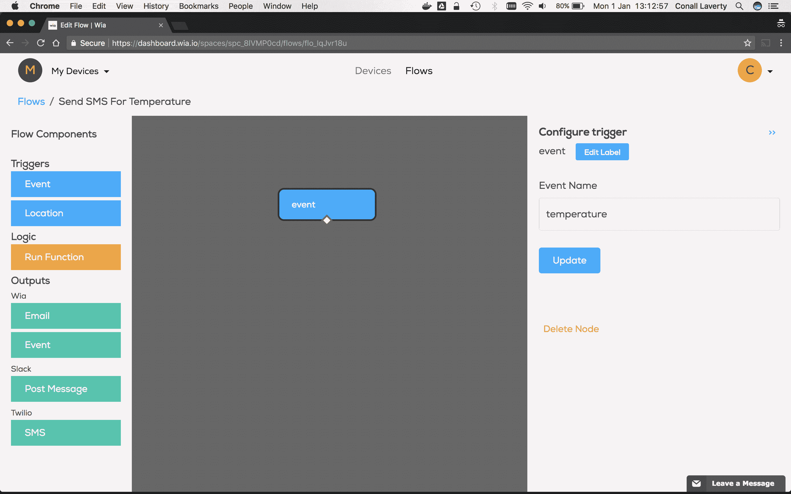
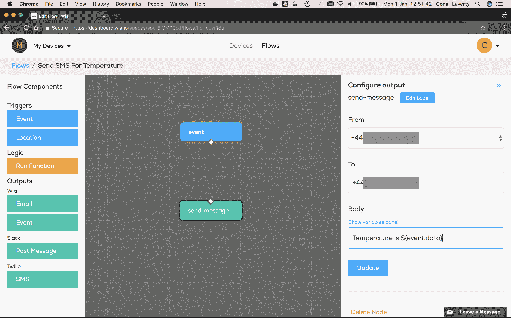
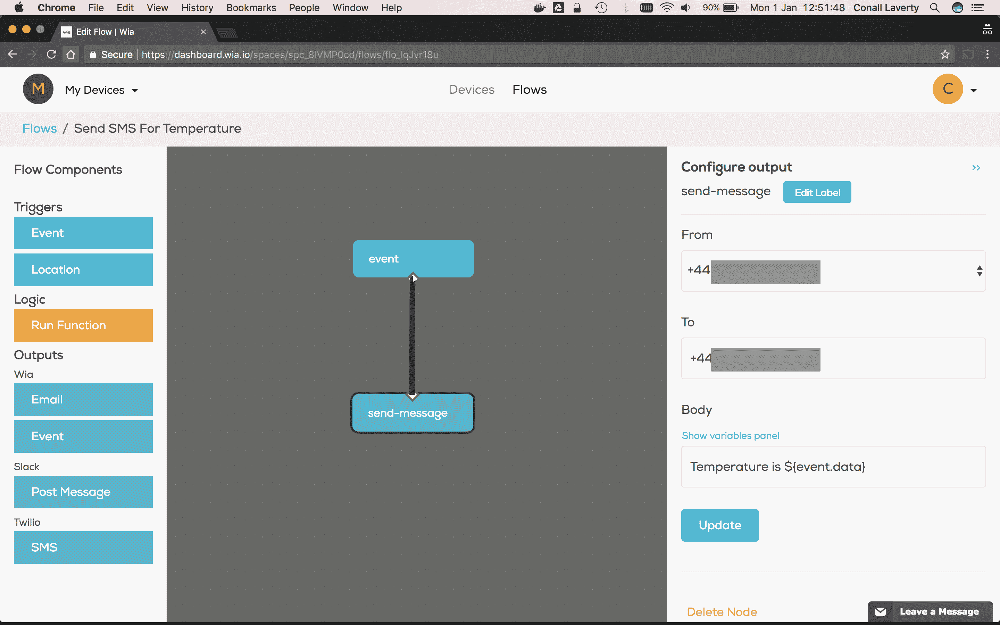
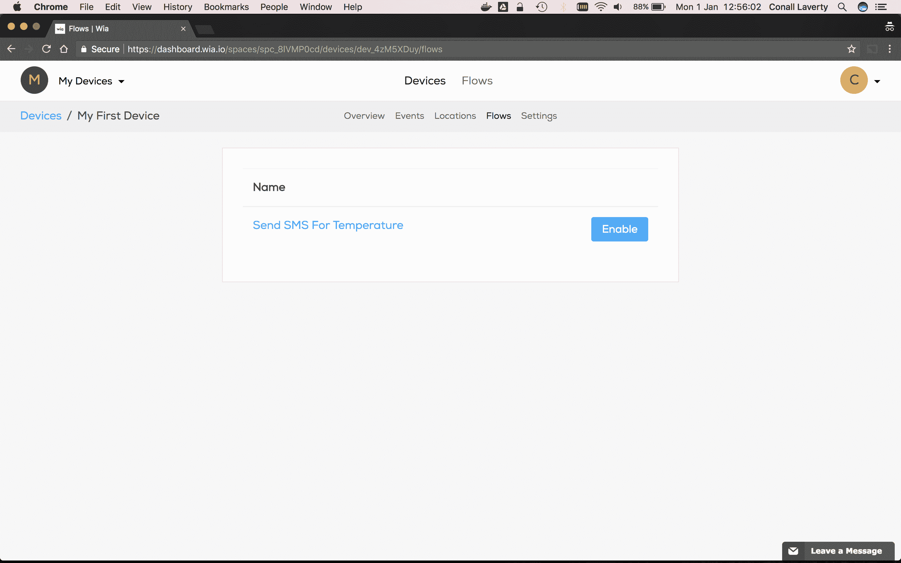

# 使用 Wia 和 Twilio 从您的物联网项目发送短信

> 原文：<https://dev.to/conalllaverty/send-sms-messages-from-your-iot-projects-using-wia--twilio-27il>

大家好，

今天我们将学习使用 [Wia](https://www.wia.io) 和 [Twilio](https://www.twilio.com) 从物联网设备发送短信。

另外，如果你想在 iOS 和 Android 上看到你的设备，请在这里预先注册我们的测试版。

### 创建您的 Wia 帐户

如果您还没有，请[点击此处](https://dashboard.wia.io/signup)注册。

### 设置一个空格

登录后，为您的设备设置一个新的空间。我要叫我的`My Devices`。当您的共享空间准备就绪时，您应该会看到如下所示的屏幕。

[T2】](//images.contentful.com/i5evrz7h2uo7/1bfPDxMf4s0SyaOSkCEsum/f0dc8f7ebe0076a222b495d36376f4f7/Screen_Shot_2018-01-01_at_12.38.44.png)

### 开始设置积分

点击左上角的空间名称，打开空间下拉菜单，然后点击`Settings`。在侧边栏中选择`Integrations`。

[T2】](//images.contentful.com/i5evrz7h2uo7/2VTGU7kVDayOGikwUUm6iO/5a16cc0c4d5b2ac0cee1027a4e75155e/Screen_Shot_2018-01-01_at_12.50.12.png)

在`Twilio`行，点击`Setup`开始设置集成。

[T2】](//images.contentful.com/i5evrz7h2uo7/3BLByHGp6gc46eQGw0O0aM/f846a3dbdbf6f1a5201d17c216e5bb6f/Screen_Shot_2018-01-01_at_12.50.16.png)

### 获取您的 Twilio API 密钥

如果您还没有 Twilio 帐户，[单击此处](https://www.twilio.com/try-twilio)免费设置一个。

*   前往 [Twilio 控制台](https://www.twilio.com/console)并登录。
*   在`Project Info`面板中，将`Account Sid`和`Auth Token`复制粘贴到 Wia 的集成面板中，点击`Create Integration`。

[T2】](//images.contentful.com/i5evrz7h2uo7/2q7P7Y0hxCgGE04IgyqeEu/3d3b4168d3522bf98ce36b4947e65285/Screen_Shot_2018-01-01_at_12.38.54.png)

在设置 SMS 之前，您需要设置一个电话号码。转到[电话号码](https://www.twilio.com/console/phone-numbers/incoming)并检查您是否有一个设置。

[T2】](//images.contentful.com/i5evrz7h2uo7/2Cbtk7RoEUsguIoWeAeSoE/b5d450e480584a1439c5bd54d9f525ff/Screen_Shot_2018-01-01_at_12.39.11.png)

### 创建一个流

*   转到`Flows`并点击`Create Flow`。
*   输入您的`Flow`的名称。我要叫我的`Send SMS For Temperature`。
*   然后，您将被重定向到 Flow Studio。

[T2】](//images.contentful.com/i5evrz7h2uo7/3QkJqW7Oh2AGmEY0kMc68G/c7b43c184778c7b2bbcfd9a34927afad/Screen_Shot_2018-01-01_at_12.49.23.png)

### 添加一个触发节点

*   在 Flow Studio 中，从左侧面板中拖动事件触发器节点。
*   选择节点，在右侧面板中输入`temperature`作为事件名称，点击`Update`。

[T2】](//images.contentful.com/i5evrz7h2uo7/4Ytayplm4E2AWAmKYmkyic/d628ec1f07899fb9d158b70a442f0acc/Screen_Shot_2018-01-01_at_13.12.56.png)

### 添加一个输出节点

*   将鼠标从左侧面板的 Twilio 部分拖到 SMS 输出节点上。
*   选择节点，然后在右侧面板上执行以下操作:
*   选择您的`From`电话号码
*   输入您的`To`电话号码(注意:输入国家代码，不要有空格，即+14568893405)。
*   输入您的`Body`消息。我准备把我的设为`Temperature is ${event.data}`。这将从事件中获取温度数据。我们要发送。点击`Show variables panel`链接可以看到更多变量。
*   点击`Update`保存您的更改。

[T2】](//images.contentful.com/i5evrz7h2uo7/531iBToQbeE4gGsAgu2OoG/bbf306d36b0cb73a8377d7ec4881e247/Screen_Shot_2018-01-01_at_12.51.40.png)

### 连接节点

*   单击事件节点底部的白色菱形，并将该线拖动到输出节点的输入端。

[T2】](//images.contentful.com/i5evrz7h2uo7/f36FnnptaoKgsKYgEoWQa/11fdf042fd9eb92efb982876173f5899/Screen_Shot_2018-01-01_at_12.51.46.png)

### 向您的设备添加流量

*   转到`Devices`并选择您想要添加流量的设备。
*   点击子菜单中的`Flows`，然后点击流程旁边的`Enable`。

[T2】](//images.contentful.com/i5evrz7h2uo7/Zd25BuY6QMmyG2UwSaSCc/93c1a284b52c19935ee97a0a02c5d08d/Screen_Shot_2018-01-01_at_12.56.00.png)

### 运行流量

从设备上发布一个事件，您将看到 SMS 消息通过。

那都是乡亲们！

附言:如果您在设置方面需要任何帮助，[发微博给我们](https://twitter.com/wiaio)或发电子邮件给 [support@wia.io](mailto:support@wia.io)

*参考资料*

[Twilio](https://www.twilio.com) 是一个开发者交流平台。软件团队使用 Twilio API 将语音、视频和消息等功能添加到他们的应用程序中。这使得企业能够为其客户提供合适的通信体验。