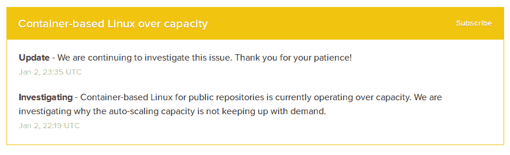
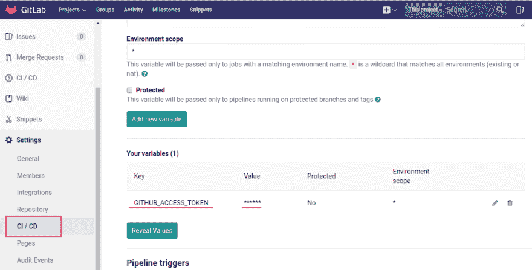
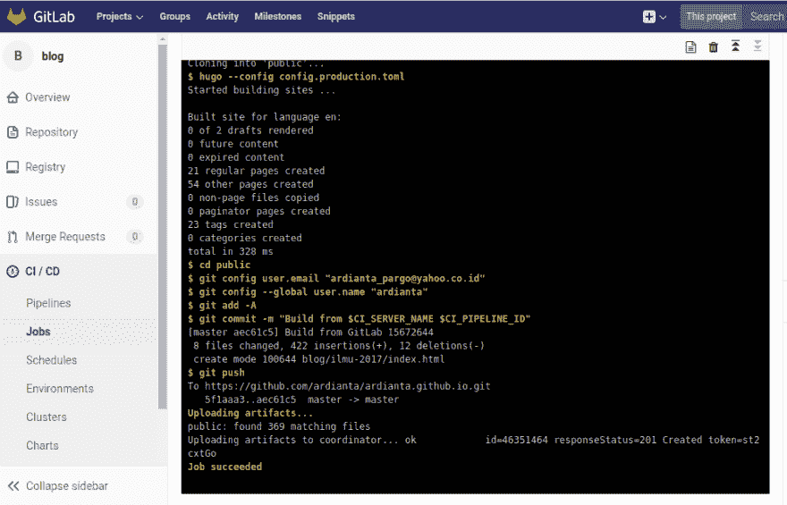
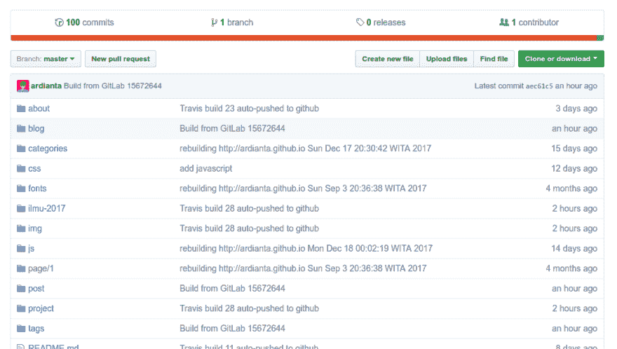

# 将 Hugo 从 Gitlab CI 部署到 Github 页面

> 原文：<https://dev.to/ardianta/deploy-hugo-from-gitlab-ci-to-github-pages-5aml>

我有 Hugo 博客，托管在 Github 页面上，并使用 Travis CI 来部署它。但是在新年，Travis CI 要花很长时间来排队我的版本。

[T2】](https://res.cloudinary.com/practicaldev/image/fetch/s--ZmPPDl2C--/c_limit%2Cf_auto%2Cfl_progressive%2Cq_auto%2Cw_880/https://thepracticaldev.s3.amazonaws.com/i/lsvpjhapht0obw8a6bmo.png)

*Travis CI 状态:[基于容器的 Linux 超过容量](https://www.traviscistatus.com/incidents/631nlzm77xq2)*

作为替代，我使用 Gitlab CI 并将我的博客库从 Github 镜像到 Gitlab。

下面是我的`.gitlab-ci.yml`脚本:

```
image: andthensome/alpine-hugo-git-bash:0.31.2

before_script:
  - hugo version

github_pages:
  script:
  - rm -rf public
  - git clone --depth 1 https://<username>:$GITHUB_ACCESS_TOKEN@github.com/<username>/<username>.github.io.git public
  - hugo --config config.production.toml
  - cd public
  - git config user.email "<your git email>"
  - git config --global user.name "<your git name>"
  - git add -A
  - git commit -m "Build from $CI_SERVER_NAME $CI_PIPELINE_ID"
  - git push
  artifacts:
    paths:
    - public
  only:
  - master 
```

Enter fullscreen mode Exit fullscreen mode

我们需要在 Gitlab 创建环境变量`GITHUB_ACCESS_TOKEN`。只需进入**设置- > CI/DI- >秘密变量**。

[T2】](https://res.cloudinary.com/practicaldev/image/fetch/s--6u8lL75s--/c_limit%2Cf_auto%2Cfl_progressive%2Cq_auto%2Cw_880/https://ardianta.github.io/img/gitlab-github/token-github.png)

您可以在[https://github.com/settings/tokens](https://github.com/settings/tokens)获得 Github 个人令牌。

然后...

让我们试着通过对 Gitlab 上的主分支进行一些修改来构建它。

[T2】](https://res.cloudinary.com/practicaldev/image/fetch/s--pTZ-Sn8I--/c_limit%2Cf_auto%2Cfl_progressive%2Cq_auto%2Cw_880/https://ardianta.github.io/img/gitlab-github/build-ci-gitlab.png)

厉害！

现在我的博客从 Gitlab CI 部署到 Github Pages，分享一下在 Github Pages 存储库中的样子。

[T2】](https://res.cloudinary.com/practicaldev/image/fetch/s--i6DfCexK--/c_limit%2Cf_auto%2Cfl_progressive%2Cq_auto%2Cw_880/https://ardianta.github.io/img/gitlab-github/github-pages.png)

*(你也可以在我的博客上看到[印尼版)](https://ardianta.github.io/blog/gitlab-github-pages/)*