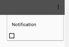

# 选项菜单复选框 android 问题

> 原文：<https://dev.to/elsimoluis/option-menu-checkbox-android-problem-5bnh>

你好

我对选项菜单可检查项目有问题

[T2】](https://res.cloudinary.com/practicaldev/image/fetch/s--DYRzLGWh--/c_limit%2Cf_auto%2Cfl_progressive%2Cq_auto%2Cw_880/https://thepracticaldev.s3.amazonaws.com/i/39eqwencx5ss9ia90ea1.png)

我希望复选框放在标题的右边，而不是下面。

他是我的选择. xml

```
<?xml version="1.0" encoding="utf-8"?>
<menu xmlns:android="http://schemas.android.com/apk/res/android"
    xmlns:app="http://schemas.android.com/apk/res-auto">

    <group android:checkableBehavior="single">
        <item android:id="@+id/notif"
            android:title="Notification"
            android:checkable = "true"/>
    </group>
</menu> 
```

Enter fullscreen mode Exit fullscreen mode

谢了。