# VuePress 简介:用 Vue 和 GraphQL 开发 WordPress。

> 原文:[https://dev . to/Ramsay/introducing-vue press-WordPress-development-with-vue-and-graph QL-me](https://dev.to/ramsay/introducing-vuepress-wordpress-development-with-vue-and-graphql-me)

## 前言:

大约两年前，我创建了 WordExpress，这是我第一次尝试只用 JavaScript 开发 WordPress 网站。它获得了相当多的关注，目前在 GitHub 上有超过 [1400 位明星。星星的数量一点都不重要，但它突出了一件事:开发者希望在前端使用 JavaScript 开发 WordPress。](https://github.com/ramsaylanier/WordExpress)

当时最难克服的一个问题是使用 GraphQL 进行服务器端渲染。WordPress 网站需要搜索引擎优化，没有服务器端渲染就无法开始做 SEO。两年来发生了很多变化，多亏了 [Apollo](https://www.apollographql.com/) ，现在使用 GraphQL 进行服务器端渲染变得更加容易。

在过去的一个月里，我重新访问了 WordExpress，并提出了一个使用 Vue 而不是 React 的解决方案。使用 React 这是完全可行的(事实上一大难题是前端不可知的 [WordExpressSchema](https://github.com/ramsaylanier/WordExpressSchema) ),但我一直在使用 Vue，他们有关于服务器端渲染的很好的文档，所以我决定尝试一下。

我把这个新的解决方案叫做 VuePress，因为我非常善于用词。

## vue press 架构

在后端，VuePress 由一个具有 GraphQL 端点的节点服务器(使用 express)组成。GraphQL 端点使用来自 Apollo 的 [GraphQLExpress](https://www.apollographql.com/docs/apollo-server/) ，它接受一个模式。这就是 WordExpressSchema 的用武之地。你可以(也应该！)[阅读关于模式的文档](https://github.com/ramsaylanier/WordExpressSchema/blob/master/README.md)。简而言之，这个模式有一些查询，这些查询通过连接到一个 WordPress 数据库并直接从中获取数据来解决。

在前端，VuePress 由 Vue 组件组成。其中一些组件包含 GraphQL 查询。当服务器收到请求时，它决定呈现哪些组件，从 GraphQL 预取所需的数据，通过模板传输数据，最后呈现 HTML。

## 制作博客

### 入门

[VuePress](https://github.com/ramsaylanier/VuePress) repo 中的代码包含了你开始使用时需要的几乎所有东西。首先，克隆回购和**按照自述文件中的说明开始**。

`$ git clone https://github.com/ramsaylanier/VuePress.git`

> 关于自定义字段的说明:我个人使用 WordPress 的高级自定义字段插件，我使用的是专业版。你绝对不需要使用这个插件，但是它让生活变得更加容易，所有的 VuePress 文档都假设你正在使用它。

按照说明进行操作后，您可以启动开发服务器。

`$ npm run dev`

您应该得到这样的结果:

[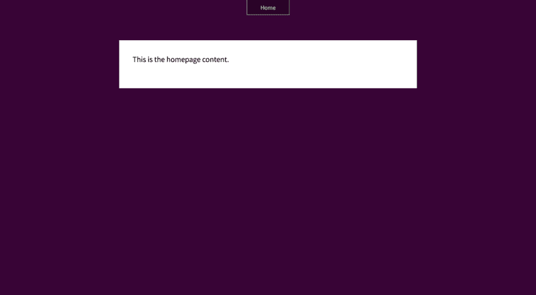T2】](https://res.cloudinary.com/practicaldev/image/fetch/s--Kuxv2Yd2--/c_limit%2Cf_auto%2Cfl_progressive%2Cq_auto%2Cw_880/https://cdn-images-1.medium.com/max/1600/1%2AU58DoyAZUynDRPKXAuMysg.png)

让我们改变主页的布局，以包括一个页眉。

[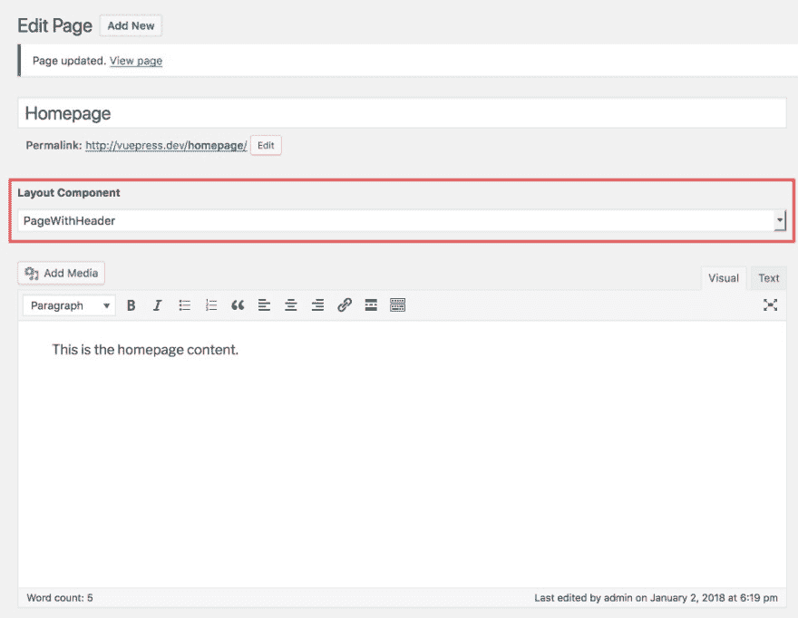T2】](https://res.cloudinary.com/practicaldev/image/fetch/s--secILDxX--/c_limit%2Cf_auto%2Cfl_progressive%2Cq_auto%2Cw_880/https://cdn-images-1.medium.com/max/1600/1%2AYpF5WdK6E5gdoC-N-TCYcw.jpeg)

现在它应该看起来好一点了:

[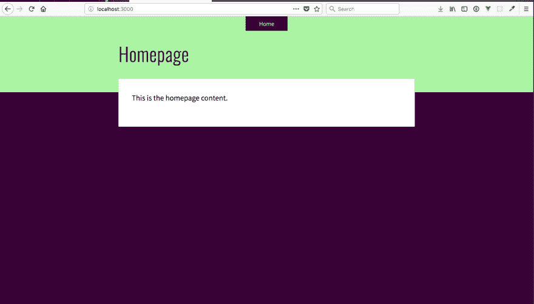T2】](https://res.cloudinary.com/practicaldev/image/fetch/s--Qtqs1Zi5--/c_limit%2Cf_auto%2Cfl_progressive%2Cq_auto%2Cw_880/https://cdn-images-1.medium.com/max/1600/1%2AmG8z_pcxa0Gftg3msPn7ag.png)

### 创建帖子列表

首先，让我们创建一个显示所有文章的页面。

[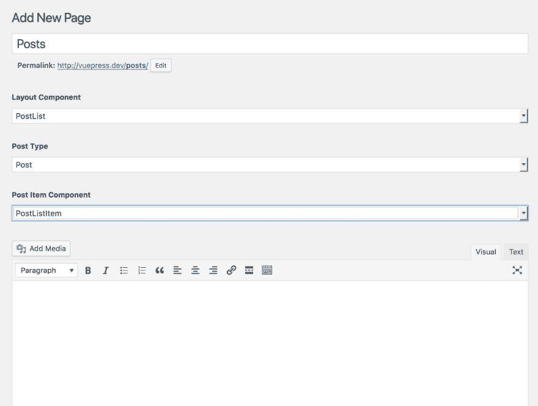T2】](https://res.cloudinary.com/practicaldev/image/fetch/s--xv2yk23z--/c_limit%2Cf_auto%2Cfl_progressive%2Cq_auto%2Cw_880/https://cdn-images-1.medium.com/max/1600/1%2Athl4CHwOrtqm_NIsGsi1yA.png)

注意布局组件的值是 *PostList* ，它生成了一些额外的定制字段(这就是 ACF 好的原因！).**帖子类型**下拉菜单将告诉`PostList`组件要呈现 WordPress 中的哪个帖子类型。现在，我们只有默认的帖子。VuePress 还允许你为每个文章列表呈现不同的文章组件。假设你有两个页面——一个文章列表和一个照片列表。每个页面中的列表项可能会有不同的设计(文章会有文本，照片会有图像)，所以您可能希望使用不同的组件来呈现该项。您可以用不同的列表创建一个全新的布局组件，但是这需要更多的工作。

现在，让我们将新的文章页面添加到主导航菜单中。

[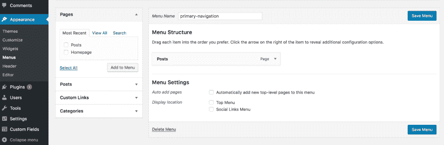T2】](https://res.cloudinary.com/practicaldev/image/fetch/s--i-sZBWv1--/c_limit%2Cf_auto%2Cfl_progressive%2Cq_auto%2Cw_880/https://cdn-images-1.medium.com/max/2000/1%2A_oLQhY0CKoLE_o3WiG6lHA.png)

保存菜单并刷新应用程序浏览器。您应该会看到**文章**页面现在位于标题菜单中。该页面看起来像这样:

[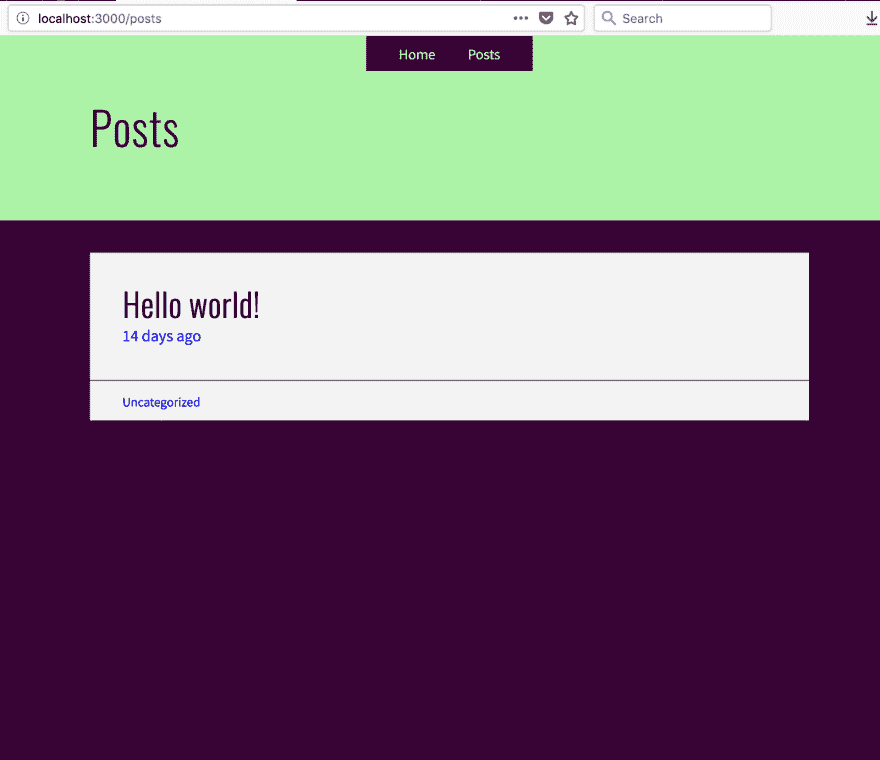T2】](https://res.cloudinary.com/practicaldev/image/fetch/s--4T_yUh9I--/c_limit%2Cf_auto%2Cfl_progressive%2Cq_auto%2Cw_880/https://cdn-images-1.medium.com/max/1600/1%2AxLSUwti-6bX6rgTYcrmeAg.png)

瞧，只需几个步骤，我们就有了一个非常简单的博客。

## 创建自定义布局组件

假设我们想要创建一个页面，它有一个侧边栏，侧边栏有自己的外部链接菜单。到目前为止，我们还没有接触任何应用程序代码，但这即将改变。首先，我们需要对自定义字段进行一些更新。

在 WordPress 后端，进入自定义字段->字段组->页面字段。选择页面字段，并向 LayoutComponent 字段添加新值。

[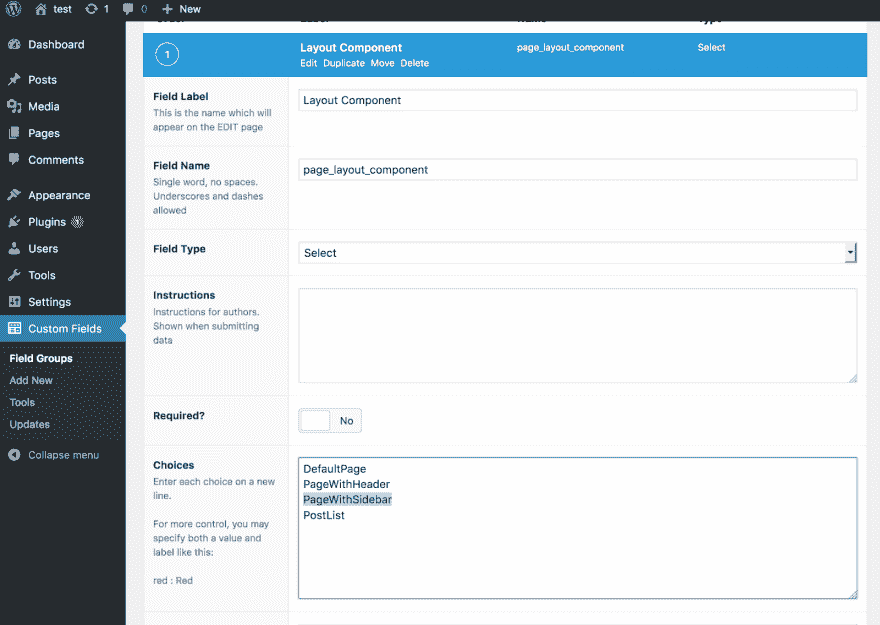T2】](https://res.cloudinary.com/practicaldev/image/fetch/s--hbxp2RcB--/c_limit%2Cf_auto%2Cfl_progressive%2Cq_auto%2Cw_880/https://cdn-images-1.medium.com/max/1600/1%2Ams7s-NW4xg-grmaOmm4PHw.png)

点击最右边的**更新**按钮保存更改。现在，让我们创建一个名为 *SidebarMenu* 的新页面字段，它将允许用户按名称呈现自定义菜单。我们只希望这个字段显示在具有*页面和侧栏*布局的页面上。点击**添加字段**按钮。

[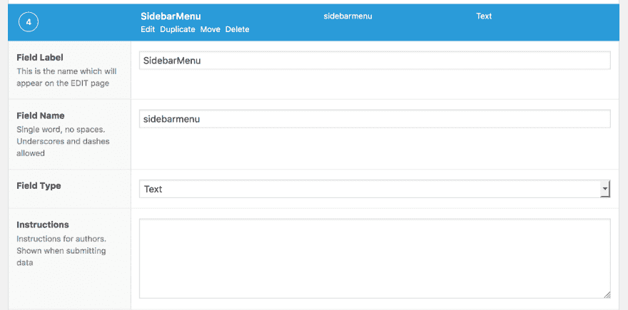T2】](https://res.cloudinary.com/practicaldev/image/fetch/s--BonoFJHK--/c_limit%2Cf_auto%2Cfl_progressive%2Cq_auto%2Cw_880/https://cdn-images-1.medium.com/max/1600/1%2Ak5-BdTxTKW8DfT8SyuMmcQ.png)

接下来，我们希望添加一些条件逻辑来决定何时显示该字段。

[T2】](https://res.cloudinary.com/practicaldev/image/fetch/s--mHnLzP_O--/c_limit%2Cf_auto%2Cfl_progressive%2Cq_auto%2Cw_880/https://cdn-images-1.medium.com/max/1600/1%2AbXSQ-nPZWA1EI6RZQ2w2Vw.png)

保存更改。

现在，让我们为侧边栏创建一个新菜单。我的菜单将是我喜欢的 Vue 资源链接的集合。你的可以随便！以下是我的菜单:

[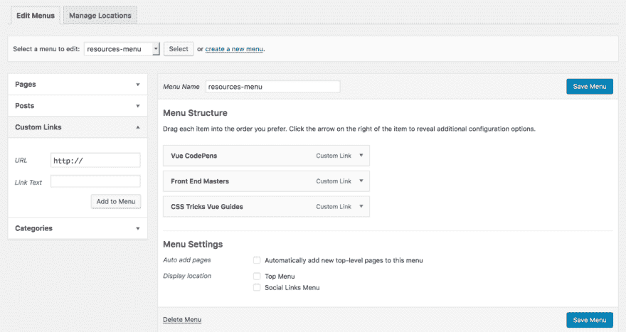T2】](https://res.cloudinary.com/practicaldev/image/fetch/s--V_HLVwyA--/c_limit%2Cf_auto%2Cfl_progressive%2Cq_auto%2Cw_880/https://cdn-images-1.medium.com/max/1600/1%2ApsBpBIHXooHenXqiUxPyCw.png)

现在让我们创建一个新页面，它将使用侧边栏和自定义菜单。你可以给这个页面起任何你想要的名字——我已经把它命名为 *Resources* 。

[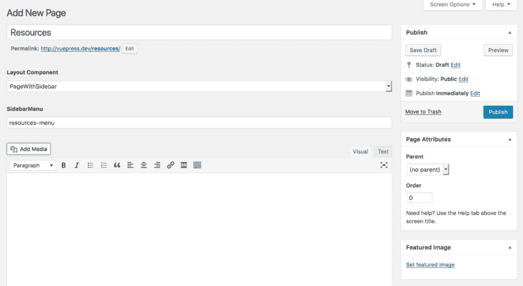T2】](https://res.cloudinary.com/practicaldev/image/fetch/s--i7_yHit_--/c_limit%2Cf_auto%2Cfl_progressive%2Cq_auto%2Cw_880/https://cdn-images-1.medium.com/max/1600/1%2A1w89uIBn6aI2wVJoN0O-dA.png)

最后，您需要记住将新页面添加到*主导航*菜单中。

太好了！这就是我们在 WordPress 后端需要做的。现在，我们需要创建自定义布局文件。

布局组件位于`/src/components/page/layouts`中。在该目录中，您将看到现有的布局组件。创建一个名为`PageWithSidebar.vue`的新文件。它看起来像这样:

```
<template>
  <div class="wrapper">
    <menu-container class="sidebar" :menuName="getSidebarMenuName()">
      <ul class="menu" slot-scope="menu">
        <li class="item" v-for="item in menu.items" :key="item.id">
          <menu-link :link="item.navitem"/>
        </li>
      </ul>
    </menu-container>
    <div class="body">
      <post-content :content="page.post_content"/> 
    </div>
  </div>
</template>

<script>
import MenuContainer from '@/components/menu/menuContainer'
import MenuLink from '@/components/menu/menuLink'
import PostContent from '@/components/post/PostContent'
export default {
  name: 'page-with-sidebar',
  props: ['page'],
  components: {
    MenuContainer, MenuLink, PostContent
  },
  methods: {
    getSidebarMenuName () {
      return this.page.post_meta.filter(item => {
        return item.meta_key === 'sidebarmenu'
      })[0].meta_value
    }
  }
}
</script> 
```

<svg width="20px" height="20px" viewBox="0 0 24 24" class="highlight-action crayons-icon highlight-action--fullscreen-on"><title>Enter fullscreen mode</title></svg> <svg width="20px" height="20px" viewBox="0 0 24 24" class="highlight-action crayons-icon highlight-action--fullscreen-off"><title>Exit fullscreen mode</title></svg>

有几件事需要注意。首先，注意定制的`menu-container`组件。该组件包含一个 GraphQL 查询。它接受一个名为`menuName`的属性，并使用它来查询 GraphQL 并获取菜单中的项目。但是首先，我们必须从我们当前所在页面的自定义字段中获取菜单的名称。为此，我们必须对页面的帖子元进行一些过滤。

这是一个提到 VuePress 配备了 [GraphiQL](https://github.com/graphql/graphiql) 的好时机，这是一个用于探索 GraphiQL 的浏览器内 IDE。可以去 localhost:3000/graphiql 看看。[点击这里](http://localhost:3000/graphiql?query=%7B%0A%20%20post%28name%3A%20%22resources%22%29%7B%0A%20%20%20%20post_meta%7B%0A%20%20%20%20%20%20meta_key%0A%20%20%20%20%20%20meta_value%0A%20%20%20%20%7D%0A%20%20%7D%0A%7D)，它将打开 GraphiQL，对名为“资源”的页面进行页面查询，如下所示。

[T2】](https://res.cloudinary.com/practicaldev/image/fetch/s--Ke9GTpP5--/c_limit%2Cf_auto%2Cfl_progressive%2Cq_auto%2Cw_880/https://cdn-images-1.medium.com/max/2000/1%2AtJhszHe0EVbt4cxGjmJzIQ.png)

注意*边栏菜单*的`meta_key`和`meta_value`是*资源-菜单*。回到`PageWithSidebar`组件，您可以看到`getSidebarMenuName`只是为 *sidebarmenu* 键过滤帖子元并获取其`meta_value`。

现在，让我们看看菜单查询是什么样子的。[点击此处查看链接](http://localhost:3000/graphiql?query=%7B%0A%20%20menus%28name%3A%22resources-menu%22%29%7B%0A%20%20%20%20items%20%7B%0A%20%20%20%20%20%20navitem%7B%0A%20%20%20%20%20%20%20%20post_title%0A%20%20%20%20%20%20%20%20post_name%0A%20%20%20%20%20%20%20%20post_meta%7B%0A%20%20%20%20%20%20%20%20%20%20meta_value%0A%20%20%20%20%20%20%20%20%20%20meta_key%0A%20%20%20%20%20%20%20%20%7D%0A%20%20%20%20%20%20%7D%0A%20%20%20%20%7D%0A%20%20%7D%0A%7D)。

[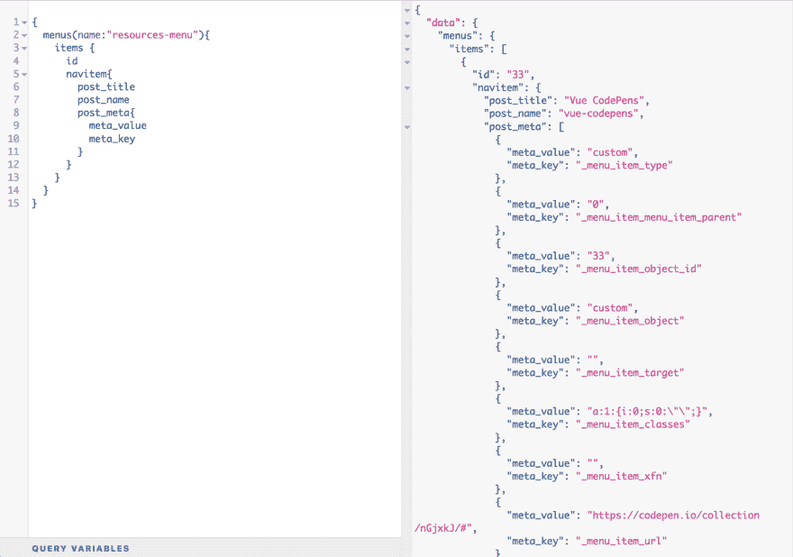T2】](https://res.cloudinary.com/practicaldev/image/fetch/s--2aHl3wUY--/c_limit%2Cf_auto%2Cfl_progressive%2Cq_auto%2Cw_880/https://cdn-images-1.medium.com/max/2000/1%2AGOXCvBIS3TsNQvvK7dzQgQ.png)

现在，菜单可以说是 WordPress 中最疯狂的事情之一，因为它们是如何保存在数据库中的。每个菜单项都有一个导航项，它可以是另一篇文章的链接，也可以是带有自己的文章元的自定义链接。在这个侧边栏菜单中，所有的链接都是自定义的。幸运的是，我已经创建了一个 MenuLink 组件，它将确定链接是内部的还是外部的，所以您只需要将 navitem 传递给它。

下面是`PageWithSidebar`组件的最终结果。

[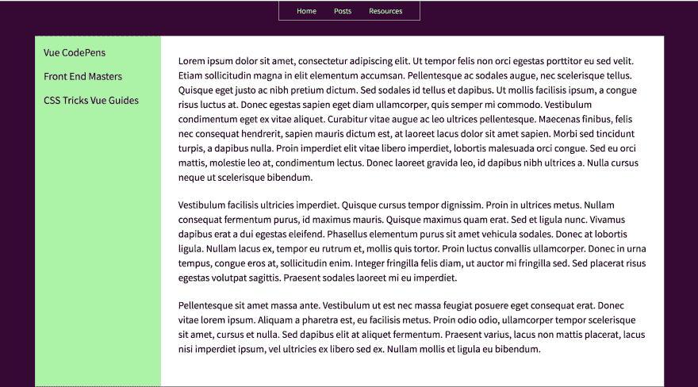T2】](https://res.cloudinary.com/practicaldev/image/fetch/s--97Sj5XBb--/c_limit%2Cf_auto%2Cfl_progressive%2Cq_auto%2Cw_880/https://cdn-images-1.medium.com/max/2000/1%2ArV37OJ8pi7fbzf4pqnf5cg.png)

## 包装完毕

虽然 VuePress 仍处于重度开发阶段(我甚至没有为它编写任何测试，这使我成为一个坏人)，但我认为这是朝着正确方向迈出的一步。能够编写 Vue 组件而不是使用 PHP 模板的感觉很好。内置作用域 CSS 或 CSS 模块很好。很高兴终于有了服务器端渲染。

在接下来的几周时间里，我计划认真整理一些文档，并开发一套全面的测试套件。如果你想投稿，请通过 [twitter](http://twitter.com/rmmmsy) 联系我。快乐发展！