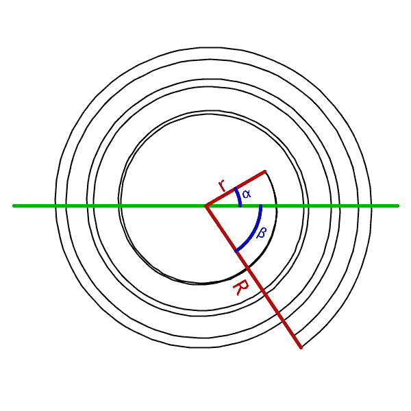
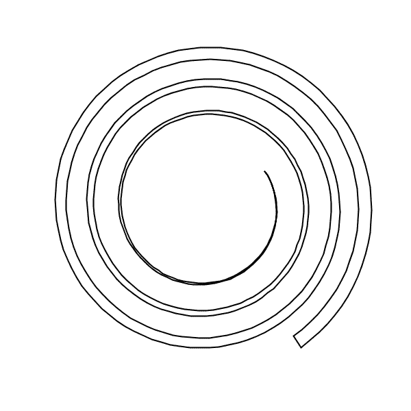
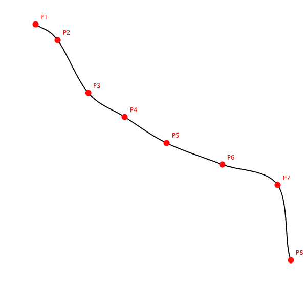
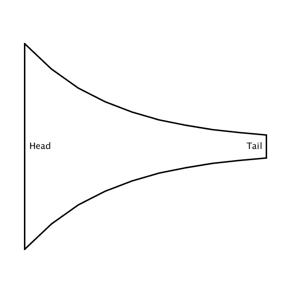
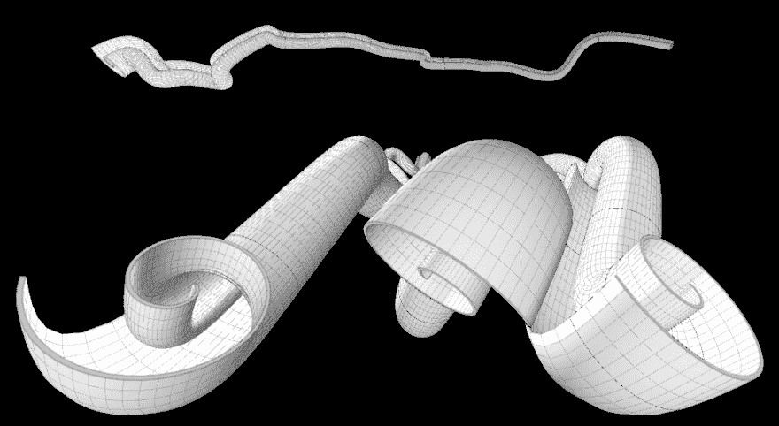
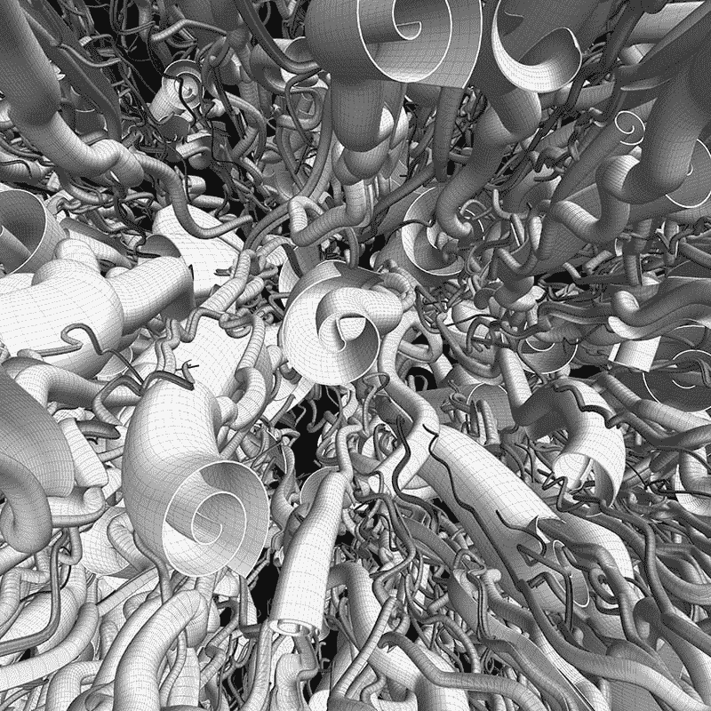
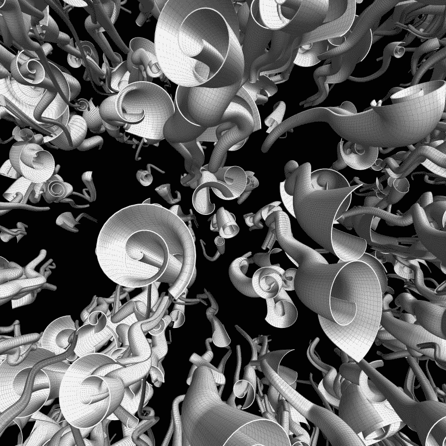
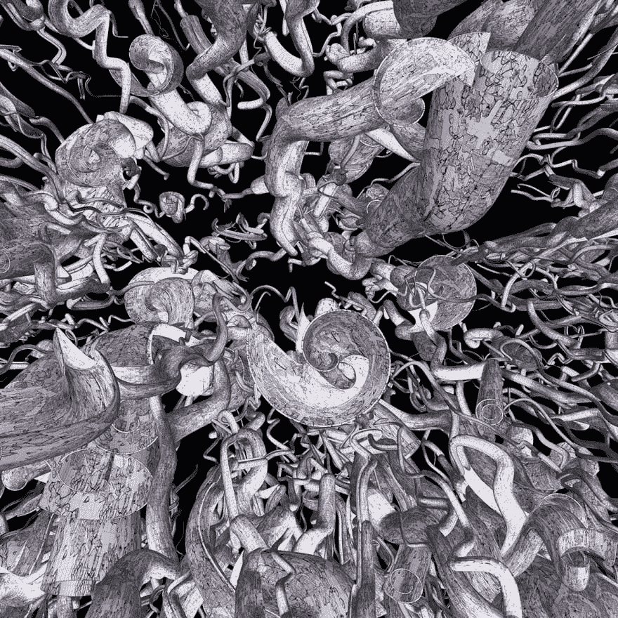
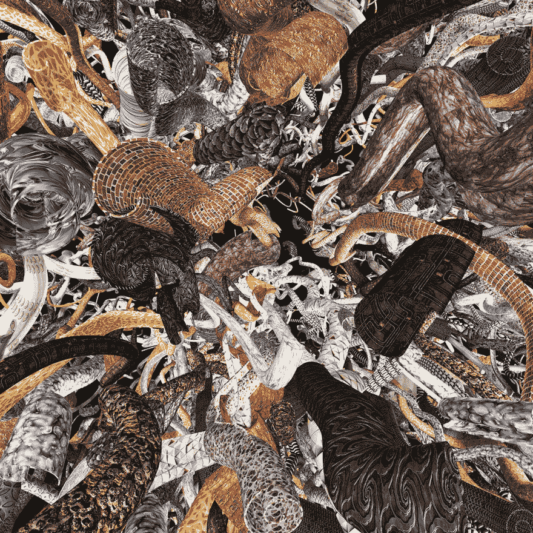

# 用代码生成艺术:涂鸦、数学和聚宝盆

> 原文:[https://dev . to/lpas qualis/generating-art-with-code-doodling-math-and-cornupias-12 J2](https://dev.to/lpasqualis/generating-art-with-code-doodling-math-and-cornucopias-12j2)

这篇文章最初发表在 [CoderHood](https://coderhood.com) 上，名为[用代码产生艺术:涂鸦、数学和聚宝盆](https://www.coderhood.com/generating-art-code-doodling-math-cornucopias/)。CoderHood 是一个致力于软件工程人类层面的博客。

* * *

我有创作艺术的强烈需求；我也对编码有着毕生的热爱。这两种激情是相容的，相互关联的。编码和数学可以产生艺术视觉。在这篇文章中，我展示了我如何创建一个程序来绘制由在太空中游动的“聚宝盆”缠结而成的涂鸦。

## 终生涂鸦

如果你是我博客的读者，你会知道每周二我都会从我的 Moleskine 上发布一个手绘的会议涂鸦。最近我一直在涂鸦一个有趣的形状，出于某种原因，我喜欢看。我称它为聚宝盆，因为它像一个细长扭曲的山羊角。你可以在这里看到一个例子[。](https://www.coderhood.com/doodle-tuesday-tangle-scrolls/)

本周的 Doodle 就是基于这个概念，但是它有一点不同，而且更加精细。这是:

[T2】](https://res.cloudinary.com/practicaldev/image/fetch/s--ImuuZEPV--/c_limit%2Cf_auto%2Cfl_progressive%2Cq_auto%2Cw_880/https://thepracticaldev.s3.amazonaws.com/i/slcqwzs7h6w2ehxp1tbo.png)

你大概也猜到了，这不是我用纸笔画的。我希望我有那么好。相反，我用代码和数学“画”出了它，我将向你们展示我是如何做到的。

## 涂鸦生成器

在假期里，在蛋酒和圣诞饼干之间，我决定做一个小的兼职项目来保持我的编码技能并满足我强迫性的艺术冲动。我创建了一个[处理](http://www.processing.org/)(相当于 Java)草图来自动生成由漂浮在 3D 空间中的聚宝盆组成的艺术作品。

我一开始就对最终结果有一个清晰的设想。我的意图是传达一种运动感和一种“纠结”感我还想生成涂鸦的许多随机变化，以便有材料来选择最视觉愉悦的一个。此外，我试图使代码易于配置。

## 聚宝盆理论

在这个上下文中定义的聚宝盆可能与你所期望的有点不同。它是通过沿贝塞尔样条挤出螺旋而生成的 3D 形状。

### 螺旋形

螺旋由其中心位置、小半径 R、大半径 R > r、角度α、整圈数 L >= 0 和角度β来定义。

下面是一个例子，r=1，R=2.5，α=-30，β= 60，L=3:

[T2】](https://res.cloudinary.com/practicaldev/image/fetch/s--E_zptQ9M--/c_limit%2Cf_auto%2Cfl_progressive%2Cq_auto%2Cw_880/https://thepracticaldev.s3.amazonaws.com/i/6h6kvrio4v8dqpk849id.png)

你也可以通过简单地指定角度θ=(360 * L)+β来消除同时具有 L 和β的需要。在上面的例子中，θ= 1140。

聚宝盆是一个三维形状，它需要一些“厚度”为了创建它，我简单地通过绘制两个具有相同 r(或接近相同)、α、β和 L，但 r 值略有不同的螺旋来加倍螺旋。下面是一个例子:

[T2】](https://res.cloudinary.com/practicaldev/image/fetch/s--l35zEZ6B--/c_limit%2Cf_auto%2Cfl_progressive%2Cq_auto%2Cw_880/https://thepracticaldev.s3.amazonaws.com/i/chlthymofi67bxctenfv.png)

从图像中移除标签后，螺旋的形状变得更加清晰:

[T2】](https://res.cloudinary.com/practicaldev/image/fetch/s--HIPgBL9o--/c_limit%2Cf_auto%2Cfl_progressive%2Cq_auto%2Cw_880/https://thepracticaldev.s3.amazonaws.com/i/dzqj4y4fqb5qdg474t0t.png)

### 贝塞尔样条

聚宝盆通过遵循贝塞尔样条的路径延伸，贝塞尔样条是与空间中给定数目的点相交的曲线。以下是由 8 个点定义的样条的 2D 示例:

[T2】](https://res.cloudinary.com/practicaldev/image/fetch/s--ZIkISeJ---/c_limit%2Cf_auto%2Cfl_progressive%2Cq_auto%2Cw_880/https://thepracticaldev.s3.amazonaws.com/i/clai9rbbg52yni3hw32s.png)

### 沿样条的螺旋半径

聚宝盆始于大头，终于窄尾；它有点像小号。在尝试了各种公式之后，我选择了指数半径，这导致了一个截面如下的形状:

[T2】](https://res.cloudinary.com/practicaldev/image/fetch/s--Hw14PSnW--/c_limit%2Cf_auto%2Cfl_progressive%2Cq_auto%2Cw_880/https://thepracticaldev.s3.amazonaws.com/i/xq63cos7fc7noplqtenz.png)

### 把所有的放在一起

最后，在 3D 空间中沿着样条线挤出一条螺旋线，从而形成聚宝盆。想象沿着样条线拉伸一个螺旋，创建一个从头到尾半径为指数的喇叭状形状。

这里有一个向不同方向旋转的例子:

[T2】](https://res.cloudinary.com/practicaldev/image/fetch/s--rWhIxezF--/c_limit%2Cf_auto%2Cfl_progressive%2Cq_auto%2Cw_880/https://thepracticaldev.s3.amazonaws.com/i/xkgu14kodmi1d2mjflwp.png)

### 自动生成嘟嘟

涂鸦生成器使用所有这些“理论”来创建一个带有大量随机聚宝盆的图像，这些聚宝盆的头部朝向观察者的大致方向。该程序还允许选择纹理图像，以最终实现令人愉快的合成效果和光源的定位。

我在这篇文章的开头给你展示了最终产品的例子；我再给你看几个。

无纹理:

[T2】](https://res.cloudinary.com/practicaldev/image/fetch/s--TTr3lHmT--/c_limit%2Cf_auto%2Cfl_progressive%2Cq_auto%2Cw_880/https://thepracticaldev.s3.amazonaws.com/i/2k0jvultsirq6wfwmbga.png)

[T2】](https://res.cloudinary.com/practicaldev/image/fetch/s--_C34BvCZ--/c_limit%2Cf_auto%2Cfl_progressive%2Cq_auto%2Cw_880/https://thepracticaldev.s3.amazonaws.com/i/63hrgraecaj75n35pvxp.png)

一种具有单一纹理的纹理:

[T2】](https://res.cloudinary.com/practicaldev/image/fetch/s--3XOR_PxQ--/c_limit%2Cf_auto%2Cfl_progressive%2Cq_auto%2Cw_880/https://thepracticaldev.s3.amazonaws.com/i/gvqukkus5jq433yxdhoj.png)

一个有多种纹理:

[T2】](https://res.cloudinary.com/practicaldev/image/fetch/s--Gn3aggSJ--/c_limit%2Cf_auto%2Cfl_progressive%2Cq_auto%2Cw_880/https://thepracticaldev.s3.amazonaws.com/i/tkm7acilhhrs3lgoho99.png)

## 给我看看代码！

结果的源代码可以在[这里](https://github.com/lpasqualis/CornucopiaArt)找到。

注意:加工草图通常不是为非技术人员设计的应用程序。它们通常是紧凑的代码片段，构建的唯一目的是生成图像或动画。我的聚宝盆艺术素描也不例外，改变它的参数需要改变代码。

这是一项正在进行的工作，我将随着时间的推移继续完善，特别是如果有人对这个主题感兴趣的话。

* * *

### 如果你喜欢这篇文章，请保持联系！

*   在 CoderHood 上找到我所有的帖子。
*   在 LinkedIn 上加入我的职业网络。
*   在推特上关注我。
*   加入我的脸书主页。
*   最后，请在 dev.to 上关注我！