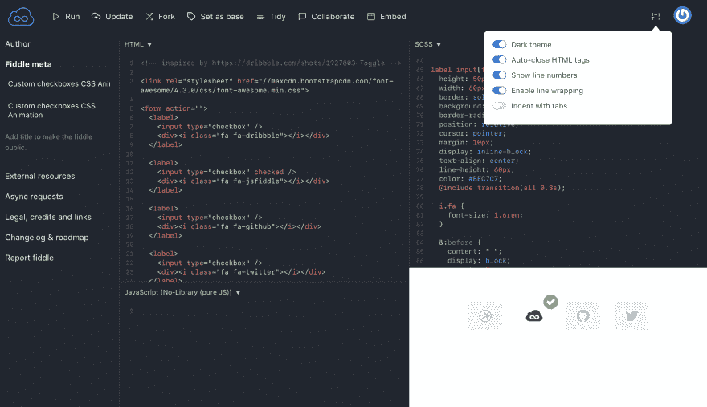
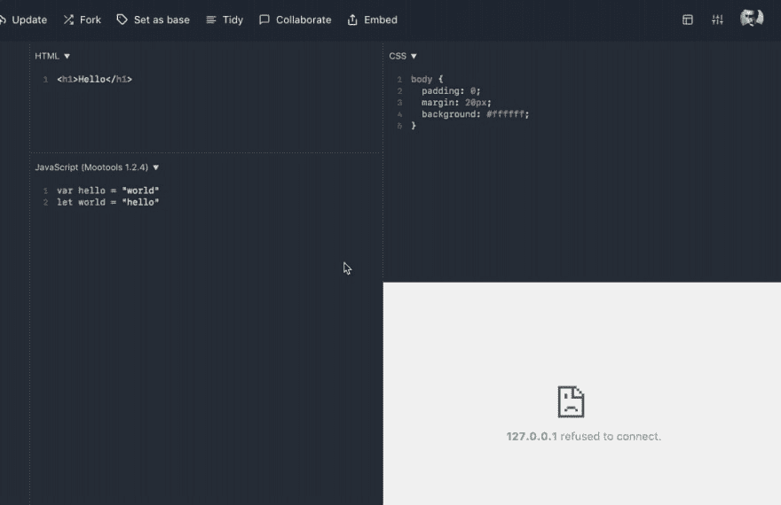

# JSFiddle 中的黑暗模式

> 原文:[https://dev.to/jsfiddle/dark-mode-in-jsfiddle-52o3](https://dev.to/jsfiddle/dark-mode-in-jsfiddle-52o3)

> exes 64@ xsimon 47[@ js fiddle](https://twitter.com/jsfiddle)我靠 YESS！！！！！我已经等了好几年了！！2017 年 12 月 29 日 22 点 36 分

如果说从[我们的路线图](https://trello.com/b/LakLkQBW/jsfiddle-roadmap)(以及^的那条推文)中可以看出什么的话，那就是人们真的希望 JSFiddle 有一个黑暗模式——那个功能请求得到了**484 票**。

花了一段时间终于完成了，它把 **[变成了真的，真的很好的](https://jsfiddle.net)** 。

[T2】](https://jsfiddle.net)

几个月前，我做了一个调查，大多数 said 用户说他们实际上更喜欢深色主题，这也是为什么这个主题现在是默认的。

这次更新带来了一些其他的改进，比如**完全移除了所有的网页/图标字体**，这对我们来说一直是个负担，并且对加载时间有很多负面影响。现在所有的图标和 SVG–实际上网站上没有一张图片，所有的都是代码。

谁不喜欢更好的装载时间呢！🚀

很快会有更多的更新，其中一个是另一个大的更新——在不同的编辑器网格之间切换！

> <video loop="" controls=""><source src="https://video.twimg.com/tweet_video/DSYQW4UW0AAFnah.mp4" type="video/mp4"></video>奥斯卡科劳兹克🌲[@ oskar](https://dev.to/oskar)中的网格切换器 [@jsfiddle](https://twitter.com/jsfiddle) 差不多完成了，我很有可能明天就把它推直播🥃13:41pm-2017 年 12 月 31 日