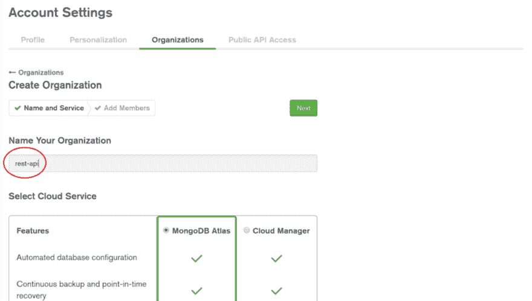
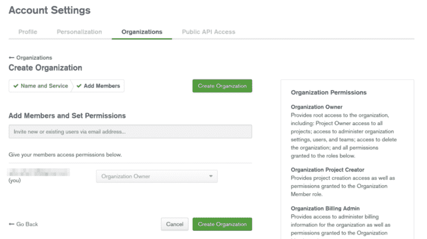
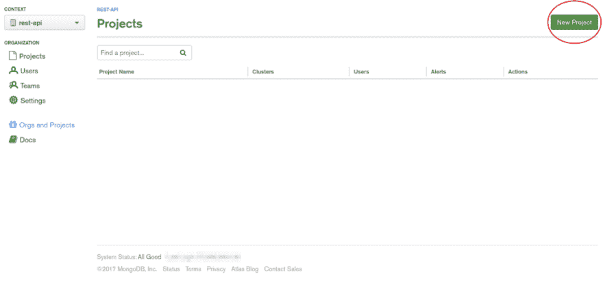
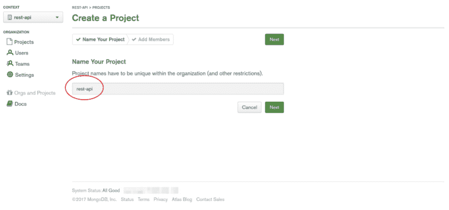
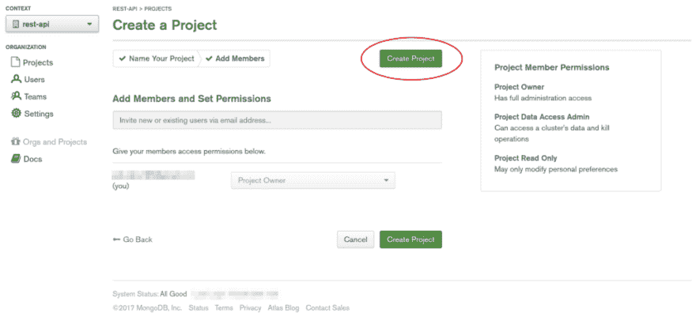
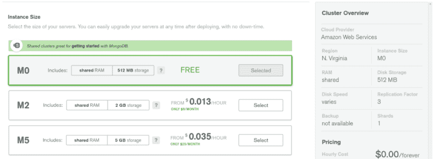
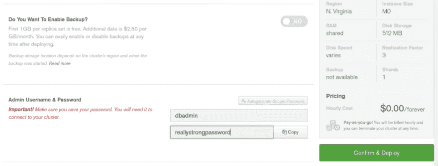

# 用 Node.js 和 MongoDB 构建无服务器 REST API

> 原文:[https://dev . to/adnanrahic/building-a-server less-rest-API-with-nodejs-and-MongoDB-43db](https://dev.to/adnanrahic/building-a-serverless-rest-api-with-nodejs-and-mongodb-43db)

在过去的几个月里，无服务器运动已经获得了一些动力。每个人似乎都在谈论它。有些人甚至称之为革命！但是，我们不要太兴奋。不要像我一样。我对这种很酷的东西过于兴奋，于是开始写文章。如果这对你来说是全新的，这里有一篇我不久前写的文章，解释了核心概念。

[node . js 无服务器速成班](https://dev.to/adnanrahic/a-crash-course-on-serverless-with-nodejs-5jp)

本着这种精神，我花在探索使用无服务器架构构建什么是合理的时间可能超过了被视为健康的时间。我的结论是，几乎所有东西都可以用无服务器的方式构建。你唯一需要问自己的问题是，你是否真的需要它。Lambdas 是无状态的，这意味着编写服务器端代码的整个概念需要重新学习。

听起来很有趣？是啊，对我来说也是。我最近发表了一篇关于在现实生活中使用无服务器架构的实践课程。我把我所有的发现和使用无服务器的合理理由都倾注到这个课程中。我不断问自己这个问题*“为什么我需要无服务器？”*贯穿整个创作过程。你可以在下面找到我的想法。

[无服务器 JavaScript 示例[视频] -视频|现在只需 5 美元](https://www.packtpub.com/web-development/serverless-javascript-example-video)

### 为什么要对 REST APIs 使用无服务器？

为什么不呢？是因为我们可以，还是我们看到了相对于传统服务器的明显优势？硬币的两面都有有效的论据。无服务器被认为是永远运行的。因为你不需要管理任何东西，你不用担心正常运行时间，它只是工作。它还可以自动扩展。真好。真的很好。扩展服务器并不有趣。

但是持久存储呢？我们不能像过去那样在服务器上运行 MongoDB 数据库。然而，如果你一直遵循在过去一年中不断增长的**“关注点分离”**的生活方式，你可能已经习惯了将你的数据库与你的后端分离。如果你习惯写微服务就更是如此。你只需给你的应用一个连接 URL，数据库就准备好了。

### 你准备好接受挑战了吗？

本文将向您展示如何将 MongoDB 数据库作为服务连接到无服务器 REST API。可能有点厚脸皮，因为使用 AWS 无服务器架构的首选方式是使用他们的 NoSQL DBaaS，名为 [DynamoDB](https://aws.amazon.com/dynamodb/) 。但我喜欢组合奇怪的东西。而且，说实话， [MongoDB Atlas](https://www.mongodb.com/cloud/atlas) 太神奇了。是 MongoDB 自己的 DBaaS。你可以免费获得一个专用的 MongoDB 集群。

这个设置最棒的地方是，我将向您展示如何以您已经习惯的方式编写代码。你在 Node.js、Express 和 Mongoose 中所知道的一切都将在本教程中重复使用。

新的是使用 [Lambda 计算服务](https://aws.amazon.com/lambda/)背后的思维模式。AWS Lambda 函数基本上是一个 [Docker](https://www.docker.com/what-docker) 容器。一旦 Lambda 被调用，容器就开始旋转并运行代码。这是我们想要初始化数据库连接的时候，第一次调用函数，第一次初始化 Docker 容器。对 Lambda 函数的每个后续请求都应该使用现有的数据库连接。够简单吗？让我们开始吧！

### 起床跑步

我假设您已经对无服务器框架有了基本的了解。我也希望你有一个 AWS 帐户设置。如果没有，请看一下我[在顶部](https://dev.to/adnanrahic/a-crash-course-on-serverless-with-nodejs-5jp)链接的文章。

#### 1。创建服务

首先，让我们创建一个新的服务来保存我们所有的代码。

```
$ sls create -t aws-nodejs -p rest-api && cd rest-api 
```

<svg width="20px" height="20px" viewBox="0 0 24 24" class="highlight-action crayons-icon highlight-action--fullscreen-on"><title>Enter fullscreen mode</title></svg> <svg width="20px" height="20px" viewBox="0 0 24 24" class="highlight-action crayons-icon highlight-action--fullscreen-off"><title>Exit fullscreen mode</title></svg>

这个命令将搭建出所有必要的文件和代码来创建我们的 Lambda 函数和 API 网关事件。它将按照我们用-p 标志给它指定的路径来做这件事。这意味着它将创建一个名为 rest-api 的目录。我们想换到那个目录，从那里开始工作。

#### 2。安装模块

我们需要几个模块。首先，我们需要无服务器离线插件，以便在部署到 AWS 之前能够在本地运行我们的代码。然后我们需要抓住[猫鼬](https://www.npmjs.com/package/mongoose)，我选择的 ORM，和 [dotenv](https://www.npmjs.com/package/dotenv) ，因为我喜欢**而不是**按 GitHub 的键。把钥匙推到 GitHub 上糟透了。不要那样做。每当你按下 GitHub 的一个键，就会有一只小企鹅死去。我是说，不完全是，但还是很糟糕。

确保您在 rest-api 目录中。先离线安装 Serverless，再安装 mongoose 和 dotenv。

```
$ npm init -y
$ npm i --save-dev serverless-offline
$ npm i --save mongoose dotenv 
```

<svg width="20px" height="20px" viewBox="0 0 24 24" class="highlight-action crayons-icon highlight-action--fullscreen-on"><title>Enter fullscreen mode</title></svg> <svg width="20px" height="20px" viewBox="0 0 24 24" class="highlight-action crayons-icon highlight-action--fullscreen-off"><title>Exit fullscreen mode</title></svg>

就这样，让我们从终端休息一下，跳到 Atlas 来创建一个数据库。

#### 3。在 MongoDB Atlas 上创建数据库

准备好接受更多配置了吗？是啊，没人喜欢这部分。但是和我一起。跳到 MongoDB Atlas 并注册。

[完全托管的 MongoDB，托管在 AWS、Azure 和 GCP 上](https://www.mongodb.com/cloud/atlas?jmp=nav)

这是免费的，不需要信用卡。这将是我们玩耍时需要的沙箱。设置好帐户后，打开您的帐户页面并添加一个新组织。

[T2】](https://res.cloudinary.com/practicaldev/image/fetch/s--N5dByltq--/c_limit%2Cf_auto%2Cfl_progressive%2Cq_auto%2Cw_880/https://cdn-images-1.medium.com/max/1024/1%2AhM21Qo6sum_Bcj98giFYzQ.png)

添加一个您认为合适的名称，我将坚持使用 rest-api。点击“下一步”,继续创建组织。

[T2】](https://res.cloudinary.com/practicaldev/image/fetch/s--I8yuffI9--/c_limit%2Cf_auto%2Cfl_progressive%2Cq_auto%2Cw_880/https://cdn-images-1.medium.com/max/1024/1%2A-JBOmTjNK0iSLb3VZEKwsw.png)

很好。这将带您进入组织页面。按下新项目按钮。

[T2】](https://res.cloudinary.com/practicaldev/image/fetch/s--Eq5_kAsG--/c_limit%2Cf_auto%2Cfl_progressive%2Cq_auto%2Cw_880/https://cdn-images-1.medium.com/max/1024/1%2AsOxiyVzJjVFF_cV5V7oO6w.png)

这将打开一个页面来命名您的项目。只需再次输入 rest-api，然后点击 next。

[T2】](https://res.cloudinary.com/practicaldev/image/fetch/s--DqzJTiXb--/c_limit%2Cf_auto%2Cfl_progressive%2Cq_auto%2Cw_880/https://cdn-images-1.medium.com/max/1024/1%2ASSSzcsD2g9z0JhFtAaWnBQ.png)

MongoDB 关心权限和安全性，所以 Atlas 将向您展示另一个管理权限页面。我们现在可以跳过这一步，创建项目。

[T2】](https://res.cloudinary.com/practicaldev/image/fetch/s--LtzVzIFo--/c_limit%2Cf_auto%2Cfl_progressive%2Cq_auto%2Cw_880/https://cdn-images-1.medium.com/max/1024/1%2AyCM_HJiy-Qw42CxxF-LBpg.png)

唷，我们找到了。最后，我们可以创建实际的集群！按下巨大的绿色**“建立新集群”**按钮。这将打开一个巨大的集群创建窗口。您可以保留所有的默认值，只需确保选择 **M0** 实例大小，并禁用备份。

[T2】](https://res.cloudinary.com/practicaldev/image/fetch/s--roRJK7LH--/c_limit%2Cf_auto%2Cfl_progressive%2Cq_auto%2Cw_880/https://cdn-images-1.medium.com/max/1024/1%2ApYF8SbJsPASbLX2su7p8AQ.png)

[T2】](https://res.cloudinary.com/practicaldev/image/fetch/s--d4IGN3UF--/c_limit%2Cf_auto%2Cfl_progressive%2Cq_auto%2Cw_880/https://cdn-images-1.medium.com/max/1024/1%2AB0keX3l5GWSefyprHzoNOA.png)

完成所有这些后，只需为集群添加一个管理员用户，并给他一个非常强的密码。如您所见，该集群的价格将为**$ 0.00/永久**。相当不错。就是这样，点击**确认&部署**。

部署您的集群需要几分钟时间。在此过程中，让我们最终开始编写一些代码。

### 编写一些代码

那个装置很难。现在我们需要在 **serverless.yml** 文件中编写资源配置，并将实际的 CRUD 方法添加到 **handler.js** 中。

#### 4。配置所有 YAML

无服务器框架的神奇之处在于它有很好的初始架构。您几乎可以仅使用 **serverless.yml** 文件中注释掉的代码来创建一个很好的配置。但是，因为我是一个爱干净的人，所以让我们把它全部删除，添加下面的代码。在你把它复制到你的 **serverless.yml** 文件后，我会继续解释这一切。

```
service: rest-api

provider:
  name: aws
  runtime: nodejs6.10 # set node.js runtime
  memorySize: 128 # set the maximum memory of the Lambdas in Megabytes
  timeout: 10 # the timeout is 10 seconds (default is 6 seconds)
  stage: dev # setting the env stage to dev, this will be visible in the routes
  region: us-east-1

functions: # add 4 functions for CRUD
  create:
    handler: handler.create # point to exported create function in handler.js
    events:
      - http:
          path: notes # path will be domain.name.com/dev/notes
          method: post
          cors: true
  getOne:
    handler: handler.getOne
    events:
      - http:
          path: notes/{id} # path will be domain.name.com/dev/notes/1
          method: get
          cors: true
  getAll:
    handler: handler.getAll # path will be domain.name.com/dev/notes
    events:
     - http:
         path: notes
         method: get
         cors: true
  update:
    handler: handler.update # path will be domain.name.com/dev/notes/1
    events:
     - http:
         path: notes/{id}
         method: put
         cors: true
  delete:
    handler: handler.delete
    events:
     - http:
         path: notes/{id} # path will be domain.name.com/dev/notes/1
         method: delete
         cors: true

plugins:
- serverless-offline # adding the plugin to be able to run the offline emulation 
```

<svg width="20px" height="20px" viewBox="0 0 24 24" class="highlight-action crayons-icon highlight-action--fullscreen-on"><title>Enter fullscreen mode</title></svg> <svg width="20px" height="20px" viewBox="0 0 24 24" class="highlight-action crayons-icon highlight-action--fullscreen-off"><title>Exit fullscreen mode</title></svg>

这种配置非常简单，刚好满足我们的需求。我们已经将 Lambdas 的最大内存大小设置为 128MB，这对于我们的需求来说已经足够了。在我自己测试了几天后，它们从未超过 50MB。

让我们进入有趣的部分，**函数**部分。我们一共增加了 5 个函数:**创建**、 **getOne** 、 **getAll** 、**更新**、**删除**。它们都指向 **handler.js** 文件中同名的导出函数。它们的路径都遵循标准 REST API 的命名约定。令人惊讶的是，这就是我们设置 [API 网关](https://dashbird.io/api-gateway-cost-calculator/)资源来触发 [Lambda 函数](https://dashbird.io/lambda-cost-calculator/)所需要的全部。

差不多就这些了，最后就是增加一个插件部分和**无服务器-离线**。我们在上面安装了这个模块，在部署到 AWS 之前，我们将用它来测试服务。我猜我们准备好接下来玩 **handler.js** 了。我们走吧！

#### 5。充实功能

我们准备好享受真正的乐趣了。我们将首先定义我们需要的 5 个函数，并创建我们想要的行为的初始布局。之后，我们可以创建数据库连接，并添加与 Mongoose 的数据库交互逻辑。

首先打开 **handler.js** 文件。您将看到默认的 hello 函数。继续删除它，并添加下面的代码。

```
'use strict';

module.exports.create = (event, context, callback) => {
  context.callbackWaitsForEmptyEventLoop = false;

  connectToDatabase()
    .then(() => {
      Note.create(JSON.parse(event.body))
        .then(note => callback(null, {
          statusCode: 200,
          body: JSON.stringify(note)
        }))
        .catch(err => callback(null, {
          statusCode: err.statusCode || 500,
          headers: { 'Content-Type': 'text/plain' },
          body: 'Could not create the note.'
        }));
    });
};

module.exports.getOne = (event, context, callback) => {
  context.callbackWaitsForEmptyEventLoop = false;

  connectToDatabase()
    .then(() => {
      Note.findById(event.pathParameters.id)
        .then(note => callback(null, {
          statusCode: 200,
          body: JSON.stringify(note)
        }))
        .catch(err => callback(null, {
          statusCode: err.statusCode || 500,
          headers: { 'Content-Type': 'text/plain' },
          body: 'Could not fetch the note.'
        }));
    });
};

module.exports.getAll = (event, context, callback) => {
  context.callbackWaitsForEmptyEventLoop = false;

  connectToDatabase()
    .then(() => {
      Note.find()
        .then(notes => callback(null, {
          statusCode: 200,
          body: JSON.stringify(notes)
        }))
        .catch(err => callback(null, {
          statusCode: err.statusCode || 500,
          headers: { 'Content-Type': 'text/plain' },
          body: 'Could not fetch the notes.'
        }))
    });
};

module.exports.update = (event, context, callback) => {
  context.callbackWaitsForEmptyEventLoop = false;

  connectToDatabase()
    .then(() => {
      Note.findByIdAndUpdate(event.pathParameters.id, JSON.parse(event.body), { new: true })
        .then(note => callback(null, {
          statusCode: 200,
          body: JSON.stringify(note)
        }))
        .catch(err => callback(null, {
          statusCode: err.statusCode || 500,
          headers: { 'Content-Type': 'text/plain' },
          body: 'Could not fetch the notes.'
        }));
    });
};

module.exports.delete = (event, context, callback) => {
  context.callbackWaitsForEmptyEventLoop = false;

  connectToDatabase()
    .then(() => {
      Note.findByIdAndRemove(event.pathParameters.id)
        .then(note => callback(null, {
          statusCode: 200,
          body: JSON.stringify({ message: 'Removed note with id: ' + note._id, note: note })
        }))
        .catch(err => callback(null, {
          statusCode: err.statusCode || 500,
          headers: { 'Content-Type': 'text/plain' },
          body: 'Could not fetch the notes.'
        }));
    });
}; 
```

<svg width="20px" height="20px" viewBox="0 0 24 24" class="highlight-action crayons-icon highlight-action--fullscreen-on"><title>Enter fullscreen mode</title></svg> <svg width="20px" height="20px" viewBox="0 0 24 24" class="highlight-action crayons-icon highlight-action--fullscreen-off"><title>Exit fullscreen mode</title></svg>

好吧，有点不知所措是正常的。但是，没必要担心。这只是 5 个简单的功能。每个函数都有相同的值`context.callbackWaitsForEmptyEventLoop`设置为`false`，并以`connectToDatabase()`函数调用开始。一旦`connectToDatabase()`函数解决了这个问题，它将继续通过 Mongoose 执行数据库交互。对于实际的数据库交互，我们将使用 Note 模型方法。但是等等，我们还没有定义或创建这些！你们一定在问自己我怎么了。我是故意这样做的，首先我想让你看到这并不复杂，与用 Node.js 和 Express 创建 REST API 也没有什么不同。

***注意****:*context . callbackwaitsforemptyeventloop—*默认情况下，回调会一直等到 Node.js 运行时事件循环为空，才会冻结进程并将结果返回给调用者。您可以将该属性设置为 false，以请求 AWS Lambda 在调用* *回调后立即冻结进程，即使事件循环中有事件。AWS Lambda 将冻结 Node.js 事件循环中的流程、任何状态数据和事件(下一次调用 Lambda 函数时，如果 AWS Lambda 选择使用冻结的流程，将处理事件循环中的任何剩余事件)。

-* [*AWS 文档*](https://docs.aws.amazon.com/lambda/latest/dg/nodejs-prog-model-context.html)

是时候添加实际的数据库连接了。在我们添加代码之前，重要的是要理解连接将被建立一次。当 Lambda 第一次被调用时，这被称为冷启动，AWS 将启动一个 Docker 容器来运行代码。这是我们连接到数据库的时候。所有后续请求都将使用现有的数据库连接。从概念上讲，这很容易理解，但是当我们需要在代码中理解它的时候，就很难了。开始了。

#### 6。添加数据库连接

连接到 MongoDB 的过程是双重的。我们需要创建一种动态的方式来创建连接，但也要确保重用相同的连接(如果可用的话)。我们会慢慢开始。

在服务的根目录下创建一个新文件，就在 **handler.js** 旁边。给它起一个很有逻辑的名字 **db.js** ，并添加下面的代码。

```
const mongoose = require('mongoose');
mongoose.Promise = global.Promise;
let isConnected;

module.exports = connectToDatabase = () => {
  if (isConnected) {
    console.log('=> using existing database connection');
    return Promise.resolve();
  }

  console.log('=> using new database connection');
  return mongoose.connect(process.env.DB)
    .then(db => { 
      isConnected = db.connections[0].readyState;
    });
}; 
```

<svg width="20px" height="20px" viewBox="0 0 24 24" class="highlight-action crayons-icon highlight-action--fullscreen-on"><title>Enter fullscreen mode</title></svg> <svg width="20px" height="20px" viewBox="0 0 24 24" class="highlight-action crayons-icon highlight-action--fullscreen-off"><title>Exit fullscreen mode</title></svg>

***注*** *:此语法对 mongose 5 . 0 . 0-rc0 及以上版本有效。它将不会与低于 5 的任何版本的猫鼬一起工作。*

在第 1 行，我们需要 mongose，就像我们习惯的那样，在第 2 行，我们添加了 mongose 使用的本地 promise 库。这是因为当我们用笔记模型方法调用它们时，我们希望`.then`在 **handler.js** 中正常工作。

那么`isConnected`变量呢？我们正在创建一个闭包，并将`isConnected`视为正在运行的 Docker 容器中的当前数据库状态。看看我们输出的`connectToDatabase`函数。在第 12 行，我们正在用一个环境变量提供的连接字符串建立一个连接。这个函数返回一个承诺，我们简单地用`.then`得到一个`db`对象。这个对象表示当前的连接，并且有一个我们特别感兴趣的属性。`.readyState`将告诉我们连接是否存在。如果是，就等于`1`，否则就是`0`。

我们基本上是缓存数据库连接，确保它不会被创建，如果它已经存在。那样的话我们就马上解决承诺。

随着 **db.js** 文件的创建，让我们在 **handler.js** 中要求它。只需将这段代码添加到处理程序的顶部。

```
// top of handler.js
const connectToDatabase = require('./db'); 
```

<svg width="20px" height="20px" viewBox="0 0 24 24" class="highlight-action crayons-icon highlight-action--fullscreen-on"><title>Enter fullscreen mode</title></svg> <svg width="20px" height="20px" viewBox="0 0 24 24" class="highlight-action crayons-icon highlight-action--fullscreen-off"><title>Exit fullscreen mode</title></svg>

#### 7。添加注释模型

再看一下 handler.js。可以看到我们在函数中调用了 Note 模型来检索数据，但是没有定义模型。好吧，现在正是时候。

在服务根目录下创建一个新文件夹，并将其命名为 **models** 。在其中创建另一个文件，命名为 **Note.js** 。这将只是一个简单的 mongoose 模式和模型定义。