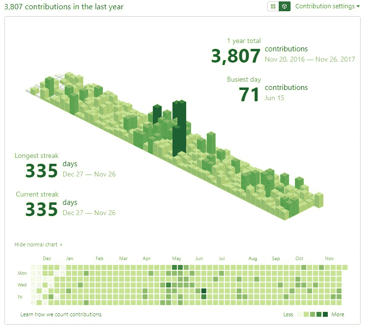
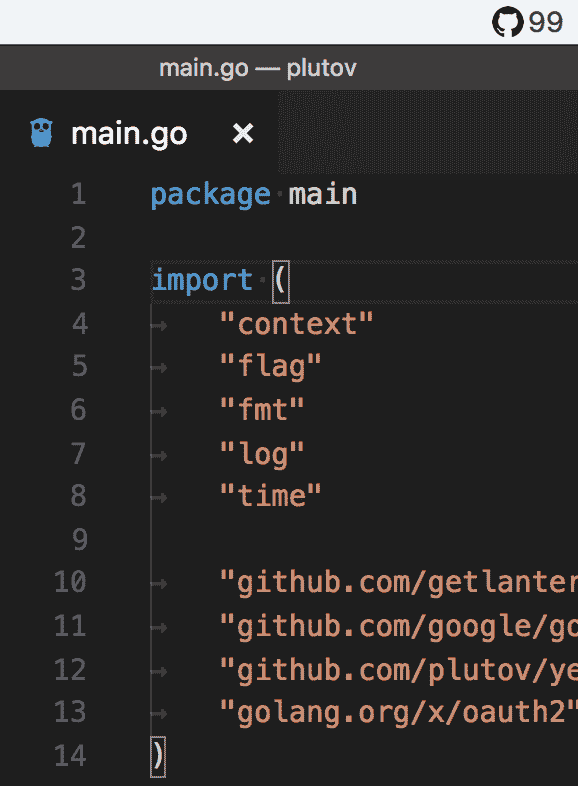

# 提交年份:Go 中的简单系统程序

> 原文:[https://dev . to/plutov/year-of-commits-simple-systray-program-in-go-5fjh](https://dev.to/plutov/year-of-commits-simple-systray-program-in-go-5fjh)

地鼠新年快乐！我 2018 年的目标之一是每天向 GitHub 提交一个代码。所以 GitHub 上的“贡献”看起来像这样:

[T2】](https://res.cloudinary.com/practicaldev/image/fetch/s--vtQPdOT4--/c_limit%2Cf_auto%2Cfl_progressive%2Cq_auto%2Cw_880/http://pliutau.com/yearofcommits-full.jpg)

为了跟踪这个过程，我决定写一个 Go 程序，它会一直在我的托盘里，并且会显示我连续多少天向 Github 提交了一些东西。

Tadaa！[承诺年份](https://github.com/plutov/yearofcommits)

这是一个使用以下软件包的单文件命令行工具:

*   github.com/getlantern/systray
*   github.com/google/go-github/github
*   golang.org/x/oauth2

我们正在使用 [dep](https://github.com/golang/dep) 安装它们。

systray 是一个跨平台的包，用于将图标和菜单放入通知区域。虽然我只在 Mac 上测试过。

然后应用在 [go-github/github](//github.com/google/go-github/github) Go 包的帮助下使用 GitHub API。GitHub API 没有贡献端点，所以我们需要获取所有存储库，并获取指定用户的所有提交。

```
client.Repositories.List(ctx, user, reposOpts)
client.Repositories.ListCommits(ctx, user, repo.GetName(), commitsOpts) 
```

<svg width="20px" height="20px" viewBox="0 0 24 24" class="highlight-action crayons-icon highlight-action--fullscreen-on"><title>Enter fullscreen mode</title></svg> <svg width="20px" height="20px" viewBox="0 0 24 24" class="highlight-action crayons-icon highlight-action--fullscreen-off"><title>Exit fullscreen mode</title></svg>

剩下的就简单了，数着日子。

[T2】](https://res.cloudinary.com/practicaldev/image/fetch/s--hi4ws36E--/c_limit%2Cf_auto%2Cfl_progressive%2Cq_auto%2Cw_880/http://pliutau.com/yearofcommits.png)

要在本地运行它，你需要安装`dep`并运行:

```
dep ensure
go install
yearofcommits -u github_user -t github_api_token 
```

<svg width="20px" height="20px" viewBox="0 0 24 24" class="highlight-action crayons-icon highlight-action--fullscreen-on"><title>Enter fullscreen mode</title></svg> <svg width="20px" height="20px" viewBox="0 0 24 24" class="highlight-action crayons-icon highlight-action--fullscreen-off"><title>Exit fullscreen mode</title></svg>

此外，如果您想在重启 Mac 后保持运行，您可以配置`launchctl`。用下面的 XML 创建`/Library/LaunchAgents/yearofcommits.plist`文件:

```
<?xml version="1.0" encoding="UTF-8"?>
<!DOCTYPE plist PUBLIC "-//Apple Computer//DTD PLIST 1.0//EN" "http://www.apple.com/DTDs/PropertyList-1.0.dtd">
<plist version="1.0">
<dict>
    <key>Label</key>
    <string>yearofcommits</string>

    <key>OnDemand</key>
    <false/>

    <key>UserName</key>
    <string>MAC_USER</string>

    <key>GroupName</key>
    <string>MAC_GROUP</string>

    <key>ProgramArguments</key>
    <array>
            <string>/go/bin/yearofcommits</string>
            <string>-u</string>
            <string>GITHUB_USER</string>
            <string>-t</string>
            <string>GITHUB_TOKEN</string>
    </array>
</dict>
</plist> 
```

<svg width="20px" height="20px" viewBox="0 0 24 24" class="highlight-action crayons-icon highlight-action--fullscreen-on"><title>Enter fullscreen mode</title></svg> <svg width="20px" height="20px" viewBox="0 0 24 24" class="highlight-action crayons-icon highlight-action--fullscreen-off"><title>Exit fullscreen mode</title></svg>

将`/go/bin/yearofcommits`改为$GOBIN 中的绝对路径。

运行:

```
sudo launchctl load /Library/LaunchAgents/yearofcommits.plist 
```

<svg width="20px" height="20px" viewBox="0 0 24 24" class="highlight-action crayons-icon highlight-action--fullscreen-on"><title>Enter fullscreen mode</title></svg> <svg width="20px" height="20px" viewBox="0 0 24 24" class="highlight-action crayons-icon highlight-action--fullscreen-off"><title>Exit fullscreen mode</title></svg>

[我博客里的原创帖子](http://pliutau.com/year-of-commits/)