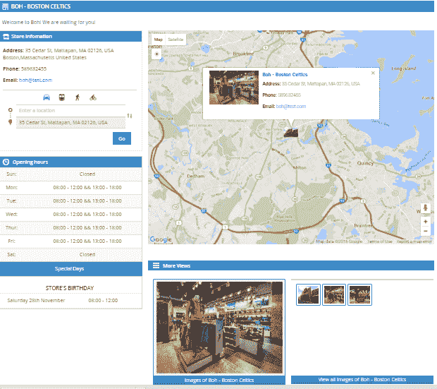

# 商店定位器 Magento 2

> 原文：<https://dev.to/magentoaht/store-locator-magento-2-2ejc>

[商店定位器 Magento 2](https://www.magesolution.com/store-locator-magento-2.html) 让您的客户可以轻松找到并查看您的商店的完整列表，甚至是离客户位置最近的商店，以及客户想要购买的商店的可用产品。您的商店将显示在谷歌地图上。

[T2】](https://res.cloudinary.com/practicaldev/image/fetch/s--KtNtdxhw--/c_limit%2Cf_auto%2Cfl_progressive%2Cq_auto%2Cw_880/http://www.magesolution.com/blog/wp-content/uploads/2016/02/store-locator.png)

客户的完整功能列表
按国家、州/省、城市搜索商店
按邮政编码搜索商店&按距离搜索商店
在谷歌地图上用自定义大头针图标查看完整的商店列表
在地图和卫星之间无缝切换查看模式
查看商店详情和商店信息并在地图上显示商店
供管理员使用
添加所有需要的商店信息，如地址、联系信息、网站、标签、 图片等
设置商店的营业时间&灵活的休息日
输入地址或经纬度以获取地图上的位置或点击地图选择位置
商店定位器 Magento 2 允许您在顶部链接上显示或不显示商店定位器链接并更改顶部链接的标题
查看更多:[https://www.magesolution.com/store-locator-magento-2.html](https://www.magesolution.com/store-locator-magento-2.html)