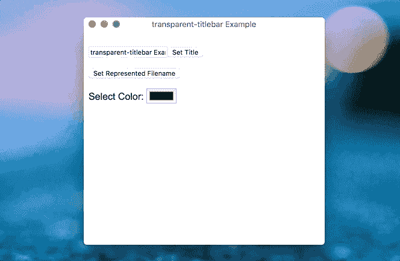

# 透明标题栏:Mac 版电子版中带有原生标题标签的透明标题栏

> 原文：<https://dev.to/seanchas_t/transparent-titlebar-transparent-title-bar-with-native-title-label-in-electron-for-mac-1ej0>

[T2】](https://res.cloudinary.com/practicaldev/image/fetch/s--vaifMnZX--/c_limit%2Cf_auto%2Cfl_progressive%2Cq_66%2Cw_880/https://thepracticaldev.s3.amazonaws.com/i/i6j7s8zedltdvfnmhnht.gif)

GitHub:[https://github.com/seanchas116/transparent-titlebar](https://github.com/seanchas116/transparent-titlebar)

## 在 Mac 中定制电子应用的标题栏

很多很酷的 Mac 应用定制标题栏，经常隐藏原来的标题栏背景。Electron 提供了 [titleBarStyle 选项](https://electronjs.org/docs/api/frameless-window#hidden)来隐藏原始标题栏，但是它也隐藏了标题标签。
如果你想让标题栏透明，同时让原生标题标签可见，你需要另一种方法。

### 为什么需要原生标题标签？

原生标题级别的最大好处是以[为代表的文件](https://electronjs.org/docs/tutorial/desktop-environment-integration#represented-file-of-window-macos)。
很难在 DOM 中完美地重新实现这一点。

## 透明-标题栏

我开发了[透明标题栏](https://www.npmjs.com/package/transparent-titlebar)库，它使用 Cocoa APIs 将标题栏设置为透明，同时保持标题标签可见。
定制`NSWindow`的`titlebarAppearsTransparent`和`styleMask`来显示整个窗口空间的内容。

这是如何使用这个库:

```
let win: BrowserWindow
const transparentTitlebar = require('transparent-titlebar')

// Setup window to use transparent titlebar
transparentTitlebar.setup(win.getNativeWindowHandle())

// Set title color to red (must be called whenever the title has changed)
transparentTitlebar.setColor(win.getNativeWindowHandle(), 1, 0, 0, 1) 
```

Enter fullscreen mode Exit fullscreen mode

安装后，您可能需要运行[电子重建](https://github.com/electron/electron-rebuild)。

## 改变颜色(以杂乱的方式)

很难改变标题的文本颜色，因为 Cocoa 没有提供任何 API 来直接改变它。幸运的是，我找到了从标题栏子视图中找到 NSTextField 并改变其颜色的方法:[http://stackoverflow.com/a/29336473](http://stackoverflow.com/a/29336473)

`setTitleBarColor`函数使用此解决方案。每当标题更改后，都必须调用它。这是一个黑客，你可能要小心使用它。
(这是因为我在一个单独的包中发表了这篇文章，而不是对电子版的拉式请求)