# 用硒和科特林进行 E2E 测试

> 原文:[https://dev . to/chrisvasqm/e2e-用硒和 kotlin-1kia 测试](https://dev.to/chrisvasqm/e2e-testing-with-selenium-and-kotlin-1kia)

# 留心

#### 这将是一篇 looong 帖子。所以，拿杯咖啡/茶，抓紧时间！

# 简介

### 什么是 E2E？

*端到端(E2E)测试*是一种用于测试整个流程的技术，就像我们是一个真实的用户一样，通过模拟他们在浏览器上的行为(点击、按下某些键、在字段中键入内容等)。

### 硒是什么？

Selenium 是一个用于 web 应用程序的自动化框架。

### 什么是科特林？

Kotlin 是一种静态类型的编程语言，由 T2 Jetbrains 公司开发，可用于前端和后端的网络、移动和桌面应用程序。我们将在 JVM 上使用它。

### 什么是爱情？

宝贝不要伤害我...

抱歉，我不得不这么做！

# 要求

## [这里](#ide)

我将使用同样由 Jetbrains 开发的 IntelliJ IDEA。

从他们的[下载页面](https://www.jetbrains.com/idea/download/)，选择社区版(免费)。

[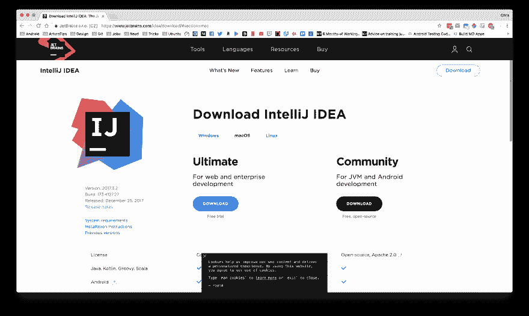T2】](https://res.cloudinary.com/practicaldev/image/fetch/s--29dNWbKJ--/c_limit%2Cf_auto%2Cfl_progressive%2Cq_auto%2Cw_880/https://thepracticaldev.s3.amazonaws.com/i/gxu9ss9m2ahblelf2jye.png)

## 硒

前往 Selenium 的[下载页面](http://www.seleniumhq.org/download/)下载。jar 文件，位于“Selenium 独立服务器”部分。

[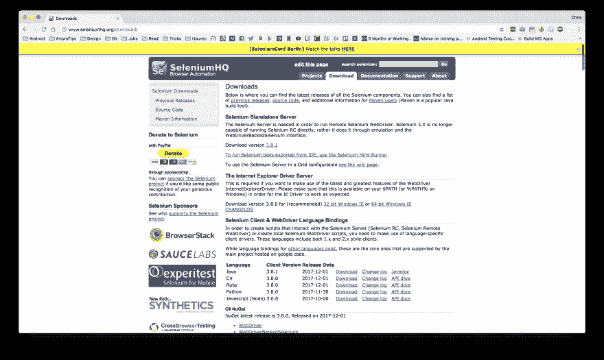T2】](https://res.cloudinary.com/practicaldev/image/fetch/s--o_EzVtTT--/c_limit%2Cf_auto%2Cfl_progressive%2Cq_auto%2Cw_880/https://thepracticaldev.s3.amazonaws.com/i/xlr45xu3aqnp9jn9fowl.png)

[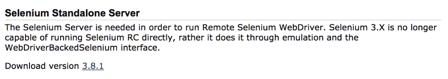T2】](https://res.cloudinary.com/practicaldev/image/fetch/s--FRXbJN1Q--/c_limit%2Cf_auto%2Cfl_progressive%2Cq_auto%2Cw_880/https://thepracticaldev.s3.amazonaws.com/i/6z7bfbnwrub40t5kvxjy.png)

## 节点

这可以通过他们的[网站](https://nodejs.org/en/download/)或者通过你的操作系统的终端/命令行来完成(步骤会因你的操作系统而异)。

之后，为了验证 NodeJS 是否安装成功，在终端/命令行中运行以下命令:

`npm -v`

你应该能看到版本号，我写这篇文章的时候，我的版本是 5.6.0。

## 浏览器驱动程序

在我们的机器上安装了`npm`之后，我们现在可以安装我们需要的浏览器驱动程序了。在这种情况下，我们将使用谷歌浏览器(这里的[文件](https://github.com/SeleniumHQ/selenium/wiki)，如果你想使用一个不同的搜索“驱动程序”在右边的导航栏)。

### Chromedriver

为了安装`chromedriver`，您必须在终端/命令行上运行以下命令:

`npm install chromedriver`

现在，运行以下命令，再次检查安装是否成功完成:

`chromedriver -v`

### 牛逼，但是...

# 代码在哪里，tho？

[T2】](https://res.cloudinary.com/practicaldev/image/fetch/s--O1wEjDSf--/c_limit%2Cf_auto%2Cfl_progressive%2Cq_66%2Cw_880/https://thepracticaldev.s3.amazonaws.com/i/w6d1imumvw5xjw3jiesn.gif)

继续打开 IntelliJ IDEA 并遵循基本的设置步骤。

别急，慢慢来，我可以等。

在“欢迎来到 IntelliJ IDEA”屏幕见我。

[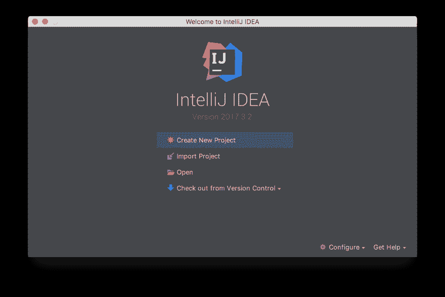T2】](https://res.cloudinary.com/practicaldev/image/fetch/s--qaY65Y8Y--/c_limit%2Cf_auto%2Cfl_progressive%2Cq_auto%2Cw_880/https://thepracticaldev.s3.amazonaws.com/i/1as5xicwwdg4nu4qja1s.png)

选择`Create New Project`，选择`Kotlin > Kotlin/JVM`。

[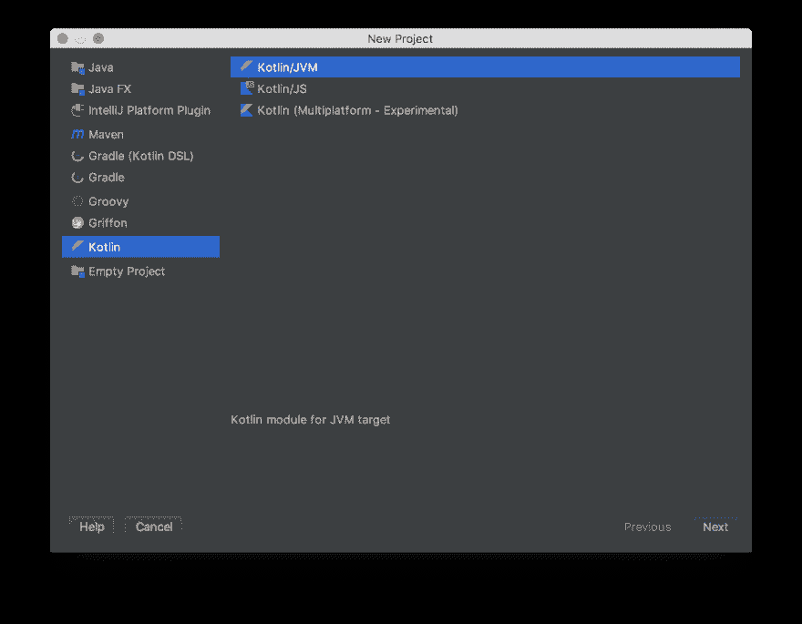T2】](https://res.cloudinary.com/practicaldev/image/fetch/s--h5zDiYq7--/c_limit%2Cf_auto%2Cfl_progressive%2Cq_auto%2Cw_880/https://thepracticaldev.s3.amazonaws.com/i/jxxhpg699gv3ealggrgt.png)

选择一个项目名称，我选了`selenium-kotlin`。

[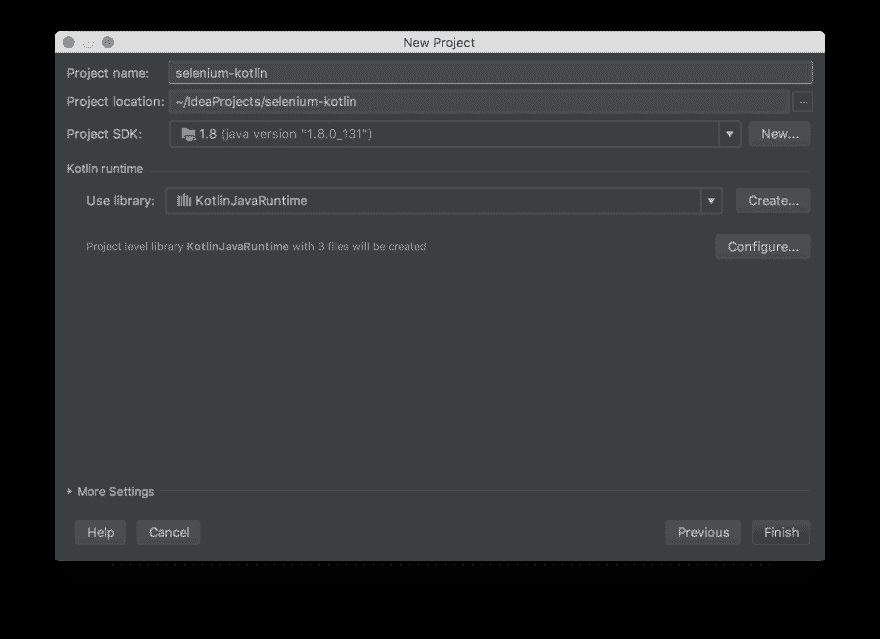T2】](https://res.cloudinary.com/practicaldev/image/fetch/s--ER25_you--/c_limit%2Cf_auto%2Cfl_progressive%2Cq_auto%2Cw_880/https://thepracticaldev.s3.amazonaws.com/i/8gmsfcypt5sww73dozdb.png)

然后，点击`Finish`按钮。

转到左侧窗格(项目浏览器)

[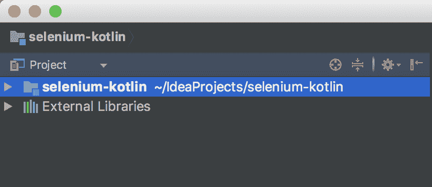T2】](https://res.cloudinary.com/practicaldev/image/fetch/s--IttFRrkK--/c_limit%2Cf_auto%2Cfl_progressive%2Cq_auto%2Cw_880/https://thepracticaldev.s3.amazonaws.com/i/qm5jgd3pha7z9u7h7xl2.png)

## 项目结构

我们将创建几个包来匹配这个结构:

```
selenium-kotlin    
│
└─── .idea
|    |
|    └─── ...
|
└─── src
|    │
|    └─── main
|    |    |
|    |    └─── page
|    |
|    └─── tests
|
└─── selenium-kotlin.iml 
```

<svg width="20px" height="20px" viewBox="0 0 24 24" class="highlight-action crayons-icon highlight-action--fullscreen-on"><title>Enter fullscreen mode</title></svg> <svg width="20px" height="20px" viewBox="0 0 24 24" class="highlight-action crayons-icon highlight-action--fullscreen-off"><title>Exit fullscreen mode</title></svg>

现在，我们需要将`main`文件夹标记为`Sources root`，将`tests`文件夹标记为`Test Sources root`。你可以通过右击软件包并选择`Mark Directory as > ...`来实现

## 添加硒到项目中

进入`File`菜单并选择`Project Structure...`。

[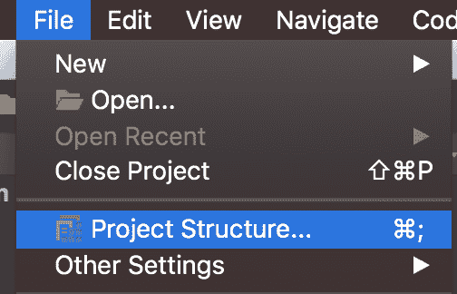T2】](https://res.cloudinary.com/practicaldev/image/fetch/s--DmXDDgok--/c_limit%2Cf_auto%2Cfl_progressive%2Cq_auto%2Cw_880/https://thepracticaldev.s3.amazonaws.com/i/79u29dsa0ldn3sasll9v.png)

选择`Modules`。

[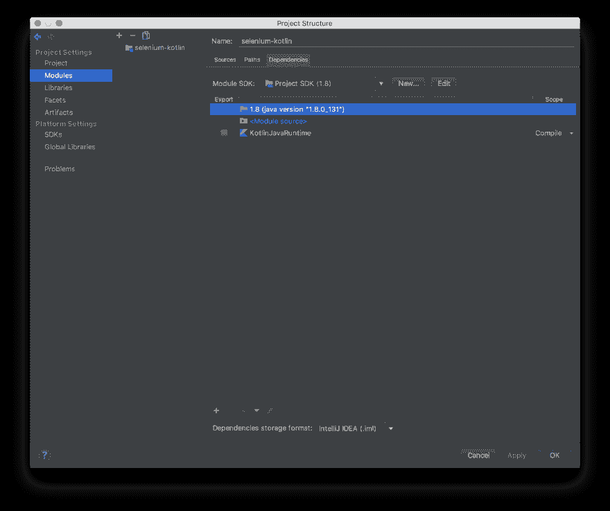T2】](https://res.cloudinary.com/practicaldev/image/fetch/s--vMSaw-K0--/c_limit%2Cf_auto%2Cfl_progressive%2Cq_auto%2Cw_880/https://thepracticaldev.s3.amazonaws.com/i/2du3sji37shc5nvtxmc5.png)

将 selenium jar 添加到项目中。

[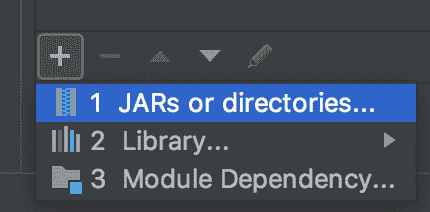T2】](https://res.cloudinary.com/practicaldev/image/fetch/s--w5LBQ90y--/c_limit%2Cf_auto%2Cfl_progressive%2Cq_auto%2Cw_880/https://thepracticaldev.s3.amazonaws.com/i/1g1y373qkmm12c8i1upd.png)

寻找。我们之前下载的 jar 文件。它可能在您的`./Downloads`文件夹中，除非您将它保存在其他地方。

点击`Project Structure`窗口右下角的`OK`按钮，你现在应该可以在`Project Explorer`的`External Libraries`下看到 selenium。

## 创建您的第一个页面对象模型

我们终于可以*开始编码了！*

> 页面对象模型是一种设计模式，它帮助我们组织所有的`WebElement`基于它们属于哪个“页面”。这有助于我们减少代码库不同部分的代码重复。

前往你的`src/main/kotlin/page`文件夹。在这个包中，我们将创建代表 web 应用程序中给定页面的类。

[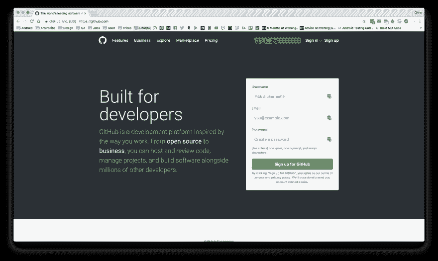T2】](https://res.cloudinary.com/practicaldev/image/fetch/s--Hzuu0_Dh--/c_limit%2Cf_auto%2Cfl_progressive%2Cq_auto%2Cw_880/https://thepracticaldev.s3.amazonaws.com/i/pdae8wuz85mm64rif5jl.png)

就像上面那个由`GitHubHomePage.kt`表示的。所以，去做吧。右击`page`文件夹，选择`New > Kotlin File/Class`。

您的文件将(几乎)为空:

```
package page 
```

<svg width="20px" height="20px" viewBox="0 0 24 24" class="highlight-action crayons-icon highlight-action--fullscreen-on"><title>Enter fullscreen mode</title></svg> <svg width="20px" height="20px" viewBox="0 0 24 24" class="highlight-action crayons-icon highlight-action--fullscreen-off"><title>Exit fullscreen mode</title></svg>

继续添加类定义:

```
class GitHubHomePage {

} 
```

<svg width="20px" height="20px" viewBox="0 0 24 24" class="highlight-action crayons-icon highlight-action--fullscreen-on"><title>Enter fullscreen mode</title></svg> <svg width="20px" height="20px" viewBox="0 0 24 24" class="highlight-action crayons-icon highlight-action--fullscreen-off"><title>Exit fullscreen mode</title></svg>

我们需要对页面做的第一件事是添加一个`open()`方法。因为我们想在测试期间用一个直接的 URL 访问它。

```
class GitHubHomePage {

    fun open() {
        // Go to GitHub's home page
    }

} 
```

<svg width="20px" height="20px" viewBox="0 0 24 24" class="highlight-action crayons-icon highlight-action--fullscreen-on"><title>Enter fullscreen mode</title></svg> <svg width="20px" height="20px" viewBox="0 0 24 24" class="highlight-action crayons-icon highlight-action--fullscreen-off"><title>Exit fullscreen mode</title></svg>

为了做到这一点，我们将需要一个`WebDriver`对象，这是 Selenium 提供的一个类，它代表我们的浏览器(Chrome、Firefox、Safari、Internet Explorer 等)以及它控制浏览器的所有方法。

我们需要在我们的`GitHubHomePage`的构造函数中传递它，然后通过调用被称为`get()`的`WebDriver`的方法在我们的`open()`方法中使用它。

```
class GitHubHomePage(private val driver: WebDriver) {

    fun open() {
        driver.get("https://github.com/")
    }

} 
```

<svg width="20px" height="20px" viewBox="0 0 24 24" class="highlight-action crayons-icon highlight-action--fullscreen-on"><title>Enter fullscreen mode</title></svg> <svg width="20px" height="20px" viewBox="0 0 24 24" class="highlight-action crayons-icon highlight-action--fullscreen-off"><title>Exit fullscreen mode</title></svg>

如您所见，`get()`方法接收一个`String`值，该值将成为 GitHub 的主页。

> 注意:`get()`方法实际调用的是`navigate().to()`，但是`get()`更短:)

现在我们可以运行我们的第一个测试，打开一个浏览器，然后访问 GitHub 的网站。

## 创建您的第一个测试

将您的`cursor`放在`GitHubHomePage`类名之上，通过按`SHIFT + CTRL + A`(Windows)或`SHIFT + CMD + A`(MAC OS)使用`Find Actions`菜单。

会出现一个搜索栏对话框，输入`Create test`，然后点击`ENTER`。

一个新的对话框将会出现。从下拉列表中选择`TestNG`作为您的`Testing Library`，会出现一条警告信息“模块中未找到 TestNG 库”。别担心，只要按下它旁边的`Fix`按钮。

将出现另一个窗口，确保“使用 IntelliJ IDEA 发行版的‘TestNG’”单选按钮处于活动状态，点击`OK`，然后选中两个复选框:`setUp/@Before`和`tearDown/@After`。

它应该是这样的:

[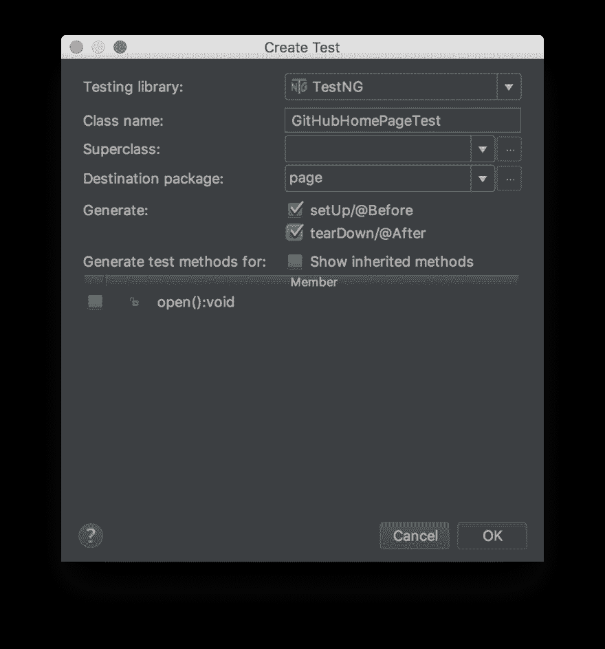T2】](https://res.cloudinary.com/practicaldev/image/fetch/s--W-nhMg6T--/c_limit%2Cf_auto%2Cfl_progressive%2Cq_auto%2Cw_880/https://thepracticaldev.s3.amazonaws.com/i/vpkedxpqcrfzcuz1bosm.png)

然后，再次点击`OK`。

这将使用`setUp()`和`tearDown()`方法在`src/tests/kotlin/page`目录中为您创建测试类。

`setUp()`方法将总是在每次测试之前运行*，而`tearDown()`将总是在每次测试*之后运行*。*

我们将使用它们来*设置*我们的浏览器，这次我们将使用 Chrome，并且我们将确保在测试完成后总是关闭所有的浏览器。

回到代码！

## 打开浏览器

在`setUp()`方法中，让我们创建一个`ChomeDriver`类的实例。

```
class GitHubHomePageTest {
    private lateinit var driver: WebDriver

    @BeforeMethod
    fun setUp() {
        driver = ChromeDriver()
    }

    @AfterMethod
    fun tearDown() {
        // Close all browsers
    }
} 
```

<svg width="20px" height="20px" viewBox="0 0 24 24" class="highlight-action crayons-icon highlight-action--fullscreen-on"><title>Enter fullscreen mode</title></svg> <svg width="20px" height="20px" viewBox="0 0 24 24" class="highlight-action crayons-icon highlight-action--fullscreen-off"><title>Exit fullscreen mode</title></svg>

## 转到 GitHub 的主页

现在让我们创建一个`GitHubHomePage`类的实例，并将其命名为`open()`方法。

```
class GitHubHomePageTest {
    private lateinit var driver: WebDriver
    private lateinit var gitHubHomePage: GitHubHomePage

    @BeforeMethod
    fun setUp() {
        driver = ChromeDriver()
        gitHubHomePage = GitHubHomePage(driver)
        gitHubHomePage.open()
    }

    @AfterMethod
    fun tearDown() {
        // Close all browsers
    }
} 
```

<svg width="20px" height="20px" viewBox="0 0 24 24" class="highlight-action crayons-icon highlight-action--fullscreen-on"><title>Enter fullscreen mode</title></svg> <svg width="20px" height="20px" viewBox="0 0 24 24" class="highlight-action crayons-icon highlight-action--fullscreen-off"><title>Exit fullscreen mode</title></svg>

## 完成后，关闭浏览器

转到`tearDown()`方法，从`driver`实例中调用 de `quit()`方法。

```
class GitHubHomePageTest {
    private lateinit var driver: WebDriver
    private lateinit var gitHubHomePage: GitHubHomePage

    @BeforeMethod
    fun setUp() {
        driver = ChromeDriver()
        gitHubHomePage = GitHubHomePage(driver)
        gitHubHomePage.open()
    }

    @AfterMethod
    fun tearDown() {
        driver.quit()
    }
} 
```

<svg width="20px" height="20px" viewBox="0 0 24 24" class="highlight-action crayons-icon highlight-action--fullscreen-on"><title>Enter fullscreen mode</title></svg> <svg width="20px" height="20px" viewBox="0 0 24 24" class="highlight-action crayons-icon highlight-action--fullscreen-off"><title>Exit fullscreen mode</title></svg>

快到了！

我们来添加一个测试功能，还记得怎么用`Generate`菜单吗？

`SHIFT + CTRL + A` / `SHIFT + CMD + A`。

输入`Generate`并点击`ENTER`。

选择`Test Function`。

给它起一个类似于`emptyTest`的名字，并暂时放置一个占位符注释。我们只是想看看能否打开浏览器，进入主页。

运行我们的`emptyTest`最简单的方法是点击编辑器窗格左侧的绿色播放按钮。就在 21 号线旁边。

[T2】](https://res.cloudinary.com/practicaldev/image/fetch/s--jgIAtMFb--/c_limit%2Cf_auto%2Cfl_progressive%2Cq_auto%2Cw_880/https://thepracticaldev.s3.amazonaws.com/i/tz7uejorvae0wjuxpkmr.png)

[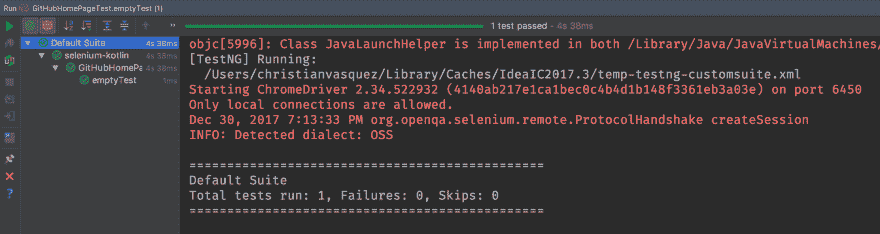T2】](https://res.cloudinary.com/practicaldev/image/fetch/s--JFSN-3In--/c_limit%2Cf_auto%2Cfl_progressive%2Cq_auto%2Cw_880/https://thepracticaldev.s3.amazonaws.com/i/ankn0lqv1or4u1osx8gm.png)

[T2】](https://i.giphy.com/media/xTiQyAVsNw6mOab8hW/giphy.gif)

# 我们来做一个真实的测试

测试一下我们是否能找到一个 GitHub 用户名并访问他们的个人资料怎么样？

听起来很简单，对吗？

## 重构`emptyTest`

我们需要做的第一件事是重命名我们的`emptyTest`方法。

怎么样...`searchForUsername`？很好。

现在，搜索栏在哪里？就在主页上。

因此，让我们添加一个方法，它将接受一个`String`，将其键入`searchBox`并提交。它应该是这样的:

```
fun searchFor(query: String) {
    val searchBox = driver.findElement(By.xpath("//input[@placeholder='Search GitHub']"))
    searchBox.sendKeys(query, Keys.ENTER)
} 
```

<svg width="20px" height="20px" viewBox="0 0 24 24" class="highlight-action crayons-icon highlight-action--fullscreen-on"><title>Enter fullscreen mode</title></svg> <svg width="20px" height="20px" viewBox="0 0 24 24" class="highlight-action crayons-icon highlight-action--fullscreen-off"><title>Exit fullscreen mode</title></svg>

等等，等等，等等...

#### 这一切的`findElement()`、`By`、`xpath`、`sendKeys()`、`Keys`从何而来！？

好吧，让我解释一下:

`findElement()`是来自`driver`的一个方法，它将一个`By.<something>`作为参数。如果成功，则返回一个`WebElement`；否则，它会`throw`一个`NoSuchElementException`。

`By.xpath()`接受一个`String`参数，这将帮助我们在页面上定位一个元素，在这种情况下，我们将得到任何具有与“Search GitHub”完全匹配的`placeholder`属性的`<input>`。其他例子还有`By.id`、`By.cssSelector`、`By.className`等。

`sendKeys()`是来自 Selenium 提供的`WebElement`类的一个方法，它接受一个类型为`CharSequence`的参数，这意味着我们可以传入一个`char`、`String`或来自`Keys`枚举类的任何值，比如`Keys.ENTER`，它不会键入单词“ENTER”，而是模拟我们按下键盘上的`ENTER`键，从而在我们的示例中提交查询。

### 爽吧？但是我们还没有完成

现在我们要过滤搜索结果，只看到用户名，然后点击我们要找的用户名。

由于这个页面的元素只是“搜索”流程的一部分，我们将创建另一个页面类，并将其命名为`GitHubSearchPage`(记得在`src/main/kotlin/page`包中创建)。

```
class GitHubSearchPage(private val driver: WebDriver) {

} 
```

<svg width="20px" height="20px" viewBox="0 0 24 24" class="highlight-action crayons-icon highlight-action--fullscreen-on"><title>Enter fullscreen mode</title></svg> <svg width="20px" height="20px" viewBox="0 0 24 24" class="highlight-action crayons-icon highlight-action--fullscreen-off"><title>Exit fullscreen mode</title></svg>

为用户过滤器添加`WebElement`和将`click()`它的`filterByUsers()`方法。

```
fun filterByUsers() {
    val usersFilter = driver.findElement(By.xpath("//a[text() = 'Users']"))
    usersFilter.click()
} 
```

<svg width="20px" height="20px" viewBox="0 0 24 24" class="highlight-action crayons-icon highlight-action--fullscreen-on"><title>Enter fullscreen mode</title></svg> <svg width="20px" height="20px" viewBox="0 0 24 24" class="highlight-action crayons-icon highlight-action--fullscreen-off"><title>Exit fullscreen mode</title></svg>

为用户资料链接添加另一个`WebElement`和一个将`click()`它的`enterUserProfile()`方法。

```
fun enterUserProfile() {
    val userProfileLink = driver.findElement(By.xpath("//span[text() = 'Christian Vasquez']/../a/em"))
    userProfileLink.click()
} 
```

<svg width="20px" height="20px" viewBox="0 0 24 24" class="highlight-action crayons-icon highlight-action--fullscreen-on"><title>Enter fullscreen mode</title></svg> <svg width="20px" height="20px" viewBox="0 0 24 24" class="highlight-action crayons-icon highlight-action--fullscreen-off"><title>Exit fullscreen mode</title></svg>

我还将添加一个`open()`方法，这样我们就可以直接进入搜索页面，以备以后需要。

整个类应该是这样的:

```
class GitHubSearchPage(private val driver: WebDriver) {

    fun open() {
        driver.get("https://github.com/search?")
    }

    fun filterByUsers() {
        val usersFilter = driver.findElement(By.xpath("//a[text() = 'Users']"))
        usersFilter.click()
    }

    fun enterUserProfile() {
        val userProfileLink = driver.findElement(By.xpath("//span[text() = 'Christian Vasquez']/../a/em"))
        userProfileLink.click()
    }

} 
```

<svg width="20px" height="20px" viewBox="0 0 24 24" class="highlight-action crayons-icon highlight-action--fullscreen-on"><title>Enter fullscreen mode</title></svg> <svg width="20px" height="20px" viewBox="0 0 24 24" class="highlight-action crayons-icon highlight-action--fullscreen-off"><title>Exit fullscreen mode</title></svg>

让我们开始在我们的`searchForUsername()`测试函数中使用新的`GitHubSearchPage`。

```
@Test
fun searchForUsername() {
    gitHubHomePage.searchFor("chrisvasqm")
    gitHUbSearchPage = GitHubSearchPage(driver)
    gitHUbSearchPage.filterByUsers()
    gitHUbSearchPage.enterUserProfile()
} 
```

<svg width="20px" height="20px" viewBox="0 0 24 24" class="highlight-action crayons-icon highlight-action--fullscreen-on"><title>Enter fullscreen mode</title></svg> <svg width="20px" height="20px" viewBox="0 0 24 24" class="highlight-action crayons-icon highlight-action--fullscreen-off"><title>Exit fullscreen mode</title></svg>

现在让我们通过在我们的`searchForUsername()`方法中添加下面一行来检查我们是否被正确地重定向到了“[www.github.com/chrisvasqm](http://www.github.com/chrisvasqm)URL:

```
assertTrue(driver.currentUrl == "https://github.com/chrisvasqm") 
```

<svg width="20px" height="20px" viewBox="0 0 24 24" class="highlight-action crayons-icon highlight-action--fullscreen-on"><title>Enter fullscreen mode</title></svg> <svg width="20px" height="20px" viewBox="0 0 24 24" class="highlight-action crayons-icon highlight-action--fullscreen-off"><title>Exit fullscreen mode</title></svg>

整个测试函数现在应该是这样的:

```
@Test
fun searForUsername() {
    gitHubHomePage.searchFor("chrisvasqm")
    gitHUbSearchPage = GitHubSearchPage(driver)
    gitHUbSearchPage.filterByUsers()
    gitHUbSearchPage.enterUserProfile()

    assertTrue(driver.currentUrl == "https://github.com/chrisvasqm")
} 
```

<svg width="20px" height="20px" viewBox="0 0 24 24" class="highlight-action crayons-icon highlight-action--fullscreen-on"><title>Enter fullscreen mode</title></svg> <svg width="20px" height="20px" viewBox="0 0 24 24" class="highlight-action crayons-icon highlight-action--fullscreen-off"><title>Exit fullscreen mode</title></svg>

现在让我们试着运行我们的测试...

[T2】](https://i.giphy.com/media/dpnfPvaCIHBrW/giphy.gif)

我们得到了一个`NoSuchElementException`，但担心你一定没有。

发生的情况是，在我们单击`usersFilter`元素后，我们的`userProfileLink` WebElement 不会立即出现。

为了解决这个问题，我们可以使用 Selenium 提供的两个类:`PageFactory`和`AjaxElementLocatorFactory`。

我们的方法是使用 Kotlin 拥有的`init {...}`块(它类似于一个构造函数，但只用于初始化)。

```
init {
    PageFactory.initElements(AjaxElementLocatorFactory(driver, 15), this)
} 
```

<svg width="20px" height="20px" viewBox="0 0 24 24" class="highlight-action crayons-icon highlight-action--fullscreen-on"><title>Enter fullscreen mode</title></svg> <svg width="20px" height="20px" viewBox="0 0 24 24" class="highlight-action crayons-icon highlight-action--fullscreen-off"><title>Exit fullscreen mode</title></svg>

这行代码确保初始化我们的属性，以便在抛出`NoSuchElementException`之前最多等待 15 秒。

## 哪些属性？

好问题！

记得我们在做这个吗？

```
val element = driver.findElement(By.xpath("VALUE")) 
```

<svg width="20px" height="20px" viewBox="0 0 24 24" class="highlight-action crayons-icon highlight-action--fullscreen-on"><title>Enter fullscreen mode</title></svg> <svg width="20px" height="20px" viewBox="0 0 24 24" class="highlight-action crayons-icon highlight-action--fullscreen-off"><title>Exit fullscreen mode</title></svg>

我们将替换为:

```
@FindBy(xpath = "VALUE")
private lateinit var element: WebElement 
```

<svg width="20px" height="20px" viewBox="0 0 24 24" class="highlight-action crayons-icon highlight-action--fullscreen-on"><title>Enter fullscreen mode</title></svg> <svg width="20px" height="20px" viewBox="0 0 24 24" class="highlight-action crayons-icon highlight-action--fullscreen-off"><title>Exit fullscreen mode</title></svg>

每当我们将`PageFactory` + `AjaxElementLocatorFactory`组合与`@FindBy`注释一起使用时，我们将获得我之前提到的 15 秒超时的好处。

让我们重构我们的`GitHubSearchPage`类，然后再重构

```
class GitHubSearchPage(private val driver: WebDriver) {

    @FindBy(xpath = "\"//a[text() = 'Users']\"")
    private lateinit var usersFilter: WebElement

    @FindBy(xpath = "//span[text() = 'Christian Vasquez']/../a/em")
    private lateinit var userProfileLink: WebElement

    init {
        PageFactory.initElements(AjaxElementLocatorFactory(driver, 15), this)
    }

    fun open() {
        driver.get("https://github.com/search?")
    }

    fun filterByUsers() {
        usersFilter.click()
    }

    fun enterUserProfile() {
        userProfileLink.click()
    }

} 
```

<svg width="20px" height="20px" viewBox="0 0 24 24" class="highlight-action crayons-icon highlight-action--fullscreen-on"><title>Enter fullscreen mode</title></svg> <svg width="20px" height="20px" viewBox="0 0 24 24" class="highlight-action crayons-icon highlight-action--fullscreen-off"><title>Exit fullscreen mode</title></svg>

重新运行测试🤞

[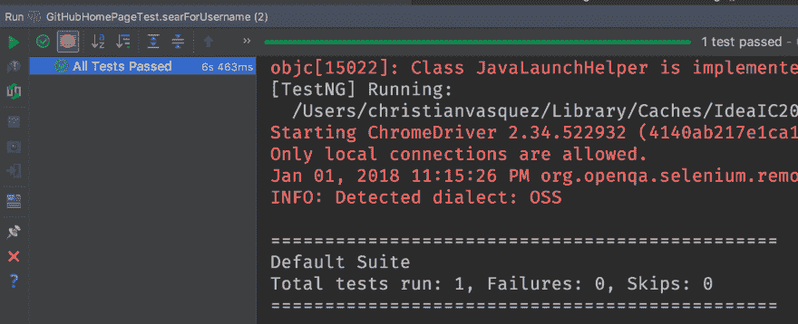T2】](https://res.cloudinary.com/practicaldev/image/fetch/s--t_3qKIm4--/c_limit%2Cf_auto%2Cfl_progressive%2Cq_auto%2Cw_880/https://thepracticaldev.s3.amazonaws.com/i/ehkvr2gm37vem5llrum8.png)

我们终于成功了！

[T2】](https://res.cloudinary.com/practicaldev/image/fetch/s--fvTGAbFg--/c_limit%2Cf_auto%2Cfl_progressive%2Cq_auto%2Cw_880/https://thepracticaldev.s3.amazonaws.com/i/fnt1ijqcv1wm9t2wno5z.jpg)

如果你还不知道 Selenium，我希望这篇文章教会你一些新的东西。

我知道我没有深究为什么我做了 Kotlin 本身的一些事情，但这可能是将来另一篇文章的主题；)

不知道，也许这会促使你自己去尝试其他的东西！

# 了解更多

这里有另一个链接，你可能会发现对[了解更多](https://github.com/SeleniumHQ/selenium/wiki/Getting-Started)关于*硒*有用。

如果你想了解另一种选择，这里有一个关于如何使用 JavaScript 和 VS 代码编辑器用 TestCafe 进行 [E2E 测试的指南。](https://dev.to/chrisvasqm/e2e-testing-with-testcafe-17jl)