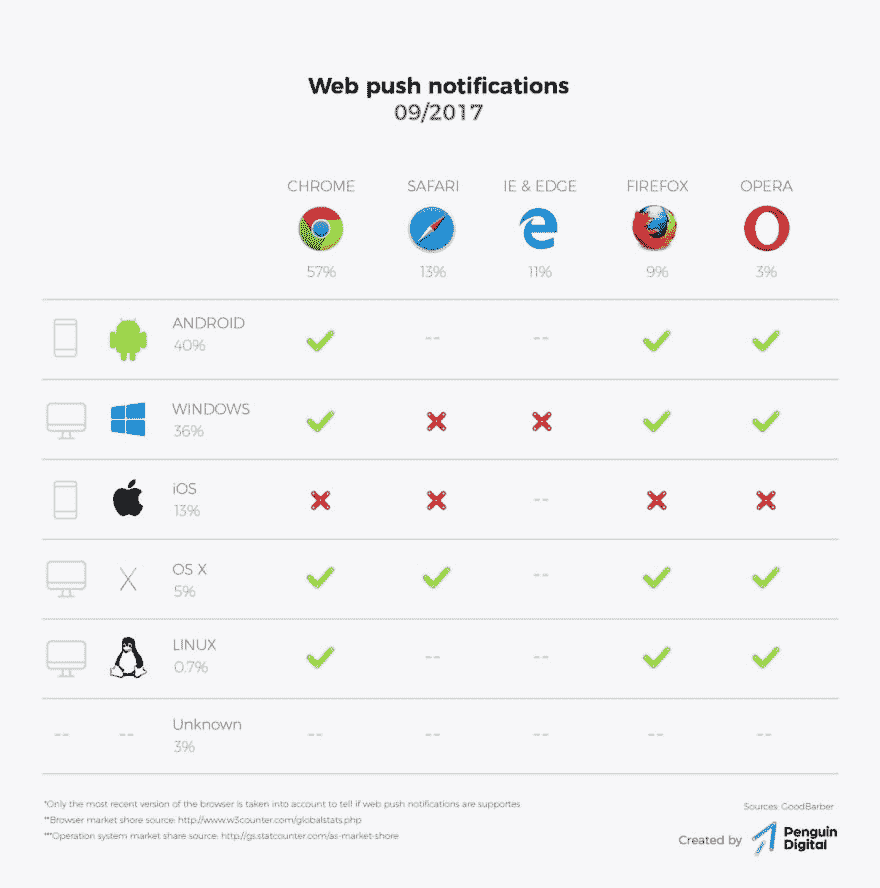

# 渐进式网络应用(第二部分)

> 原文：<https://dev.to/pa1nd/progressive-web-apps-part-2-56a3>

这是第二篇解释 PWAs 的文章。第一部分在这里。

## 技术

为了理解 pwa 有多神奇，为了展望它们的发展前景，我们必须了解这项技术来自哪里，为什么我们以前没有这项技术。

PWAs 的基础是一种叫做“appmanifest”的技术。它是由万维网的主要国际标准组织“万维网联盟”(W3C)开发的。[技术标准草案](https://www.w3.org/TR/appmanifest/)的最后一个版本是几天前的，这说明了它当前的积极发展。

新功能可用的速度由两个实体决定:W3C(如上所示)和浏览器开发公司(Mozilla: Firefox，Google: Chrome，Apple: Safari 和 iOS，Netscape:只是开玩笑……)。

谷歌一直在推进 PWAs，而苹果最初对此非常怀疑。目前，Android 和 Chrome 以及 Firefox 对 PWAs 的支持已经非常好了。好消息:苹果也开始实施这个标准，所以这些功能开始在 iOS 上运行只是时间问题。因此，现在每个主流浏览器都支持或将支持 PWAs。下图显示了截至 2017 年 9 月对推送通知的支持。

<figure> 

<figcaption>截至 2017 年 9 月对网页推送通知的支持</figcaption>

</figure>

## 支持重要功能

每个客户都希望使用的两个重要功能是:

1.  **在主屏幕上安装 web 应用程序。**如今，这已经在所有主要设备上运行。安装 web 应用程序后，它会全屏打开(没有地址栏)，并直接提供类似应用程序的感觉。
2.  **发送推送通知。**这在所有主要设备(包括台式机)上都是可能的，但目前在 iOS 上还没有。到目前为止，我们还不知道它将于何时在 iOS 上发布。

## 有哪些功能可用

渐进式网络应用包括一系列惊人的功能。这里你有一个关于 Chrome 下已经可用的特性的概述。

<figure>

<figcaption>Chrome</figcaption>

</figure>

支持跨平台渐进式网络应用

* * *

在 Penguin，我们很高兴看到瑞士对 PWAs 的兴趣正在快速增长。如果您想了解更多关于这一令人敬畏的技术，请随时联系我们！