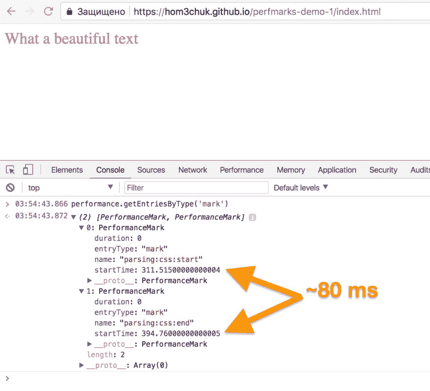
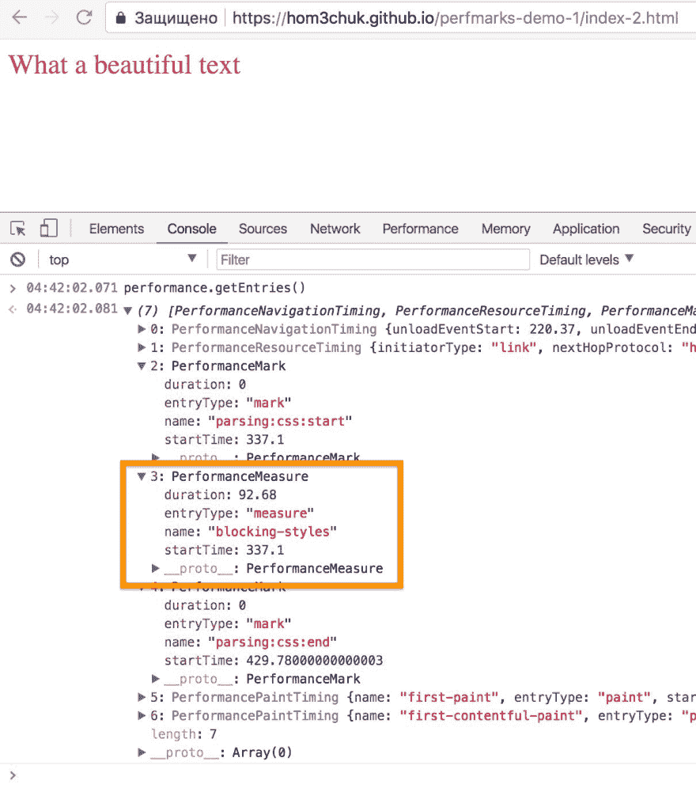

# 绩效标志:缺失的手册，第一部分

> 原文：<https://dev.to/hom3chuk/performance-marks-the-missing-manual-part-1-b6>

图像为[维多利亚语](https://www.shutterstock.com/g/viktoriiaa)

[`performance.mark()`](https://developer.mozilla.org/en-US/docs/Web/API/Performance/mark) 是[用户定时 API](https://developer.mozilla.org/en-US/docs/Web/API/User_Timing_API) 的一部分。可以说，这是目前浏览器中最有用的与性能相关的方法，因为它的应用可能性远远不止“为我标记这个时间戳”，尤其是结合对浏览器实际工作方式的深入理解。

## 基本用法

要使用它，只需调用`performance.mark()`并在任何 JavaScript 代码中将 mark name 作为参数传递:

```
performance.mark("fontsLoaded"); 
```

这将为[绩效时间线](https://www.w3.org/TR/performance-timeline/#performance-timeline)添加一个[绩效标记](https://developer.mozilla.org/en-US/docs/Web/API/PerformanceMark)。
要删除一个标记，调用`performance.clearMarks()`方法:

```
performance.clearMarks("fontsLoaded"); 
```

直接内联到 HTML 中的 JS 一行程序也可以:

```
<p>What a beautiful text</p>
<script>
  performance.mark("afterText");
</script> 
```

我知道你在想什么:“嘿，JS 基本上是单线程的，我能标记浏览器到达文档中的*确切行*的时刻吗？”。在很大程度上，是的，你可以。让我们试试这个！

## 标注所有的事物

首先，一点理论🤓。[大多数时候](https://developer.mozilla.org/en-US/docs/Web/API/Web_Workers_API/Using_web_workers)，文档解析和 JS 执行是在一个线程中完成的，从第一行到最后一行的文档结构都是如此。当浏览器遇到样式表或脚本的`<link>`时，它暂停执行，下载偶然发现的资源，解析并执行它，然后才继续解析和执行下面的内容。这个概念——渲染阻塞资源——对于实现快速渲染时间至关重要，伊利亚·格里戈利克在他的演讲和[免费在线课程](https://developers.google.com/web/fundamentals/performance/critical-rendering-path/)中精彩地讲述了这个概念。

现在，撇开优化不谈，你可能想知道*由于渲染被资源*阻塞，你损失了多少时间。看一下这个片段:

```
<html>
  <head>
  Performance marks demo #1
  <script>performance.mark('parsing:css:start');</script>
  <link rel="stylesheet" href="shiny-style.css">
  <script>performance.mark('parsing:css:end');</script>
  </head>
  <body>
    <p>What a beautiful text</p>
  </body>
</html> 
```

在浏览器中打开它将标记两个事件:一个在样式表链接之前，一个在样式表链接之后。瞧瞧:
[](https://res.cloudinary.com/practicaldev/image/fetch/s--7b7lKvEo--/c_limit%2Cf_auto%2Cfl_progressive%2Cq_auto%2Cw_880/https://thepracticaldev.s3.amazonaws.com/i/li3j6ec1vlgvav8ug6cc.jpg) 
哇哦😱！浏览器花了将近 80 毫秒来下载、解析和应用我们闪亮的样式表，比一眨眼的时间还要快。不过，对于我们现有的一个 CSS 选择器来说，速度还不够快。

好的一面是，您现在知道如何测量渲染被资源阻塞了多长时间。等等，我说`measure`了吗？

### 措施

我们都 [❤️数学](https://xkcd.com/55/)，不是吗？但是当涉及到实际计算时，我们喜欢让计算机来做。表现分数也不例外，我们有简便的 [`performance.measure()`](https://developer.mozilla.org/en-US/docs/Web/API/Performance/measure) 方法，嗯，*测量两个分数之间的*距离。让我们将它添加到我们的 HTML 片段中:

```
<html>
  <head>
  Performance marks demo #2: measures
  <script>performance.mark('parsing:css:start');</script>
  <link rel="stylesheet" href="shiny-style.css">
  <script>
    performance.mark('parsing:css:end');
    performance.measure('blocking-styles', 'parsing:css:start', 'parsing:css:end');
  </script>
  </head>
  <body>
    <p>What a beautiful text</p>
  </body>
</html> 
```

现在让我们来看看[浏览器](https://hom3chuk.github.io/perfmarks-demo-1/index-2.html) :
[](https://res.cloudinary.com/practicaldev/image/fetch/s--YnnxkKNv--/c_limit%2Cf_auto%2Cfl_progressive%2Cq_auto%2Cw_880/https://thepracticaldev.s3.amazonaws.com/i/nu4gjhrhbfq5k3gg4iz1.jpg) 
如何测量这个东西。酷，我们现在可以只看`measure`的`duration`而不是做数学。耶电脑！

## 马克-傅

我本人以及其他一些开发人员在设置标记时更喜欢使用某种命名空间来跨不同的标记和事件类型组织分类法:

```
performance.mark("fonts:roboto:load");
performance.mark("parsing.head.start"); 
```

也就是说，您只需用冒号或点分隔名称空间，您的标记就会得到良好的结构。当然你可以用任何东西([🐰，有人吗？](https://hom3chuk.github.io/perfmarks-demo-1/index-3.html))来分隔名称空间，而不仅仅是点和冒号。绩效标志命名空间没有固定的标准，您可以使用任何您想使用的分隔符，就像 CSV 格式一样。

## 找回你的分数

### 发育期

使用浏览器获得性能分数很容易:

1.  转到浏览器的开发工具
2.  切换到 JavaScript 控制台选项卡
3.  写下来，它们在这里！

### 来自真实用户

现在，最困难的部分是从你的真实用户那里取回这些标记，我们在塔基非常关心标记。我们目前正在开发标记' n '措施仪表板，虽然标记已经在我们的瀑布视图中可见。

[Webpagetest](https://www.webpagetest.org) ，以及总部位于 WPT 的[mach metrics](https://www.machmetrics.com/)&[speed curve](https://speedcurve.com)，都在一定程度上支持绩效评分，使用这些工具你可以对绩效时间表中的评分一目了然。如果你还没有听说过 WPT，那就去看看吧:它是最好的#webperf 工具之一，完全免费，但有很多功能。我每天都使用它，并且非常喜欢它。

## 谁用它？

据我所知，在 wild 中有几个性能标记的例子:Google Maps 和 Optimizely。他们在他们的客户端 JS 中设置了标记，所以如果你嵌入了 GMaps，或者做了一些优化实验，用你的 devtools 在那些页面上检查性能条目！

## 接下来呢？

在接下来的文章中，我将展示更多的高级标记符，并告诉你不同浏览器在标记处理上的差异(你甚至不认为我们开发的所有浏览器都是一样的，是吗？😉).

如果你知道除了谷歌地图和 Optimizely 之外的一些其他野外标记的例子，请在下面的评论中分享它们。当然，我鼓励你分享你使用 marks 的经验，我很乐意看看其他开发者使用 marks 的方法。

记住，#perfmatters！