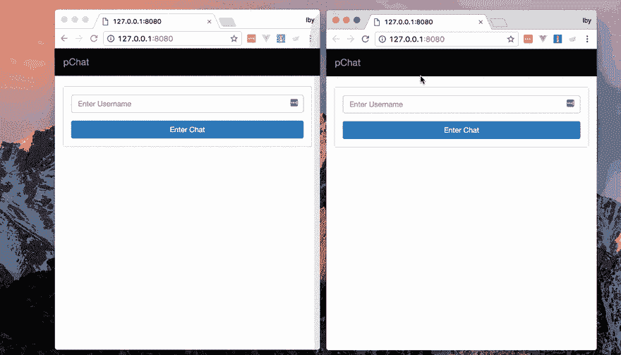
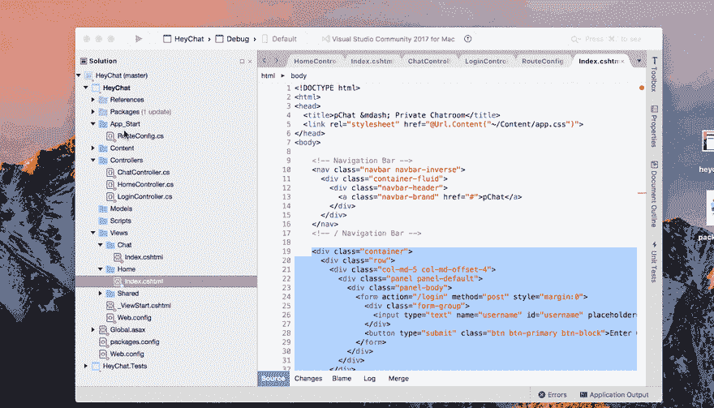

# 如何在中构建键入指示器功能。网

> 原文:[https://dev . to/neo/how-to-build-a-typing-indicator-feature-in-net-10e 1](https://dev.to/neo/how-to-build-a-typing-indicator-feature-in-net-10e1)

在构建聊天应用程序时，知道与你聊天的人何时在输入消息可以改善用户体验。它给了你一些反馈，告诉你在对话中你不是一个人，一个信息正在向你走来。在本教程中，我们将通过一些简单的步骤来使用 C#实现这一功能。网和推动器。

在本教程结束时，我们将会看到这样的内容:

[T2】](https://res.cloudinary.com/practicaldev/image/fetch/s--bgIvXkqK--/c_limit%2Cf_auto%2Cfl_progressive%2Cq_66%2Cw_880/https://thepracticaldev.s3.amazonaws.com/i/29p3wlp2mut86pp7h3gs.gif)

本教程假设您事先了解:

*   C#
*   。净 MVC 和
*   JavaScript (jQuery)

你准备好了，我们就开始吧。

## 设置我们的项目

我们将使用 [Visual Studio](https://www.visualstudio.com/) ，这是一个广泛用于构建的 IDE。NET 项目。Visual Studio 2017 是免费的，可用于普遍使用的操作系统。你可以在这里查看[的安装细节。](https://www.visualstudio.com/)

安装 Visual Studio 后，启动它并通过在仪表板上单击**新建项目**来创建一个新项目。跟随**新项目**向导我们:

*   将 C#设为我们要使用的语言，
*   选择。NET MVC 项目为模板，
*   填写项目名称，例如 HeyChat(任何名称都可以)，
*   填写解决方案名称，即应用程序名称(HeyChat 或任何名称均可)。

> **提示:**出于本教程的目的，我们将假设该聊天对所有用户开放，所需要的只是我们的用户在第一次登录时指定他们的姓名。

### 路线定义

我们可以定义制作该特征所需的一些路线，它们是:

*   一个 home route，它呈现带有用户名的第一个页面。
*   接受用户名的`POST`请求的登录路径。
*   呈现聊天视图的聊天路线。

> 提示:我们可能需要一些其他的路线，但这对初学者来说已经足够了。

为了添加这些路由，我们打开应用程序的`App_Start`目录中的`RouteConfig.cs`文件。在其中，我们添加了我们定义的路线。

```
 routes.MapRoute(
        name: "Home",
        url: "",
        defaults: new { controller = "Home", action = "Index" }
    );

    routes.MapRoute(
        name: "Login",
        url: "login",
        defaults: new { controller = "Login", action = "Index" }
    );

    routes.MapRoute(
        name: "ChatRoom",
        url: "chat",
        defaults: new {controller = "Chat", action="Index"}
    ); 
```

使用**家**路由作为示例，路由定义声明`/`请求将由在`Controllers/HomeController.cs`文件中找到的`HomeController`和该控制器的`Index`方法来处理。接下来，我们创建我们需要的控制器。

### 创建控制器和动作方法

要创建一个新的控制器，右击**控制器**目录并选择`Add → Controller`。在生成的表单中，我们键入控制器的名称并选择空模板。

> **提示:**当我们的应用程序被创建时，它默认包含一个带有 Index action 方法的 HomeController，所以我们将执行上面的步骤来创建我们的 LoginController 和 ChatController。

在我们的 LoginController 类中，我们创建了索引操作方法，在操作方法的顶部指定了`[HttpPost]`,以指示它处理`POST`请求。

```
 public class LoginController : Controller
    {
        [HttpPost]
        public ActionResult Index()
        {

        }
    } 
```

LoginController 的 Index 操作将接收请求负载，从负载中读取用户名并将其分配给当前用户会话，然后将我们的用户重定向到聊天页面。当我们把这个加入到我们的动作方法中时。

> **提示:**在现实世界的聊天应用程序中，我们会将用户添加到数据库中，并将用户标记为已登录，以便其他用户查看可用的聊天选项，但这超出了本教程的范围，因此添加一个会话就足够了。

在我们的 ChatController 类中，我们将添加 Index action 方法。ChatController 的 Index 操作将呈现我们的聊天视图，并将当前用户传递给视图。

```
 public class LoginController : Controller
    {
        [HttpPost]
        public ActionResult Index()
        {
            string user = Request.Form["username"];
            if (user.Trim() == "") {
                return Redirect("/");
            }
            Session["user"] = user;
            return Redirect("/chat");
        }
    } 
```

> **提示:**默认情况下，动作方法处理`GET`请求，所以我们不需要在方法的顶部添加`[HttpGet]`。我们还添加了一个简单的检查来防止没有登录用户访问聊天页面。

别忘了我们的回家路线。在 HomeController 中，我们将添加代码来呈现首页。

```
 public class ChatController : Controller
    {
        public ActionResult Index()
        {
            if (Session["user"] == null) {
                return Redirect("/");
            }

            ViewBag.currentUser = Session["user"];

            return View ();
        }
    } 
```

> **提示:**我们还添加了一个小检查来防止在同一个用户会话中多次登录。

在这一点上，我们已经创建了控制器和方法来服务我们的视图(我们还没有创建),所以试图运行它会给你带来一些错误！让我们解决这个问题。

## 实现应用程序的视图

基于到目前为止我们已经定义的路线，我们将需要两个视图:
-带有登录表单的首页视图-由`HomeController`类
的`Index`动作方法提供-将看到“谁在打字”特征的聊天视图-由`ChatController`类`Index`动作方法提供

### 首页/登录页面

对于我们的首页，我们创建了一个页面，其中包含一个用于输入用户名的字段和一个用于提交登录的按钮。参考我们的控制器代码:

```
 public class HomeController : Controller
    {
        public ActionResult Index()
        {
            if ( Session["user"] != null ) {
                return Redirect("/chat");
            }

            return View();
        }
    } 
```

> **提示:****视图**函数创建一个我们返回的视图响应。当 **View()** 被调用时，C#寻找调用控制器类的默认视图。这个默认视图是在**视图**目录中找到的`index.cshtml`文件，该目录与控制器同名。
> 即 HomeController 类的默认视图将是`Views/Home/index.cshtml`文件。

为了创建我们的`HomeController`默认视图，我们:

*   右键单击视图目录并选择`Add New Folder`，
*   填写 **Home** 作为文件夹名称，
*   右键单击新创建的 **Home** 文件夹，选择`Add New View`，
*   填写视图名称(在我们的例子中是**索引**，选择`Razor`作为视图引擎并点击 ok。

现在我们已经创建了首页视图文件，我们将为登录表单添加标记。

```
 <div class="container">
      <div class="row">
        <div class="col-md-5 col-md-offset-4">
          <div class="panel panel-default">
            <div class="panel-body">
              <form action="/login" method="post" style="margin:0">
                <div class="form-group">
                  <input type="text" name="username" id="username" 
                      placeholder="Enter Username" class="form-control" 
                      required minlength="3" maxlength="15" />
                </div>
                <button type="submit" class="btn btn-primary btn-block">
                  Enter Chat
                </button>
              </form>
            </div>
          </div>
        </div>
      </div>
    </div> 
```

### 聊天页面

我们将按照与上面相同的步骤为聊天页面创建视图，但是使用`Chat`而不是`Home`作为我们的文件夹名称。

在聊天视图中，我们添加标记，为我们提供可用用户的侧栏和聊天区域。

```
 <!DOCTYPE html>
    <html>
    <head>
      <title>pChat &mdash; Private Chatroom</title>
      <link rel="stylesheet" href="@Url.Content("~/Content/app.css")">
    </head>
    <body>
            @{
                var currentUser = ViewBag.currentUser;
            }
        <!-- Navigation Bar -->
        <nav class="navbar navbar-inverse">
          <div class="container-fluid">
            <div class="navbar-header">
              <a class="navbar-brand" href="#">pChat</a>
            </div>
            <ul class="nav navbar-nav navbar-right">
              <li><a href="#">Log Out</a></li>
            </ul>
          </div>
        </nav>
        <!-- / Navigation Bar -->
        <div class="container">
          <div class="row">
            <div class="col-xs-12 col-md-3">
              <aside class="main">
                <div class="row">
                  <div class="col-xs-12">
                    <div class="panel panel-default users__bar">
                      <div class="panel-heading users__heading">
                        Online Users (1)
                      </div>
                      <div class="panel-body users__body">
                        <ul class="list-group">
                        @if( @currentUser == "Daenerys" ) {
                            <li class="user__item">
                                <div class="avatar"></div> <a href="#">Jon</a>
                            </li>
                        } else if( @currentUser == "Jon") {
                            <li class="user__item">
                                <div class="avatar"></div> <a href="#">Daenerys</a>
                            </li>
                        }
                        </ul>
                      </div>
                    </div>
                  </div>
                </div>
              </aside>
            </div>
            <div class="col-xs-12 col-md-9 chat__body">
              <div class="row">
                <div class="col-xs-12">
                  <ul class="list-group chat__main">
                    <div class="row __chat__par__">
                      <div class="__chat__ from__chat">
                        <p>Did you see Avery's sword???</p>
                      </div>
                    </div>
                    <div class="row __chat__par__">
                      <div class="__chat__ receive__chat">
                        <p>Err Looked normal to me...</p>
                      </div>
                    </div>
                    <div class="row __chat__par__">
                      <div class="__chat__ receive__chat">
                        <p>maybe I'm a hater</p>
                      </div>
                    </div>
                    <div class="row __chat__par__">
                      <div class="__chat__ from__chat">
                        <p>Lmaooo</p>
                      </div>
                    </div>
                  </ul>
                </div>
                <div class="chat__type__body">
                  <div class="chat__type">
                    <textarea id="msg_box" placeholder="Type your message"></textarea>
                  </div>
                </div>
                <div class="chat__typing">
                  <span id="typerDisplay"></span>
                </div>
              </div>
            </div>
          </div>
        </div>
        <script src="@Url.Content("~/Content/app.js")"></script>
        </body>
    </html> 
```

我们正在使用 [razor 模板引擎](https://en.wikipedia.org/wiki/ASP.NET_Razor)，它让我们能够读取从 C#代码传来的数据，并将它们分配给可以在我们的前端使用的变量。使用`@{ var currentUser = ViewBag.currentUser }`我们传递了当前用户的名字，这将很快派上用场。

> **提示:**为了让事情变得简单快捷，我们假设只有两个可能的用户:**丹妮莉丝**或者**乔恩**。因此，使用剃刀`@if{ }`条件，我们显示谁可以聊天。

现在我们已经有了自己的观点，我们可以继续我们的“谁在打字”功能！

## 实现“谁在打字”功能

### 监听打字事件

在大多数聊天应用程序中，当有人打字时，这个特性就变得可见，所以要实现它，我们将从使用 jQuery 监听聊天文本区域中的打字事件开始。我们还将把之前用 razor 定义的`currentUser`变量传递给我们的脚本。

```
 var currentUser = @currentUser;

    $('#msg_box').on('keydown', function () {
      //stub
    }); 
```

我们在打字区域的`keydown`事件中添加了一个监听器，以帮助我们在有人打字时进行监控。

现在我们已经创建了我们的侦听器，我们将让我们的侦听器向聊天的其他成员发送某人正在键入的消息。为此，我们将在 C#代码中创建一个端点来接收这个请求，并通过 Pusher 广播它。

我们将实现所有的客户端代码(假设我们的 C#端点存在，那么我们将在以后实际创建端点)。

> **提示:**为了防止对我们的 C#代码的过多请求，即在键盘上的每个键都被按下或释放时发送请求，我们将使用去抖功能来抑制请求的发送。如果某个函数持续出现，这个去抖函数会暂时忽略它。

```
 // Debounce function
    // Credit: https://davidwalsh.name/javascript-debounce-function

    // Returns a function, that, as long as it continues to be invoked, will not
    // be triggered. The function will be called after it stops being called for
    // N milliseconds. If `immediate` is passed, trigger the function on the
    // leading edge, instead of the trailing.
    function debounce(func, wait, immediate) {
        var timeout;
        return function() {
            var context = this, args = arguments;
            var later = function() {
                timeout = null;
                if (!immediate) func.apply(context, args);
            };
            var callNow = immediate && !timeout;
            clearTimeout(timeout);
            timeout = setTimeout(later, wait);
            if (callNow) func.apply(context, args);
        };
    }; 
```

现在我们有了一个**去抖**函数，我们将为我们的`keydown`事件:
创建回调函数

```
 var isTypingCallback = debounce( function() {
        $.post('/chat/typing', {
            typer: currentUser,
        });
    }, 600, true); 
```

并将回调传递给我们的事件侦听器。

```
 $('#msg_box').on('keydown',isTypingCallback); 
```

### 创建由打字事件触发的端点

之前，我们让事件监听器向客户端的`/chat/typing`路由发送一个 **POST** 请求。现在我们将创建这个路由，它将使用[推送器](http://pusher.com)将输入事件传输给其他客户端用户。

首先，我们将在我们的`RouteConfig.cs`文件中为端点创建路由。

```
 ...
    routes.MapRoute(
        name: "UserTyping",
        url: "chat/typing",
        defaults: new { controller = "Chat", action = "Typing" }
    ); 
```

> **提示:**我们已经创建了这个端点，由**聊天控制器**的**打字**动作方法来处理

接下来，我们将在`ChatController` :
中创建我们的输入动作方法

```
 [HttpPost]
    public ActionResult Typing()
    {
        //stub
    } 
```

### 使用 Pusher 使我们的应用程序实时更新

我们的`/` `chat` `/` `typing`端点将接收正在打字的用户的 post 有效负载。我们将使用[按钮](http://pusher.com)将此信息传递给其他所有人。

在我们的 Pusher [仪表板](https://dashboard.pusher.com/)上，我们将创建一个新的应用程序，填写所需的信息，即应用程序名称、前端技术等。如果你没有帐号，你可以[免费注册](https://pusher.com/)。接下来，我们将使用. NET 的打包管理器 NuGet 在 C#代码中安装**推送服务器**包

[T2】](https://res.cloudinary.com/practicaldev/image/fetch/s--J2zA61w9--/c_limit%2Cf_auto%2Cfl_progressive%2Cq_66%2Cw_880/https://thepracticaldev.s3.amazonaws.com/i/ow6vnmkxls9zq4ah0eud.gif)

> **提示:**要安装软件包我们右击**软件包**目录；选择**添加包选项**，选择**推送服务器**包。

然后，我们将把推送广播添加到我们的**输入**动作事件中。要使用 Pusher，我们必须在代码中导入 **Pusher 服务器**名称空间。

```
 ...
    using PusherServer;

    namespace HeyChat.Controllers
    {
        public class ChatController : Controller
        {
          ...

          [HttpPost]
          public ActionResult Typing()
          {
              string typer        = Request.Form["typer"];
              string socket_id    = Request.Form["socket_id"];

              var options = new PusherOptions();
              options.Cluster = "PUSHER_APP_CLUSTER";

              var pusher = new Pusher(
              "PUSHER_APP_ID",
              "PUSHER_APP_KEY",
              "PUSHER_APP_SECRET", options);

              pusher.TriggerAsync(
              "chat",
              "typing",
              new { typer = typer },
              new TriggerOptions() { SocketId = socket_id });

              return new HttpStatusCodeResult(200);
          } 
        ... 
```

我们使用我们的 **PUSHER_APP_ID** 、 **PUSHER_APP_KEY** 、 **PUSHER_APP_SECRET** 和 **PUSHER_APP_CLUSTER** 来初始化 Pusher(确保用您的仪表板中的实际值替换它们)；然后通过`chat`通道在* `typing`事件上广播一个包含* **打字者**的对象，即打字的人。

> **提示:**我们在 Pusher **triggerAsync** 函数中添加了`new TriggerOptions() { SocketId = socket_id }`。这是为了防止广播的发送者也接收广播。为了做到这一点，我们假设我们在有效载荷中接收到了`socket_id`和`typer`，因此在我们的客户端，我们将把它添加到发送的有效载荷中。

现在，每当有一个输入事件，我们的 C#代码就会在 Pusher 上广播它，剩下的就是收听广播并显示“xxxx 正在输入…”的特性。

首先，我们将使用我们的 **PUSHER_APP_KEY** 和 **PUSHER_APP_CLUSTER** 在我们的聊天页面的脚本部分初始化 Pusher(再次用您的仪表板中的值替换它们)。

```
 var pusher = new Pusher('PUSHER_APP_KEY', {
        cluster:'PUSHER_APP_CLUSTER'
    }); 
```

为了实现我们前面提到的广播者豁免，我们将从我们的客户端`pusher`实例中获取套接字 id，并修改我们的有效负载，以便将它包含在对服务器的输入请求中。

```
 var socketId = null;
    pusher.connection.bind('connected', function() {
      socketId = pusher.connection.socket_id;
    });

    var isTypingCallback = debounce( function() {
        $.post('/chat/typing', {
            typer: currentUser,
            socket_id: socketId // pass socket_id parameter to be used by server
        });
    }, 600, true); 
```

现在 Pusher 已经在我们的客户端初始化了，我们将订阅聊天频道，并使用传递的`typer`实现我们的特性。

```
 var channel = pusher.subscribe('chat');

    channel.bind('typing', function(data) {
        $('#typerDisplay').text( data.typer + ' is typing...');

        $('.chat__typing').fadeIn(100, function() {
            $('.chat__type__body').addClass('typing_display__open');
        }).delay(1000).fadeOut(300, function(){
            $('.chat__type__body').removeClass('typing_display__open');
        });
    }); 
```

## 结论

在本教程中，我们已经使用 Pusher 实现了流行的**输入**特性。NET，C#代码和一些 jQuery。我们还看到了如何广播消息并避免发送方对其发送的消息做出响应。

这篇教程的全部代码可以在 [Git](https://github.com/neoighodaro/Whos-Typing-In-.NET) [H](https://github.com/neoighodaro/Whos-Typing-In-.NET) [ub](https://github.com/neoighodaro/Whos-Typing-In-.NET) 上找到。我希望你会发现这个教程很有帮助，并且很容易理解，如果你对使用 Pusher 有什么问题或者很酷的想法，尤其是。NET 应用，在评论区告诉我们吧！

这篇博文最早出现在[推手博客](https://blog.pusher.com/how-to-build-a-typing-indicators-feature-in-net/)上