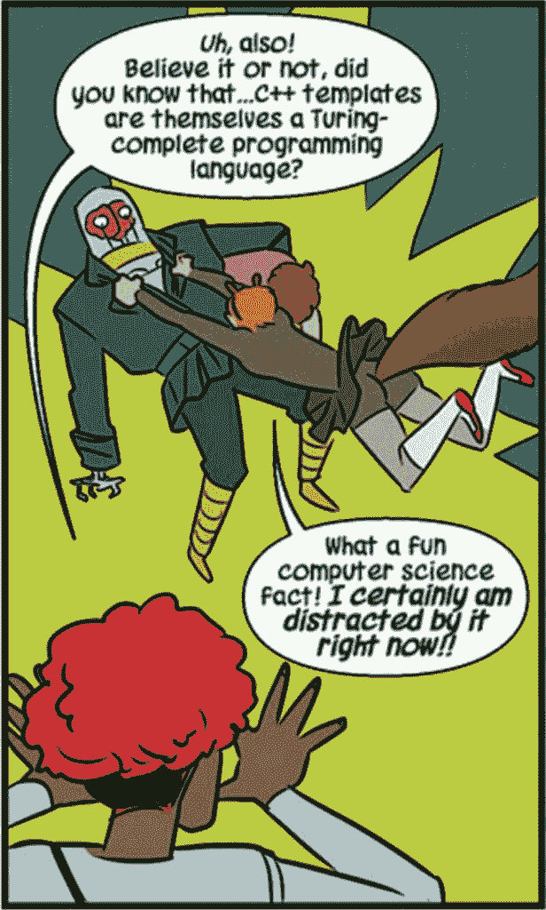
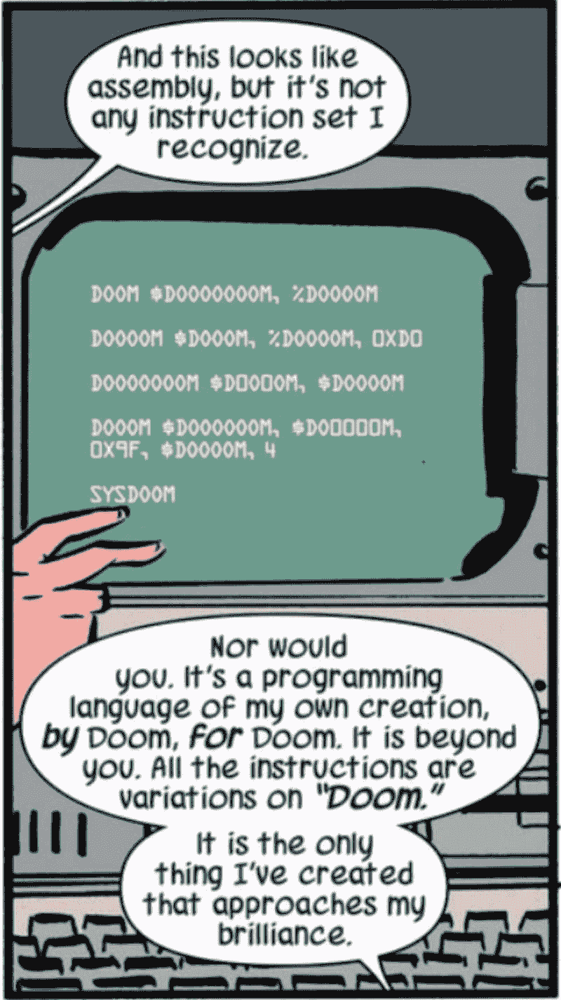
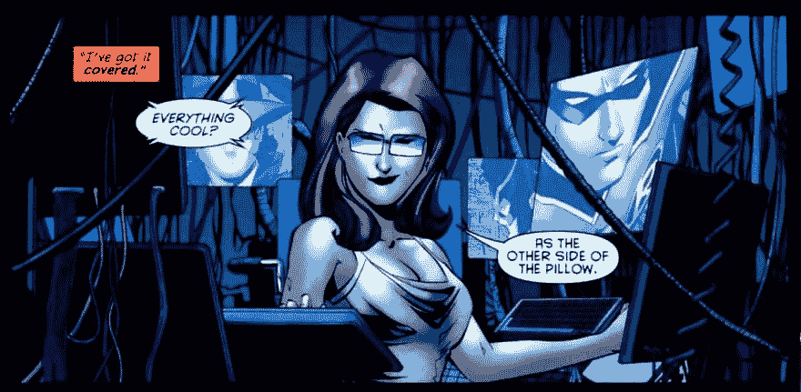
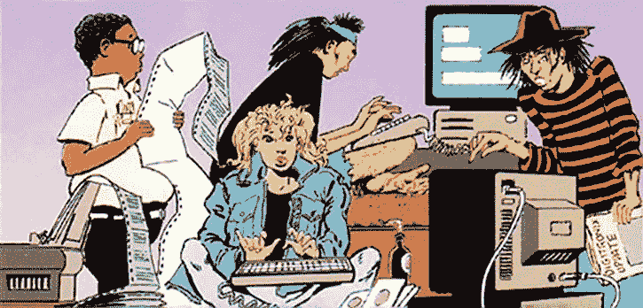
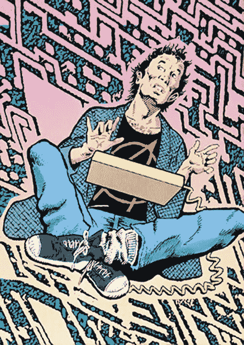
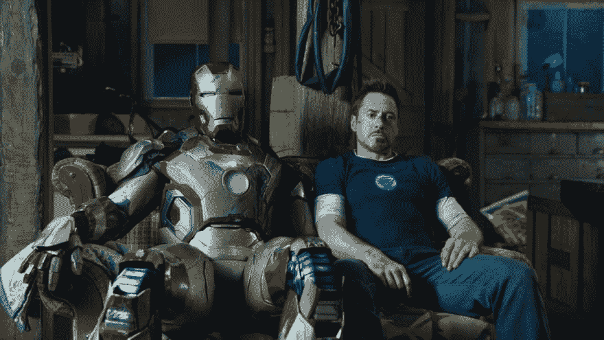
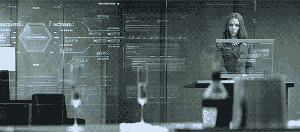

# 超级程序员

> 原文：<https://dev.to/terceranexus6/the-super-programmer-13nc>

我是漫画迷，我喜欢看各种各样的漫画。自从我开始阅读漫画以来，当我在漫画中看到计算机科学的表现时，我感到特别兴奋。因此，今天我决定用漫画的形式来汇集程序员、黑客和开发人员。欢迎在评论中添加更多内容！

## 无敌的松鼠女孩(多琳)

漫威最强大的英雄之一，善良，有趣，疯狂，长着一条毛茸茸的大尾巴...哦，她是计算机科学的优等生。在漫画中，她总是由她的同学南希陪伴，并且有大量的计算机科学参考资料。我真的很喜欢这个角色。

[T2】](https://res.cloudinary.com/practicaldev/image/fetch/s--oLinrWkx--/c_limit%2Cf_auto%2Cfl_progressive%2Cq_auto%2Cw_880/https://pbs.twimg.com/media/DSPPv1cXUAEfCB-.jpg)

## 末日博士

在《无与伦比的松鼠女孩》的其中一章中，末日博士展示了他创造的基于汇编的编程语言。但这只是建立在世界末日的基础上。他不知道 C++ tho！

[T2】](https://res.cloudinary.com/practicaldev/image/fetch/s--trTIWN3Z--/c_limit%2Cf_auto%2Cfl_progressive%2Cq_auto%2Cw_880/https://i.kinja-img.com/gawker-media/image/upload/s--U3h5lKxZ--/c_scale%2Cf_auto%2Cfl_progressive%2Cq_80%2Cw_800/lxxydnouvrttxgxdvdpb.png)

## 蝙蝠少女(芭芭拉·戈登)

她是一个了不起的女英雄，但她也是一个超级聪明的黑客。[ **剧透**在**黑客档案**中，当她被小丑从背后开枪时，她仍然战胜了帮助一群青少年黑客。

[T2】](https://res.cloudinary.com/practicaldev/image/fetch/s--MO7o4sWS--/c_limit%2Cf_auto%2Cfl_progressive%2Cq_auto%2Cw_880/https://scifielements.files.wordpress.com/2015/02/oracle_0005.jpg)

## 苏·德尼姆、弗里基·弗里迪和布拉斯特大师

在**黑客档案**中，一群少年黑客帮助拯救世界免于核灾难。

[T2】](https://res.cloudinary.com/practicaldev/image/fetch/s--s5x4kzxY--/c_limit%2Cf_auto%2Cfl_progressive%2Cq_auto%2Cw_880/http://www.writeups.org/wp-content/uploads/Hacker-Speed-Metal-Kids-DC-Comics-h.jpg)

## 杰克·马歇尔

《黑客档案》的主角是一名黑客/程序员，他向提到的青少年寻求帮助，因为他“是最好的，但他已经太老了，不适合这份工作”。

[T2】](https://res.cloudinary.com/practicaldev/image/fetch/s--I8YWlyH0--/c_limit%2Cf_auto%2Cfl_progressive%2Cq_auto%2Cw_880/http://www.writeups.org/wp-content/uploads/Hacker-DC-Comics-Jack-Marshall-a.jpg)

## 钢铁侠(托尼斯塔克)

他什么都知道，好吗？但他是一名电子极客、程序员、开发人员和黑客。除了有钱，花花公子，超级英雄。

[T2】](https://res.cloudinary.com/practicaldev/image/fetch/s--SnpqW29N--/c_limit%2Cf_auto%2Cfl_progressive%2Cq_auto%2Cw_880/http://www.comicsbeat.com/wp-content/uploads/2013/05/iron-man-3-tony-stark-robert-downey-jr.jpg)

## 黑寡妇(Nat Romanova)

除了是个优秀的间谍，她还是个普通的黑客。

[T2】](https://res.cloudinary.com/practicaldev/image/fetch/s--bmfUf62l--/c_limit%2Cf_auto%2Cfl_progressive%2Cq_66%2Cw_880/https://jamjani.files.wordpress.com/2015/07/gg.gif)