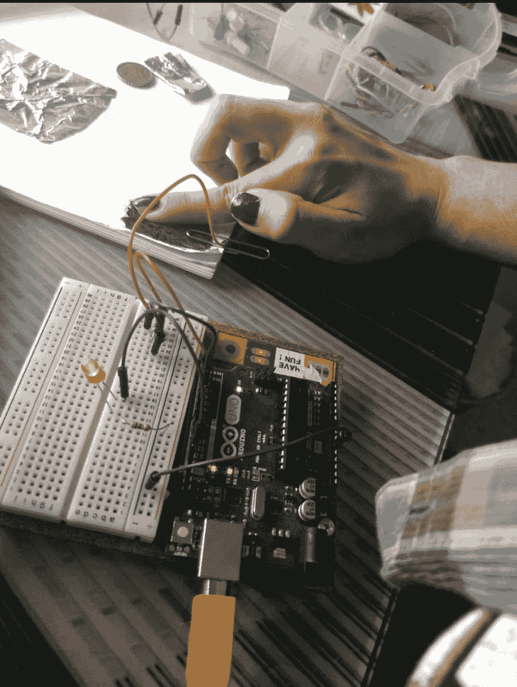
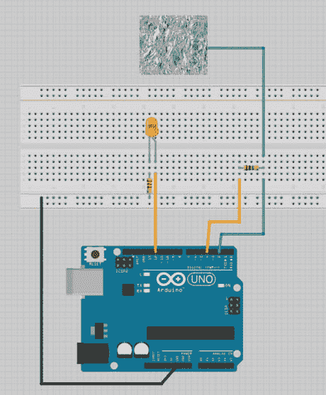

# 用 arduino 创建交互式绘图

> 原文：<https://dev.to/terceranexus6/creating-an-interactive-drawing-with-arduino-2jnp>

我每周都要为我年轻的学生开发新的 arduino 项目，他对电子和硬件充满热情。为此，我发现我们的上一个项目既有创意又有趣，我打赌你们中的一些人可以把它作为一个极客的实验。

[T2】](https://res.cloudinary.com/practicaldev/image/fetch/s--VXyb5lAq--/c_limit%2Cf_auto%2Cfl_progressive%2Cq_auto%2Cw_880/https://thepracticaldev.s3.amazonaws.com/i/zo3m6c5zxzd71dx82629.jpg)

我们这里需要的是石墨铅笔(或者直接石墨，效果更好)、arduino、电阻、led、金属夹和白色普通纸。它是如何工作的？

首先我们应该知道这是如何工作的。在 arduino 中，我们可以使用几个传感器作为输入，例如按钮、光线传感器、湿度传感器等。但我们也可以使用导体材料附加自制输入。钢和金属是常见的导体材料(你也可以用硬币来做这个实验)，石墨也是。

为了在 arduino 中完成这项工作，我们使用了一个名为 [CapacitiveSensor04](https://github.com/arduino-libraries/CapacitiveSensor/zipball/master) 的特殊库。一旦我们的库被添加，我们就可以开始设计电路了。这是一个用钢纸的例子，用石墨也一样。只画点东西(很密的)，在图上附上一个回形针(注意，应该是单线图)和一根电缆到纸针，就是接电阻+ 4 和 2 针的那个。

[T2】](https://res.cloudinary.com/practicaldev/image/fetch/s--J_vRHJHQ--/c_limit%2Cf_auto%2Cfl_progressive%2Cq_auto%2Cw_880/https://thepracticaldev.s3.amazonaws.com/i/9bewaymb5tkzqso3abo6.jpg)

这是我们的代码:

```
#include <CapacitiveSensor.h>
CapacitiveSensor capSensor = CapacitiveSensor(4,2);

int threshold = 1000;
const int ledPin = 12;

void setup() {

    Serial.begin(9600);
    pinMode(ledPin, OUTPUT);

}

void loop() {

    long sensorValue = capSensor.capacitiveSensor(30);
    Serial.println(sensorValue);
    if(sensorValue > threshold) {
        digitalWrite(ledPin, HIGH);
    }
    else {
        digitalWrite(ledPin, LOW);
    }
    delay(10);

} 
```

Enter fullscreen mode Exit fullscreen mode

我们可能需要校准阈值，在这种情况下，您只需打开监视器进行测试。和...塔达！互动绘图帽灯的 led。你现在可以做其他事情了。只是实验！

如果你是家庭教师、老师或家长，这里是我为学生准备的西班牙语课程内容(答案、给他们的不完整代码和给老师和活动的带注释的完整代码)。