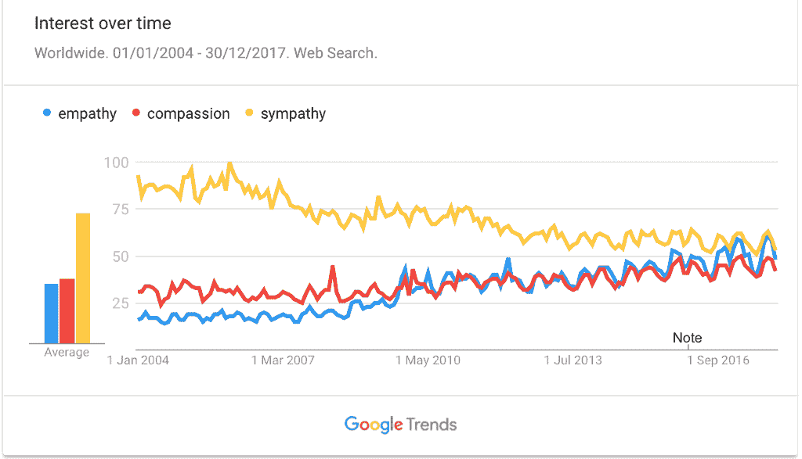
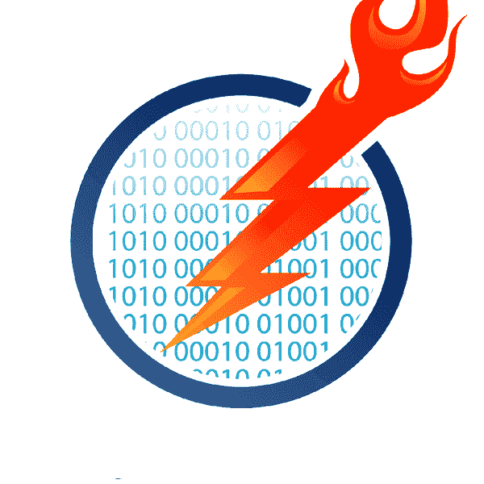
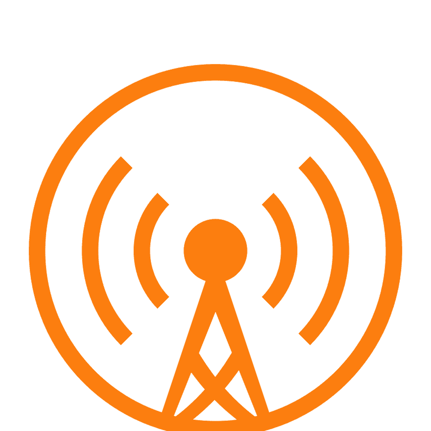

# 2017 年用同理心编码

> 原文:[https://dev.to/pavsaund/coding-with-empathy-in-2017-5b1a](https://dev.to/pavsaund/coding-with-empathy-in-2017-5b1a)

**感同身受**——2017 年第四大热门词汇，[根据韦氏词典](https://www.merriam-webster.com/words-at-play/word-of-the-year-2017-feminism/empathy)。有趣的是，这个词今年越来越受欢迎了。米里阿姆-韦伯斯特还指出了美国政治与移情的使用和搜索的增加之间的联系。

以下是[谷歌对 2017 年同理心的看法](https://trends.google.com/trends/explore?date=2004-01-01%202017-12-30&q=empathy,compassion,sympathy)。这是与同情和怜悯相比的趋势图:

[T2】](https://cdn-images-1.medium.com/max/1024/1*YqXAiGLpiPuQP1mjK2sxiA.png)

所以，这肯定是人们越来越意识到的事情，也可能是人们正在探索的事情。

### 博客

这个博客还没有[像 2016 年](http://codingwithempathy.com/2016/12/27/reflecting-on-2016/)那么活跃，但是已经有一些活动了。

我今年发表了 3 篇最受欢迎的博文，在这个博客和伟大的[dev to platform](https://dev.to/pavsaund)上都受到了好评。

1.  [软件行业的羞辱仪式](http://codingwithempathy.com/2017/01/10/rituals-of-shaming-in-the-software-industry/)
2.  [软件开发团队的效率和有效性](http://codingwithempathy.com/2017/01/24/efficiency-effectiveness-teams/)
3.  [求求你，拆了建！](http://codingwithempathy.com/2017/01/17/please-break-build/)

### pav log

正如在 2016 年总结中宣布的，我今年探索了视频，用一个月的每日视频集探索了对瑞安·哈乐黛的[的每日思考。我的灵感来自瑞安·哈乐黛之前的两本书；](https://www.amazon.com/Daily-Stoic-Meditations-Wisdom-Perseverance/dp/0735211736)[障碍是道路](https://www.amazon.com/Obstacle-Way-Timeless-Turning-Triumph/dp/1591846358)和[自我是敌人](https://www.amazon.com/Ego-Is-the-Enemy/dp/B01GSIZ9EY)。这些向我介绍了斯多葛主义，以及这种哲学是多么有价值。在个人和职业层面上，30 集的视频博客让我大开眼界。我在编辑视频、学习斯多葛主义以及将这些与同时也是 vlog 的日报结合起来的过程中找到了新的乐趣。

请随时查看结果，并告诉我您的想法:

[https://www.youtube.com/embed/-7RLkE8wkhA](https://www.youtube.com/embed/-7RLkE8wkhA)

### 会议讲座/播客

当我在 NDC 奥斯陆和纽约 QCon 大会上发表演讲时，同理心也是今年会议的焦点。两次谈话都有录音，可供查阅。

我对这些谈话的结果以及他们的反馈非常满意。虽然它们非常相似，但我认为 QCon NYC 的第二次迭代确实击中了要害。

我也有机会在 InfoQ 工程文化播客中与 Shawn Hastie 聊天，我们讨论了团队领导和同理心的话题。这是一次愉快的聊天，当然也是我想做更多的事情。

*   [NDC 奥斯陆 2017】t1](https://www.youtube.com/watch?v=qxeOo2jWoNM)
*   [QCon NYC 2017](https://www.infoq.com/presentations/empathy-burnout-impostor)
*   [Pavneet Saund 在 InfoQ 工程文化播客](https://www.infoq.com/podcasts/pavneet-saund)上谈实际的同理心

### #goofy 宗教

我对 2017 年的总结不能不提 twitter 上的[# goofy religion group](https://twitter.com/search?f=tweets&vertical=default&q=%23goofyreligion&src=tyah)。戴夫·雷尔开的一个玩笑很快升级为一个杂凑标签。我们几个人聚集在一起，互相激励，照顾好自己的身体和精神健康。

引发这一切的推特:

> 戴夫·雷尔@雷尔亚德[@ Jose gonz 321](https://twitter.com/JoseGonz321)[@ KC _ DC](https://twitter.com/kc_dc)[@ ReidNEvans](https://twitter.com/ReidNEvans)[@ pryelluw](https://twitter.com/pryelluw)[@ pav saund](https://twitter.com/pavsaund)[@ Shwany](https://twitter.com/Shwany)把你的傻宗教留给自己吧😀2017 年 8 月 17 日上午 03:0904

要了解更多关于#goofyreligion 以及关于平衡和函数式编程的精彩对话，请查看 Developer on Fire 播客中的 Reid Evans

 [# 第 294 集| Reid Evans -关联思维](/developeronfire/episode-294--reid-evans--connected-mindset) [

# 开发商着火了](/developeronfire) [ iTunes ](https://itunes.apple.com/us/podcast/developer-on-fire/id1006105326) [  Overcast ](https://overcast.fm/itunes1006105326/developer-on-fire) [  Android ](http://subscribeonandroid.com/developeronfire.com/rss.xml) [ RSS](http://developeronfire.com/rss.xml)   

<audio id="audio" data-episode="episode-294--reid-evans--connected-mindset" data-podcast="developeronfire"><source src="https://traffic.libsyn.com/developeronfire/DeveloperOnFire-294-ReidEvans.mp3" type="audio/mpeg"> Your browser does not support the audio element.</audio>

           <input type="range" name="points" id="volumeslider" value="50" min="0" max="100" data-show-value="true">      1x  [ x ] 

### 感恩

2017 年下半年对我来说一直是感恩。与其说是外在的感激，不如说是内在的。欣赏我周围的人。在大量关注我自己和我的活动之后，把它们放在焦点上。我想这是关于平衡，真的。我花时间在公共场合做这些事情来帮助别人，但在一天结束时，我也需要在那里为我周围的人服务。因此，我要特别感谢我的妻子、孩子和家人。

我要感谢 KomplettDev 的优秀员工。这是一种快乐，与这么多的个人一起工作，每天带着他们的整个自我去工作，建立欧洲最好的网上商店。

我还要感谢#goofyreligion 帮(和朋友们)。这些人用他们的行动和言语激励他人。我很幸运有你，期待在 2018 年与更多人分享#goofyreligion。

特别感谢埃米尔·卡德尔在 NDC 奥斯陆演讲后给了我一本日记和一支笔。我现在每天都写日记，并因此变得更好！今年到目前为止写了 150 天的日志。

### 向前看

我努力保持平衡，并找到一种健康的方式在各方面推动自己。我发现这意味着要改掉我在生活中养成的一些坏习惯，并理解改变我的心态是很难的。这里的一个关键词是重新布线习惯。

还有一些新的事情正在发生，这让我非常兴奋，我希望在 2018 年分享更多！

最后，我想感谢你们每一位读者，感谢你们将同理心融入到你们的生活中，以及你们周围的人。我在我们的社区中看到了很多积极的东西，这给了我很多希望，让我可以将安全带入我们的职业。但是还有很长的路要走。所以，让我们在 2018 年继续我们的工作。

*原载于 2017 年 12 月 30 日*[*【codingwithempathy.com】*](http://codingwithempathy.com/2017/12/30/coding-with-empathy-in-2017/)*。*

* * *