# 最完美的结合:即时编译器

> 原文:[https://dev . to/vaidehijoshi/a-most-perfect-union-just-in-time-compilers-2ml](https://dev.to/vaidehijoshi/a-most-perfect-union-just-in-time-compilers-2mml)

<figure> 

<figcaption>一个最完美的联盟:即时编译器。</figcaption>

</figure>

计算机科学的世界似乎总是要进行权衡。有时，我们被迫在两种数据结构、算法或函数之间做出选择，这两种数据结构、算法或函数都可以完成工作，但本质上是非常不同的。在一天结束的时候，我们真正要选择的是我们最关心和最重视的东西，以及我们愿意牺牲的东西。

但是这个真理不仅仅适用于计算机科学；这都是计算。即使我们没有直接使用计算机科学的概念，当涉及到我们的代码和我们如何编写它时，我们仍然必须做出选择和权衡。在更广的层面上，我们还必须考虑不同技术、设计决策和实现策略的利弊。还是那句话:更多权衡！

但是技术上的权衡并不全是坏事。有时候，它们正是我们前进的动力。新的框架和语言经常被创造出来，只是为了让开发人员不需要在事物之间进行选择——换句话说，为了让我们必须选择的权衡在本质上不必如此陡峭。许多技术旨在使这些选择更容易，痛苦更少，以便其他程序员不需要在两种非常不同的解决问题的方法之间进行选择。相反，这些新方法试图两全其美，找到一个快乐的中间点，同时学习并融合世界上已经存在的概念。在计算世界中，这种情况一次又一次地发生。

也许这方面最有趣的例子是编译器和解释器的结合；它结合了两种强大的技术，创造了一种新的东西，我们现在知道这就是*实时编译器*。

### 稀有品种:编译器-解释器混合体

上周，我们深入了解了编译器和解释器，它们是如何工作的，以及允许其中一个——编译器——创建另一个——解释器的方式。事实证明，解释器的历史与随后出现的即时编译器有着内在的联系。

我们会记得解释器是在 1958 年由史蒂夫·罗素发明的，当时他正与麻省理工学院的教授约翰·麦卡锡一起工作。麦卡锡写了一篇关于列表编程语言的论文，罗素在读了他关于这个主题的论文后，被吸引去和他的教授一起工作。

然而，约翰·麦卡锡还写了另一篇名为[“符号表达式的递归函数及其机器计算”](http://www-formal.stanford.edu/jmc/recursive/recursive.html)，发表于 1960 年。虽然我们不能完全确定，但这篇论文似乎包含了一些[对即时编译的最早引用](http://www.cs.tufts.edu/comp/150IPL/papers/aycock03jit.pdf)。

<figure>

<figcaption>IBM 7094 操作员控制台，[维基媒体基金会](https://en.wikipedia.org/wiki/IBM_7090#/media/File:IBM_7094_console2.agr.JPG)</figcaption>

</figure>

另一个对实时编译器的早期参考出现在 1966 年密歇根大学 IBM 7090 执行系统手册中。该特定机器系统的手册解释了如何在执行代码的同时翻译和加载代码，这暗示了即时编译器在 60 年代中期已经开始在更实用的水平上实现了！

好吧，但是等一下——那本手册到底是什么意思？我们已经看到了即时编译器首次出现的时间和地点……但是什么是即时编译器呢？

嗯，一个简单的思考方式是这样的: ***实时编译器*** (或者简称为 ***JIT*** )是它的父母、编译器和解释器的孩子。

<figure> 

<figcaption>实时编译器:一个定义。</figcaption>

</figure>

JIT 是解释器和编译器的融合或组合，它们各自是两种类型的翻译器。即时编译器集这两种翻译技术的许多优点于一身。

我们将回忆一下，编译器和解释器都做将程序员的源代码翻译成可执行的机器代码的工作，要么通过一次性翻译(编译器)，要么通过逐行解释和运行代码(解释器)。

编译器可以充当伟大的翻译者，因为它使代码执行起来更快；然而，它必须先将所有的源代码翻译成二进制文件，然后才能执行其中的任何一部分，当我们只有机器码可以使用时，这使得从源代码中调试某些东西变得很痛苦。

另一方面，解释器可以在运行时直接执行代码片段，这意味着如果出现问题，它可以维护在运行时调用执行代码的上下文。然而，解释器必须多次重新翻译代码，这可能会使其速度慢且效率低。

<figure>[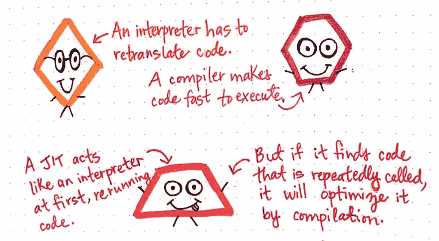](https://res.cloudinary.com/practicaldev/image/fetch/s--b1jYNR6C--/c_limit%2Cf_auto%2Cfl_progressive%2Cq_auto%2Cw_880/https://cdn-images-1.medium.com/max/1024/1%2AbRfB9avGGBhB0XYWyo5v9Q.jpeg)

<figcaption>JIT 比作它的父母:编译器和解释器。</figcaption>

</figure>

那么 JIT 在这方面有什么用呢？首先，JIT 的行为就像它的父母之一——也就是说，它一开始就像一个*解释器*,执行并重新运行被调用的代码。然而，如果 JIT 找到被多次调用和重复调用的代码，它的行为就像它的另一个父代:编译器。

JIT 就像一个解释器，直到它注意到它正在做一堆重复的工作。在这一点上，它的行为更像一个编译器，并将通过直接编译来优化重复调用的代码。这允许 JIT 吸收其“父”翻译器——编译器和解释器——的优点。虽然它是从解释原文开始的，但它是以一种特殊的方式开始的。JIT 必须在解释期间密切关注它正在内联运行的代码。

JIT 需要能够回答这个问题:

> 我可以继续直接解释这段代码吗，或者我应该继续编译这段代码，这样我就不需要重复翻译工作了？

那么它是如何回答这个有时很难的问题的呢？嗯，JIT 密切关注正在发生的事情， ***监视*** 或 ***剖析*** 它正在执行的代码。

<figure>[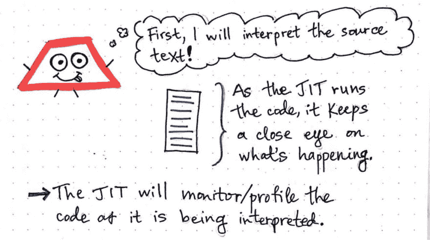](https://res.cloudinary.com/practicaldev/image/fetch/s--vCJ1gANn--/c_limit%2Cf_auto%2Cfl_progressive%2Cq_auto%2Cw_880/https://cdn-images-1.medium.com/max/1024/1%2ABEZ-PWgl2UvdMUP0KADFyg.jpeg)

<figcaption>JIT 最初如何解释源文本中的代码。</figcaption>

</figure>

当 JIT 解释代码时，它同时监控代码。当它注意到重复的工作时，它会想:*“嘿！这太愚蠢了。我不需要做这种不必要的工作。让我明智地处理这些代码。”*

这在理论上似乎很棒。但是 JIT 在实践中是如何知道如何回答这个问题的呢？是时候找出答案了！

### 烟导致火，火导致编

我们知道 JIT 必须密切关注它运行的代码。但是它到底是如何监控正在发生的事情的呢？嗯，我们可以想象一下，如果我们从外部监控某件事情，我们会怎么做:我们可能会有一张纸或一个记事本，在事情发生时做标记，以便在事件发生时跟踪事件。

JIT 正是这样做的。它通常有一个内部监视器来“标记”看起来可疑的代码。例如，如果我们的一段源代码被调用了几次，JIT 会记录下这段代码被频繁调用的事实；这就是通常所说的 ***【温暖】代号*** 。

<figure>[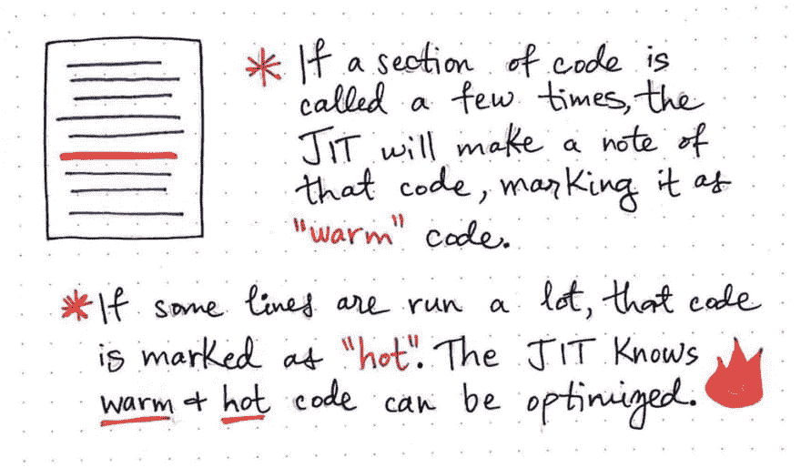](https://res.cloudinary.com/practicaldev/image/fetch/s--is0XPBeK--/c_limit%2Cf_auto%2Cfl_progressive%2Cq_auto%2Cw_880/https://cdn-images-1.medium.com/max/1024/1%2A0lmvQX9D1WSo4CUJ57odJw.jpeg)

<figcaption>JIT 使用热度和热度来决定如何优化我们的代码！</figcaption>

</figure>

出于同样的原因，如果我们的源代码中的一些行被运行了很多很多次，那么 JIT 将会把它标记为 ***【热】代码*** 。通过使用这些定界符，JIT 可以很容易地找出哪些代码行和代码段可以被优化——换句话说，可以在稍后被*编译*而不是*解释*。

通过一个例子来理解“暖”和“热”代码的价值和用途更有意义。因此，让我们来看一些源文本的抽象版本，它可以是任何语言，任何大小。出于我们的目的，我们可以想象这是一个非常短的程序，只有 6 行代码长。

<figure>[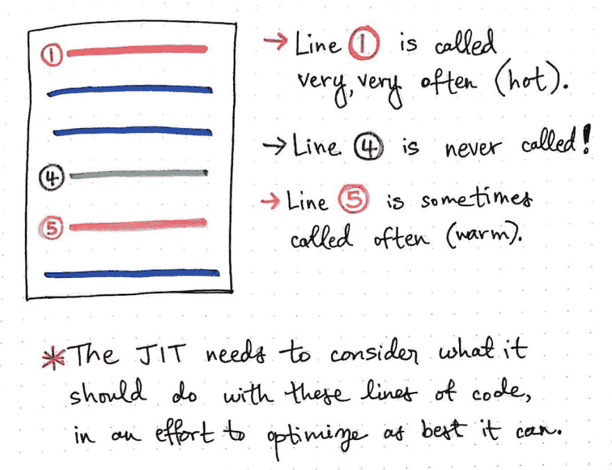](https://res.cloudinary.com/practicaldev/image/fetch/s--HbKDoZMA--/c_limit%2Cf_auto%2Cfl_progressive%2Cq_auto%2Cw_880/https://cdn-images-1.medium.com/max/1024/1%2A7U5lXmGC6V9N2J2edSmgPQ.jpeg)

<figcaption>JIT 是如何知道如何处理一个热代码行、一个暖代码行和一个从未被调用过的代码行的？</figcaption>

</figure>

查看这里显示的插图，我们可以看到第 1 行被调用的频率非常高。JIT 会很快识别出第 1 行是“热”代码。

另一方面，第 4 行实际上从未被调用；也许它设置了一个从未使用过的变量，或者是一行永远不会被调用的代码。这就是有时所说的 ***【死】代号*** 。

最后，第 5 行有时被经常调用，但不如第 1 行那么频繁。JIT 将识别出这是“热”代码，并可能以某种方式进行优化。

JIT 需要考虑应该对所有这些代码行做些什么，这样它才能找出最佳的优化方式。需要考虑这一点的原因是*并非所有的优化都是好的*。根据 JIT 决定优化的效率，优化可能实际上并不那么有用！

让我们看看其中的一些行，看看如果不够聪明，JIT 最终会如何做出一个糟糕的优化选择。

<figure>[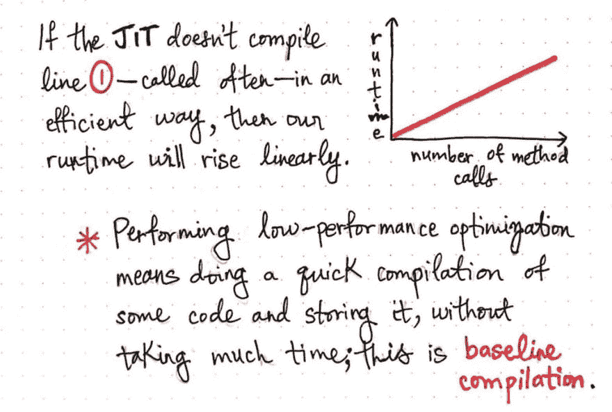](https://res.cloudinary.com/practicaldev/image/fetch/s--7LhzpciR--/c_limit%2Cf_auto%2Cfl_progressive%2Cq_auto%2Cw_880/https://cdn-images-1.medium.com/max/1024/1%2ADttv73ZwQwIehqXQu78iIg.jpeg) 

<figcaption>基线编译:一个定义。</figcaption>

</figure>

我们从 1 号线开始。在这种情况下，第 1 行的代码会被频繁执行。假设 JIT 注意到(监控到)这一行经常被重复。它将不可避免地选择“热门”代码行并决定编译它。

但是 JIT 决定编译这段代码的方式和它开始编译它的事实一样重要。

JIT 可以执行不同种类的编译，有些很快，有些更复杂。代码的快速编译通常是一种性能较低的优化，包括编译代码，然后存储编译结果，而不会花费太多时间。这种形式的快速优化被称为 ***基线优化*** 。

然而，如果 JIT 选择对第 1 行进行基线优化，这会如何影响我们代码的运行时呢？好吧，第 1 行上一个糟糕的优化选择的结果将导致我们的运行时间随着对第 1 行上的方法的调用数量的增加而线性增加( *O(n)* )。

或者，JIT 也可以执行一种更长、更深入的性能优化，称为 ***优化编译*** ，或者 ***优化编译*** 。Opt 编译包括预先花费时间，通过尽可能高效地编译来优化一段代码，然后使用存储的优化值。

> 我们可以认为基线编辑和选择编辑是编辑文章的两种不同方法。

基线编译有点像编辑一篇文章的拼写、标点和语法；我们没有对文章做深入的改进，但我们做了一些改进。另一方面，除了拼写和语法，选择编译类似于编辑一篇文章的内容、清晰度和可读性。Opt 编译需要更多的前期工作，但是会带来更好的最终结果。

opt 编译的好处在于，一旦我们以可能的最佳方式编译了一段代码，我们就可以存储优化代码的结果，并一次又一次地永久运行编译后的代码。这意味着，无论我们在已经优化的代码段中调用多少次方法，都将花费恒定的时间来运行该代码，因为我们实际上每次都在运行相同的编译文件。即使方法调用的数量增加了，代码执行的运行时间保持不变；这导致已经被 opt 编译的代码有恒定的时间( *O(1)* )。

<figure>[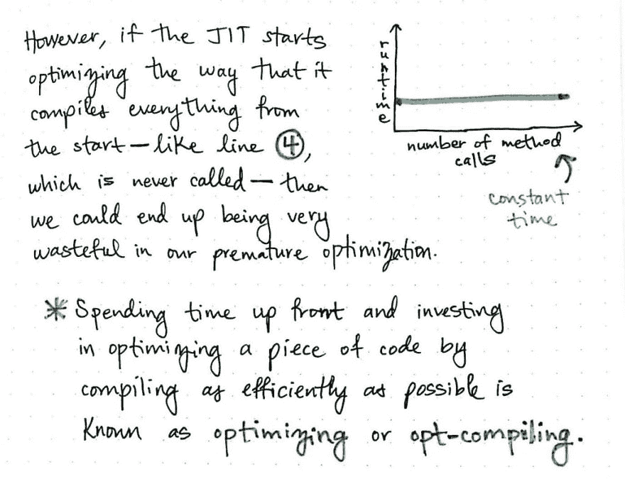](https://res.cloudinary.com/practicaldev/image/fetch/s--OjbYlTzB--/c_limit%2Cf_auto%2Cfl_progressive%2Cq_auto%2Cw_880/https://cdn-images-1.medium.com/max/1024/1%2AQ-FGSMJ5__jQ0MnW6eNmmQ.jpeg) 

<figcaption>优化编译:一个定义。</figcaption>

</figure>

仅仅基于 opt 编译的大 O 符号，听起来似乎 opt 编译应该永远是一种方法！然而，在某些情况下，opt 编译可能是白费力气。

例如，如果我们的 JIT 继续下去，并开始选择编译一切，会发生什么？我们还记得，第 4 行实际上从未被调用，是“死”代码。如果我们的 JIT 预先花时间选择编译第 4 行，这甚至从来没有运行过，那么它将花费不必要的时间来过早地优化一行从来没有被调用的代码。在这种情况下，盲目地选择编译，不深入了解代码中实际发生了什么，也不依赖代码本身的热度，结果是相当浪费的！

那么，JIT 编译器要做什么呢？最终，它需要在基线编译和优化编译之间找到一个合适的中间点。这正是代码的“热度”发挥作用的地方。

<figure>[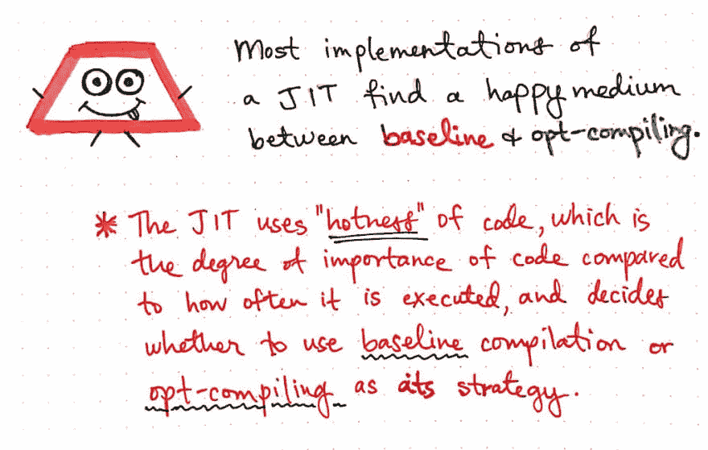](https://res.cloudinary.com/practicaldev/image/fetch/s--kxOVPE5f--/c_limit%2Cf_auto%2Cfl_progressive%2Cq_auto%2Cw_880/https://cdn-images-1.medium.com/max/1024/1%2A_NnYS04l7k9iqMW5dumkmA.jpeg) 

<figcaption>在基线和 opt-编译之间找到一个快乐的中间点。</figcaption>

</figure>

JIT 使用一行代码的“热度”来决定编译该代码的重要性，以及编译时使用哪种策略——或者是*基线*或者是*选择编译*。

### 一条快乐、热的道路通向最优的 JIT 编译

我们已经知道，JIT 使用代码的“热度”来决定使用哪种编译策略。但它到底是如何做出决定的呢？

<figure>[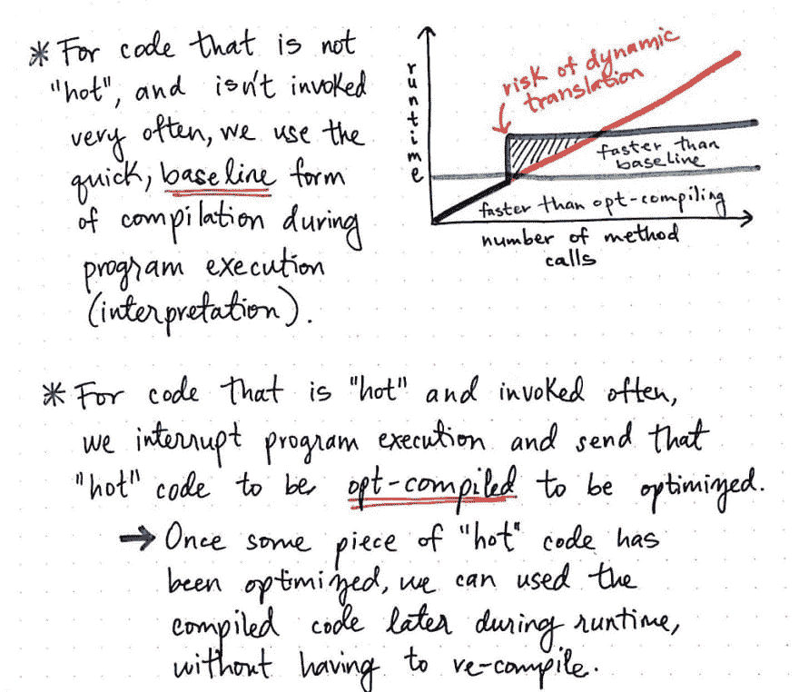](https://res.cloudinary.com/practicaldev/image/fetch/s--Jm-V2IFu--/c_limit%2Cf_auto%2Cfl_progressive%2Cq_auto%2Cw_880/https://cdn-images-1.medium.com/max/1024/1%2AXuZ3nduRSxFk8hFTdWYQcg.jpeg) 

<figcaption>结合热度和最优的编译策略！</figcaption>

</figure>

对于既不“热”也不“温”的代码(包括“死”的代码)，JIT 的行为就像一个解释器，甚至不需要进行任何编译器优化。

但是，对于“热”但不“热”的代码，JIT 将在程序执行期间使用更快的、基线形式的编译。换句话说，当它解释这段代码并注意到它是“热的”时，它会在代码仍在执行时将其发送出去进行编译。它将以一种简单的方式编译“温暖的”代码——可能的最快、低性能的方式。这意味着它做出了轻微的改进，因为对于“温暖的”代码来说，即使是基线编译也比什么都没有好。

然而，对于“热门”且被频繁调用的代码，JIT 会记录下来，当它被调用足够多次时，它会中断程序执行(解释)，并发送该代码进行 opt 编译——以尽可能最好的方式进行优化，这也意味着提前在编译上投入更多时间。这样做的好处是,“热”代码只需要优化一次，即使这样做的工作量稍大。一旦“热”代码被优化，JIT 将在运行时一次又一次地重复使用和重新运行优化版本的机器代码，而不需要一次又一次地重新编译。

要记住的基本经验是:

> 对于不经常调用的代码，JIT 将使用基线编译，这样更快。然而，对于频繁调用的代码，JIT 将使用更长的 opt-compile 方法，因为它知道这样做是值得的。

<figure>[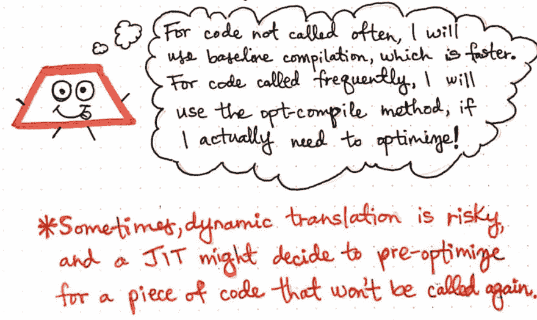](https://res.cloudinary.com/practicaldev/image/fetch/s--Cz3WRYYA--/c_limit%2Cf_auto%2Cfl_progressive%2Cq_auto%2Cw_880/https://cdn-images-1.medium.com/max/1024/1%2ALETkOZtFLXqgkGFQxmsW7g.jpeg) 

<figcaption>动态翻译的风险。</figcaption>

</figure>

JIT 很少会发出不正确的调用。也就是说，它将确定某段代码被调用的次数足够多，可以进行优化编译，但事实证明，可能不是这样！例如，如果我们的 JIT 在它被优化编译之前寻找被调用 5 次的代码行，并且它看到一行代码被调用了 4 次，在第 5 次时，它将很可能把它发送出去进行优化编译。在极少数情况下，它选择编译的代码行可能再也不会被调用了！在这种情况下，它为编译该行所做的所有工作都白费了。

对于动态翻译*，这只是故事的一部分，而这正是即时编译所发生的。有时，JIT 会决定预先优化一段实际上不会再被调用的代码。不过这种情况很少见，因为大多数代码行要么被频繁调用，要么只被调用几次。很可能大多数现代 JIT 可以很好地解释这一点，但是 JIT 也有可能偶尔出错。*

 *大多数时候，JIT 很好地知道何时它应该表现得像一个解释器，何时它应该获取一段代码并编译它。这件事的好处是我们的 JIT 只允许我们加速那些*需要*加速的事情。即时编译允许我们优化和编译我们最常运行的代码。

此外，它允许我们继续保留源代码中编译后的代码最初运行的地方！换句话说，我们仍然可以引用一些编译代码的运行位置。

<figure>[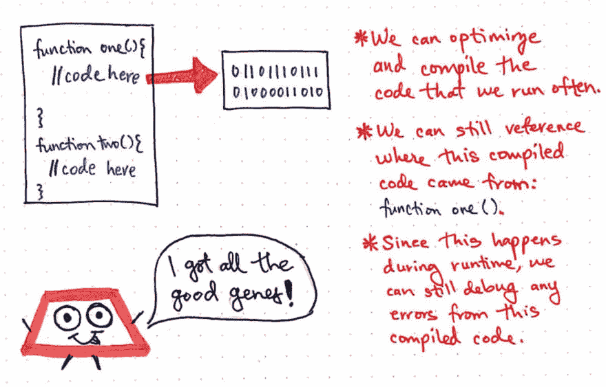](https://res.cloudinary.com/practicaldev/image/fetch/s--S9c8uQ-V--/c_limit%2Cf_auto%2Cfl_progressive%2Cq_auto%2Cw_880/https://cdn-images-1.medium.com/max/1024/1%2Addwl6qKtsL9R1RsEPd2EMA.jpeg) 

<figcaption>即时编译器的好处！</figcaption>

</figure>

例如，在上面的图片中，我们的 JIT 确定函数 one()是一个高“热度”，可以进行优化编译以提高效率。即使函数 one()被编译了，我们仍然可以在源文本中引用编译的代码。实际上，如果编译后的代码中有任何错误，我们现在知道它在源文本中的确切位置。由于编译发生在运行时，我们可以很容易地调试任何错误或问题，因为我们知道查看函数 one()来寻找线索，因为错误来自于由这一行代码生成的编译后的代码。

即时编译器给了我们两个世界的好处:它允许我们运行可以通过编译优化和执行的快速代码，同时仍然保留来自解释器的维护上下文，这是程序员在调试时喜欢拥有的。

<figure>[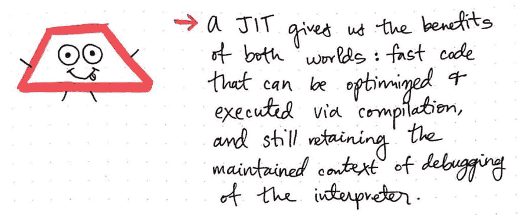](https://res.cloudinary.com/practicaldev/image/fetch/s--_ZeDVmQt--/c_limit%2Cf_auto%2Cfl_progressive%2Cq_auto%2Cw_880/https://cdn-images-1.medium.com/max/1024/1%2A7BUm-FvG8jXwfloKgEEBLw.jpeg)

<figcaption>JIT 给了我们最好的解释器和编译器。</figcaption>

</figure>

JIT 是一个完美的例子，说明我们偶尔会在计算机科学中走运，而不必在权衡取舍中做出选择。有时候，我们也可以让我们的编译器和解释器来解释我们的代码！

### 资源

即使 JIT 编译器是在当今计算中常用的语言中实现的，也很难找到好的资源来真正解释它们是什么、它们如何工作以及它们为什么重要。当然，有一些视频和文章很好地回答了这些问题，但你必须稍微挖掘一下才能找到它们。幸运的是，我为你做了调查！如果你正在寻找进一步的 JIT 相关阅读，这里有一些好的起点。

1.  [即时编译器速成班](https://hacks.mozilla.org/2017/02/a-crash-course-in-just-in-time-jit-compilers/)，林·克拉克
2.  什么是解释器、编译器& JIT 编译器？、Avelx
3.  [及时编译](https://www.youtube.com/watch?v=yQ27DjKnxwo)，SEPL 法兰克福歌德大学
4.  [了解 JIT 编译器(just-in-time compiler)](https://aboullaite.me/understanding-jit-compiler-just-in-time-compiler/) ，阿布莱特·穆罕默德
5.  [及时编译](http://www.cs.columbia.edu/~aho/cs6998/Lectures/14-09-22_Croce_JIT.pdf)，路易斯·克罗齐教授
6.  [准时制](http://www.cs.tufts.edu/comp/150IPL/papers/aycock03jit.pdf)简史，约翰·艾科克教授

* * **