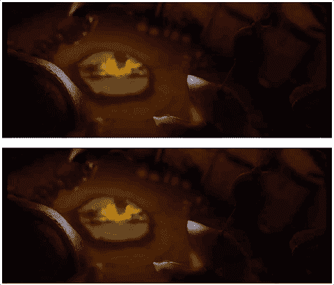

# Video.js:精确帧字幕

> 原文:[https://dev.to/scleriot/videojs-帧-精确-字幕-4ccb](https://dev.to/scleriot/videojs--frame-accurate-subtitles-4ccb)

在后期制作和广播行业，视频是逐帧处理的。
字幕遵循相同的规则:入和出时间码是帧精确的(例如:`00:00:23:22` - > 23 秒和 22 个图像)。

浏览器处理带有毫秒时间戳的视频，这就是为什么字幕必须基于视频帧速率进行转换:对于每秒 25 幅图像的视频，先前的时间码看起来像毫秒格式的`00:00:23.880`(`1000/25 * 22 = 880`)。

帧的准确性非常重要:字幕需要在下一个剪辑之前消失，并在上一个剪辑之后出现。问题是默认 HTML5 视频的刷新率太低:字幕出现和消失得太晚，导致观众的体验很差(而且不符合广播标准)。

下面的例子突出了这个问题。在计划改变之前，固定视频中的字幕消失:

[T2】](https://res.cloudinary.com/practicaldev/image/fetch/s--Fq0ib6hn--/c_limit%2Cf_auto%2Cfl_progressive%2Cq_66%2Cw_880/https://thepracticaldev.s3.amazonaws.com/i/z0g5w833mi9xm72vppxl.gif)

这看似无关紧要，但后期制作行业需要精确的画面。

由于浏览器的限制，`timeupdate`(视频播放位置改变时触发的事件)每隔 150-250 毫秒触发一次。这对帧精度来说是不够的:25fps 意味着每 40 毫秒更新一次。
我们需要计算每一帧应该显示哪个字幕(而不是默认的每 4-5 帧显示一次)。每次调用文本轨道的属性`activeCues` getter 时，Video.js 字幕引擎都会进行计算。

text-track.js 摘自 Video.js 源代码:

```
Object.defineProperty(tt, 'activeCues', {
    get() {
        if (!this.loaded_) {
            return null;
        }
        // nothing to do
        if (this.cues.length === 0) {
            return activeCues;
        }
        const ct = this.tech_.currentTime();
        const active = [];
        for (let i = 0, l = this.cues.length; i < l; i++) {
            const cue = this.cues[i];

            if (cue.startTime <= ct && cue.endTime >= ct) {
                active.push(cue);
            } else if (cue.startTime === cue.endTime &&
                cue.startTime <= ct &&
                cue.startTime + 0.5 >= ct) {
                active.push(cue);
            }
        }
        changed = false;
        if (active.length !== this.activeCues_.length) {
            changed = true;
        } else {
            for (let i = 0; i < active.length; i++) {
                if (this.activeCues_.indexOf(active[i]) === -1) {
                    changed = true;
                }
            }
        }
        this.activeCues_ = active;
        activeCues.setCues_(this.activeCues_);
        return activeCues;
    },
    set() {}
}); 
```

然后，您需要在文本轨道上调用`trigger('cuechange')`，以确保视频显示是最新的:

```
player.textTracks()[0].activeCues; // computes the current subtitle based on current time
player.textTracks()[0].trigger('cuechange'); // updates the display 
```

`requestAnimationFrame`针对动画进行了优化，比`setInterval`或`setTimeout`的延迟要小得多，所以我们将把它用于我们的时间敏感循环(这里的[帧速率控制源](http://codetheory.in/controlling-the-frame-rate-with-requestanimationframe/))。

以下是完整的源代码:

```
var fps = 25;
var now;
var then = Date.now();
var interval = 1000/fps;
var delta;

function reloadCues() {
    requestAnimationFrame(reloadCues);

    now = Date.now();
    delta = now - then;

    if (delta > interval) {
        then = now - (delta % interval);

        if(videojs.players.player.textTracks().length == 1) {
            videojs.players.player.textTracks()[0].activeCues;
            videojs.players.player.textTracks()[0].trigger('cuechange')
        }
    }
}
reloadCues(); 
```

演示项目可从[这里](/demo/videojs-frame-accurate-subtitles)获得。

**最初发表于[我的个人博客](http://cleriotsimon.com/posts/videojs-frame-accurate-subtitles/)。**