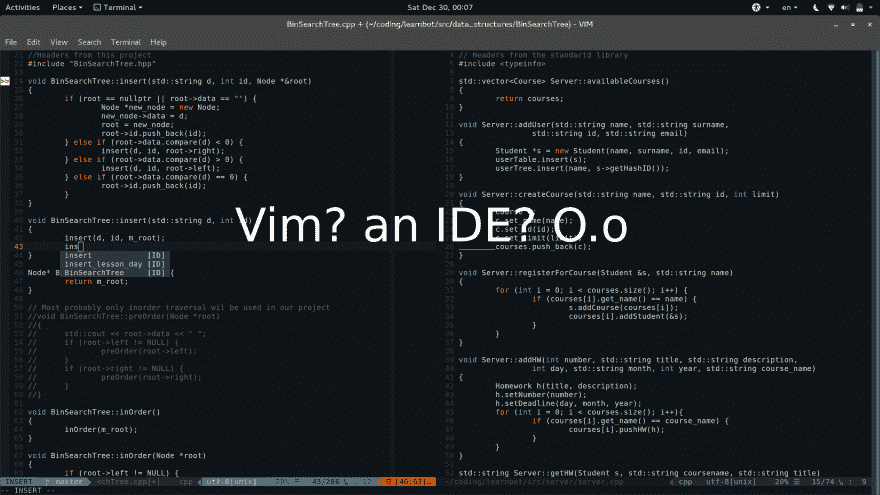
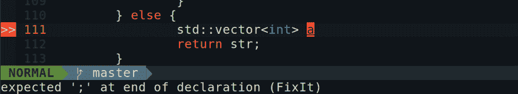
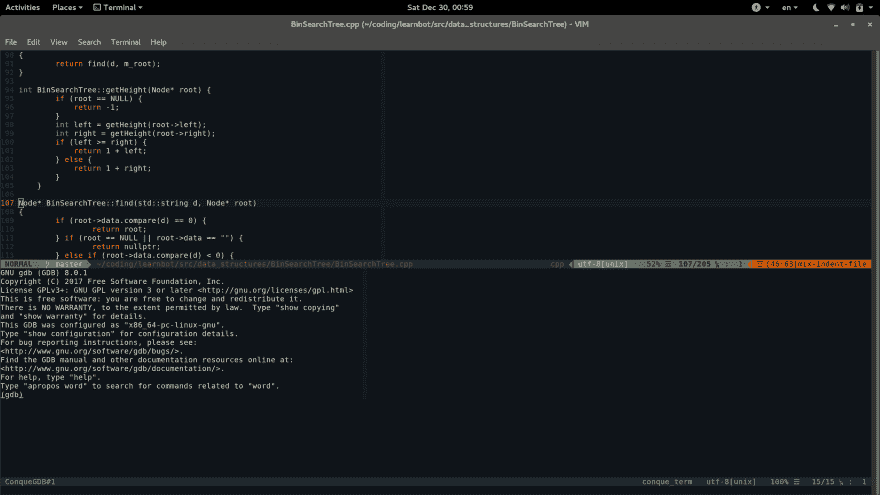

# 谁说 VIM 不能和 IDEs 竞争？

> 原文：<https://dev.to/bezirganyan/who-said-that-vim-cannot-compete-with-ides-51k4>

[T2】](https://res.cloudinary.com/practicaldev/image/fetch/s--iiTOvsXg--/c_limit%2Cf_auto%2Cfl_progressive%2Cq_auto%2Cw_880/https://bezirganyan.github.io/img/2017/12/vim_main.jpg)

每个开发人员都有自己喜欢的文本编辑器或 IDE，只要开发人员存在，文本编辑器战争就不会结束。所谓“编辑战”的两大主要力量是 Vim 和 Emacs。他们都很棒，可以做很多事情，但是...但它们不是 IDE。

我听说过许多开发人员，他们热爱 vim 或 Emacs，但却使用 clion、CodeBlocks、VisualStudio 等 ide。，因为某些特性。

但是等等！如果我告诉你，你可以把你的 vim 或 Emacs 变成一个 IDE？是的，它会工作，而且在大多数情况下，它会比你的传统 IDE 工作得更好更快，至少对 C/C++是这样。

## 配置 vim 成为 IDE

嗯，IDE 的主要基本特性是

*   代码完成
*   误差检测
*   排除故障

当然，ide 还有更多的特性，配置 vim 来完成其中的大部分是可能的，但是在这篇文章中，我将只谈论这三个主要的特性。

所以，让我们看看每个特性，并尝试在 vim 中使用它

*注意:*该配置是针对 C/C++的，但是只要稍加修改和适当的插件，就可以让它们适合你想要的语言。

### 代码补全

Vim 已经有一个内置的代码补全功能，你所要做的就是输入开始的字母并按下`crtl + n`，它会从你的代码中得到建议。但这还不够。所有的 ide 都有更智能的代码完成功能，这不仅会从你已经编写的代码中得到建议，还会从你使用的库中得到建议。

你可以通过一个名为 [**YouCompleteMe**](https://valloric.github.io/YouCompleteMe/) 的 vim 插件来实现这样的功能。

你所要做的就是安装插件并配置你想要的语言和库。

[T2】](https://res.cloudinary.com/practicaldev/image/fetch/s--ZP57z_4b--/c_limit%2Cf_auto%2Cfl_progressive%2Cq_auto%2Cw_880/https://bezirganyan.github.io/img/2017/12/vim_code_completion.png)

### 错误检测

我喜欢 Vim 的一个特点是当你使用它的`make`命令时，如果出现错误，它会把光标移到第一个编译错误发生的那一行。然而，ide 做的远不止这些。在您键入
之后，它们会立即检测到错误。

对于 vim，同样的功能提供了 [**YouCompleteMe**](https://valloric.github.io/YouCompleteMe/) 插件，我们已经在上面讨论过了。键入后，当您按下`Esc`键时，如果出现编译错误，将会突出显示导致错误的代码部分。

[T2】](https://res.cloudinary.com/practicaldev/image/fetch/s--kcs2nUaU--/c_limit%2Cf_auto%2Cfl_progressive%2Cq_auto%2Cw_880/https://bezirganyan.github.io/img/2017/12/vim_error.png)

### 调试

当我刚开始使用 Vim 时，为了调试我的程序，我不得不打开另一个终端，运行`gdb`，键入`ref`，并尝试使用不那么用户友好的界面，没有语法高亮。当我写命令的时候，我甚至不能使用我的箭头键。好吧，真糟糕。

然后我发现了 [**征服者——GDB**T3】](https://github.com/vim-scripts/Conque-GDB)

征服 GDB 是一个 vim 脚本，将 GDB 整合到你的 vim 中。酷吧？更酷的是，它在 vim 中显示了代码上的断点或分段错误位置。你甚至可以用你的箭头键移动你的光标！

老实说，我讨厌 GDB，甚至在使用这个插件之后，直到有一天，在一次编程奥林匹克竞赛中，我不得不使用 Visual Studio 的调试器。我甚至找不到我的程序抛出 SegFault 的地方。所以我所做的(我甚至不知道我是否有权利这样做)是从我的 USB 启动 Linux，并使用征服 GDB。

[T2】](https://res.cloudinary.com/practicaldev/image/fetch/s--vccV2DT6--/c_limit%2Cf_auto%2Cfl_progressive%2Cq_auto%2Cw_880/https://bezirganyan.github.io/img/2017/12/vim_gdb.png)

### 其他插件？

有一个非常牛逼的网站充斥着各种 vim 插件，叫做[**【vimawesome.com】**](//vimawesome.com)。您可以在那里找到更多的插件，使您的 vim 更接近实际的 IDE。

您可以在下面评论您的 vim 配置。顺便说一句，这是我的第一篇博文，所以我在评论区等待你的正面批评。

[*来源*](https://bezirganyan.github.io/blog/vim_ide/)