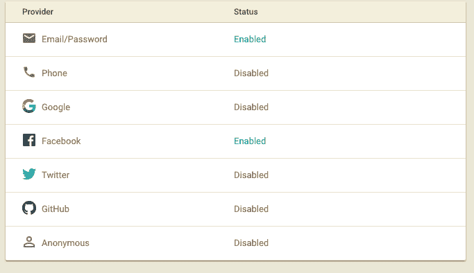
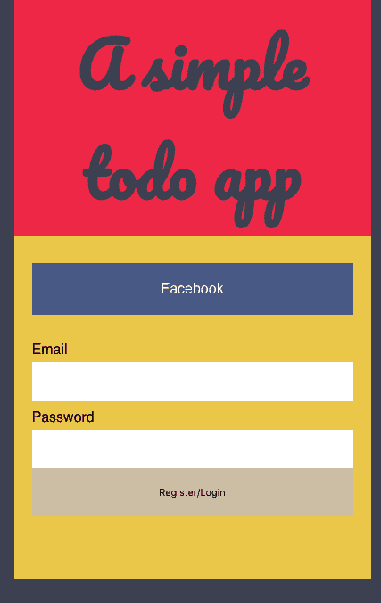

# 使用 react 和 firebase 创建应用程序-第三部分

> 原文:[https://dev . to/aurelkurtula/creating-a-app-with-react-and-fire base-part-three-2c 03](https://dev.to/aurelkurtula/creating-an-app-with-react-and-firebase---part-three-2c03)

欢迎来到 React 和 Firebase 系列的第三部分，也是最后一部分。在学习本教程之前，确保你已经完成了第一部分[和第二部分](https://dev.to/aurelkurtula/creating-an-app-with-react-and-firebase---part-one-814)[和第三部分](https://dev.to/aurelkurtula/creating-an-app-with-react-and-firebase---part-two-5hmc)。你可以克隆这个项目，并从名为[的第二部分](https://github.com/aurelkurtula/todo-app-with-react-and-firebase/tree/part-two)开始学习本教程

到目前为止，应用程序的状态是任何人都可以读写存储在数据库中的 todo 项。今天，我们将在项目中添加身份验证，以便只有经过身份验证的用户才能读写内容。当然，我们将进一步限制每个用户可以读写的内容，从而使每个用户拥有自己的项目。

## 01。设置 firebase

我们将使用两种身份验证方法。用户将能够通过电子邮件和密码或通过 facebook 注册/登录。

在 firebase 上启用这两种方法的步骤已经在我的关于用 firebase 进行认证的教程[中介绍过了——你只需要按照标题“03。使用电子邮件和密码进行身份验证”和“06。脸书的认证”之后你可以回到这里。](https://dev.to/aurelkurtula/introduction-to-authentication-with-firebase-bkd)

此时，您应该已经启用了登录方法“电子邮件/密码”和“脸书”。

[T2】](https://res.cloudinary.com/practicaldev/image/fetch/s--wS7iirF4--/c_limit%2Cf_auto%2Cfl_progressive%2Cq_auto%2Cw_880/https://thepracticaldev.s3.amazonaws.com/i/qdo3ig1efjbvl9s2prtl.png)

最后，将数据库规则更改如下。

```
{
  "rules": {
    ".read": "auth != null",
    ".write": "auth != null"
  }
} 
```

<svg width="20px" height="20px" viewBox="0 0 24 24" class="highlight-action crayons-icon highlight-action--fullscreen-on"><title>Enter fullscreen mode</title></svg> <svg width="20px" height="20px" viewBox="0 0 24 24" class="highlight-action crayons-icon highlight-action--fullscreen-off"><title>Exit fullscreen mode</title></svg>

这些规则确保未经授权的用户无法读取或写入内容。

从现在开始...一路都是代码。

## 02。使用 facebook 登录

让我们从设置 facebook 身份验证开始。正如你已经在网络上使用的应用中看到的，用户点击一个链接/按钮，通过弹出窗口进行身份验证。

在`./src/fire.js`抬头。在那里，我们将初始化由`firebase`包提供的`FacebookAuthProvider`。

```
import firebase from 'firebase';
const config = {
   ...
};
const fire = firebase.initializeApp(config)
const facebookProvider = new firebase.auth.FacebookAuthProvider();
export { fire, facebookProvider } 
```

<svg width="20px" height="20px" viewBox="0 0 24 24" class="highlight-action crayons-icon highlight-action--fullscreen-on"><title>Enter fullscreen mode</title></svg> <svg width="20px" height="20px" viewBox="0 0 24 24" class="highlight-action crayons-icon highlight-action--fullscreen-off"><title>Exit fullscreen mode</title></svg>

在第六行，或者倒数第二行，我们初始化提供程序，然后导出它，使它可用于任何其他要导入的文件。

让我们在`./src/App.js`处添加`facebookProvider`来实现，如下所示:

```
import { fire, facebookProvider } from './fire'; 
```

<svg width="20px" height="20px" viewBox="0 0 24 24" class="highlight-action crayons-icon highlight-action--fullscreen-on"><title>Enter fullscreen mode</title></svg> <svg width="20px" height="20px" viewBox="0 0 24 24" class="highlight-action crayons-icon highlight-action--fullscreen-off"><title>Exit fullscreen mode</title></svg>

现在让我们创建一个身份验证方法

```
authWithFacebook=()=>{
  fire.auth().signInWithPopup(facebookProvider)
    .then((result,error) => {
      if(error){
        console.log('unable to signup with firebase')
      } else {
        this.setState({authenticated: true })
      }
    }) 
} 
```

<svg width="20px" height="20px" viewBox="0 0 24 24" class="highlight-action crayons-icon highlight-action--fullscreen-on"><title>Enter fullscreen mode</title></svg> <svg width="20px" height="20px" viewBox="0 0 24 24" class="highlight-action crayons-icon highlight-action--fullscreen-off"><title>Exit fullscreen mode</title></svg>

`authWithFacebook`是我随机选择的一个名字，认证的魔力就在里面。实际上，如果你读过【Firebase 认证介绍教程，你应该会非常熟悉。

要测试这是否可行，请在呈现的菜单中添加一个链接

```
render() {
  return (
    <BrowserRouter>  
      ...
        <ul className="menu">
          <li><Link to={'/'}>To do</Link></li>
          <li><Link to={'/completed'}>Completed</Link></li>
          <li onClick={this.authWithFacebook}>Login with Facebook</li>
        </ul>
        ...
    </BrowserRouter>   
  );
} 
```

<svg width="20px" height="20px" viewBox="0 0 24 24" class="highlight-action crayons-icon highlight-action--fullscreen-on"><title>Enter fullscreen mode</title></svg> <svg width="20px" height="20px" viewBox="0 0 24 24" class="highlight-action crayons-icon highlight-action--fullscreen-off"><title>Exit fullscreen mode</title></svg>

如果认证成功，我们将把`{authenticated: true}`添加到`App`组件状态中。

但这还不够。

正如我们在使用 firebase 的[认证教程中已经探讨过的，`auth`方法让我们能够监听认证的变化](https://dev.to/aurelkurtula/introduction-to-authentication-with-firebase-bkd)

```
fire.auth().onAuthStateChanged() 
```

<svg width="20px" height="20px" viewBox="0 0 24 24" class="highlight-action crayons-icon highlight-action--fullscreen-on"><title>Enter fullscreen mode</title></svg> <svg width="20px" height="20px" viewBox="0 0 24 24" class="highlight-action crayons-icon highlight-action--fullscreen-off"><title>Exit fullscreen mode</title></svg>

我们可以在`componentWillMount`“生命周期”组件中使用它。

## 03。基于经过身份验证的用户访问数据

其工作方式是，当我们点击“用脸书登录”时，认证弹出窗口运行。当**成功时，`App`组件重新呈现**。因此，重新运行`componentWillMount`,使它成为我们在身份验证状态改变时更新应用程序状态的最佳位置。

目前这是我们拥有的代码。

```
componentWillMount(){
  this.itemsRef.on('value', data=> {
    this.setState({
      items: data.val()
    })
  })
} 
```

<svg width="20px" height="20px" viewBox="0 0 24 24" class="highlight-action crayons-icon highlight-action--fullscreen-on"><title>Enter fullscreen mode</title></svg> <svg width="20px" height="20px" viewBox="0 0 24 24" class="highlight-action crayons-icon highlight-action--fullscreen-off"><title>Exit fullscreen mode</title></svg>

就目前情况来看，它确实起了作用。如果没有用户通过验证，它仍然会尝试获取一些数据，但是我们的 firebase 数据库规则会阻止访问，因此`data.val()`不会返回任何内容。然后，经过身份验证后，相同的代码重新请求一些数据，然后`data.val()`返回我们的 todo 项。

但这将是一个噩梦，在上面的配置中，每个登录的用户都可以访问相同的数据，就像我们添加身份验证之前一样。

我们希望将用户数据存储在只有用户可以访问的对象中。让我们重写一些代码:

```
class App extends Component {
  state = {
    items: {},
    authenticated: false, 
    loading: true
  }
  itemsRef = '';
  componentWillMount(){
    this.removeAuthListener = fire.auth().onAuthStateChanged(user=>{
      if(user){
        this.itemsRef = fire.database().ref(`items/${user.uid}`)
        this.itemsRef.on('value', data => {
          this.setState({
            authenticated: true, 
            items: data.val(),
            loading: false
          })
        })
      } else {
        this.setState({
          authenticated: false,
          loading: false
        })
      }
    })
  }
  ... 
```

<svg width="20px" height="20px" viewBox="0 0 24 24" class="highlight-action crayons-icon highlight-action--fullscreen-on"><title>Enter fullscreen mode</title></svg> <svg width="20px" height="20px" viewBox="0 0 24 24" class="highlight-action crayons-icon highlight-action--fullscreen-off"><title>Exit fullscreen mode</title></svg>

我们基本上在做同样的事情，但是有一点小小的改动。最值得注意的是，我们不再向数据库中的`items`对象写入数据，而是向`items/${user.uid}`对象写入数据。`uid`由`onAuthStateChanged()`提供。

另外，请注意，我们正在从`onAuthStateChanged()`中更改`this.itemsRef`的值，以便用户的惟一 ID 在组件状态级别上可用。

从视觉上看，我们正在非 sql 数据库中雕刻一个槽，看起来像这样

```
{
  "items" : {
    "wINebMADEUPCfbvJUSTINZpvCASE1qVRiI2" : {
      "-L1Of70brslQ_JIg922l" : {
        "completed" : false,
        "item" : "item one"
      }
    }
  }
} 
```

<svg width="20px" height="20px" viewBox="0 0 24 24" class="highlight-action crayons-icon highlight-action--fullscreen-on"><title>Enter fullscreen mode</title></svg> <svg width="20px" height="20px" viewBox="0 0 24 24" class="highlight-action crayons-icon highlight-action--fullscreen-off"><title>Exit fullscreen mode</title></svg>

在`items`中我们有`user.uid`，在里面我们有用户的项目。这样，每个用户现在只能访问他们自己的数据。

## 04。注销

正如我已经在[用 firebase](https://dev.to/aurelkurtula/introduction-to-authentication-with-firebase-bkd) 认证教程中提到的，注销非常容易:

```
logOut=()=>{
  fire.auth().signOut().then((user)=> {
    this.setState({items:null})   
  })
} 
```

<svg width="20px" height="20px" viewBox="0 0 24 24" class="highlight-action crayons-icon highlight-action--fullscreen-on"><title>Enter fullscreen mode</title></svg> <svg width="20px" height="20px" viewBox="0 0 24 24" class="highlight-action crayons-icon highlight-action--fullscreen-off"><title>Exit fullscreen mode</title></svg>

然后我们有一个简单的按钮，点击后触发上面的方法。

## 05。UI 设计

在我们继续使用电子邮件和密码进行身份验证之前，让我们构建一个更好的 UI。我们现在有各种方法根据用户是否登录来为他们提供更好的用户界面。

当然代码将会在 github 中，所以这里有一个快速的概述

在`App`组件的初始状态中，我们有一个属性`loading: true`，然后在`componentWillMount`中，我们设置`loading: false`，表示无论我们接下来做什么，组件都已经挂载。因此，我们能够呈现条件代码。

```
render() {
    if (this.state.loading) {
      return (<h3>Loading</h3>)
    }
    return ( ... )
} 
```

<svg width="20px" height="20px" viewBox="0 0 24 24" class="highlight-action crayons-icon highlight-action--fullscreen-on"><title>Enter fullscreen mode</title></svg> <svg width="20px" height="20px" viewBox="0 0 24 24" class="highlight-action crayons-icon highlight-action--fullscreen-off"><title>Exit fullscreen mode</title></svg>

如果条件为真，`h3`将呈现在页面上。当这不再正确时，运行第二个 return 语句——呈现我们一直拥有的代码。

我们做同样的事情来确定用户是否登录。我们的状态中有`authenticated` boolian，它根据认证状态从`false`切换到`true`

目前，我们已经在载入这个系列的[第一部](https://dev.to/aurelkurtula/creating-an-app-with-react-and-firebase---part-one-814)中的`ItemsComponent`。我们现在将为菜单创建另一个组件。但是在我们这样做之前，让我们在`App`组件中编写我们想要返回的代码。

```
import Menu from './components/Menu';
...
return (
      <BrowserRouter>  
        <div className="wrap">
          <h2>A simple todo app</h2>
          <Menu 
            logOut={this.logOut} 
            authenticated={this.state.authenticated} 
            authWithFacebook={this.authWithFacebook} 
          /> 
```

<svg width="20px" height="20px" viewBox="0 0 24 24" class="highlight-action crayons-icon highlight-action--fullscreen-on"><title>Enter fullscreen mode</title></svg> <svg width="20px" height="20px" viewBox="0 0 24 24" class="highlight-action crayons-icon highlight-action--fullscreen-off"><title>Exit fullscreen mode</title></svg>

为了保持代码的整洁，我们将链接移到了它们自己的组件中。这是我们正在做的事情。

```
import React from 'react';
import { Link } from 'react-router-dom';
const Menu = (props) => {
  if(props.authenticated){
    return (
      <ul className="menu">
        <li><Link to={'/'}>To do</Link></li>
        <li><Link to={'/completed'}>Completed</Link></li>
        <li className="logOut"  onClick={ props.logOut }>sign out</li>
      </ul>
    );
  } else {
    return (
        <div className="auth">
          <p className="facebook" onClick={props.authWithFacebook}>
            Facebook
          </p>
          <form>
            <label> Email <input type="email" /> </label>
            <label> Password <input type="password" /> </label>
          </form>
        </div>
    );
  }
}
export default Menu; 
```

<svg width="20px" height="20px" viewBox="0 0 24 24" class="highlight-action crayons-icon highlight-action--fullscreen-on"><title>Enter fullscreen mode</title></svg> <svg width="20px" height="20px" viewBox="0 0 24 24" class="highlight-action crayons-icon highlight-action--fullscreen-off"><title>Exit fullscreen mode</title></svg>

很简单，我们检查用户是否经过身份验证。如果没有用户通过身份验证，我们将呈现 facebook 按钮(它执行我们在上面创建的`authWithFacebook`),我们还将显示一个表单。最终结果(包括 css，您可以从存储库中获得)如下所示

[T2】](https://res.cloudinary.com/practicaldev/image/fetch/s--9bqFsJyF--/c_limit%2Cf_auto%2Cfl_progressive%2Cq_auto%2Cw_880/https://thepracticaldev.s3.amazonaws.com/i/aundq5cinsj5xhcphz7f.png)

## 使用电子邮件和密码进行认证

让我们在`App`组件中创建一个`EmailAndPasswordAuthentication`。

```
EmailAndPasswordAuthentication=(e)=>{
  e.preventDefault()
  const email = this.emailInput.value;
  const password = this.passwordInput.value;
  fire.auth().fetchProvidersForEmail(email)
    .then(provider => {
      if(provider.length === 0){
        return fire.auth().createUserWithEmailAndPassword(email, password)
      }else if (provider.indexOf("password") === -1) {
        console.log("you already have an account with " + provider[0] )
    } else {
      return fire.auth().signInWithEmailAndPassword(email, password)
    }
    })
} 
```

<svg width="20px" height="20px" viewBox="0 0 24 24" class="highlight-action crayons-icon highlight-action--fullscreen-on"><title>Enter fullscreen mode</title></svg> <svg width="20px" height="20px" viewBox="0 0 24 24" class="highlight-action crayons-icon highlight-action--fullscreen-off"><title>Exit fullscreen mode</title></svg>

首先我们阻止表单运行，然后获取表单输入值。然后我们通过向它提供收到的电子邮件来运行`fetchProvidersForEmail`。该方法检查 firebase 身份验证，查看是否存在具有所提供电子邮件的用户。因此，我们使用一个`if`语句来适当地行动。首先，我们说，如果没有返回任何内容，那么创建一个用户，并提供电子邮件和密码。如果是这种情况，如果电子邮件是新的，则创建一个用户**，并自动登录**。

在第二个`if`语句中，我们检查包含`password`元素的数组是否不存在！这就是它的工作原理，当用户用 facebook 登录时，他们的电子邮件被存储在 firebase 中。因此，如果有人试图用同一个电子邮件地址注册，`provider`会返回`["facebook.com"]`。

最终条件(`else`)返回一个数组`["password"]`。我猜这就是 firebase 选择告诉我们用户是否存在以及来自哪个提供商的方式。

### 表单

请记住，表单位于`./src/components/Menu.js`，我们在`./src/App.js`呈现它，如下所示

```
<Menu 
    ...
    emailInput={el => this.emailInput = el}
    passwordInput={el => this.passwordInput = el}
    EmailAndPasswordAuthentication={this.EmailAndPasswordAuthentication}
  /> 
```

<svg width="20px" height="20px" viewBox="0 0 24 24" class="highlight-action crayons-icon highlight-action--fullscreen-on"><title>Enter fullscreen mode</title></svg> <svg width="20px" height="20px" viewBox="0 0 24 24" class="highlight-action crayons-icon highlight-action--fullscreen-off"><title>Exit fullscreen mode</title></svg>

`emailInput`和`passwordInput`将获取传递给它的元素，并将其附加到`App`组件(`this.emailInput`和`this.passwordInput`)中的一个局部变量，当然`this.EmailAndPasswordAuthentication`指的是我们刚刚创建的方法。

现在在`./src/components/Menu.js`中，表单看起来像这样

```
return (
    <div className="auth">
      <p className="facebook" onClick={props.authWithFacebook}>Facebook</p>
      <form 
      onSubmit={(event) => {props.EmailAndPasswordAuthentication(event) }} 
      >
        <label>
          Email <input type="email" ref={ props.emailInput} />
        </label>
        <label>
          Password  <input type="password" ref={ props.passwordInput} />
        </label>
        <input type="submit" value="Register/Login" />
      </form>
    </div>
); 
```

<svg width="20px" height="20px" viewBox="0 0 24 24" class="highlight-action crayons-icon highlight-action--fullscreen-on"><title>Enter fullscreen mode</title></svg> <svg width="20px" height="20px" viewBox="0 0 24 24" class="highlight-action crayons-icon highlight-action--fullscreen-off"><title>Exit fullscreen mode</title></svg>

类似于把元素交给道具。所以在`App`组件中，`this.emailInput`将返回与`document.querySelector('input[type="email"]')`相同的东西。

## 结论

就是这样。我们现在可以用 facebook 或者电子邮件和密码让用户登录。至此，这个跨越三篇文章的迷你项目就完成了。本教程中的代码位于名为 [part-three](https://github.com/aurelkurtula/todo-app-with-react-and-firebase/tree/part-three) 的分支中的同一个 github 存储库中。

可以查看前面两个帖子[这里](https://dev.to/aurelkurtula/creating-an-app-with-react-and-firebase---part-one-814)和[这里](https://dev.to/aurelkurtula/creating-an-app-with-react-and-firebase---part-two-5hmc)