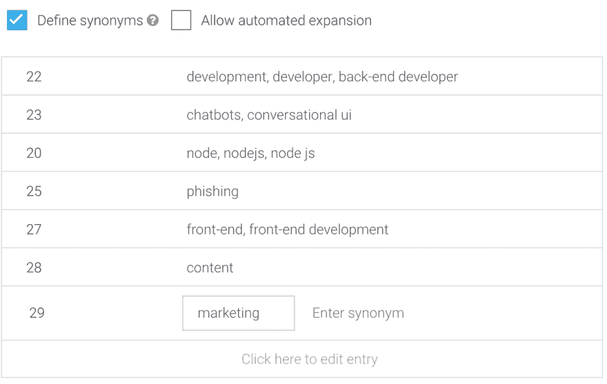
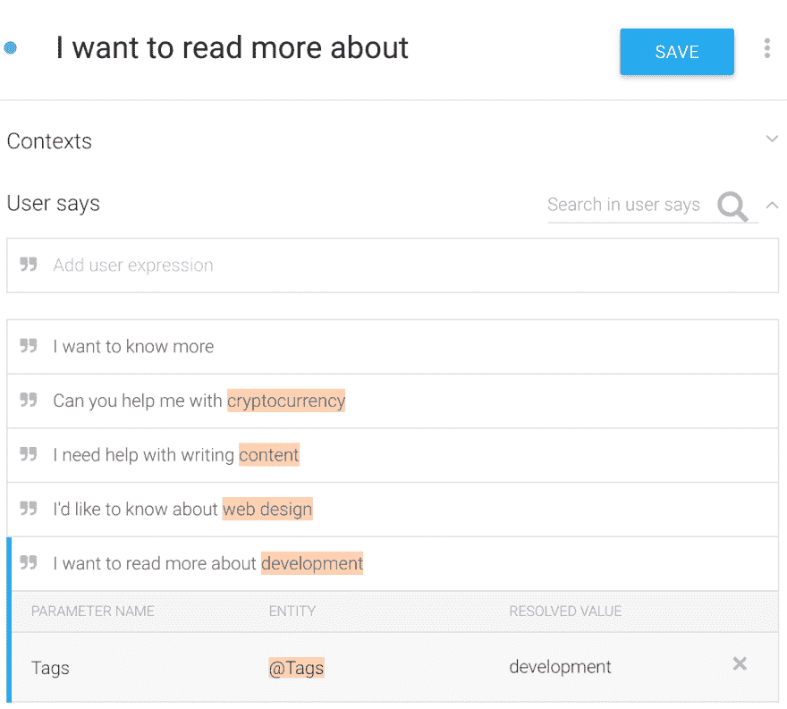
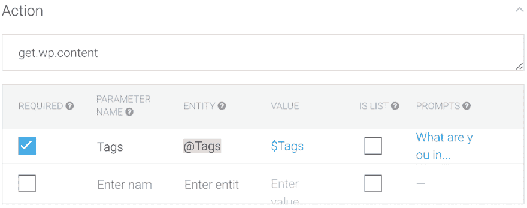
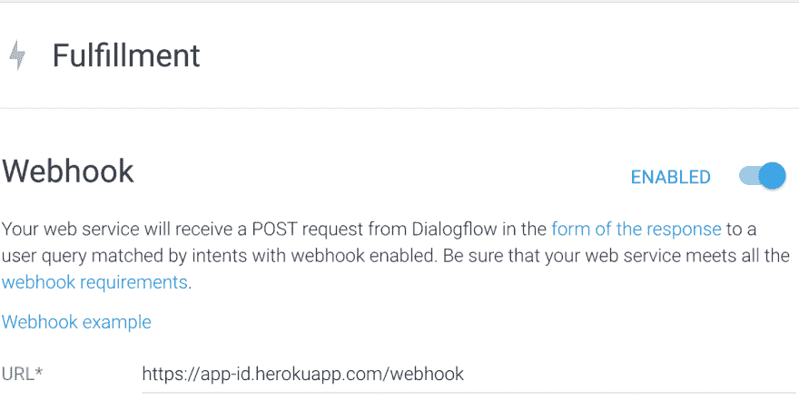

# 用节点 JS 将 WordPress 集成到 DialogueFlow 中

> 原文:[https://dev . to/attacous studio OS/integrating-WordPress-into-dialogueflow-with-node-js-594 o](https://dev.to/assaultoustudios/integrating-wordpress-into-dialogueflow-with-node-js-594o)

WordPress API 为开发者打开了许多大门——尤其是在管理其他网络应用和移动应用的内容方面。在这种情况下，我们将看看如何将 WordPress API 集成到 Dialogflow 和 Node JS 中，以向脸书信使提供内容。本教程解释了一些基本概念，但是 Node 和 Dialogflow 的工作知识将是有益的。 **PS 我是为中级开发人员写的，作为一名中级开发人员，可以随意跳过一些简单的概念**

在开始之前，请确保您已经完成了以下工作(链接可用):

*   安装了一个工作版本的[节点 JS](https://nodejs.org/en/download/)
*   安装了 [Heroku CLI](https://devcenter.heroku.com/articles/heroku-cli)
*   创建了一个新的[节点项目](https://blog.risingstack.com/node-hero-tutorial-getting-started-with-node-js/)
*   创建了一个空的 [GIT 仓库](http://github.com/)
*   设置一个 [Dialogflow](https://console.dialogflow.com/api-client/) 账户
*   为 Chrome 安装了 [Postman](https://www.getpostman.com/) 或[JSONview](https://chrome.google.com/webstore/detail/jsonview/chklaanhfefbnpoihckbnefhakgolnmc?hl=en)(推荐)
*   可以访问 WordPress 博客，从中提取内容(我用[这个博客](http://diginauts.co.za/)作为例子)

## 设置意图

### 设置我们的标签为实体

为了让我们的聊天机器人理解我们的用户正在寻找什么类型的内容，我们需要 Dialogflow 使用其自然语言功能来理解用户意图中的标签。为此，我们将设置一个[实体](https://dialogflow.com/docs/entities)。实体是消息中的内容类型，允许我们的机器人有更多的上下文；例如地点或日期。我们需要将标签创建为实体，因为我们稍后将使用它们从我们的 WordPress 博客中提取特定内容。

首先，单击 Dialogflow 控制台左侧的*实体*选项卡。确保您的实体有一个语义名称(如*标签*，并勾选*定义同义词*框。将每个标记作为新行添加:在第一列中，添加标记号(或 ID ),在第二列中列出该标记的所有不同的同义词。标签号将使我们更容易从我们的 webhook 中通过标签获取帖子——你可以通过在 WordPress 中编辑标签，或者调用 API URL 来获取所有标签。完成后，点击*保存*并前往*意图*选项卡。

[T2】](https://res.cloudinary.com/practicaldev/image/fetch/s--wERREW8S--/c_limit%2Cf_auto%2Cfl_progressive%2Cq_auto%2Cw_880/https://thepracticaldev.s3.amazonaws.com/i/dghsas2f5emh0goa1gkk.png)

### 创建内容交付意向

我们现在将设置一个 [Intent](https://dialogflow.com/docs/intents) 来使我们能够向用户交付内容。一个好的策略是给你的意图起一个类似于用户可能会问的名字——当你有超过 10 个意图时，这特别有用。接下来我们添加一个用户输入的例子。在这种情况下，我们使用*我想了解更多关于发展的信息。*为了让 Dialogflow 理解用户消息上下文中的*开发*，我们需要将单词映射到我们的实体。选择整个单词，entity 菜单应该会自动打开——向下滚动或使用过滤器选择我们创建的 tag (@tag)实体。

[T2】](https://res.cloudinary.com/practicaldev/image/fetch/s--CndrUQtS--/c_limit%2Cf_auto%2Cfl_progressive%2Cq_auto%2Cw_880/https://thepracticaldev.s3.amazonaws.com/i/ko9wmz6w8mwv4ezuuf4b.png)

### 训练我们的机器人

如果我们现在在右侧的消息控制台中发送一条*我想阅读更多关于开发*的测试消息，您会注意到 Dialogflow 返回一条空消息，带有一组*标签*的*参数*和一个 *22* 的*值*(这是*开发*标签的 ID)。如果我们将消息更改为*，我想阅读更多关于内容*的内容；我们得到类似的响应，但是我们的标记参数的值将是内容。这意味着 Dialogflow 能够理解我们的信息，并辨别出我们想要具体了解的发展或内容。

然而，如果我们将消息更改为*我想了解更多关于网页设计的信息，* Dialogflow 在大多数情况下将无法理解我们所指的标签。这是因为我们的机器人需要一些额外的训练——这意味着我们需要添加更多可能的用户消息。这些可能包括*我想了解更多，告诉我更多，我想了解，你能帮我吗。*您可以向 Dialogflow 添加的场景数量没有限制；但 10 英镑通常就够了。当您添加这些消息时，您可能会发现 Dialogflow 会自动选取实体，这意味着您的培训正在起作用。

### 设置动作，使标签成为必需的实体

webhooks 的一个要求是要有一些东西来识别我们的意图。这可以通过许多方式来实现，但是我建议使用意图的 action 属性。Dialogflow 将获取整个 intent 的有效负载(一个 JSON 对象)并将其发送到我们的 webhook。然后，我们可以访问有效负载，检查 action 键的值，并最终使用它来构建我们的逻辑。稍后我将向您展示这是如何工作的，但与此同时，只要将您的意图输入到动作输入字段中，就可以给它一个动作。称之为语义——在我的例子中，我使用了 *get.wp.content.*

接下来，我们需要确保我们的机器人在向我们的机器人发送有效载荷时总是有一些上下文。如果你问你的机器人类似于*我想知道更多*的问题，你会注意到它无法获得我们的*标签*实体——因为我们的消息不包含实体。为了解决这个问题，我们需要通过勾选动作输入字段下面的这个框，将我们的标签实体设置为 *required* 。我们还需要为我们的机器人提供一种方法来请求这些信息，这可以通过选择 prompts 列并添加一个提示来获得更多信息来实现。好的例子包括*你需要什么帮助？*或*你的职业是什么？*

[T2】](https://res.cloudinary.com/practicaldev/image/fetch/s--VMXHzUaH--/c_limit%2Cf_auto%2Cfl_progressive%2Cq_auto%2Cw_880/https://thepracticaldev.s3.amazonaws.com/i/uj8g65tqpujgist37nrw.png)

一旦完成，保存你的意图，我们现在应该准备好继续构建我们的 webhook 并将其集成到 WordPress 博客中。

## 创建 webhook

网上有大量预建 webhooks 的存储库；但是为了本文的目的，我们将从头构建一个。我将提供代码示例，但这不一定是节点教程，所以如果您有任何问题，请留下评论。也欢迎你叉这个项目的回购。

### 设置我们的项目

对于我们的 webhook，我们将使用 [express](https://www.npmjs.com/package/express) 、 [body-parser](https://www.npmjs.com/package/body-parser) 和 [request](https://www.npmjs.com/package/request) 包。首先，我们将通过 npm install 安装这些软件包:

```
npm install express body-parser request 
```

<svg width="20px" height="20px" viewBox="0 0 24 24" class="highlight-action crayons-icon highlight-action--fullscreen-on"><title>Enter fullscreen mode</title></svg> <svg width="20px" height="20px" viewBox="0 0 24 24" class="highlight-action crayons-icon highlight-action--fullscreen-off"><title>Exit fullscreen mode</title></svg>

一旦安装了这些包，就可以通过组织资源来设置项目的其余部分。我将把我所有的代码(除了 server.js)保存在一个 lib 文件夹中；这将帮助我们分割我们的功能，使我们的代码更具可读性和可重用性。最后，不要忘记[添加 node_modules 到。gitignore](https://chaseadams.io/2015/07/my-gitignore-conventions/) ！

首先，在您的项目根目录下创建一个名为 server.js 的新文件。这将包含我们所有的 express 代码，并且将成为我们的默认脚本。打开 server.js，从导入 express 和 body-parser 模块开始——我们将使用 [ES6](http://es6-features.org/) 。

```
// Modules
const express = require('express');
const bodyParser = require('body-parser'); 
```

<svg width="20px" height="20px" viewBox="0 0 24 24" class="highlight-action crayons-icon highlight-action--fullscreen-on"><title>Enter fullscreen mode</title></svg> <svg width="20px" height="20px" viewBox="0 0 24 24" class="highlight-action crayons-icon highlight-action--fullscreen-off"><title>Exit fullscreen mode</title></svg>

接下来，我们将 app 声明为一个新的 express 实例，并将 body-parser 作为中间件[添加到其中，以使我们能够从 Dialogflow 中读取 JSON 有效负载。](http://expressjs.com/en/guide/using-middleware.html) 

```
// Express set up
let app = express();
app.use(bodyParser.json()); 
```

<svg width="20px" height="20px" viewBox="0 0 24 24" class="highlight-action crayons-icon highlight-action--fullscreen-on"><title>Enter fullscreen mode</title></svg> <svg width="20px" height="20px" viewBox="0 0 24 24" class="highlight-action crayons-icon highlight-action--fullscreen-off"><title>Exit fullscreen mode</title></svg>

设置好 express 应用程序后，我们需要启动自己的服务器。Express 要求我们设置端口号以启动服务器；而是因为 Heroku 在服务器运行时分配端口；我们需要从 Heroku 环境中获取端口号。为了实现这一点，我们使用 process.env.PORT，如果不存在环境端口，默认端口为 3100。你可以在这里阅读更多关于这个[的内容。你的代码现在应该看起来像这样:](https://www.twilio.com/blog/2017/08/working-with-environment-variables-in-node-js.html) 

```
// Modules
const express = require('express');
const bodyParser = require('body-parser');

// Set port for server
const port = process.env.PORT || 3100;

// Express set up
let app = express();
app.use(bodyParser.json());

// Start server
app.listen(port, () => {
    console.log(`Listening on port ${port}`)
}); 
```

<svg width="20px" height="20px" viewBox="0 0 24 24" class="highlight-action crayons-icon highlight-action--fullscreen-on"><title>Enter fullscreen mode</title></svg> <svg width="20px" height="20px" viewBox="0 0 24 24" class="highlight-action crayons-icon highlight-action--fullscreen-off"><title>Exit fullscreen mode</title></svg>

现在就这样——我们已经拥有了开始编写 webhook 所需的一切。

### 书写我们的 webhook 路线

Dialogflow 需要一个路由才能与我们的 webhook 成功通信。我们将创建一个新的邮政快递路线来处理这个问题。我将这个路由命名为 */webhook* ，以使我们的代码更具可伸缩性，如果我们以后想要添加更多的路由的话。在主体解析器中间件加载之后的行中，创建一个新的 post route:

```
app.post('/webhook', (req, res, next) => {  
}); 
```

<svg width="20px" height="20px" viewBox="0 0 24 24" class="highlight-action crayons-icon highlight-action--fullscreen-on"><title>Enter fullscreen mode</title></svg> <svg width="20px" height="20px" viewBox="0 0 24 24" class="highlight-action crayons-icon highlight-action--fullscreen-off"><title>Exit fullscreen mode</title></svg>

在我们的 webhook 路由中，让我们从 Dialogflow 有效负载中获取动作。如果您不确定有效负载是如何构造的，可以在控制台右侧发送测试消息时查看 Dialogflow 中的 JSON 结构。在我们的 JSON 对象中，动作在有效负载的结果对象中。我们需要通过获取请求对象的主体来访问它——请求对象是通过 post 发送到我们的 webhook 路由的任何信息。我们的主体解析器中间件将允许我们从请求对象中获取主体，我们将把它存储在一个名为 action 的新变量中。我们还要声明另一个名为 message 的空变量(这将是我们的 webhook 发送回 Dialogflow 的消息)。

```
let action = req.body.result.action;
let message = ''; 
```

<svg width="20px" height="20px" viewBox="0 0 24 24" class="highlight-action crayons-icon highlight-action--fullscreen-on"><title>Enter fullscreen mode</title></svg> <svg width="20px" height="20px" viewBox="0 0 24 24" class="highlight-action crayons-icon highlight-action--fullscreen-off"><title>Exit fullscreen mode</title></svg>

最后一步是使用我们的 routes response 对象向 Dialogflow 发回一个响应——这是通过调用 res.send 完成的。我们将发回一个包含我们的消息的 JSON 对象，它构成 Dialogflow 的[实现生命周期](https://dialogflow.com/docs/fulfillment)的一部分。我们还将使用一个简单的 if/else 三元组来检查我们是否点击了在 Dialogflow 中设置的 *get.wp.content* 动作。我们的 server.js 文件应该是这样的:

```
const express = require('express');
const bodyParser = require('body-parser');

const port = process.env.PORT || 3100;

let app = express();
app.use(bodyParser.json());

app.post('/webhook', (req, res, next) => {

    let action = req.body.result.action;
    let message = action === 'get.wp.content' ? `Hey, our webhook is connected!` : `Sorry, I didn't get that`;

    res.send({
        speech: message,
        displayText: message,
        source: 'wp-webhook',
    });

});

app.listen(port, () => {
    console.log(`Listening on port ${port}`)
}); 
```

<svg width="20px" height="20px" viewBox="0 0 24 24" class="highlight-action crayons-icon highlight-action--fullscreen-on"><title>Enter fullscreen mode</title></svg> <svg width="20px" height="20px" viewBox="0 0 24 24" class="highlight-action crayons-icon highlight-action--fullscreen-off"><title>Exit fullscreen mode</title></svg>

### 连接我们的 webhook

现在我们的基本 webhook 已经完成，需要上传到 [Heroku](https://www.heroku.com/) 。Heroku 为 Node(以及更多)应用程序提供免费托管，必要时可以选择扩展，这使得它成为部署我们的 webhook 的一个很好的选择。Dialogflow 要求 webhooks 托管在 https 上，Heroku 也负责这项工作。

首先，让我们将 *cd* 放入你的项目文件夹，并通过在终端或命令提示符下运行 *heroku create* 来创建一个新的 Heroku 应用程序。如果要求您登录，请使用您的 Heroku 凭据并重试该命令。创建后，您将看到一个唯一的 Heroku url，这是我们稍后将在 Dialogflow 中使用的链接。接下来，我们将所有文件添加到 git repo 中，并提交它们。最后一步是通过运行 git push heroku master 将这些文件推送到我们的 Heroku 应用程序。

```
heroku create
git add .
git commit -m "Init webhook"
git push heroku master 
```

<svg width="20px" height="20px" viewBox="0 0 24 24" class="highlight-action crayons-icon highlight-action--fullscreen-on"><title>Enter fullscreen mode</title></svg> <svg width="20px" height="20px" viewBox="0 0 24 24" class="highlight-action crayons-icon highlight-action--fullscreen-off"><title>Exit fullscreen mode</title></svg>

一旦你向上推你的代码，它将运行所有必要的构建步骤，一旦完成，你应该看到*构建成功！*控制台内。您现在可以通过运行 heroku open 来测试您的应用程序，这将打开您的 heroku 应用程序。您应该会看到一条错误消息；*不能得到/；*这很正常，因为我们还没有设置这条路线。

既然我们的 webhook 正在工作，我们需要在 Dialogflow 中启用实现。为此，请单击左侧菜单中的 fulfillment 选项卡，并在此页面上启用它。将您的 webhook url(您必须包含/webhook)粘贴到第一个输入中并保存。

[T2】](https://res.cloudinary.com/practicaldev/image/fetch/s--Tgo6RRU8--/c_limit%2Cf_auto%2Cfl_progressive%2Cq_auto%2Cw_880/https://thepracticaldev.s3.amazonaws.com/i/owv0b4icmg45rqi4g644.png)

最后一步是进入我们对 Dialogflow 的意图，并在页面的 fulfillment 部分(就在底部)启用*使用 webhook* 。单击保存，等待代理进行训练。现在，当您将*我想阅读更多关于开发的信息*发送到右侧的测试控制台时，您应该会看到*嘿，我们的 webhook 已连接！*作为回应！

## 获取 WordPress 文章

对于下一部分，我建议你使用类似 Postman 的东西来更好地理解来自 WordPress API 的响应。如果你没有自己的博客来获取内容，你可以使用 Diginauts(根据这个演示),因为它的流量很低。要做一些测试，在 Postman(或浏览器)中点击[http://your site . coma/WP-json/WP/v2/posts](http://yoursite.com/wp-json/wp/v2/posts)，您应该会看到一个 JSON 对象，其中包含该博客的帖子列表。这就是我们所有帖子的结构，我们稍后将使用这些信息来格式化我们的脸书信使回复。

我们还可以获得带有特定标签的帖子，如果你点击[http://yoursite.com/wp-json/wp/v2/posts?tags=22](http://yoursite.com/wp-json/wp/v2/posts?tags=22)，你只会看到带有*发展*标签的帖子。这是一个好消息，因为这意味着我们现在可以使用我们的 Dialogflow 标签参数来获取我们需要的帖子。

### 设置 API 请求

回到我们的项目，我将在我们的 *lib* 文件夹中创建一个名为 *wordpress* 的新文件夹，并创建一个名为 *wordpress.js* 的新文件。我们需要做的第一件事是加载我们之前安装的*请求*模块，因为我们将发出一个 API 请求。我还将声明一个带有 API 链接的新变量。

```
const request = require('request');
const api = 'http://yourblog.com/wp-json/wp/v2/'; 
```

<svg width="20px" height="20px" viewBox="0 0 24 24" class="highlight-action crayons-icon highlight-action--fullscreen-on"><title>Enter fullscreen mode</title></svg> <svg width="20px" height="20px" viewBox="0 0 24 24" class="highlight-action crayons-icon highlight-action--fullscreen-off"><title>Exit fullscreen mode</title></svg>

我们现在想设置一个函数，允许我们从 WordPress API 加载文章。我们的函数将接受两个参数，一个是我们要获取内容的标签，另一个是 API 调用完成时的回调。

```
let getPosts = (tag, callback) => {
} 
```

<svg width="20px" height="20px" viewBox="0 0 24 24" class="highlight-action crayons-icon highlight-action--fullscreen-on"><title>Enter fullscreen mode</title></svg> <svg width="20px" height="20px" viewBox="0 0 24 24" class="highlight-action crayons-icon highlight-action--fullscreen-off"><title>Exit fullscreen mode</title></svg>

现在我们想为我们的 API 调用构造 URL。有各种方法可以做到这一点，理想情况下，您希望通过向我们的 API URL 添加更多逻辑来重构 getPosts 函数，但现在我们将保持简单。我们的 API 调用有三个要求:首先我们将点击 WordPress API 的/post 路径，这将允许我们获得帖子。其次，我们需要添加一个 URL 参数，以便只通过 ID 获取特定标签的帖子。最后，我们希望添加 _embed 参数，因为这将在我们的有效负载中包含特色图像。我将使用 [ES6 模板字符串](https://developer.mozilla.org/en-US/docs/Web/JavaScript/Reference/Template_literals)嵌入所有这些。

```
let getPosts = (tag, callback) => {
    let url = `${api}/posts?tags=${tag}&_embed`;
} 
```

<svg width="20px" height="20px" viewBox="0 0 24 24" class="highlight-action crayons-icon highlight-action--fullscreen-on"><title>Enter fullscreen mode</title></svg> <svg width="20px" height="20px" viewBox="0 0 24 24" class="highlight-action crayons-icon highlight-action--fullscreen-off"><title>Exit fullscreen mode</title></svg>

### 处理错误和未发现的情况

我们现在准备使用*请求*模块向 WordPress API 发出请求。请求带有两个参数:我们的 API URL(或者一个带有数据的对象)和一个带有错误、响应和主体参数的回调函数。在 I 'd 语句中，我们将处理错误和成功的情况。现在，让我们通过添加用户友好的错误消息并返回错误来调用我们的回调。

```
let getPosts = (tag, callback) => {
    let url = `${api}/posts?tags=${tag}&_embed`;
    request({url}, (err, res, body) => {
        if (err) {
            callback('Sorry, there was an error getting posts from our blog', err)
        } else {
        }
    });
} 
```

<svg width="20px" height="20px" viewBox="0 0 24 24" class="highlight-action crayons-icon highlight-action--fullscreen-on"><title>Enter fullscreen mode</title></svg> <svg width="20px" height="20px" viewBox="0 0 24 24" class="highlight-action crayons-icon highlight-action--fullscreen-off"><title>Exit fullscreen mode</title></svg>

对于我们的 not found 和 success 案例，我们需要首先[解析](https://www.w3schools.com/js/js_json_parse.asp)我们的响应主体，因为 WordPress API 将返回一个字符串化的 JSON 对象数组，并将它赋给一个变量。一旦我们解析了响应，我们需要检查数组中的条目数量——如果数组为空，则没有条目返回，因此我们可以通过友好的消息让用户知道。

```
let getPosts = (tag, callback) => {
    let url = `${api}/posts?tags=${tag}&_embed`;
    request({url}, (err, res, body) => {
        if (err) {
            callback('Sorry, there was an error getting posts from our blog', err)
        } else {
            let posts = JSON.parse(body);
            if (posts.length === 0) 
                callback(`It doesn't seem like there's any content available on this topic`);
            }
        }
    });
} 
```

<svg width="20px" height="20px" viewBox="0 0 24 24" class="highlight-action crayons-icon highlight-action--fullscreen-on"><title>Enter fullscreen mode</title></svg> <svg width="20px" height="20px" viewBox="0 0 24 24" class="highlight-action crayons-icon highlight-action--fullscreen-off"><title>Exit fullscreen mode</title></svg>

### 处理成功案例

在数组长度检查中添加一个 else 语句，以处理成功的情况。WordPress API 返回了很多我们的脸书卡不需要的数据，所以我们需要将数据映射到一个新的数组中，并且只获取我们需要的信息。同时，按照脸书要求的[格式构造我们的数组，以便在 messenger 中显示卡片，这将是有益的。我们需要的大部分信息可以通过遍历我们的 API 响应来找到(您可以使用 Postman 来更好地查看这个响应是什么样子)。对于副标题，我们需要去掉所有的 HTML 标签和实体，以确保我们向脸书发送一个干净的字符串，因为 API 不会返回一个干净的字符串——我们可以用 regex 做到这一点。最后，我们需要得到我们的特色形象。这深深嵌入到我们的 API 响应中，当引用 *wp:featuremedia* 时，你必须使用括号符号，因为它包含一个冒号。](https://developers.facebook.com/docs/messenger-platform/send-messages/template/generic)

对于我们的成功案例，我们需要做的最后一件事是向我们的机器人的响应添加一条文本消息，因为如果我们的用户只获得一系列文章，这将是很奇怪的。我们可以通过使用 unshift 在 formattedPosts 数组的开头添加一条自定义消息来实现这一点。完成后，我们可以通过将第一个参数设置为 undefined(因为没有错误)并设置第二个参数等于 formattedPosts 来调用回调。通过 module.exports 导出 getPosts，我们就完成了 wordpress 模块。

```
const request = require('request');
const api = 'http://diginauts.co.za/wp-json/wp/v2';

let getPosts = (tag, callback) => {
    let url = `${api}/posts?tags=${tag}&_embed`;
    request({url}, (err, res, body) => {
        if (err) {
            callback('Sorry, there was an error getting posts from our blog', err)
        } else {
            let posts = JSON.parse(body);
            if (posts.length === 0) {
                callback(`It doesn't seem like there's any content available on this topic`);
            } else {
                let formattedPosts = posts.map((post) => {
                    return {
                        type: 1,
                        platform: 'facebook',
                        title: post.title.rendered,
                        subtitle: post.excerpt.rendered.replace(/<(?:.|\n)*?>/gm, '').replace(/&[^\s]*/, ''),
                        imageUrl: post._embedded['wp:featuredmedia'][0].media_details.sizes.listing.source_url,
                        buttons: [
                            {
                                text: 'Read more',
                                postback: post.link
                            }
                        ]
                    }
                });

                formattedPosts.unshift({
                    type: 0,
                    platform: 'facebook',
                    speech: 'Sure, here are some helpful articles'
                });

                callback(undefined, formattedPosts);
            }
        }
    });
}

module.exports = {getPosts}; 
```

<svg width="20px" height="20px" viewBox="0 0 24 24" class="highlight-action crayons-icon highlight-action--fullscreen-on"><title>Enter fullscreen mode</title></svg> <svg width="20px" height="20px" viewBox="0 0 24 24" class="highlight-action crayons-icon highlight-action--fullscreen-off"><title>Exit fullscreen mode</title></svg>

## 把一切联系在一起

由于我们的 post 数据已经准备好被使用，我们可以继续从 *server.js* 向 Dialogflow 发送一个响应。首先，让我们使用 require 导入我们的 wordpress.js 模块，并删除我们的消息变量以及用于发送响应的现有代码。为我们将传递给 getPosts 函数的标记创建一个新变量，并将其设置为 Dialogflow 有效负载的 parameters 属性。

```
const express = require('express');
const bodyParser = require('body-parser');

const wordpress = require('./lib/wordpress/wordpress');

const port = process.env.PORT || 3100;

let app = express();
app.use(bodyParser.json());

app.post('/webhook', (req, res, next) => {

    let action = req.body.result.action;
    let tag = req.body.result.parameters.tags;

});

app.listen(port, () => {
    console.log(`Listening on port ${port}`)
}); 
```

<svg width="20px" height="20px" viewBox="0 0 24 24" class="highlight-action crayons-icon highlight-action--fullscreen-on"><title>Enter fullscreen mode</title></svg> <svg width="20px" height="20px" viewBox="0 0 24 24" class="highlight-action crayons-icon highlight-action--fullscreen-off"><title>Exit fullscreen mode</title></svg>

我们现在可以通过导入的 wordpress 模块调用 getPosts 函数了。这个函数将我们的标签作为参数，后面跟着我们的回调函数。我们的回调函数有自己的参数:一条错误消息和我们的帖子内容。如果出现错误消息，我们可以使用之前使用的 JSON 格式将该错误消息作为 Dialogflow 响应发送给用户。对于我们的成功案例(即 errorMessage 未定义)，我们可以将我们的帖子内容发送到 Dialogflow，但这次我们将通过 *message* 属性发送它。*消息*属性包含不同平台和类型的消息数组，因为我们在 wordpress.js 中指定了这个数组，所以我们可以简单地发送我们的 *postContent* 变量。将语音和显示文本留空，因为我们不需要一般的响应。

```
const express = require('express');
const bodyParser = require('body-parser');

const wordpress = require('./lib/wordpress/wordpress');

const port = process.env.PORT || 3100;

let app = express();
app.use(bodyParser.json());

app.post('/webhook', (req, res, next) => {

    let action = req.body.result.action;
    let tag = req.body.result.parameters.tags;

    wordpress.getPosts(tag, (errorMessage, postContent) => {
        if (errorMessage) {
            res.status(400).send({
                speech: errorMessage,
                displayText: errorMessage,
                source: 'wp-webhook',
            });
        } else {
            res.status(200).send({
                speech: '',
                displayText: '',
                source: 'wp-webhook',
                messages: postContent
            });
        }
    });

});

app.listen(port, () => {
    console.log(`Listening on port ${port}`)
}); 
```

<svg width="20px" height="20px" viewBox="0 0 24 24" class="highlight-action crayons-icon highlight-action--fullscreen-on"><title>Enter fullscreen mode</title></svg> <svg width="20px" height="20px" viewBox="0 0 24 24" class="highlight-action crayons-icon highlight-action--fullscreen-off"><title>Exit fullscreen mode</title></svg>

将此代码推送到 Heroku，并在 Dialogflow 控制台中测试您的意图。您可以将响应类型切换到脸书信使，以测试卡是否正常通过。如果您对结果满意，[通过 _Integrations _tab 将 Dialogflow 连接到脸书信使](https://dialogflow.com/docs/integrations/facebook)，您就可以开始了。

## 进一步说明

*   重构我们的代码并创建一个用于创建脸书卡片的函数可能会有好处。目前我们的 getPost 函数相当混乱，最好将这些问题分开
*   有时人们可能会提供多个标签——dialog flow 能够解释列表中的实体。我们的代码将需要修改相当大，但它应该是可行的。
*   记得经常训练你的机器人——没有什么比和机器人聊天时走进死胡同更糟糕的了！
*   集成到 Chatbase 是必须的，特别是如果你通过聊天渠道提供大量的内容
*   考虑其他聊天渠道——Slack 是一个很好的渠道，也提供卡片
*   启用缓存，以便 bot 响应更快。