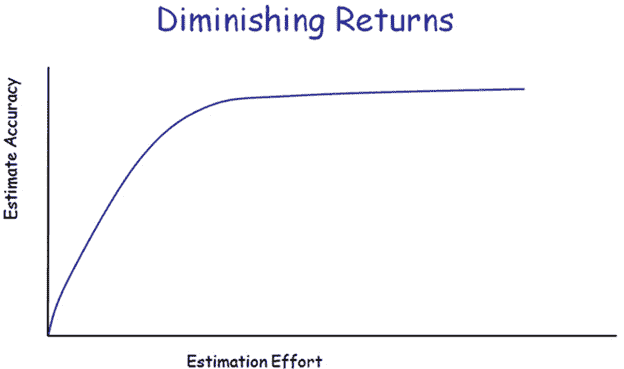

# 发布计划和可预测的交付

> 原文:[https://dev . to/nkd agility/release-planning-and-predictable-delivery-2di 4](https://dev.to/nkdagility/release-planning-and-predictable-delivery-2di4)

许多组织努力解决敏捷和发布管理之间看似不兼容的问题，他们努力解决发布计划和可预测的交付。

## TL；DR；

没有可用的软件，你就无法建立信任，你也不知道什么时候你会得到下一个可用的软件。

你创建的任何软件都是组织的资产，降低质量的决定需要反映在你的公司账目中，因此这些决定需要由你的执行领导层做出，而不应该由开发团队做出。一旦你接受了这一点，并且质量变得不可协商，你的[开发团队](https://nkdagility.com/training/courses/professional-scrum-developer-training/)就可以专注于创建可交付的工作软件增量。一旦你有了可交付的工作软件增量，你就可以开始感兴趣地关注特性和目标的进展。

如果没有一个正常的工作软件交付节奏，任何认为你会得到工作软件的想法都是被误导的。专业开发团队创建工作软件。

## 发布计划和可预测交付

可预测的交付和敏捷之间的不兼容是虚构的 <small>( [推特这个](http://clicktotweet.com/Ub4K3) )</small> 虽然通常是由不愿意放弃旧方式和拥抱敏捷的租户的组织和结构创建的，但它也可能是团队热衷于放弃所有带有预先计划味道的事情的结果。人们缺乏对敏捷和通往敏捷之路的理解，这不仅仅是你构建软件的方式的改变，而是你经营业务的方式的根本转变。就像制造业中的精益运动一样，全心全意接受它的公司最终看到了它提供的竞争优势。如果一个人不愿意放弃旧的方式，那么他就不能获得新的价值。这种改变需要艰苦的工作和勇气，因为有效检查和适应所需的基本透明度与过去的措施不一致。软件开发缺乏可预测性是理解新模型的关键。

## 为什么软件如此不可预测

**所有的软件开发都是产品开发。**在精益制造中，我们可以通过可预测生产的性质来优化预开发产品的生产。每个工作单元都需要相同数量的材料和时间来生产，因此我们对流程、时间或材料所做的任何更改都可以很容易地进行验证，并展示其优势。**制造业生活在预测的世界里。**

有了软件，我们创造的一切都需要自己的时间:你真的只能知道事情完成后花了多长时间。即使在制造业，如果你问工程师开发一种新型的工作单位需要多长时间，他们也不能肯定地告诉你。然而，一旦他们开发出来，他们可以准确地告诉你制作每一个需要多长时间，然后系统地优化你用来制作它的过程。在软件开发中，我们总是在做新产品设计，因此，我们没有确定性…这经常导致混乱。软件生活在经验世界中。

然而，我们还没有失去一切，通过查看我们类似产品的交付历史，我们可以做出非常好的**预测** …

我们所能做的最好的事情就是尽可能地做出准确的预测，同时承认花更多的时间做计划并不一定会影响预测的准确性。

 

<small>图:收益递减[敏捷估算——估算方法](http://leadinganswers.typepad.com/leading_answers/2007/11/agile-estimatin.html)</small>

归根结底，软件开发是一种创造性的努力，与绘画、写书或拍电影一样缺乏可预测性。然而电影一直都在制作。这怎么可能！他们有一个拥有大量资金和交付计划的导演(产品负责人)，一个确保每个人在正确的时间和地点拥有技能、知识和资产的制片人(Scrum Master)，以及一个或多个拥有将导演的想法转化为工作电影所需的所有技能的单位(开发团队)。他们创建他们期望创建的故事板，以便他们可以将它传递给利益相关者并获得反馈。他们将这些故事板带到与特技、道具、灯光、摄像、音响和服装人员合作的单位，以获得预算和成本，并最终协调创作这部电影。有时他们不知道如何做事情，只是不得不试一试，看看他们得到了什么。

制作一部电影就像制作软件一样，你需要一个预算，你需要一个计划，并且你正在努力达到一个出货日期。就像构建软件一样，最终你必须赚钱，这样你才能从头再来。

## 接受缺乏预见性

虽然我希望现在你已经明白缺乏可预测性是构建软件的一部分，但是我们可以做很多事情来减少这种混乱的影响。事实上，如果你要估计你需要做的所有谨慎的事情来实现一个小、中、大的目标(让我们称之为待办事项),你的实际时间的标准差会是多少？我敢打赌它相当大。事实上如此之大，以至于至少有一半的介质被更准确地归类为大介质。但是这种重新分类只能在事后进行。这确实是无估计运动的一个租户，因为实际上只有三种大小分类:**微不足道，** **适合冲刺**，或者**太大**不适合冲刺。

这种评估上的困难对于向敏捷发展的组织来说是正常的，因为它带来的透明性揭示了这类问题。为了提高我们预测的准确性，我们可以执行一些简单的活动。这些活动虽然容易理解，但很难做到，因为它们需要组织内部的文化转变以及参与者的勇气来使它们发挥作用。

### 关注持续质量

大多数软件缺乏质量，原因很简单，你不能像看一张表或一幅画那样容易地看到软件的质量。我不是在说用户界面的质量，而是在幕后的质量；代码的质量。

> 如果你让开发人员承受交付的压力，他们会不断地降低质量以满足最后期限。<small>-未知([推特本](http://clicktotweet.com/0U2be) )</small>

代码质量的缺乏导致了技术债务(或者更准确地说，未对冲基金)的增加，这反过来又导致了两个问题。第一个是团队越来越多地不得不花更多的时间在软件的复杂性上，而不是在新特性上。如果你仍然推动你的团队每年交付相同的特性级别，你只是鼓励他们削减更多的质量，从而招致更多的技术债务，这就变成了一个恶性循环。第二是在生产中发现越来越多的错误。在生产中发现的 bug 也会直接影响到团队可以交付的特性的数量，任何 bug，无论多小，在生产中修复的成本都是开发中的十倍。

处理技术债务的唯一方法是停止创建它，然后在每次迭代中偿还一点。然而，如果你深陷于技术债务中，以至于在迭代结束时不能创建工作软件，那么:

1.  创建一个简短的可测量清单,反映最小可发布产品(完成的定义)
2.  停止添加新功能，让你的产品符合清单，发布你的产品
3.  当你有一个增量的工作软件(Sprint)时
    1.  **努力创造有价值的东西(增量)**
    2.  在满足 DOD(冲刺目标)的同时，朝着新的目标努力
    3.  让事情变得比你发现时更好(卓越工程)
    4.  **和你利益相关者一起评审有价值的东西(冲刺评审，待办事项适应)**
    5.  为利益相关者获取至少一个新事物的反馈
    6.  更新 Backlog 以反映这些新信息
    7.  **反思你是如何与整个团队合作的(冲刺回顾，改善)**

4.  转到#1

你可以把从工作软件的 while 循环中退出的活动称为**Scrumble**；你需要停止在那些不起作用的特性上堆积更多的特性，并修复一些东西，这样你就可以创造新的东西。最终[专业团队会开发出有效的软件](https://dev.to/mrhinsh/professional-scrum-teams-build-software-that-works-4aie-temp-slug-8239734)。

有许多策略可以帮助你停止创造并开始偿还技术债务:

*   足够的需求——如果你的待办事项中有太多太模糊的东西，那么你的团队将无法真正理解它们，这反过来又会增加不确定性。对于您要求团队交付的每一件事情，都要遵循 INVEST(独立的、可协商的、有价值的、可评估的、小的、可测试的)模型。如果你以这种方式投资于你的 backlog，你会发现交付内容更容易，从而预测交付。这将需要你花大量的时间来完善。待定项细化是促进可操作的待定项流向您的团队的关键。
*   **开发团队选择他们可以交付什么**——这意味着开发团队可以拒绝待办事项中他们不理解的任何项目。如果我们承认每个开发团队都在尽力为他们的产品所有者交付产品，那么拒绝任何东西的唯一理由就是项目太大或者没有足够的细节来理解。这些待办事项可以放在队列中进行细化，并在下一个 Sprint 中进行细化。记住没有[没有被拒绝的待办事项](https://dev.to/mrhinsh/the-fallacy-of-the-rejected-backlog-item-8mk-temp-slug-8469265)，只有可操作的反馈和持续改进。
*   **完成的定义(DoD)**–除了有足够的需求，可预测性的最大障碍是缺乏对完成的共同理解。对于一个开发团队来说，完成应该等同于完成一个项目而不需要进一步的工作来发布它。如果[你不能发布工作软件](https://dev.to/mrhinsh/professional-scrum-teams-build-software-that-works-4aie-temp-slug-8239734)，那么你需要停止冲刺，Scrumble，并专注于让你的软件成为一个可以在冲刺中交付的形状。
*   **测试优先**–关注[测试优先实践，如 TDD 或 ATDD](https://dev.to/mrhinsh/you-are-doing-it-wrong-if-you-are-not-using-test-first-4pc8-temp-slug-8256556) 来帮助你确保不仅你的工程师构建了他们期望的东西，而且你最终构建了客户期望的东西。
*   **固定长度的迭代**–如果你有可变长度的迭代，你不能确定你能在特定的时间框架内做什么。你需要对 backlog 做多少分解？团队在一次迭代中能交付多少？你不能确定，除非你有固定长度的迭代，[你拒绝交错迭代的想法](https://dev.to/mrhinsh/a-better-way-than-staggered-iterations-for-delivery-1dcn-temp-slug-6610444)。
*   没有单独的团队——这意味着没有单独的测试团队、配置管理团队，当然也没有单独的维护团队。人们很难理解，特别是最近对开发运维的关注，但是如果你有单独的团队，那么为什么你的开发团队，那些最适合解决任何问题的团队，会关心其他团队的问题。创建软件最成功的组织拥有拥有整个应用程序生命周期的开发团队(Amazon AWS | Visual Studio。)
*   **管理依赖关系**–管理依赖关系是一项艰巨的任务，我的建议是尽量减少依赖关系的数量。一个开发团队应该拥有以您想要的质量水平交付您想要的东西所需的所有技能。因此，如果您需要生产数据库或用于生产交付的脚本，那么您可能需要一名 DBA 或一两名运营管理员。这对于许多团队或组织来说可能很难，但是创建像配置管理或 DevOps 这样的孤岛就不那么成功了。而是把你需要的人加入团队。然而，如果你依赖于一个单独的团队，也许你有一个应用程序依赖于你所有的其他应用程序，那么你可能需要另一种方法。这不是个人技能类型的筒仓，而是一个领域，团队只是在他们的积压中有一些你所依赖的东西。当这些事情完成时，由团队各自的产品负责人~~和~~协商决定。
*   **使用现代源代码控制系统**–一个[现代源代码控制系统不仅仅是代码管理](https://dev.to/mrhinsh/getting-started-with-a-modern-source-control-system-and-devops-13og-temp-slug-4418693)，它应该包括 DevOps 实践和其他实践中谈到的所有好东西。

如果可以，把它们都做了，还有更多…

帖子[发布计划和可预测交付](https://nkdagility.com/release-planning-and-predictable-delivery/)最早出现在[马丁辛舍尔伍德-裸体敏捷有限公司](https://nkdagility.com)上。