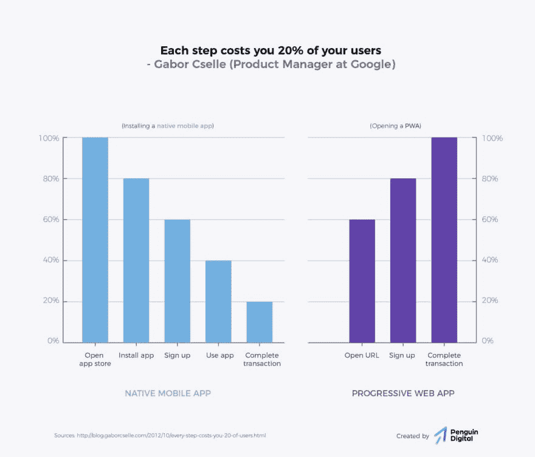

# 渐进式 Web 应用程序(第 1 部分)

> 原文：<https://dev.to/pa1nd/progressive-web-apps-part-1-20od>

作为企鹅，我们对一项新技术感到兴奋:

**渐进式网络应用。为什么？**

> 在转向渐进式网络应用后，全球速卖通的 iOS 转化率增加了 82%。这比他们看到的所有浏览器的增幅(104%)要小，但大多数企业会很乐意接受 82%的转化率增长。(例如，网站访问者转化为客户)《华盛顿邮报》的用户参与度增长了近 5 倍。

*来源:* [*云四*](https://cloudfour.com/thinks/ios-doesnt-support-progressive-web-apps-so-what/)

## 从“网站”到“网络应用”🚀

本文旨在解释一项伟大的全新技术的基础:渐进式网络应用(PWAs)。在第一部分，我将从商业角度展示 web 应用的潜力。第二部分将涵盖背后的技术，展示当前的局限性以及我们在不久的将来可以期待的。

首先:什么是 web 应用程序，你为什么会关注它？

app 和网站合二为一。就这么简单。不再需要“安装”应用程序。你现在可以访问一个网站，在那里你会看到一个“安装”按钮。一键完成。

**为什么 web 应用程序很棒？**

网站令人惊叹。你可以在谷歌或其他地方找到它们，然后访问它们——并使用它们。但是像脸书和推特这样的网站也提供应用程序。为什么？为什么那么多公司想创建一个 app？因为你有在网站上得不到的强大功能:离线可用性、推送通知、访问用户联系人或蓝牙。现在，多亏了“PWAs ”,我们也可以用“网站”做那些事情。

> 让我们停止称那些东西为“网站”,而是“网络应用”。

<figure> 

<figcaption>【网站】变成了“网络应用”</figcaption>

</figure>

## 欢迎来到未来

为了以防万一，你想了解更多关于 PWAs 的惊人可能性，这里有一些你应该感到高兴并考虑向你的数字机构询问网络应用的好理由:

1.  **可访问性**你可以创建像网站一样容易访问的“应用程序”。只需点击一下，用户就可以安装它。这不仅听起来不错，而且已经有相当多公司的博客帖子报告安装量大幅增加。
2.  你基本上创建了一个网站，现在可以在所有平台上作为应用程序使用。一个网站。还记得那段时间，你不得不创建一个网站、一个安卓应用、一个 iOS 应用，或许还要为微软再创建一个？现在你需要一个，你可以包括所有这些平台。这大大减少了工作量和成本。它还能让您更快地实现功能，等等…您已经了解了。
3.  开发人员:技能现在，你可以和一个团队一起工作，而不是用三种编程语言(每种平台一种语言)组成一个团队，或者雇佣两家公司。
4.  提升你的网站:就像一个应用程序一样它不仅是你将创建的令人惊叹的应用程序，而且你也为你的网站增加了超能力。你现在能做的是:–增加重新参与度:发送推送通知；–轻松实现:pwa 安装在主屏幕上并实时显示；–体验:PWAs 不会在浏览器中打开，而是全屏显示；–缓存内容，即使访问者离线也能访问网站；–优化您的加载时间并预加载所有内容。
5.  **更多的转化**安装一个原生应用需要更长的时间和更多的点击。每走一步，你都会失去大约 20%的用户。pwa 被更好地整合，你将失去更少的潜在用户。

<figure> 

<figcaption>渐进式网络应用整合更好，因此转化率更高</figcaption>

</figure>

## 但是等等！

如果没有限制，你不会相信，对吗？因此，您应该了解一些限制:

1.  目前，硬件密集型应用(例如虚拟现实/增强现实)仍然在原生应用中工作得更好。我对另一项正在大力开发的新技术感到兴奋:web assembly([http://webassembly.org/](http://webassembly.org/))将在以后解决这个问题。
2.  它是全新的。这通常是一件好事，但这也意味着并非所有的特性在每个平台上都可用。我们将在这篇文章的第二部分对此进行更多的讨论。

* * *

尽管存在这些问题，但现在正是开始将你的网站或应用提升到下一个水平的最佳时机。最好的事情:你从一个正在成长的技术开始，当新的特性对 PWAs 可用时，你将直接从它们中获益，而不需要或很少需要额外的努力！

在 Penguin，我们很高兴看到瑞士对 PWAs 的兴趣正在快速增长。如果您想了解更多关于这一令人敬畏的技术，请随时联系我们！

* * *

**更新:**你可以继续阅读背后的技术，目前的局限性以及我们在不久的将来可以期待的:**第二部现已在此:**[https://blog.penguin.academy/progressive-web-apps-part-2-/](https://blog.penguin.academy/progressive-web-apps--part-2-/)