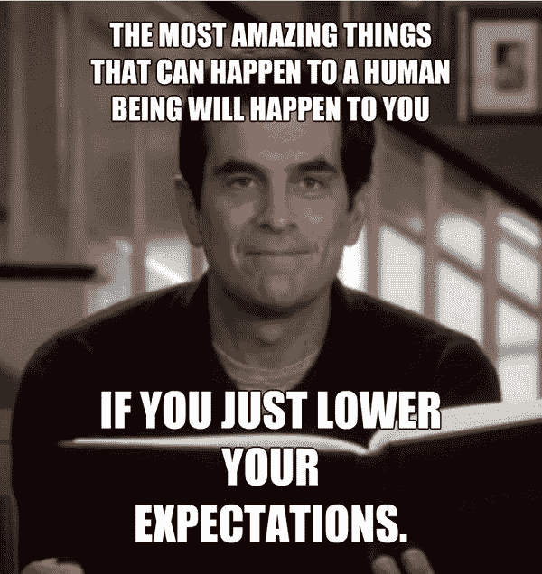

# 故事时间:这就是我的 2017 年

> 原文：<https://dev.to/michaeljota/story-time-this-is-how-my-2017-was-like-579h>

嗨陌生人！这将是一个个人帖子，将谈论编码以外的事情。我希望你喜欢。

去年的同一天，我在我的国家委内瑞拉。与家人和爱人一起庆祝圣诞节。我做得很好，但如果你不知道，委内瑞拉真的做得很好。我在另一个国家找工作，以便能够离开那里，也带我的家人离开。我每个月挣 40 美元。是的，先生，你没看错，整个月 40 美元。就那点工资，存钱去旅行真的很难，非常困难，尽管很多人真的去旅行了，带着 200 美元或更少的钱离开这个国家。尽管如此，我知道我可以得到一份工作，带着少量的钱离开，因为我将在外面挣钱。

我正在编写一个单页桌面应用程序，使用了 Angular 和 electronic。这是一个管理公司员工的管理应用程序。这是我在一家公司的第一份工作，虽然我被解雇了，但我的国家的形势越来越严峻。

今年二月，我被玻利维亚科恰班巴的一家公司叫去。我说，这就是了，*出路*。我记得当他们告诉我，我被选中了，这实际上是一个把委内瑞拉的程序员带到玻利维亚的计划，我不相信。我想这可能是某种玩笑，或者别的什么。我无言以对。

四月，我去玻利维亚旅行。一个新的文化，一个新的国家，没有朋友，家人，也没有亲人。我把那些都抛在脑后了。这是我生命中重要的一步，我没有掉以轻心，而是需要迈出。

然后我进入这个大公司，据他们说是最大的科技公司。这是我第一次在大公司工作。那一周，我接受了培训，并被介绍给至少 100 人。我进入了这个 React 项目，有一个 Meteor 服务器。在此之前，我对 JS 的了解仅限于 TS，Angular 和更简单的 Express 应用。但我拥抱他们，就像我知道反应和流星我的整个生活。阅读大约 500 篇关于 React、Meteor 和 Javascript 本身的文章、教程和书籍。

它让我明白，并关心像 Babel 或 Typescript 这样的编译器是如何工作的，Javascript 是如何工作的，然后我开始讨厌它。Javascript 是一种如此复杂的语言，允许这么多奇怪的事情。Typescript 提供了一个摆脱疯狂方法，我接受了。但是有趣的事情发生了，我对 Typescript 了解得越多，我就越意识到我只是键入了 Javascript，我开始喜欢那些我讨厌的非常奇怪的东西，并开始看到它们的用处。

委内瑞拉的局势并没有好转，事实上，我是在几次骚乱和民众反抗中离开的。我很难在网上找到那里发生了什么。我产生了足够的压力，以至于对此感到恶心，差不多有一个星期。首先，我停电了，去医院住了一晚，花了 800 美元。你可能认为这不是很多钱，但是记住我告诉过你我每个月挣 40 美元，到那时我每个月挣 600 美元，所以即使我没有花费，我仍然会存两个月来支付它。我不得不贷款。他们对我进行的所有检查都很顺利，我当天就离开了医院。三天后，我又昏厥了。我在另一家医院住了三天，那不是很贵，但那三天的费用仍然是 600 美元。另一笔贷款。

从那以后，我进入了严重抑郁的状态。只有离开床去工作。我不知道我的国家的情况，因为，信不信由你，不知道比知道压力小。我告诉过你我是一个人来的吗？嗯，那实际上不是真的。我是和项目的另一位选手一起来的，为了节省开支，我和他住在一起。他在这里呆了三个月后离开了，去了墨西哥或者智利什么的，我不知道，但是他走了。我独自一人。真的很孤独。

我在一周内看了《星际牛仔》,还有其他几部连续剧和动漫，因为我感觉不太好。然后我决定去。我想去。我想逃离。公司不想提供合适的工作机会，我们在那里实习，600 美元/月，虽然我在委内瑞拉挣的钱更多，但我花的也更多，这还不够。说真的，除了工作，我很少离开床。我在一个糟糕的地方。

然后我接到一个电话。一家德国公司对像我这样的专业人士感兴趣。这是一次提升。这真的很了不起。就像一张小纸条，上面写着:“嘿！你有价值。实际上，你价值如此之高，以至于德国的一家公司有兴趣带你去”。我真的很兴奋。最终，公司拒绝了这个提议。但这对我来说已经足够了。

我的国家的情况没有变好，但它引发了骚乱和示威，顺便说一下，这不是一件好事。然而，我妈妈和我的一个兄弟设法逃出来了。他们不能来这里，但知道他们在外面很安全是件好事。尽管如此，我在委内瑞拉还有两个兄弟和其他家庭成员，情况非常复杂。

那是八月。我的女朋友去了科恰班巴，我们住在一起，我被调到另一个项目，在同一家公司。这是一个 AngularJS 应用程序，使用了几个用 C#编写的服务器。这是我的第一个企业网络应用。这真是一次令人沮丧的经历，因为我们需要使用一种被遗忘的语言编写的遗留应用程序。幸运的是，我的团队在两方面都给了我很大的帮助，处理挫折和学习应用程序。

实际上，我学到了很多。我最喜欢的一件事是项目的组织方式。他们使用 SAFe，这是一个用于企业级项目的微软敏捷框架。这太棒了，虽然两个月一次的会议有点无聊，但它们让我们对需要做什么以及如何做有了一个很好的定义。我在新团队的运动中得到了提升，最终能够支付网飞和我的医疗费用。

然后我辞职了。事实上，22 号星期五是我工作的最后一天。我为什么辞职？也许这是其他职位。

我只是想和你分享这个。这不是一个悲伤的故事，至少对我来说是这样。是的，发生了一些不好的事情，但对我来说，今年是他妈的神奇的一年。我学到了很多关于如何在大公司工作，如何管理企业项目，而我不想那样。我发现我更喜欢小团队，小项目，这也是我辞职的原因之一。

对于 2018 年，我不抱任何期待。我会让自己感到惊讶。请记住:

[T2】](https://res.cloudinary.com/practicaldev/image/fetch/s--MLQeOq7P--/c_limit%2Cf_auto%2Cfl_progressive%2Cq_auto%2Cw_880/https://i.pinimg.com/736x/a0/e9/85/a0e985d75b1f9eab51bd57432dd08ece--phil-dunphy-quotes-funny-senior-quotes.jpg)