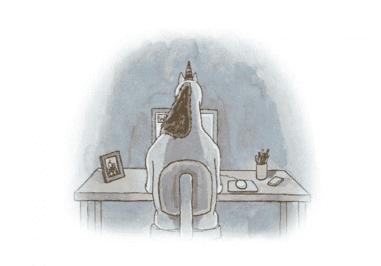

# 我在面试网站开发人员时遇到的 5 个不同寻常的测试问题

> 原文：<https://dev.to/jenc/5-questions-companies-ask-to-filter-for-cs-degree-holders-4o54>

T3】

Poor [Mister Unicorn](http://misterunicorn.com/index.php?/books/unicorn-being-a-jerk/)

*更新:我把标题从“公司为筛选 CS 学位持有者而提出的 5 个问题”改成了现在的标题，因为这个标题很有关联，似乎与这篇文章的内容不太相关。虽然提到的大多数问题都涉及到 CS 基础/教育问题，但更大的问题是要求申请人完成的任务非常困难，或者与职位的日常任务无关，因此给人的印象是雇主在寻找世界级的人。*T3】

> 丽贝卡·斯莱特金[@丽贝卡·斯莱特金](https://dev.to/rebeccaslatkin)“他让我反转一棵二叉树，于是我在白板上画了一棵树，和他握了握手，然后离开了。”–我认识的最强 iOS 开发者04:18am-2017 年 10 月

> 

* * *

如果你和我一样，没有上过计算机科学的学校，你可能会奇怪为什么你得到了面试机会，却没有通过第二轮。在经历了大约 9 次失败的面试后，我认为原因是:
1)我的投资组合中缺少或充满了模板化项目或错误项目
2)我没有及时回答技术测试中的以下问题(这些问题与在职知识没有什么关系，但是，嘿，我想进入下一个阶段，对吗？).

你瞧:我在 hackerrank 上看到的曲线球，定时测试和 irl 前前端工程师和软件开发面试。

## 1。给定一组条件，找出这些数字是否存在于二叉树的任何地方。

修订(在英国的意义上)...重读):递归和范围

## 2。在不使用互联网的情况下，编写汉堡三明治菜单、标签导航或下拉菜单

复习:媒体查询、DOM 操作和事件处理程序

## 3。在不使用 JS 的情况下，动画显示两种大小的 CSS 按钮上的星星。

修改:CSS 动画和渐变

## 4。在一系列无限不连续的数字中，你用什么排序方法来寻找一个缺失的数字？

修订:排序算法

## 5。那件事的起因是什么？

修改:任务效率

好吧，我又想到了两个...

## 6。编写一个单选按钮 JS 测验，根据用户是否选择了正确的选项来显示和隐藏下一个答案。在控制台或编辑器中测试，不要在线查找文档。

复习:数组操作

## 7。找出一个特定的字母在句子中出现或重复的次数，不管它的第一个字母是大写还是小写。

复习:数组操作和面向对象的 JS

我认为技术测试包括不现实的工作条件和高压白板场景是很不幸的。这让候选人对自己的第一印象产生怀疑，也加剧了由此产生的冒名顶替综合症。

好的一面是，我知道公司在寻找什么，我猜来自训练营的求职者的饱和正在创造一种需求，需要人才招聘人员和老派兄弟来区分顽固分子和 00 后。如果你有机会摆脱你的伴侣或父母，阅读编译器和程序是如何思考的会很有趣。

所以我的计划是练习做每一种类型的问题，直到我在不到一个小时的时间里轻松地解决它。我希望我会。

这期间我在看雄辩的 Js，你不知道的 JS，还有 Grokking 算法。

欢迎分享你遇到的更多信息！