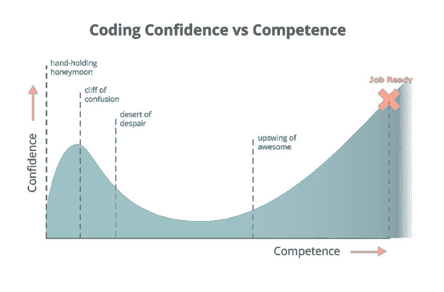

# 开始:来自一个经历过的开发者

> 原文：<https://dev.to/brycehull1/the-beginning-from-a-developer-that-has-been-there-5bi9>

<figure> 

<figcaption>一看就来的人生</figcaption>

</figure>

#### **开头**

我的旅程始于 2015 年 8 月。我在阿肯色州小石城外的一个小城市当执法人员。我在街上巡逻了大约一年，但在野外工作了三年。我热爱我正在做的事情，但同时我真的害怕每天去上班…真的很难解释！幸运的是，一天下午我偶然发现了 FreeCodeCamp，于是开始了对编码的爱恨情仇。

我很幸运找到了 FreeCodeCamp！在我执法职业生涯的这个时候，我对方向和薪水的缺乏非常不满，所以编码对我来说是一个很好的出路。头几个月，我迫不及待地想下班。轮班 12 个小时后，我会回家花 4 个小时完成课程。很棒，我非常喜欢……直到我撞上了“墙”。

我从许多自己追求 web 开发教育的人那里听说过这一点。万事开头好，然后你碰到了一堵似乎难以逾越的墙。对我来说，那就是 JavaScript。这是外国的，未知的，我只是不理解它！这就是网络开发的特点。几乎每个人都会有这样的挣扎，大多数人会在第一次尝试时放弃学习。

你猜对了！那是我！我会在几个月的好时光里坚持不懈，然后就会“碰壁”。那堵墙又脏又丑，我们相处得一点也不好。“墙”知道如何把我打倒在地，让我趴在地上。我讨厌这么说，但是“墙”知道如何打败我，而我让它一次又一次地发生。

<figure> 

<figcaption>奋斗出悟性</figcaption>

</figure>

这个故事不是关于我是如何失败的，也不是关于我从中学到了什么。这个故事是关于在你的生活中到达一个点，你必须做出决定，你是否想要成功，通过去收集 200.00 美元或被扔进监狱，而不是让你的生活朝着你想要的方向前进。

对我来说，那个时间点是在 2017 年夏天。我离开了警察队伍，和家人一起搬到了田纳西州。我不知道该做些什么，真的需要帮助。我找到了一份酒吧招待的工作，我真的很喜欢这份工作，但是我知道这不是我的职业。这是抑郁症开始发作的时候，我意识到我必须做出一些改变，否则我将在我不喜欢的工作中度过余生。

**我决定提交**

我以前在哪里找到了幸福？还记得我在警察局 12 小时轮班后，每天晚上承诺做的 4 个小时吗？你又猜对了！我回到了 FreeCodeCamp 和 CodeAcademy，从头开始。这一次，不管有多难，我都没有放弃。我意识到有时候你必须“努力去理解”，而这正是我所做的。对于我不明白的事情，外面有一个很大的世界，有很多人愿意帮助你完成这个过程(我将在本文末尾链接到一些资源)。

在意识到我非常喜欢 web 开发之后，我决定一头扎进去，参加一个 web 开发训练营。这是我做过的最好也是最艰难的决定。我现在还有两周就要毕业了，毫无疑问，我将能够在这个行业中表现得足够好，以获得一份工作，并做得很好。我有弱点吗？你打赌我有，但是我有支持那些的力量和学习我不知道的东西的驱动力。

#### **一个开发者的学习生命周期**

[T2】](https://res.cloudinary.com/practicaldev/image/fetch/s--10PmUX14--/c_limit%2Cf_auto%2Cfl_progressive%2Cq_auto%2Cw_880/https://cdn-images-1.medium.com/max/1001/1%2Ar_0LaMSMxKDCFqEeCO73cw.png)

上面的图表清楚地显示了学习编码时个人的信心是如何动摇的。我会告诉你这是 100%正确的。你以巨大的上升势头开始，然后撞上我们之前谈到的“墙”。除非你准备好了，否则放弃会变得很容易。为此做好准备，设定你的目标，当事情变得艰难时，让这些目标成为激励你的东西。我可以保证，一年后，当你回头看的时候，你会很高兴你一直坚持下去，度过那些糟糕的时光真的是值得的！

我知道我肯定是！

#### **为什么这一切都值得？**

什么让它值得，会因人而异。对我来说，这是我可以向刚接触开发的人传授概念的时候。当你第一次教别人如何映射一个数组，并把元素插入到 JSX 元素中时，你会看到灯泡发出咔嗒声…这才是真正让我觉得值得的。不，这不是我进入 web 开发领域的原因，但对我来说，帮助别人是我真正喜欢的事情。我进入这个领域的原因不仅是因为它是我每天都喜欢做的事情，我真的很享受它给我的精神挑战。当我能够坐下来，经过两个小时的算法问题，我能够解决它。这是艰难的，不要误会我的意思，但也是非常有益的。

这就是开发人员生活的开始和未来。在某种程度上，这总是一场斗争，否则大多数开发人员不会留在这个领域。我们从挑战中茁壮成长。这与最初的上山不同，因为你学会了如何应对挑战，并把它分解成可管理的小块。不要因为试图杀死一个巨人而被问题所压倒！

这些只是来自某个“经历过，做过那件事”的人的见解，他希望在他开始编码的时候就能听到这个建议。记住，日子会很艰难，但你会度过难关的。抬起你的头，继续前进。给自己一个支持系统，它不会让你放弃，在你失落的时候能让你振作起来。

我想感谢你花时间阅读这篇文章，我希望你读到的东西能引起共鸣，或者将来会引起共鸣。用这个，因为如果我两年前坚持到底，谁知道我会在哪里！不要让它成为遗憾，要让它成为机会。

对于那些学习编码的人，我使用了以下资源来学习，或者从以下资源中获得鼓励:

# [100 天代码](http://100daysofcode.com):帮助你坚持一轮又一轮 100 天编码的好方法。非常活跃的互动社区。

免费代码营(FreeCodeCamp):帮助初级开发者免费学习编码的网站。课程是循序渐进的，是开发人员的良好开端。FreeCodeCamp 也有一个非常活跃的社区，可以帮助你完成你的过程。

Codecademy :学习编码的在线资源，包括免费和付费两部分。

CodeSchool:学习如何编码的在线付费资源。

reddit.com/r/programming/:Reddit 编程论坛。

Twitter: [#codeNewbies](https://twitter.com/search?f=tweets&vertical=default&q=%23CodeNewbie&src=tyah) ， [#100DaysOfCode](https://twitter.com/search?src=typd&q=%23100daysofcode) ， [#programming](https://twitter.com/search?q=%23programming&src=tyah) (你可以接触这些话题中的任何一个，应该可以找到人来帮忙)

stackoverflow :这是用来“谷歌”任何开发者的问题，如果你决定发布一个问题，响应会很快。

最后，但同样重要的是……我在这里回答你可能有的任何问题，联系我的最简单方式是在 [Twitter](http://www.twitter.com/brycehull1) 或 [LinkedIn](https://www.linkedin.com/in/bryce-hull-9a9429123/) 。

欢迎在 twitter 上关注我的未来文章，或者只是打个招呼！

* * *