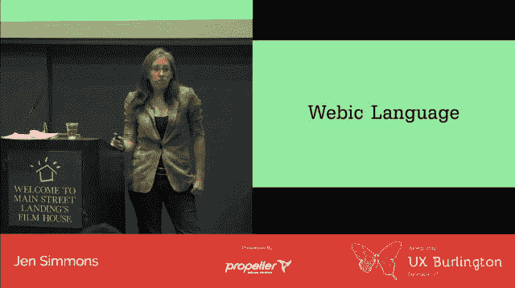
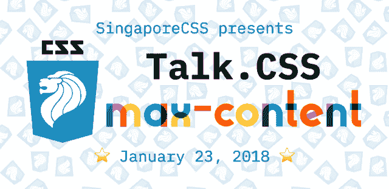
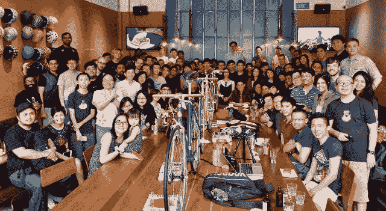

# 构建 webic 社区

> 原文：<https://dev.to/huijing/building-a-webic-community-3024>

所以这个月，在参加我的第一次 Mozilla 全明星赛时，我遇到了很多很棒的人，其中有[林·克拉克](http://lin-clark.com/)和[珍·西蒙斯](http://jensimmons.com/)。我是这两个女人的公开粉丝，但我在整个过程中保持了镇静，因为…试图接近成年人。

无论如何，如果你读过我的一些博客帖子或推文(可能是转发)，你会意识到 Jen 是我灵感的巨大来源。也许我应该对我提到她的频率做一些数据分析，那会很有趣……(好吧，我现在不会分心了)

但是我最近看到的她的演讲是她今年早些时候在 UX·伯灵顿关于“用网格设计”的演讲。你可以(我个人认为应该)在 Youtube 上观看完整的演讲，并按照自己的速度浏览[幻灯片](https://speakerdeck.com/jensimmons/designing-with-grid-ux-burlington)。

[https://www.youtube.com/embed/Gn3JOE6qMuE](https://www.youtube.com/embed/Gn3JOE6qMuE)

## 关于那个 CSS 网格…

CSS grid 已经发布了大约 8 个月，随着人们开始在他们的项目中使用它，我们开始看到更多关于 CSS grid 的文章和讨论。这是一个好迹象，因为我们确实希望 CSS grid 成为在 web 上创建布局的行业标准。

不过，我用来跟上 CSS 网格发展的关键资源并没有改变，你的清单上可能也有相同的资源(也可能没有):

*   [来自](https://blogs.igalia.com/jfernandez/) [Igalia](https://www.igalia.com/) 的哈维尔·费尔南德斯和[曼努埃尔·减压阀](https://blogs.igalia.com/mrego/)，他们是负责在 WebKit 和 Blink 中实现 CSS 网格的团队(我很确定团队中有更多成员参与其中，但这两位先生更积极地写他们在 CSS 网格上的工作)
*   Rachel Andrew ，她在几乎没有人听说过 CSS grid 的情况下，在倡导实现 CSS grid 的过程中发挥了重要作用
*   Elika J. Etemad ，他是许多许多 CSS 规范的编辑，CSS grid 就是其中之一
*   Jen Simmons ，因为她一直在寻找挑战网页设计极限的方法，并且总是想出新的点子来教授这些新技术，让我们的行业变得更好

## 网络的一种语言

如果你以前不知道，你会在看 UX·伯灵顿的演讲时发现，珍有电影和戏剧制作的背景。事实上，她有丰富的跨学科设计经验，相对来说很少有人能与之匹敌。这就是她的视角特别有趣的地方。

当她开始谈论通过 16 毫米相机的镜头讲述一个故事时，我突然想到，也许最接近网络的媒介不仅是印刷品，还有电影。框架的概念与视口密切相关。她提出的另一个关键想法是让我们开发一种网络语言，就像电影业有一种 T2 电影语言一样。

> 有一种电影语言，你去电影学校，然后开始学习它。我认为，有一种网络语言。有某种网络语言。这些事情或这些选择意味着什么。我认为慢慢开始会很有趣，**和**一起，几十年后，你知道，弄清楚那是什么，能够清楚地表达出来，用更多的技巧来使用它。
> 
> —珍·西蒙斯

<figcaption>使用了一些 DevTools 操作来获得这张截图...</figcaption>

我觉得 Jen 如此引人注目的原因是，当她分享自己的想法时，她不是规定性的。她不会到处告诉人们这种方式是做某事的最佳方式。相反，她鼓励她的观众进一步思考，一起解决问题，建立在彼此的创造力之上。

## 什么是前端？

如果工作描述是可靠的话,“前端”一词似乎是这个包罗万象的角色，只有最神奇的独角兽才有希望完成。事实上，我个人认识很多从事网络工作的人，他们所掌握的技能是大多数招聘人员不知道如何分类的。

这是非常不幸的，让我质疑我们是否有必要把所有东西都分类到整洁的盒子里。你猜怎么着，生活并不美好。当然，有些人在“成为一名*在此插入头衔*”的必备特质/技能清单上打勾，但是还有很多人没有。

> 瑞秋安德鲁@ rachelandruw人们接受擅长 CSS +设计的人，却对擅长 CSS + ops 的人感到困惑，这似乎很奇怪。2017 年 9 月 15 日下午 14:40

前端领域尚未定义，因为我们的行业发展太快，所需的技能范围似乎与日俱增。我们需要意识到，不可能成为每一项技能的专家，而**这完全没问题**。我曾经认为我是一只奇怪的鸟，因为我喜欢做 CSS 的同时也喜欢系统管理员。很高兴知道我不是一个人。

<figcaption>收敛(1952)</figcaption>

前端技能集不是离散的，你只做一件事。它也不是一个光谱，在这个光谱中，你做了几件彼此相邻的事情。这更像是一幅杰森·布拉克的画(在他打点滴的时候)，杂乱无章，到处都是。

## 一起变强(老生常谈却千真万确)

“网络语言”这个术语一直困扰着我。我一直认为网络是一种独特的媒介，网络拥有自己的语言对我来说非常有意义。但是我想更进一步，也许再多一点。我想在新加坡建立一个 webic 社区。和你们所有人一起。

我是【to】Talk 的共同组织者。CSS ，新加坡唯一以 CSS 为中心的聚会，已经奇迹般地不间断运行了两年。和我一起喝一杯，我会告诉你为什么我认为这是奇迹🤣。

如果你读了上面 Rachel 的帖子，你会发现 CSS 引起了广泛的回应。这是惊人的，创造性的，黑魔法，设计的野兽，这只是从这个线程。我听过有人说 CSS 很难，CSS 很容易，CSS 很垃圾没有意义，CSS 很直观有完美意义。🤷#极化

精通 CSS 需要一种心智模型，这种模型与大多数流行的编程语言所使用的非常不同。丹尼尔·亨特罗德的这句话完美地总结了这一点。

> “CSS 不是一种编程语言。它是一种样式表语言。我们不应该期望它的行为像一种编程语言。它有自己独特的景观和结构，那些拥有编程语言思维导图的人可能不会想到。”
> 
> ——丹妮尔·亨特罗斯

因为 CSS 在过去的 20 年里已经非常成熟了，我发现很多以前只能用 Javascript 编写的功能现在可以用 CSS 来完成。许多传统上用于数字图形的软件，如 Photoshop 或 Illustrator，现在可以用 CSS 和 SVG 来完成。

我袖手旁观我的观点是，只要你设计的东西存在于网络上，并通过浏览器消费，你就必须理解浏览器和网络是如何工作的。

需要确切知道写哪几行代码才能达到一定的效果吗？不。但是你确实需要知道什么能做，什么不能做。你还需要充分理解你的设计选择对消费者的影响。

这就是说话的原因。CSS 希望在我们的观众中有更多认同设计师的人。尤其是那些习惯于使用 Sketch 或 Photoshop 等工具进行网页设计的设计师。我们想给你的设计工具箱添加另一个工具:CSS。我们的目标是让每个为网站设计的人了解它是如何工作的。

## 说话。新的一年里的 CSS

<figcaption>浏览器中设计并维护的横幅</figcaption>

我们没想到事情会变成这样，但第一次谈话就这样发生了。2018 年的 CSS 将是我们迄今为止最大的活动。这是发展节的一部分。亚洲 2018 ，这是一周的技术会议，导致 [JSConf。亚洲 2018](https://2018.jsconf.asia/) 我们已经设法抓住了[曼迪·迈克尔](http://batmandy.com/)、[安迪·克拉克](https://stuffandnonsense.co.uk/)和[约翰·奥尔索普](http://johnfallsopp.com/)，此外还有我们自己的[泽尔·刘](https://zellwk.com/)和[塞巴斯蒂安·戴克斯](https://twitter.com/sebdeckers)进行了长达 3 小时的设计和 CSS 盛会。

这将是非常棒的，所以如果你碰巧在 1 月 22 日至 29 日的 DevFest 周期间，来加入我们吧！你可以现在就买票，我们会附赠一件 t 恤和咖啡(好的那种)。我真的希望在那里见到你🙆。

对于 2018 年，我们希望扩大我们的受众，以及谈论更多与设计相关的话题，以促进关于设计对网络意味着什么的对话。让性能和可访问性在设计过程的开始就出现，而不是在结束时匆忙添加。

我经常对愿意倾听的人说，新加坡拥有世界上最强大的技术社区之一，我真的相信这一点。有许多因素促成了这一点，我很乐意写一篇关于新加坡技术社区的完整文章，但不是这次。说话。CSS 是这个充满活力的技术社区的一部分，我们希望尽我们的一份力量来帮助它成长。

<figcaption>极客早午餐，因为我们喜欢聚在一起，边吃边聊</figcaption>

科技行业[比以往任何时候都更需要设计](https://m.signalvnoise.com/move-slowly-and-fix-things-e5a560fd928b),东南亚到处都是才华横溢的设计师和开发人员，他们肯定能有所作为，提供一种不同的视角。没有人会给我们一个席位，但我们必须让别人听到我们的声音。也许有用，也许没用。但如果我连试都不试，我会感到羞耻。

我们开始吧。

慢慢地。

**一起**。

*最初发布于[www.chenhuijing.com](https://www.chenhuijing.com/blog/building-a-webic-community/)2017 年 12 月 28 日。*