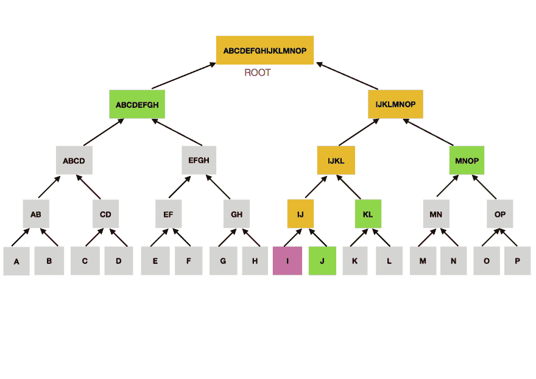

# 区块链:区块中有什么？

> 原文：<https://dev.to/damcosset/blockchain-what-is-in-a-block-48jo>

## 简介

在我以前的文章中，我试图用代码描述区块链的概念。这一次，我将尝试描述单个块的结构。我将使用比特币区块链来解释区块，但请记住，概念将或多或少保持不变。阅读我的上一篇文章会有所帮助，可以先了解一些事情。

## 块的结构

块是一种容器数据结构。在比特币世界，一个区块平均包含 500 多笔交易。一个块的平均大小好像是 1MB ( [来源](https://blockchain.info/charts/avg-block-size))。在比特币现金(比特币区块链的硬分叉)中，一个块的大小可以达到 8MB。这使得每秒可以处理更多的事务。

不管怎么说，一个块是由一个头和一长串事务组成的。让我们从标题开始。

## 块头

报头包含关于块的元数据。有三组不同的元数据:

*   前一个块哈希。请记住，在区块链中，每个块都继承自前一个块，因为我们使用前一个块的哈希来创建新块的哈希。对于每个块 N，我们给它提供块 N-1 的散列。

*   采矿比赛。对于要成为区块链一部分的块，需要给它一个有效的散列。这包含时间戳、随机数和难度。挖掘是区块链技术的另一个关键部分，但这超出了本文的范围。

*   第三部分是 merkle 树根。这是一种数据结构，用于汇总块中的交易。我们暂时就此打住。稍后将详细介绍。

## 块标识符

为了识别一个块，你有一个加密散列，如果你愿意，一个数字签名。这是通过使用 SHA256 算法对块头进行两次哈希运算而创建的。例如，[这是一个块](https://blockchain.info/en/block/000000000000000000301fcfeb141088a93b77dc0d52571a1185b425256ae2fb)。在本文中，我将把这个块作为一个例子。

该特定块的块头散列是(右列):*00000000000000000301 fcfeb 141088 a 93 b 77 DC 0d 52571 a 1185 b 425256 AE 2 FB*

我们还可以看到前一个块的 hash(右栏):*0000000000000004 B1 ef 0105 DC 1275 B3 adfd 067 aed 63 a 43324929 bed 64 FD 7*

请记住，我们使用第二个散列来创建第一个散列。每个块都使用前一个块的散列来构造自己的散列。块散列是唯一的标识符。你不会找到两个散列相同的块。

另一种识别特定砌块的方法是砌块高度。是区块在区块链中的位置。我们示例中的块位于 500312 位置。这意味着在这个块之前有 500311 个块。自从 2009 年比特币区块链诞生以来，已经有 500312 个区块被创造出来(显然是在撰写本文的时候)。

块高度不是唯一的。在分叉的情况下，几个块可以竞争相同的位置，例如比特币现金。

## 多积树木

块中的事务包含在一个称为 merkle 树或二叉散列树的结构中。

我觉得这样的话题用实际例子更容易理解。所以我们要为此编码。merkle 树是通过递归散列节点对(在这种情况下是事务)来构造的，直到只有一个散列，称为根或 merkle 根。如果我们停留在比特币的世界，使用的加密哈希算法是 SHA256。每次涂两次。

例如:我们有一个包含 4 个事务的块。为了简单起见，每个事务都是一个字符串:

```
const tA = 'Hello'
const tB = 'How are you?'
const tC = 'This is Thursday'
const tD = 'Happy new Year' 
```

Enter fullscreen mode Exit fullscreen mode

为了构建我们的 merkle 树，我们从底层开始。我们对每笔交易进行双重散列。这里我用 js-sha256 包。

```
const sha256 = require('js-sha256').sha256

// Double-hashing here
const hA = sha256(sha256(tA))
const hB = sha256(sha256(tB))
const hC = sha256(sha256(tC))
const hD = sha256(sha256(tD))

//Results
52c87cd40ccfbd7873af4180fced6d38803d4c3684ed60f6513e8d16077e5b8e //hA
426436adcaca92d2f41d221e0dd48d1518b524c56e4e93fd324d10cb4ff8bfb9 //hB
6eeb307fb7fbc0b0fdb8bcfdcd2d455e4f6f347ff8007ed47475481a462e1aeb //hC
fd0df328a806a6517e2eafeaacea72964f689d29560185294b4e99ca16c63f8f //hD 
```

Enter fullscreen mode Exit fullscreen mode

好的，很好。现在请记住我写的 merkle 树是由节点对组成的。因此，我们将配对我们的事务并连接它们的散列。然后，我们也将对它们进行双重散列。我们将使用哈希 *hA* 和 *hB* 创建一个哈希，并为 *hC* 和 *hD* 创建另一个哈希。然后，我们重复这个过程，直到我们只剩下一个散列，没有更多的对可以使用。最后的散列将是我们的 merkle 根。

只有四个交易，这将是相当快的:

```
//Pairing hA and hB

const hAB = sha256(sha256(hA + hB))
//5dc23d1a2151665e2ac258340aa9a11ed227a4cc235e142a3e1738333575590b

//Pairing hC and hD

const hCD = sha256(sha256(hC + hD))
//ff220daefda29821435691a9aa07dd2c47ca1d2574b8b77344aa783142bae330

// We do it again. We pair hAB and hCD
// This is our root!
const hABCD = sha256(sha256(hAB + hCD))
//301faf21178234b04e1746ee43e126e7b2ecd2188e3fe6986356cc1dd7aa1377 
```

Enter fullscreen mode Exit fullscreen mode

merkle 树顶部的节点称为根。这是存储在区块链上每个块的块标题中的信息。这是每个块中交易汇总的方式。在我们之前给出的示例块中，merkle 根可以在右列中找到:
*a 89769d 0487 a 29 c 73057 e 14d 89 AFA fa 0 c 01 e 02782 CBA 6 c 89 b 7018 e 5129d 475 cc*

一个块中包含多少个事务无关紧要，它们总是由一个 32 字节的散列来汇总。

*注:*merkle 树是二叉树。如果有奇数个事务，最后一个将被复制，这样我们就可以构建我们的树。

因为我们树上的所有叶子都依赖于其他叶子，所以改变一片叶子而不改变其他叶子是不可能的。如果你只改变了一个叶子(一个事务)，那么散列会改变，因此你通过将它与另一个叶子配对而构建的散列也会改变，因此 merkle 根会不同。

您可以通过创建一个*认证路径*或 *merkle 路径*来证明任何事务都包含在一个块中。你只需要知道 *log base 2(N)* 32 字节哈希。例如:

-对于我的 4 个事务 merkle 树:

log base 2( 4 ) = 2 = >如果我有一个包含 4 个事务的树的 2 个散列的路径，我可以设法证明一个事务是否属于这个 merkle 树。

对于 16 个事务的 merkle 树:

log base 2( 16 ) = 4 = >如果我有一个包含 16 个事务的树的 4 个散列的路径，我可以设法证明一个事务是否属于这个 merkle 树。

log base 2( 1500 ) = 10.55 = >如果我有一个由 1500 个事务组成的树的 11 个散列的路径，我可以设法证明一个事务是否属于这个 merkle 树。

也许一个小图表会有所帮助。

[T2】](https://res.cloudinary.com/practicaldev/image/fetch/s--vTTWUMHN--/c_limit%2Cf_auto%2Cfl_progressive%2Cq_auto%2Cw_880/https://thepracticaldev.s3.amazonaws.com/i/h8obpz10qpnbw8tlizyj.jpg)

这棵树有 16 片叶子。我们通过将每片叶子配对，自下而上地构建我们的树。现在，任何人都可以通过用绿色标出路径来证明叶子 *I* (橙色)是这个方块的一部分。我们只有 4 个散列，但这足以知道叶子 *I* 是否属于这里。这是因为有了这些信息，我们就能构建我们需要的每一片叶子(黄色)。我们可以创建 *IJ* 、 *IJKL* 、 *IJKLMNOP* 和根，并检查这些散列是否对应。这就是为什么欺骗区块链是非常复杂的。改变一件事意味着你必须改变一切。

这差不多就是比特币区块链中一个区块所包含的内容。希望有帮助！