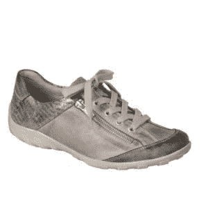

# 鞋子和软件

> 原文:[https://dev.to/wiredferret/shoes-and-software-coo](https://dev.to/wiredferret/shoes-and-software-coo)

上次去纽约时，我买了一双新鞋。我正在寻找既能搭配裙子又能搭配裤子的鞋子和靴子，既要合身，又要适合一整天的站立/7 英里的步行。这是一个相当高的要求，你知道，如果你买很多女鞋。我找到了一双我认为很有前途的鞋，并穿着它一周走了 30 英里。只有一个问题。就在我的左脚趾上。

[T2】](https://res.cloudinary.com/practicaldev/image/fetch/s--S878YnR---/c_limit%2Cf_auto%2Cfl_progressive%2Cq_auto%2Cw_880/http://www.heidiwaterhouse.com/wp-content/uploads/2017/12/remonte-r3417-womens-casual-lace-up-shoe-p21486-67580_image-300x300.jpg)

我回来后向我的朋友抱怨了这件事，她告诉我，因为我是在一家专门卖鞋的实体店买的，所以我可以把它们带进去，让商店在摩擦处稍微伸展一下。他们做到了！斑点停止摩擦。但那时我已经激怒了它，以至于我的普通鞋子都在摩擦它。嗯，这并没有严重到需要去看足病医生，这是发生在脚上的正常现象，建议是穿合适的鞋子。

我掉进了一个研究兔子洞，你知道吗？你可以买鞋楦和可以嵌入鞋楦孔中的雕刻小块，然后把它们放入鞋中，添加一些鞋撑，你就可以*裁剪你的鞋子*？你们中的某些年龄和阶层的人，穿着皮鞋长大，确实知道这一点。我刚刚学会这个，在我的第五个十年开始的时候，这几乎和我意识到我可以自己缝制衣服，让它们合身一样具有革命性。我不必接受我的脚或身体会受到普通人的轻微虐待，*我可以修复它*。如果我有合适的鞋子和买工具的钱，这是另一个帖子。

[T2】](https://res.cloudinary.com/practicaldev/image/fetch/s--KX0JdjEn--/c_limit%2Cf_auto%2Cfl_progressive%2Cq_auto%2Cw_880/http://www.heidiwaterhouse.com/wp-content/uploads/2017/12/boot-stretcher-300x225.jpg)

我认为这是软件使用者和软件创造者的本质区别。软件用户几乎总是有一个难题，一个他们不得不遵从软件期望他们行为的地方，一个令人恼火的地方。他们不知道他们可以改变它，或者他们没有改变它的工具。很“定势”。这就是软件的行为方式，这就是它的本来面目。软件创作者明白，几乎总有一些方法来调整他们的技术，使之更适合他们。软件包不是一成不变的，而是你可以修补和改变的——一种“成长思维”。

我希望世界上更多的人对他们的技术有一个增长的心态——从扎根他们的手机到消除他们不想要的软件，到关闭推送通知，到隐藏他们不关心的屏幕。这是我在与 LaunchDarkly 合作中感到兴奋的事情之一。目前，我们在比个人偏好更大的范围内工作——想想我们开始为左脚和右脚设计时的鞋子革命——但最终你可以定制你的技术体验的想法将变得越来越容易理解和民主。这太令人激动了，因为每个人都应该有适合他们特定脚的鞋子和适合他们特定需求的软件。