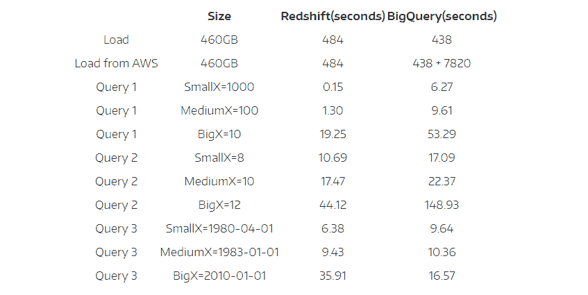
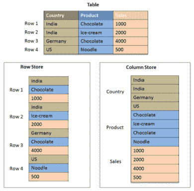

# 云数据仓库和 ETL

> 原文:[https://dev.to/limiw/the-cloud-data-warehouse-and-etl-1mje](https://dev.to/limiw/the-cloud-data-warehouse-and-etl-1mje)

## 概述

您想了解如何将企业收集的越来越多的数据转化为可操作的见解吗？

在从 BI 工具和分析应用程序中获得您需要的重要见解之前，首先了解一些基于云的数据仓库解决方案很重要，这些解决方案为在现代企业中执行高级数据分析和 BI 提供了基础。

在这篇文章中，您将了解什么是基于云的数据仓库，ETL 的重要过程如何与数据仓库相关联，并且您将比较当前可用的两种主要的基于云的数据仓库解决方案——Amazon Redshift 和 Google BigQuery。

在这篇文章结束时，您将更好地选择基于云的数据仓库解决方案，该解决方案提供了一个坚实的平台来分析您的数据，并从这些数据中获得洞察力，从而推动更好的业务决策。

## 什么是基于云的数据仓库？

基于云的数据仓库是利用云基础设施的集中式数据存储库。在云中，远程服务器和计算资源的网络用于提供数据仓库，而不是本地托管的本地服务器。在您进一步深入之前，请完整地阅读这篇关于数据仓库的好处的文章，以及 TechTarget 对红移的定义和讨论。

数据仓库对于任何数据分析工作的成功都至关重要。传统的本地数据仓库构建起来极其耗时且复杂，需要大量的物理资源投资。
与传统的数据仓库相比，云提供了重要的优势，例如:

*   公司没有必要投资数据仓库中心或其他现场托管的物理资源
*   云数据仓库提供商提供可轻松扩展的基础设施和高性能

几家公司提供基于云的数据仓库服务。一些常见的例子包括:

*   **Amazon Redshift**—这是一项完全托管的数据仓库服务，要求数据库管理员像在本地仓库中一样配置资源。当然，不同之处在于现场不需要物理资源——您可以利用 AWS (Amazon Web Services)庞大的云基础架构，并根据您的特定需求对其进行定制。亚马逊红移是迄今为止使用最广泛的基于云的数据仓库——[2016 年亚马逊 Re:Invent](http://blog.panoply.io/the-cloud-is-disrupting-data-warehousing-and-this-2017-survey-proves-it/) 云大会上 60%的与会者表示他们使用红移。
*   Google big query—Google big query 是一种无服务器服务，这意味着它从用户那里抽象出资源的供应、分配和维护。在其核心，BigQuery 使用了一个可以高速浏览数十亿行数据的查询引擎。
*   **Azure SQL 数据仓库**—这是微软基于云的数据仓库产品。Azure SQL 数据仓库既可扩展又可完全管理，这使它类似于 Amazon Redshift。
*   **雪花**—雪花是一种基于云的数据仓库服务，允许用户在亚马逊 S3 上存储数据，并使用查询引擎分析这些数据。每种基于云的数据仓库服务都有自己的优缺点。目前，Amazon Redshift 和 BigQuery 是两个受欢迎的选项，由两家全球领先的云提供商提供，因此比较它们以了解您可以从这些服务中获得什么是有意义的。

不过，在比较 Redshift 和 BigQuery 之前，理解 ETL 过程及其与数据仓库的关系很重要。

## 什么是数据仓库中的 ETL

所有希望在单个数据存储库(如数据仓库)中分析历史数据的企业都面临着一个共同的挑战，即如何从不同的源中提取数据，将这些数据转换为清晰、统一的格式，并将数据加载到数据仓库中，以供 BI 工具和分析应用程序使用。

ETL(提取、转换、加载)是从源系统获取数据到数据仓库的最古老的方法之一，即使是基于云的系统也仍然需要这种方法。ETL 在数据仓库之外使用一个独立的转换引擎，将数据转换成聚合的结构化格式，以备仓库使用。

一些专家认为，强大的现代基于云的仓库消除了对单独转换过程的需要——可以从源中提取原始形式的数据，并立即加载到仓库中，以实现无与伦比的可访问性。在仓库中，查询可以根据分析师的需要转换数据。

反对 ETL 过时的理由是，它需要超出外行 BI 分析师范围的大量知识来操作和理解原始数据。许多分析师需要使用通用结构且在业务术语上可以理解的整合数据，以便从这些数据中获得洞察力。

接下来您将了解 BigQuery 和 Redshift 之间的区别和相似之处，包括如何将数据 ETL 到这些系统中，以及在 Redshift 和 BigQuery 中是否都需要 ETL。

## 红移对比 BigQuery

以下几点概述了 BigQuery 和 Redshift 的相互比较:

### 成本

Redshift 有一个简单明了的成本结构,你可以在使用云实例时按需付费，也可以通过保留云实例长达三年来获得更低的价格。在 BigQuery 中，存储费用为 0.02 美元/GB，查询费用为 5 美元/GB。

与 Redshift 相比，查询和存储的分离使得 BigQuery 的成本结构既不可预测又复杂。此外，虽然 BigQuery 最初看起来比 Redshift 便宜，但一旦您通过在 BigQuery 中查询数据来使用数据，它很快就会变得比 Redshift 贵。

### 表现

下表显示了使用三种不同的查询来查询同一个数据集时，这两种服务的性能。请注意，Redshift 已经针对数据压缩和排序键的性能进行了优化，这更能说明它的使用方式。

[T2】](https://res.cloudinary.com/practicaldev/image/fetch/s--IknVurrT--/c_limit%2Cf_auto%2Cfl_progressive%2Cq_auto%2Cw_880/https://thepracticaldev.s3.amazonaws.com/i/cc3auij0pd3je1odqcp5.png)

[图像来源](http://blog.panoply.io/a-full-comparison-of-redshift-and-bigquery)

### ETL

Redshift 强大的基础设施确保它可以在服务中快速转换原始数据，这被称为 ELT 数据集成方法。

但是，有几个工具可以通过快速执行 ETL 来为 Redshift 准备数据，这样就不会占用集群资源。ETL 到 Redshift 服务的优势在于，一旦数据加载到 Redshift 中，用户(如分析师)就可以立即开始使用他们的分析工具查询数据，而不需要聚合、连接或清理数据。

BigQuery 依靠 ETL 将数据从事务性数据库获取到系统中进行分析。[本文](https://cloud.google.com/solutions/performing-etl-from-relational-database-into-bigquery)概述了如何从关系数据库执行 ETL 到 BigQuery。如果 BigQuery 中没有 ETL，那么使用 BigQuery UI 转换数据将会花费很多钱。

### 可用性

通过抽象底层硬件和配置的细节，BigQuery 更易于使用。然而，一旦设置好，红移对于分析师来说就很容易使用。BigQuery 和 Redshift 都可以与所有流行的 BI 工具很好地集成。

这两个数据库都支持广泛的经典数据类型，如文本、整数、浮点数和布尔值。BigQuery 不允许存储值的用户定义精度，而 Redshift 允许。用户定义的精度在需要精确数字运算的应用程序中非常重要，例如财务数据分析。两个平台都有优秀的文档，确保您在使用服务时遇到的大多数问题都有清晰的解决方案。

### 建筑

尽管 BigQuery 中使用的实际计算资源对最终用户是隐藏的，但 BigQuery 和 Redshift 具有相似的体系结构。两者都使用大规模并行处理(MPP ),将查询分布在多个服务器上，以快速执行查询。此外，这两种服务都使用列存储结构，使得分析查询运行起来更容易、更快。

[T2】](https://res.cloudinary.com/practicaldev/image/fetch/s--Y4Oq20u0--/c_limit%2Cf_auto%2Cfl_progressive%2Cq_auto%2Cw_880/https://thepracticaldev.s3.amazonaws.com/i/9s84pexrt5blpqjpi5mh.png)

[图像来源](http://saphanatutorial.com/wp-content/uploads/2013/09/Difference-between-Column-based-and-Row-based-Tables.png)

## 红移 vs . big query——你该选哪个？

在大多数分析用例中，Redshift 优于 BigQuery，而且它的成本结构更简单、更便宜。BigQuery 更容易上手，但是 Redshift 的可定制性和以用户定义的精度存储值的能力使它更加灵活。

Redshift 和 BigQuery 具有相似的体系结构设计，两种服务都非常适合与高速现代 ETL 工具一起使用，这些工具可以快速提取、准备和加载数据以供分析使用。

红移是最受欢迎的基于云的数据仓库服务，这是有原因的——它是最好的。

## 关闭思绪

*   企业很快意识到基于云的数据仓库对于分析的益处。Amazon Redshift 和 Google BigQuery 是流行的基于云的仓库解决方案的两个例子。
*   即使使用基于云的数据仓库服务，您仍然需要找出从数据仓库中的所有源系统获取数据的最佳方式，以便进行分析和报告——ETL 就是实现这一点的一种方法。
*   在决定基于云的数据仓库解决方案时，考虑成本、可用性、性能、设计以及它是否支持 ETL 或其他数据集成方法等因素非常重要。