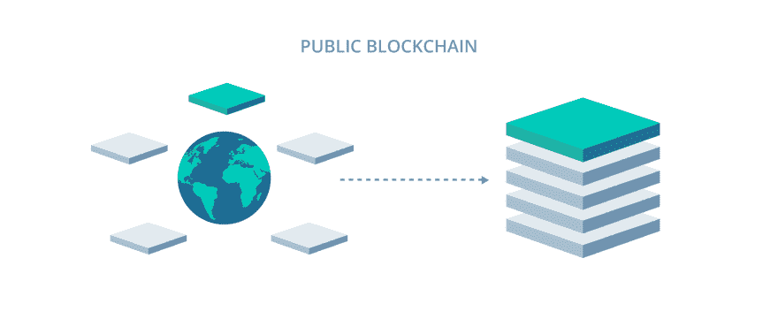
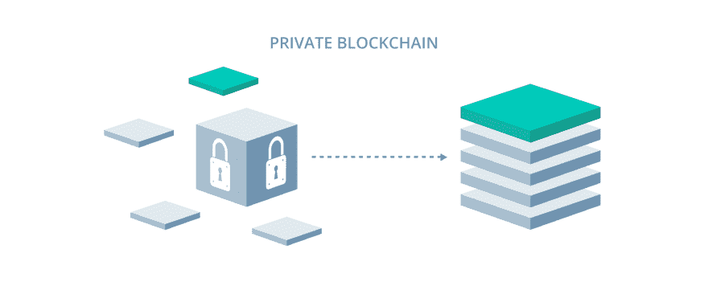

# 公司如何利用私人区块链

> 原文：<https://dev.to/galyna_chekan/how-companies-can-leverage-private-blockchains-to-improve-efficiency-and-streamline-business-processes-3n5e>

区块链——支撑比特币和以太坊的技术——与去中心化密切相关。许多人认为这是将银行(和其他中介)排除在交易之外的手段。人们相信，总有一天，它会彻底重塑我们金融体系的运作方式。

然而，区块链比人们想象的要多得多。这项技术以向普通人提供匿名和保护而闻名，对公司也有价值。虽然方式略有不同。

摩根大通和微软已经把他们价值数百万美元的帽子扔进了私人的区块链圈。

* * *

*摩根大通和微软，已经把他们数百万美元的帽子扔进了私人……*

[点击推文](https://twitter.com/share?text=JPMorgan+and+Microsoft%2C+have+already+thrown+their+multi-million+dollar+hats+into+the+private...&via=perfectial&related=perfectial&url=https://perfectial.com/blog/leveraging-private-blockchains-improve-efficiency-streamline-business-processes/)

* * *

今天，我们将讨论私有区块链，以及当应用得当时，它们如何能够简化业务流程并为各行各业的公司节省资金。

让我们开始吧。

## 区块链有哪些类型？

截至目前，所有现存的区块链可分为三类:

1.  公共
2.  财团
3.  私人的

这些网络之间的主要区别在于它们的管理方式。或者说，他们被谁统治。

[T2】](https://res.cloudinary.com/practicaldev/image/fetch/s--eKYRWhkE--/c_limit%2Cf_auto%2Cfl_progressive%2Cq_auto%2Cw_880/https://perfectial.com/wp-content/uploads/2017/12/img2-3.jpg)

**公共区块链**(比特币和以太坊之类的东西)本质上是每个人都能控制的。他们没有限制进入。他们允许每个人，除了那些没有连接到网络的人，访问甚至管理网络，只要验证者存放一些[内部或外部资源来保护他们](https://perfectial.com/blog/ethereum-blockchain-switches-to-proof-of-stake/)。

然而，公共链禁止的是一个人的完全权威。没有一个实体可以写入这样一个网络的历史，除非参与共识过程的节点决定该条目是有效的。

公共链最受称赞的安全性是通过加密经济学的巧妙应用实现的。他们使用工作证明和利益证明等算法来防止恶意活动，并为愿意建立保护的矿工(验证者)提供财务激励。

他们首先关心的是提供透明度和匿名性。他们认为效率(和可伸缩性)是次要的特性。

[T2】](https://res.cloudinary.com/practicaldev/image/fetch/s--cm10BFoG--/c_limit%2Cf_auto%2Cfl_progressive%2Cq_auto%2Cw_880/https://perfectial.com/wp-content/uploads/2017/12/img3-3.jpg)

财团和私人区块链的关注点略有不同。它们被设计成不向全世界公开它们存储的交易记录。它们由数量有限的节点管理，比它们的公共对应物有效得多。

财团和私人区块链只有一点不同。前者由一群公司(比如银行财团)管理，而后者由一家公司维持。与公共链不同，这些链的目的不是重新发明现有的业务流程，而是对它们进行补充。

金融机构和大规模公司等可以使用区块链技术交换资产，从而不必支付中介，并在几秒钟内完成这些交易。他们还可以在任何需要的时候实时监控私有的对等网络。

关于公司如何利用私人区块链来提高效率和简化业务流程的帖子最先出现在[软件开发公司 perfectal](https://perfectial.com)上。