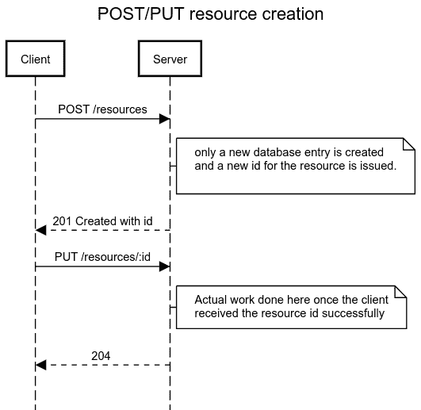

# 制作更好的 HTTP APIs

> 原文:[https://dev.to/orkon/making-better-http-apis-72l](https://dev.to/orkon/making-better-http-apis-72l)

在过去的几年里，我一直在使用各种 HTTP APIs。这些 API 通常不公开，只提供给合作伙伴公司。此外，我还见过其他开发人员开发的 API，并亲自参与了几个 API 的开发。这些 API 经常有一个设计缺陷，这使得使用 API 创建可靠的集成变得更加困难。

我说的问题是**在错误**时重复创建资源。当资源创建与支付等关键的现实世界操作绑定时，这是必不可少的。

我们以 [Paypal 的 Create Payment API](https://developer.paypal.com/docs/api/payments/#payment_create) 为例:当你创建一个新的支付资源(通过向/v1/payments/payment 发出 POST 请求)时，Paypal 会立即向用户收费。如果交易成功，您将获得由付款 id 补充的状态代码 201。这意味着，如果您在发送此请求时遇到网络问题，没有简单的方法来判断支付是否成功，因为您不知道支付 id。更糟糕的是，如果你对网络错误进行自动重试，你无疑会在某个时候向你的用户收取两倍的费用。

当然，这是 API 的一个已知问题，PayPal 提供了一个解决方案。参见[如何避免重复付款？](https://www.paypal.com/us/selfhelp/article/how-do-i-avoid-duplicate-transactions-ts1097)您可以使用标题 PayPal-Request-Id(虽然在付款 API 页面上没有记录),或者您可以误用发票号来删除重复的请求。但是解决方法一定要这么复杂吗？这两种方法都不是用户友好的:消费者需要一种可靠的机制来生成请求 ID，以便重复的请求具有相同的请求 ID；在第二种情况下，如果您需要支持每张发票的多项付款，该怎么办？可能有更好的解决方案。

#### 用 POST/PUT 资源创建解决重复资源创建

如果 POST 请求只做一个数据库条目和资源 id 的生成，就可以很容易地避免这个问题。流程是这样的:

<figure> 

<figcaption>POST/PUT 资源创建</figcaption>

</figure>

有了这个流程，当网络故障发生时，重试请求就变得容易了。如果重试 POST 请求，只会导致重复的空资源。如果您重试 PUT 请求，您是安全的，因为 PUT 请求是[幂等的](https://en.wikipedia.org/wiki/Idempotence#Computer_science_meaning)。

我发现 POST/PUT 创建模式更优雅，尽管创建一个完整的资源需要两次请求。您可能不喜欢这种方法，但是我的观点是，如果 POST 请求会导致重大的现实后果，您应该支持某种方法来消除 POST 请求的重复。如果您不提供这样的机制，您的 API 很难适合稳定可靠的集成。

感谢您的阅读，希望对您有所帮助。[在 Twitter 上关注我](https://twitter.com/orKoN)分享你在使用 API 时遇到的问题以及你是如何解决的。