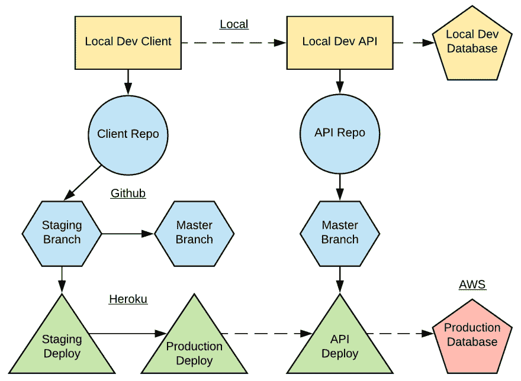

# 项目开发过程

> 原文:[https://dev . to/Ethan arrowood/project-development-process-2ede](https://dev.to/ethanarrowood/project-development-process-2ede)

[T2】](https://res.cloudinary.com/practicaldev/image/fetch/s--mH4-NCa9--/c_limit%2Cf_auto%2Cfl_progressive%2Cq_auto%2Cw_880/https://thepracticaldev.s3.amazonaws.com/i/bemom9ufonn581w9u3fb.png)

我目前正在为我的夏令营申请。我已经在这上面工作了一段时间，在学习了大量的新技能后，我想出了上面的开发和部署流程图。实线表示代码“流程”。例如，代码将从本地开发推送到 Github repos。锯齿状线条表示代码“通信”，即客户端向 API 发出请求。黄色对象是本地实例。蓝色是 Github 库。绿色是 Heroku 部署。红色是亚马逊网络服务部署。我使用 Heroku a pipeline 进行客户端暂存->生产流程。最后，Travis CI 通过客户端和 API 部署流程进行集成。

我很乐意收到一些关于这个过程的反馈，并回答其他开发人员可能有的任何问题。