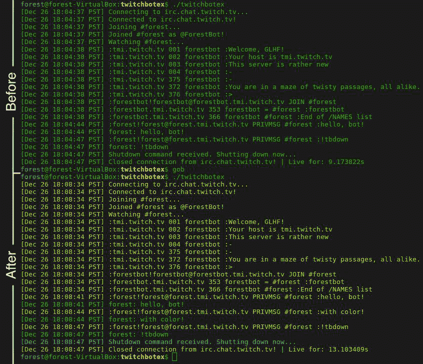

# 用 Go 构建 Twitch.tv 聊天机器人-第 2 部分

> 原文：<https://dev.to/foresthoffman/building-a-twitchtv-chat-bot-with-go---part-2-52jo>

编辑(2019 年 5 月 13 日):自撰写本文以来，该软件包已从“twitchbot”重命名为“bot”。但是，用于本教程的标记版本仍然使用旧名称。

第 1 部分开头的所有免责声明和警告在这里都适用。

## 第一步

继续并通过以下方式跳到步骤 1:

```
$ git reset --hard step-1 
```

Enter fullscreen mode Exit fullscreen mode

在上一步中，我们列出了`BasicBot`结构正常工作所需的数据类型。现在，我们将展示机器人的行为。为此，我们将从填写`TwitchBot`接口开始。

根据导入块下面的注释，我们需要创建执行以下操作的函数:

*   连接到 Twitch IRC 服务器
*   断开与 Twitch IRC 服务器的连接
*   解析来自聊天的消息并做出反应
*   连接后加入特定频道
*   从超级绝密证书文件中读取以获取机器人的密码
*   向当前聊天频道发送消息

所以，用 Go 术语来说:

*   连接()
*   断开()
*   HandleChat()错误
*   JoinChannel()
*   ReadCredentials() (*OAuthCred，错误)
*   Say(消息字符串)错误

`ReadCredentials()`函数看起来很滑稽，因为被返回的`OAuthCred`指针是一个错误。不要担心，它会在下面的步骤中得到解决。出于演练的考虑，我考虑过省略它，但它肯定会让任何跟随它的人想到，“嗯？”，同时侧着头。

我们还需要一个函数来启动一切，所以将添加`Start()`函数。弹出`twitchbot.go`，对`TwitchBot`界面做如下修改:

```
type TwitchBot interface {
    Connect()
    Disconnect()
    HandleChat() error
    JoinChannel()
    ReadCredentials() (*OAuthCred, error)
    Say(msg string) error
    Start()
} 
```

Enter fullscreen mode Exit fullscreen mode

由于`OAuthCred`未定义，我们也将添加它。再加在`TwitchBot`上面吧。

```
type OAuthCred struct {
    Password string `json:"password,omitempty"`
}

type TwitchBot interface {
... 
```

Enter fullscreen mode Exit fullscreen mode

现在已经定义了`OAuthCred`,让我们添加一个指向 BasicBot 结构的`OAuthCred`实例的指针，稍后再做介绍。`BasicBot`的定义现在应该是这样的:

```
type BasicBot struct {
    Channel string
    Credentials *OAuthCred // add the pointer field
    MsgRate time.Duration
    Name string
    Port string
    PrivatePath string
    Server string
} 
```

Enter fullscreen mode Exit fullscreen mode

如果没有爆炸，我们可以继续前进。

```
$ go fmt ./... && go build 
```

Enter fullscreen mode Exit fullscreen mode

## 第二步

让我们运行下面的代码跳到第 2 步:

```
$ git reset --hard step-2 
```

Enter fullscreen mode Exit fullscreen mode

现在，我们必须让`BasicBot`实现我们添加到`TwitchBot`接口的功能。让我们按顺序开始吧。

#### 连接()

`BasicBot.Connect()`将需要 [`net`](https://golang.org/pkg/net/) 和 [`fmt`](https://golang.org/pkg/fmt/) 包，所以我们将这些添加到导入块:

```
import (
    "fmt"
    "net"
    ...
) 
```

Enter fullscreen mode Exit fullscreen mode

因为我们想知道机器人在连接时在做什么，所以我们需要写入标准输出。不幸的是，这会变得有点笨拙，所以让我们添加一些助手函数来给日志消息加时间戳。我们还将添加一个常量时间格式字符串供`timeStamp()`使用，就在导入块之后。

```
import (
...
)

const PSTFormat = "Jan 2 15:04:05 PST"

...

// for BasicBot
func timeStamp() string {
    return TimeStamp(PSTFormat)
}

// the generic variation, for bots using the TwitchBot interface
func TimeStamp(format string) string {
    return time.Now().Format(format)
} 
```

Enter fullscreen mode Exit fullscreen mode

然后，函数本身:

```
// Connects the bot to the Twitch IRC server. The bot will continue to try to connect until it
// succeeds or is manually shutdown.
func (bb *BasicBot) Connect() {
    var err error
    fmt.Printf("[%s] Connecting to %s...\n", timeStamp(), bb.Server)

    // makes connection to Twitch IRC server
    bb.conn, err = net.Dial("tcp", bb.Server+":"+bb.Port)
    if nil != err {
        fmt.Printf("[%s] Cannot connect to %s, retrying.\n", timeStamp(), bb.Server)
        bb.Connect()
        return
    }
    fmt.Printf("[%s] Connected to %s!\n", timeStamp(), bb.Server)
    bb.startTime = time.Now()
} 
```

Enter fullscreen mode Exit fullscreen mode

很好，现在我们已经有了`BasicBot.Connect()`函数，它将创建一个包含所有必要信息的到 Twitch IRC 服务器的连接。然而，我们没有存储连接的方法，就像`bb.conn`在`BasicBot.Connect()`函数中假设的那样。我们还缺少一个`bb.startTime`字段来保存机器人成功连接到服务器的时间。我们来补充一下:

```
type BasicBot struct {
    Channel string
    conn net.Conn // add this field
    Credentials *OAuthCred
    MsgRate time.Duration
    Name string
    Port string
    PrivatePath string
    Server string
    startTime time.Time // add this field
} 
```

Enter fullscreen mode Exit fullscreen mode

#### 断开()

```
// Officially disconnects the bot from the Twitch IRC server.
func (bb *BasicBot) Disconnect() {
    bb.conn.Close()
    upTime := time.Now().Sub(bb.startTime).Seconds()
    fmt.Printf("[%s] Closed connection from %s! | Live for: %fs\n", timeStamp(), bb.Server, upTime)
} 
```

Enter fullscreen mode Exit fullscreen mode

这个函数执行 tin 上所说的操作，并输出一些关于机器人连接持续时间的信息。整洁！

#### HandleChat()

`BasicBot.HandleChat()`将会承担重任，所以有四个包将被添加到导入块:

```
import (
    "bufio"         // 1
    "errors"        // 2
    "fmt"
    "net"
    "net/textproto" // 3
    "regexp"        // 4
    "time"
) 
```

Enter fullscreen mode Exit fullscreen mode

为了让机器人理解聊天消息并对其做出反应，我们需要解析原始消息并使用上下文。这就是我们导入`regexp`包的原因。让我们编译一些正则表达式，稍后在函数中使用。您可以在导入块下添加以下内容:

```
// Regex for parsing PRIVMSG strings.
//
// First matched group is the user's name and the second matched group is the content of the
// user's message.
var msgRegex *regexp.Regexp = regexp.MustCompile(`^:(\w+)!\w+@\w+\.tmi\.twitch\.tv (PRIVMSG) #\w+(?: :(.*))?$`)

// Regex for parsing user commands, from already parsed PRIVMSG strings.
//
// First matched group is the command name and the second matched group is the argument for the
// command.
var cmdRegex *regexp.Regexp = regexp.MustCompile(`^!(\w+)\s?(\w+)?`) 
```

Enter fullscreen mode Exit fullscreen mode

你可以(也应该！)阅读关于收到的各种类型的 IRC 消息的 [Twitch 文档](https://dev.twitch.tv/docs/irc),但是它的要点是:

*   有 PING 消息必须触发来自机器人的 PONG 响应，否则它将被断开
*   有些 PRIVMSG 消息是由于某人(包括机器人本身)在当前聊天通道中交谈而发送的(尽管被称为“PRIVMSG”消息，但它们对当前聊天通道是公开的)

`msgRegex`变量将用于解析初始 PRIVMSGs，而`cmdRegex`变量将用于进一步解析以捕捉聊天中的 bot 命令。

然后我们就有了函数本身:

```
// Listens for and logs messages from chat. Responds to commands from the channel owner. The bot
// continues until it gets disconnected, told to shutdown, or forcefully shutdown.
func (bb *BasicBot) HandleChat() error {
    fmt.Printf("[%s] Watching #%s...\n", timeStamp(), bb.Channel)

    // reads from connection
    tp := textproto.NewReader(bufio.NewReader(bb.conn))

    // listens for chat messages
    for {
        line, err := tp.ReadLine()
        if nil != err {

            // officially disconnects the bot from the server
            bb.Disconnect()

            return errors.New("bb.Bot.HandleChat: Failed to read line from channel. Disconnected.")
        }

        // logs the response from the IRC server
        fmt.Printf("[%s] %s\n", timeStamp(), line)

        if "PING :tmi.twitch.tv" == line {

            // respond to PING message with a PONG message, to maintain the connection
            bb.conn.Write([]byte("PONG :tmi.twitch.tv\r\n"))
            continue
        } else {

            // handle a PRIVMSG message
            matches := msgRegex.FindStringSubmatch(line)
            if nil != matches {
                userName := matches[1]
                msgType := matches[2]

                switch msgType {
                case "PRIVMSG":
                    msg := matches[3]
                    fmt.Printf("[%s] %s: %s\n", timeStamp(), userName, msg)

                    // parse commands from user message
                    cmdMatches := cmdRegex.FindStringSubmatch(msg)
                    if nil != cmdMatches {
                        cmd := cmdMatches[1]
                        //arg := cmdMatches[2]

                        // channel-owner specific commands
                        if userName == bb.Channel {
                            switch cmd {
                            case "tbdown":
                                fmt.Printf(
                                    "[%s] Shutdown command received. Shutting down now...\n",
                                    timeStamp(),
                                )

                                bb.Disconnect()
                                return nil
                            default:
                                // do nothing
                            }
                        }
                    }
                default:
                    // do nothing
                }
            }
        }
        time.Sleep(bb.MsgRate)
    }
} 
```

Enter fullscreen mode Exit fullscreen mode

有很多，但最重要的部分是我们从机器人的连接中读取的...

```
...
// reads from connection
tp := textproto.NewReader(bufio.NewReader(bb.conn))
... 
```

Enter fullscreen mode Exit fullscreen mode

...并尝试通过响应 PINGs 来保持其活动。

```
...
if "PING :tmi.twitch.tv" == line {

    // respond to PING message with a PONG message, to maintain the connection
    bb.conn.Write([]byte("PONG :tmi.twitch.tv\r\n"))
    continue
}
... 
```

Enter fullscreen mode Exit fullscreen mode

聊天的处理发生在一个无限循环中，如果它自己发送聊天消息，会有轻微的延迟以防止机器人违反消息限制。

#### 加入通道()

```
// Makes the bot join its pre-specified channel.
func (bb *BasicBot) JoinChannel() {
    fmt.Printf("[%s] Joining #%s...\n", timeStamp(), bb.Channel)
    bb.conn.Write([]byte("PASS " + bb.Credentials.Password + "\r\n"))
    bb.conn.Write([]byte("NICK " + bb.Name + "\r\n"))
    bb.conn.Write([]byte("JOIN #" + bb.Channel + "\r\n"))

    fmt.Printf("[%s] Joined #%s as @%s!\n", timeStamp(), bb.Channel, bb.Name)
} 
```

Enter fullscreen mode Exit fullscreen mode

非常重要，因为它将所有必要的信息传递给 Twitch，包括机器人的密码，以创建所需的连接。

`bb.Credentials.Password`将被即将到来的`BasicBot.ReadCredentials()`函数初始化。

#### ReadCredentials()

为了让`BasicBot.ReadCredentials()`完成它的工作，它需要能够解析预先指定路径(存储在`PrivatePath`字段中)的 JSON 文件。因此，我们需要在导入块中再添加四个包。

```
import (
    "bufio"
    "encoding/json" // 1
    "errors"
    "fmt"
    "io"            // 2
    "io/ioutil"     // 3
    "net"
    "net/textproto"
    "regexp"
    "strings"       // 4
    "time"
) 
```

Enter fullscreen mode Exit fullscreen mode

然后，函数本身:

```
// Reads from the private credentials file and stores the data in the bot's Credentials field.
func (bb *BasicBot) ReadCredentials() error {

    // reads from the file
    credFile, err := ioutil.ReadFile(bb.PrivatePath)
    if nil != err {
        return err
    }

    bb.Credentials = &OAuthCred{}

    // parses the file contents
    dec := json.NewDecoder(strings.NewReader(string(credFile)))
    if err = dec.Decode(bb.Credentials); nil != err && io.EOF != err {
        return err
    }

    return nil
} 
```

Enter fullscreen mode Exit fullscreen mode

注意:不再返回一个`*OAuthCred`。所以更新`TwitchBot.ReadCredentials()`的定义:

```
type TwitchBot interface {
    ...
    ReadCredentials() error
    ...
} 
```

Enter fullscreen mode Exit fullscreen mode

#### 表示()

```
// Makes the bot send a message to the chat channel.
func (bb *BasicBot) Say(msg string) error {
    if "" == msg {
        return errors.New("BasicBot.Say: msg was empty.")
    }
    _, err := bb.conn.Write([]byte(fmt.Sprintf("PRIVMSG #%s %s\r\n", bb.Channel, msg)))
    if nil != err {
        return err
    }
    return nil
} 
```

Enter fullscreen mode Exit fullscreen mode

#### 开始()

```
// Starts a loop where the bot will attempt to connect to the Twitch IRC server, then connect to the
// pre-specified channel, and then handle the chat. It will attempt to reconnect until it is told to
// shut down, or is forcefully shutdown.
func (bb *BasicBot) Start() {
    err := bb.ReadCredentials()
    if nil != err {
        fmt.Println(err)
        fmt.Println("Aborting...")
        return
    }

    for {
        bb.Connect()
        bb.JoinChannel()
        err = bb.HandleChat()
        if nil != err {

            // attempts to reconnect upon unexpected chat error
            time.Sleep(1000 * time.Millisecond)
            fmt.Println(err)
            fmt.Println("Starting bot again...")
        } else {
            return
        }
    }
} 
```

Enter fullscreen mode Exit fullscreen mode

尝试在启动其他程序之前初始化机器人的凭证。

继续建造吧，如果没有爆炸，你就大功告成了！

```
$ go fmt ./... && go build 
```

Enter fullscreen mode Exit fullscreen mode

BasicBot 现在应该功能齐全了。

## 第 3/4 步

```
$ git reset --hard step-3 
```

Enter fullscreen mode Exit fullscreen mode

酷，现在我们有了一个功能齐全的机器人，让我们运行它。不幸的是，这不能在`twitchbot`包中完成，因为它只是一个库。不过，你可以抓住我的测试回购！

```
$ go get github.com/foresthoffman/twitchbotex 
```

Enter fullscreen mode Exit fullscreen mode

将您的终端导航到 twitchbotex 目录...

Linux/MacOS

```
$ cd $GOPATH/src/github.com/foresthoffman/twitchbotex 
```

Enter fullscreen mode Exit fullscreen mode

窗户

```
>  cd  %GOPATH%\src\github.com\foresthoffman\twitchbotex 
```

Enter fullscreen mode Exit fullscreen mode

...并打开`main.go`文件。您将需要用自己的频道用户名替换`Channel`和`Name`值。记住`Channel`值**必须**小写。

然后，从您的终端，您将想要在`twitchbotex`包目录中添加一个`private/`目录。

`private/`是你的`oauth.json`文件和机器人的密码将被包含的地方。要取回这个密码，你需要使用他们的 [OAuth 密码生成器](http://twitchapps.com/tmi/)连接到 Twitch。令牌将具有以下模式:“secretsecretsecretsecretsecret”。

一旦有了 bot 帐户的 OAuth 令牌，就可以将它放在包含以下 JSON 的`oauth.json`文件中(使用您的令牌):

```
{  "password":  "oauth:secretsecretsecretsecretsecret"  } 
```

Enter fullscreen mode Exit fullscreen mode

这将允许机器人在试图连接到 Twitch 的服务器之前读取凭证。

完成所有这些后，您现在应该能够构建并运行这个机器人了:

```
$ go fmt ./... && go build && ./twitchbotex 
```

Enter fullscreen mode Exit fullscreen mode

在聊天中输入`!tbdown`，在机器人运行的情况下，将温和地告诉机器人关闭，根据来自`BasicBot.HandleChat()` :
的这个块

```
...
// channel-owner specific commands
if userName == bb.Channel {
    switch cmd {
    case "tbdown":
        fmt.Printf(
            "[%s] Shutdown command received. Shutting down now...\n",
            timeStamp(),
        )

        bb.Disconnect()
        return nil
    default:
        // do nothing
    }
}
... 
```

Enter fullscreen mode Exit fullscreen mode

## 漂亮的圆木

如果你想给机器人的日志消息添加一点色彩，你可以很快切换回`twitchbot`包并运行:

```
$ git reset --hard step-4 
```

Enter fullscreen mode Exit fullscreen mode

然后重建运行`twitchbotex`，日志看起来会轻松一点。

[T2】](https://res.cloudinary.com/practicaldev/image/fetch/s--A7ZfpCEH--/c_limit%2Cf_auto%2Cfl_progressive%2Cq_auto%2Cw_880/https://foresthoffman.com/wp-content/uploads/2017/12/slice1.jpg)

感谢您的阅读！如果你有任何问题，你可以通过推特( [@forestjhoffman](https://twitter.com/forestjhoffman) )或电子邮件(【forestjhoffman@gmail.com】T2)联系我。

## 图像归属

*   卡斯帕·卡米尔·鲁宾在 [Unsplash](https://unsplash.com/s/photos/twitch?utm_source=unsplash&utm_medium=referral&utm_content=creditCopyText) 上的照片
*   Glitch，Twitch.tv 版权