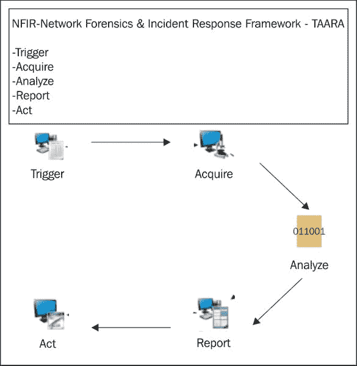

# 安全冲刺:第 6 周- Perl、取证和新的限制

> 原文：<https://dev.to/terceranexus6/security-sprint-week-6---perl-forensic-and-new-limits-2eci>

我的每周安全冲刺再次姗姗来迟，但我希望*不会太晚*因为这一次，我正在尝试危险的新视野，如[**【Perl】**](https://dev.to/jj/introduction-to-grammars-with-perl6-75e)和**取证**。我带着敬意接近 Perl，是的，为什么不说出来，害怕。首先，除了我的云计算老师，每个人都警告我这种语言的复杂性。无论如何，我试图让它变得简单，并在 github 上找到的一个已经准备好的安全脚本中寻求帮助。这个脚本非常清晰和有条理，它帮助我学习 perl 和研究安全应用程序。例如，对于获取主机地址的基本监控:

```
# (1) get the host's addresses
printheader ("Host's addresses:\n");
my $res = Net::DNS::Resolver->new(  tcp_timeout => $timeout,
                    udp_timeout => $timeout,
                    defnames => 0);

$res->nameservers($dnsserver) if $dnsserver;

my $packet = $res->query($domain);
if ($packet) {
    foreach my $rr (grep { $_->type eq 'A' } $packet->answer) {
        printrr($rr->string);
        xml_host($rr);
        push @results, $rr->address
            if $rr->name =~ /$domain$/;
    }
}
elsif ($verbose) {
    warn " ", $domain ," A query failed: ", $res->errorstring, "\n";
} 
```

Enter fullscreen mode Exit fullscreen mode

`my $res = Net::DNS::Resolver->new(...)`创建了一个名为 res 的全新变量，其定义在(...).定义之后，它创建一个等于 dns 域的数据包变量，并通过一个过滤器，如果数据包被成功捕获，则创建一个保存特定类型数据包的字符串(本例中为“A”)。一旦理解了这一部分，剩下的就非常相似了，例如在第二个选项中，它得到了名称服务器，它说:

```
foreach my $rr (grep { $_->type eq 'NS' } $packet->answer) {
        #...
    } 
```

Enter fullscreen mode Exit fullscreen mode

或者也许，我们可以遇到稍微不同的部分，比如报废:

```
if ($scrap) {
    printheader ("Scraping ".$domain." subdomains from Google:\n");
    my @tmp = googlescraping();
    if (scalar @tmp) {
        #print STDOUT "\n Performing nslookups:\n";
        launchqueries(\&nslookup, map { $_ .= '.'.$domain } @tmp);
    }
} 
```

Enter fullscreen mode Exit fullscreen mode

其中它从 Google 获得当前域名和废弃的子域名。标量强制在标量上下文中解释`@tmp`,并返回其长度。在这种情况下，如果返回为真，则启动对`nslookup`的查询，将`@tmp`翻译成相应的字符。

[T2】](https://res.cloudinary.com/practicaldev/image/fetch/s--hQ9mL2My--/c_limit%2Cf_auto%2Cfl_progressive%2Cq_auto%2Cw_880/https://blogdeaitor.files.wordpress.com/2008/10/perl_camel.jpg%3Fw%3D240)

在任何情况下，这个脚本都是高度可定制的，包含了包分析所需的所有基本元素。

在研究了用于安全脚本的 perl 之后，我还花了一些时间进行了辩论。为此，我买了这本书和其他东西。取证的基本目标是调查已经损坏的系统，这是由于利用漏洞的利用。程序员构建恶意软件的步骤是:

*   侦察(识别潜在目标)
*   外部信息收集(漏洞识别)
*   目标渗透(恶意软件开始发挥作用)
*   权限提升(恶意软件升级)
*   持久性(恶意软件试图建立稳定的性能，并试图不惜一切代价留在系统中)

恶意软件分析包括捕获恶意软件的样本，并对其进行静态或动态分析(CTF 游戏中的常见测试)，但取证包括分析已经编译的样本，并执行逆向工程，以了解恶意软件应该做什么。

[T2】](https://res.cloudinary.com/practicaldev/image/fetch/s--IHCiNLTW--/c_limit%2Cf_auto%2Cfl_progressive%2Cq_auto%2Cw_880/https://fthmb.tqn.com/dKp7AYLvKTvz0Bdp2FoCRZTsZyo%3D/1280x854/filters:no_upscale%28%29:fill%28transparent%2C1%29/107230875-56a1e28c3df78cf7726f9c57.jpg)

要进行法医调查，我们应该采用“TAARA”方法。TAARA 代表:

[T2】](https://res.cloudinary.com/practicaldev/image/fetch/s--9Rb6UBqb--/c_limit%2Cf_auto%2Cfl_progressive%2Cq_auto%2Cw_880/https://thepracticaldev.s3.amazonaws.com/i/7pfexofecj1pshwkmylm.jpg)

*   **触发**:研究被入侵系统/网络的环境，以确定是否有任何事情*异常*。例如，书中说“*短时间内来自内部主机的多个出站连接可能表明一个被入侵的主机正被用来攻击外部系统*”。此外，与阻止列表中的恶意 IP 地址或 URL 进行通信可能意味着主机受到威胁。
*   **获取**:这部分对专家来说比较复杂，需要特别注意国家法律关于泄露数据或基本信息的规定。此外，分析证据的工作不应该改变证据本身，因为它是案件的重要组成部分。一旦获得数据，就应该进行推断工作，敏感数据是否已成功收集？攻击者是否精通技术，并且非常清楚安全边界？所有这些。
*   **分析**:这可能是比较慢的部分，必须研究我们已经获取的敏感数据，比如在可疑的 IP 中查询 **WHOIS** 。在这一部分中，制作并保存打印服务器的内存和介质的隐藏图像。
*   **报告**:耶！文档，我们都喜欢，不是吗？是的，我们的调查必须写得恰当，它基本上应该是**清晰、简洁和有目的的**。它必须有导言、可用信息和假设、调查、发现和采取的行动。

*   **幕**:发生过一次，很自然；它发生了两次，这是一个错误。一旦我们已经知道发生了什么，团队应该专注于事件响应。有哪些文物可以帮助我们在未来识别这样的事件？未来的调查如何改进？

这是我这周学到的几乎所有东西，我希望你们会觉得有趣。我希望在我最近参加的一次全国抓旗活动中使用它。

**你最喜欢的安全脚本语言有哪些？你以前做过法医调查吗？**